# 二叉树遍历

从物理结构的角度来看，树是一种基于链表的数据结构，因此其遍历方式是通过指针逐个访问节点。然而，树是一种非线性数据结构，这使得遍历树比遍历链表更加复杂，需要借助搜索算法来实现。

二叉树常见的遍历方式包括层序遍历、前序遍历、中序遍历和后序遍历等。

## 层序遍历

如下图所示，「层序遍历 level-order traversal」从顶部到底部逐层遍历二叉树，并在每一层按照从左到右的顺序访问节点。

层序遍历本质上属于「广度优先遍历 breadth-first traversal」，它体现了一种“一圈一圈向外扩展”的逐层遍历方式。

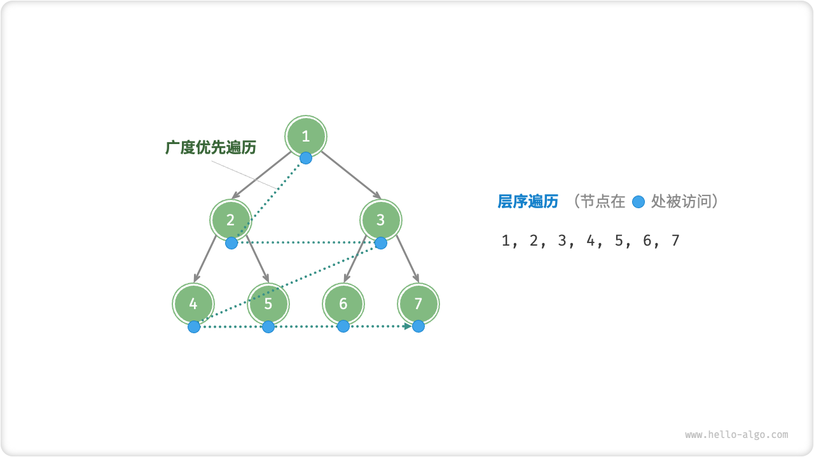

### 代码实现

广度优先遍历通常借助“队列”来实现。队列遵循“先进先出”的规则，而广度优先遍历则遵循“逐层推进”的规则，两者背后的思想是一致的。

=== "Python"

    ```python title="binary_tree_bfs.py"
    [class]{}-[func]{level_order}
    ```

=== "C++"

    ```cpp title="binary_tree_bfs.cpp"
    [class]{}-[func]{levelOrder}
    ```

=== "Java"

    ```java title="binary_tree_bfs.java"
    [class]{binary_tree_bfs}-[func]{levelOrder}
    ```

=== "C#"

    ```csharp title="binary_tree_bfs.cs"
    [class]{binary_tree_bfs}-[func]{levelOrder}
    ```

=== "Go"

    ```go title="binary_tree_bfs.go"
    [class]{}-[func]{levelOrder}
    ```

=== "Swift"

    ```swift title="binary_tree_bfs.swift"
    [class]{}-[func]{levelOrder}
    ```

=== "JS"

    ```javascript title="binary_tree_bfs.js"
    [class]{}-[func]{levelOrder}
    ```

=== "TS"

    ```typescript title="binary_tree_bfs.ts"
    [class]{}-[func]{levelOrder}
    ```

=== "Dart"

    ```dart title="binary_tree_bfs.dart"
    [class]{}-[func]{levelOrder}
    ```

=== "Rust"

    ```rust title="binary_tree_bfs.rs"
    [class]{}-[func]{level_order}
    ```

=== "C"

    ```c title="binary_tree_bfs.c"
    [class]{}-[func]{levelOrder}
    ```

=== "Zig"

    ```zig title="binary_tree_bfs.zig"
    [class]{}-[func]{levelOrder}
    ```

### 复杂度分析

- **时间复杂度 $O(n)$** ：所有节点被访问一次，使用 $O(n)$ 时间，其中 $n$ 为节点数量。
- **空间复杂度 $O(n)$** ：在最差情况下，即满二叉树时，遍历到最底层之前，队列中最多同时存在 $(n + 1) / 2$ 个节点，占用 $O(n)$ 空间。

## 前序、中序、后序遍历

相应地，前序、中序和后序遍历都属于「深度优先遍历 depth-first traversal」，它体现了一种“先走到尽头，再回溯继续”的遍历方式。

下图展示了对二叉树进行深度优先遍历的工作原理。**深度优先遍历就像是绕着整个二叉树的外围“走”一圈**，在每个节点都会遇到三个位置，分别对应前序遍历、中序遍历和后序遍历。

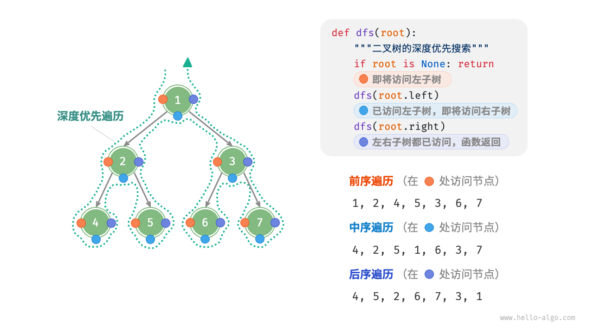

### 代码实现

深度优先搜索通常基于递归实现：

=== "Python"

    ```python title="binary_tree_dfs.py"
    [class]{}-[func]{pre_order}

    [class]{}-[func]{in_order}

    [class]{}-[func]{post_order}
    ```

=== "C++"

    ```cpp title="binary_tree_dfs.cpp"
    [class]{}-[func]{preOrder}

    [class]{}-[func]{inOrder}

    [class]{}-[func]{postOrder}
    ```

=== "Java"

    ```java title="binary_tree_dfs.java"
    [class]{binary_tree_dfs}-[func]{preOrder}

    [class]{binary_tree_dfs}-[func]{inOrder}

    [class]{binary_tree_dfs}-[func]{postOrder}
    ```

=== "C#"

    ```csharp title="binary_tree_dfs.cs"
    [class]{binary_tree_dfs}-[func]{preOrder}

    [class]{binary_tree_dfs}-[func]{inOrder}

    [class]{binary_tree_dfs}-[func]{postOrder}
    ```

=== "Go"

    ```go title="binary_tree_dfs.go"
    [class]{}-[func]{preOrder}

    [class]{}-[func]{inOrder}

    [class]{}-[func]{postOrder}
    ```

=== "Swift"

    ```swift title="binary_tree_dfs.swift"
    [class]{}-[func]{preOrder}

    [class]{}-[func]{inOrder}

    [class]{}-[func]{postOrder}
    ```

=== "JS"

    ```javascript title="binary_tree_dfs.js"
    [class]{}-[func]{preOrder}

    [class]{}-[func]{inOrder}

    [class]{}-[func]{postOrder}
    ```

=== "TS"

    ```typescript title="binary_tree_dfs.ts"
    [class]{}-[func]{preOrder}

    [class]{}-[func]{inOrder}

    [class]{}-[func]{postOrder}
    ```

=== "Dart"

    ```dart title="binary_tree_dfs.dart"
    [class]{}-[func]{preOrder}

    [class]{}-[func]{inOrder}

    [class]{}-[func]{postOrder}
    ```

=== "Rust"

    ```rust title="binary_tree_dfs.rs"
    [class]{}-[func]{pre_order}

    [class]{}-[func]{in_order}

    [class]{}-[func]{post_order}
    ```

=== "C"

    ```c title="binary_tree_dfs.c"
    [class]{}-[func]{preOrder}

    [class]{}-[func]{inOrder}

    [class]{}-[func]{postOrder}
    ```

=== "Zig"

    ```zig title="binary_tree_dfs.zig"
    [class]{}-[func]{preOrder}

    [class]{}-[func]{inOrder}

    [class]{}-[func]{postOrder}
    ```

!!! note

    深度优先搜索也可以基于迭代实现，有兴趣的同学可以自行研究。

下图展示了前序遍历二叉树的递归过程，其可分为“递”和“归”两个逆向的部分。

1. “递”表示开启新方法，程序在此过程中访问下一个节点。
2. “归”表示函数返回，代表当前节点已经访问完毕。

=== "<1>"
    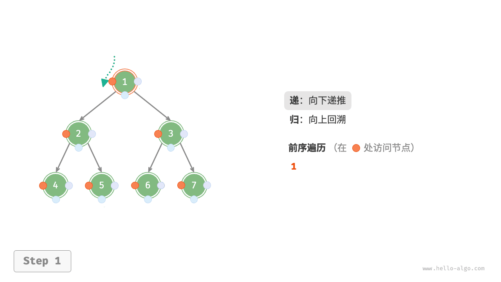

=== "<2>"
    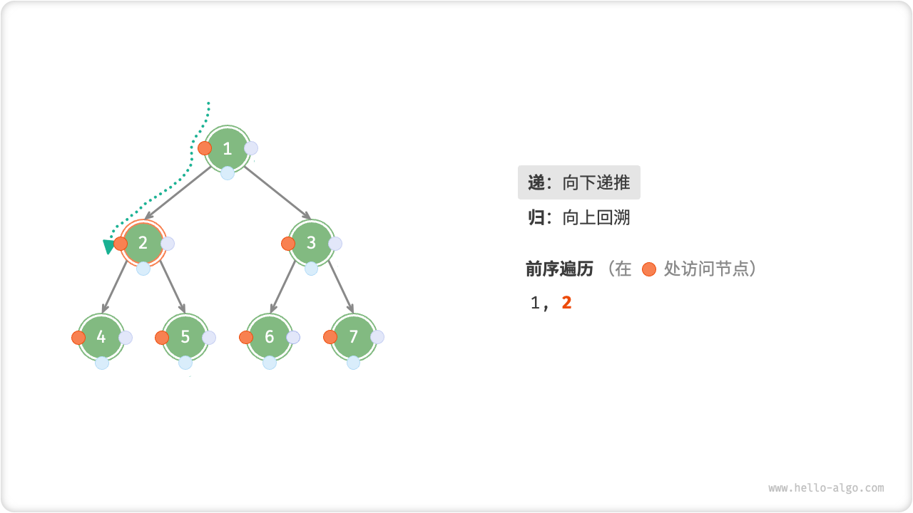

=== "<3>"
    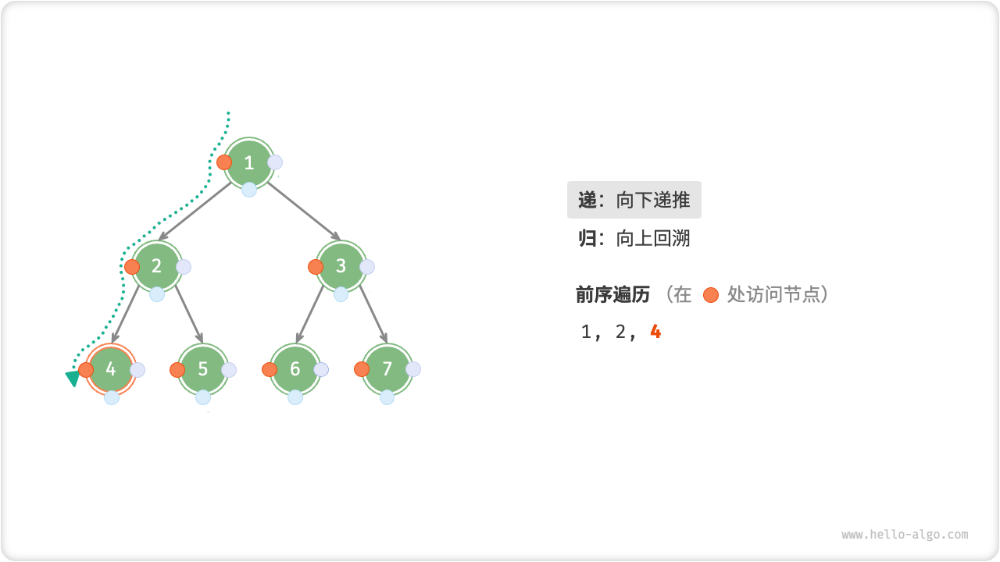

=== "<4>"
    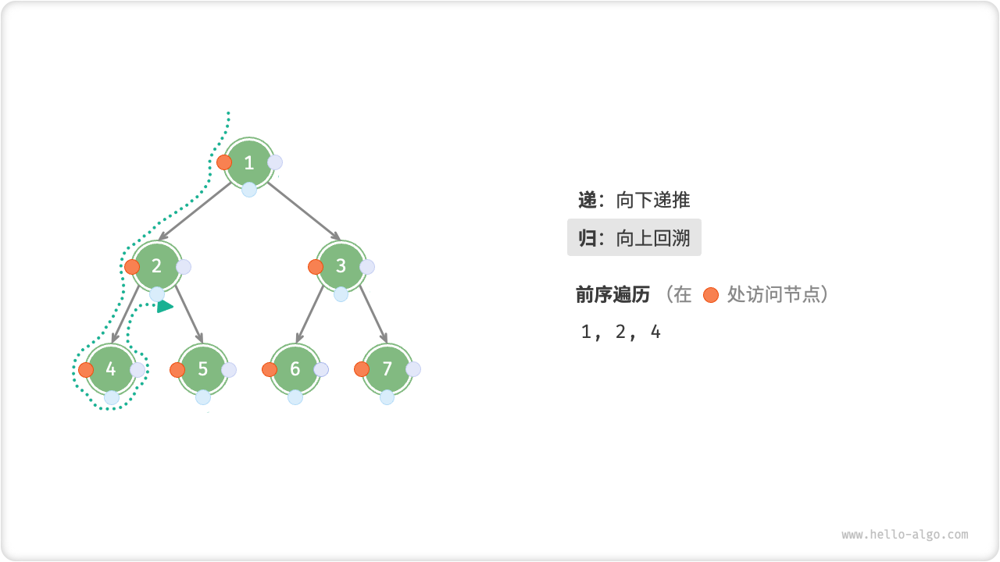

=== "<5>"
    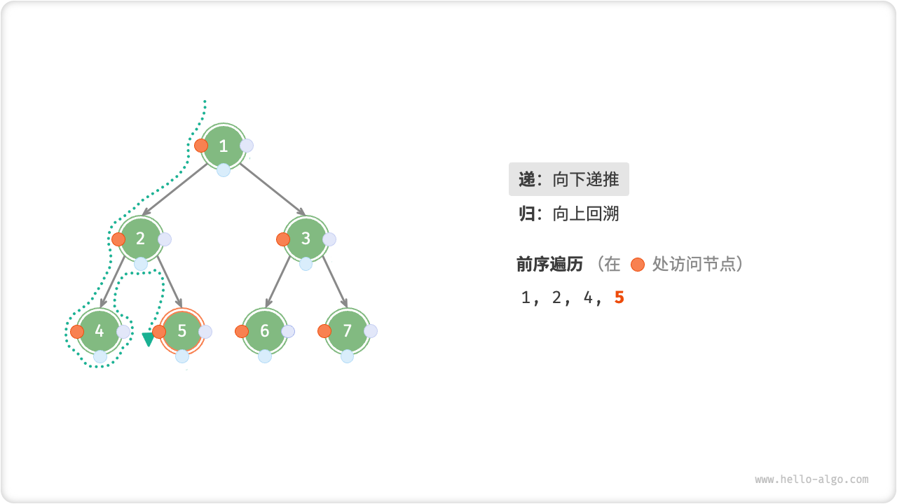

=== "<6>"
    

=== "<7>"
    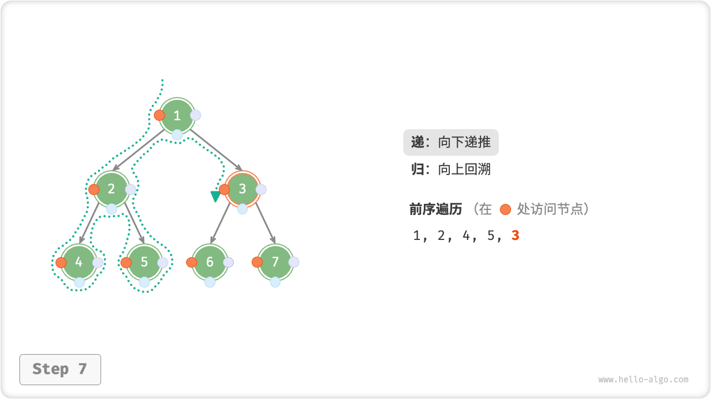

=== "<8>"
    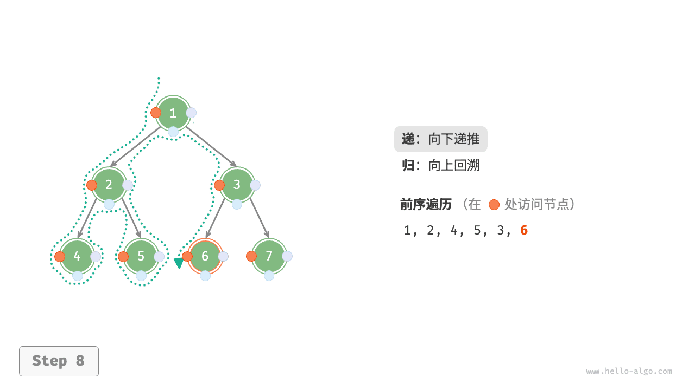

=== "<9>"
    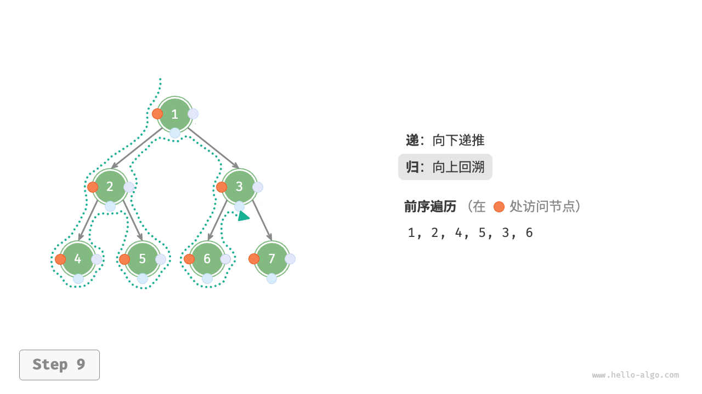

=== "<10>"
    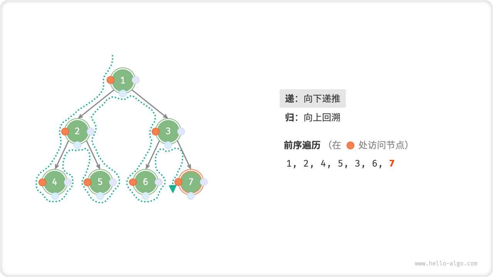

=== "<11>"
    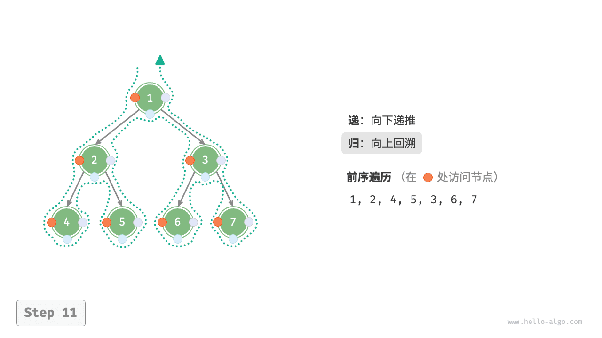

### 复杂度分析

- **时间复杂度 $O(n)$** ：所有节点被访问一次，使用 $O(n)$ 时间。
- **空间复杂度 $O(n)$** ：在最差情况下，即树退化为链表时，递归深度达到 $n$ ，系统占用 $O(n)$ 栈帧空间。
