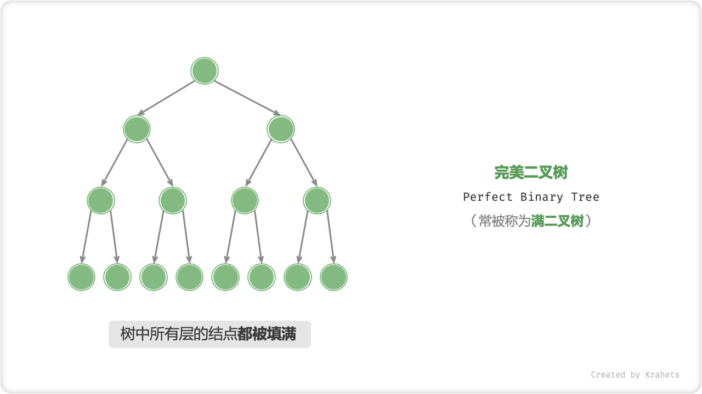
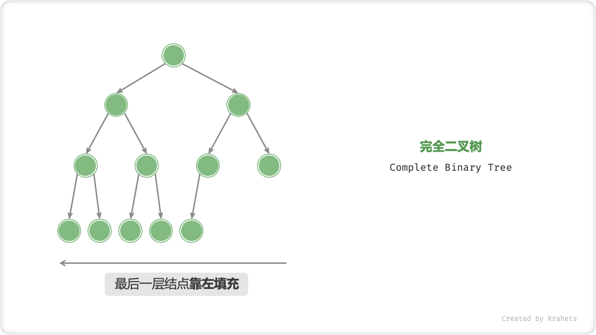
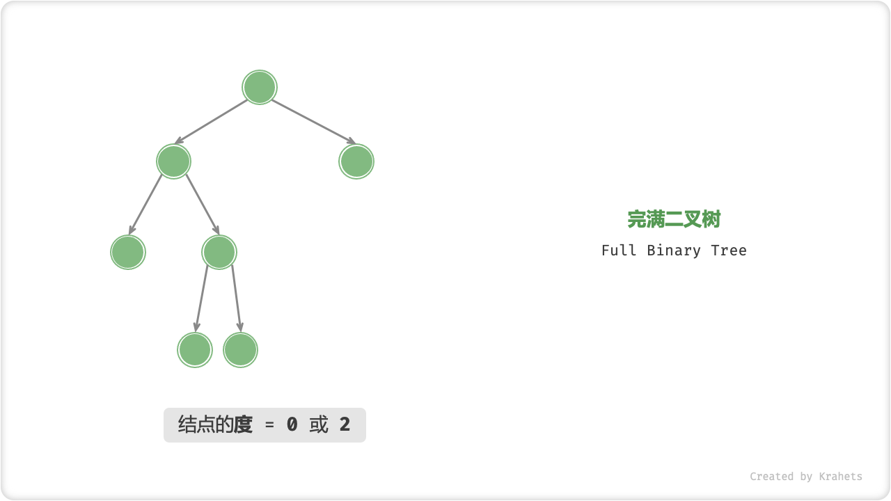
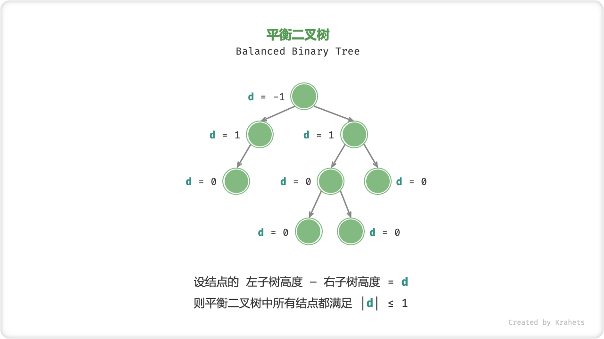

# 常见二叉树类型

## 完美二叉树

「完美二叉树 Perfect Binary Tree」，其所有层的结点都被完全填满。

!!! tip

    在中文社区中，完美二叉树常被称为「满二叉树」，请注意与完满二叉树区分。

完美二叉树的性质有：

- 若树高度 $= h$ ，则结点总数 $= 2^h$ - 1；

## 完全二叉树

「完全二叉树 Complete Binary Tree」只有最底层的结点未被填满，且最底层结点都尽量靠左填充。

完全二叉树有一个很好的性质，可以用「数组」来表示。

- 

## 完满二叉树

「完满二叉树 Full Binary Tree」除了叶结点之外，其余所有结点都有两个子结点。

## 平衡二叉树

**「平衡二叉树 Balanced Binary Tree」，又称「AVL 树」** ，其任意结点的左子树和右子树的高度之差的绝对值 $\leq 1$ 。

