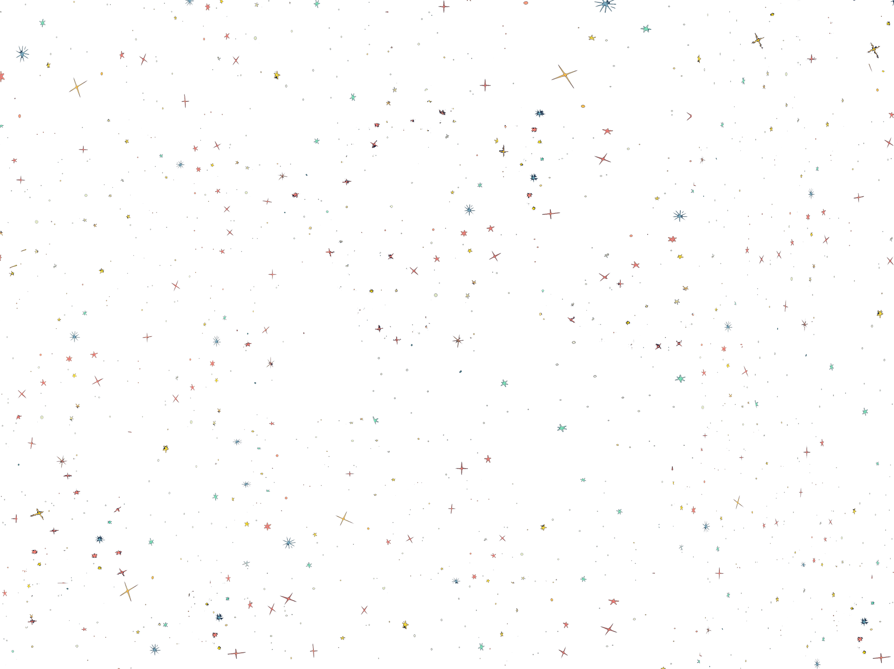
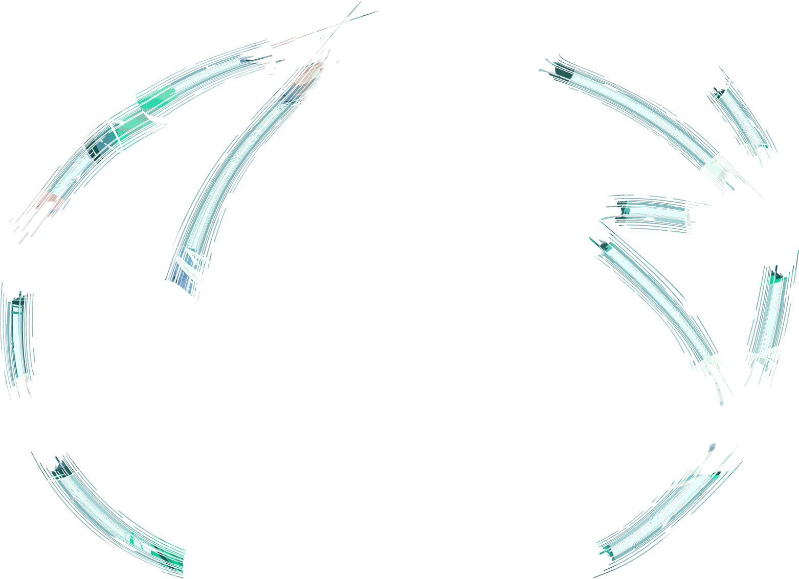
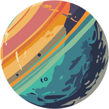
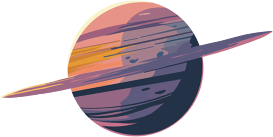
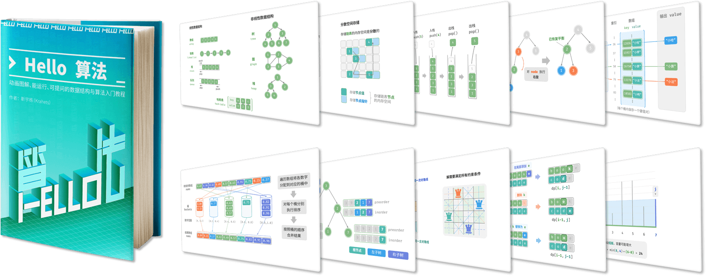
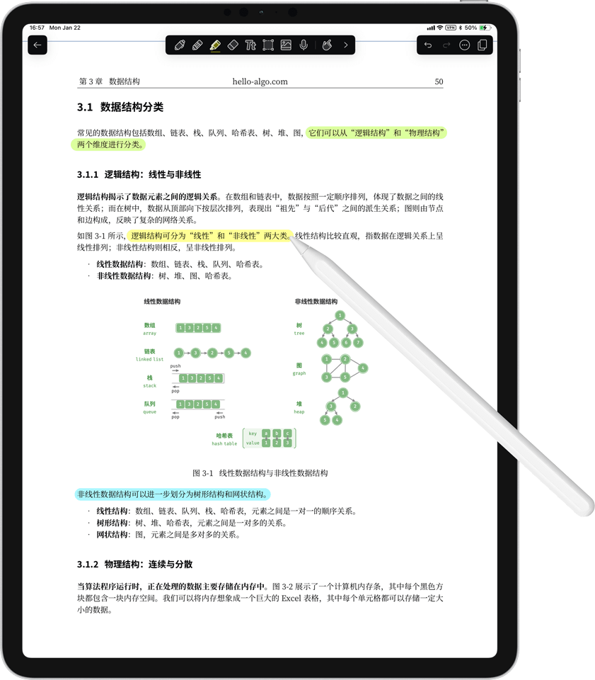

<!--Section: hero -->
<section data-md-color-scheme="slate" data-md-color-primary="grey" class="home-div"
  style="height: min(100vh, 120vw); position: relative; margin-top:-2.4rem; padding: 0; overflow: hidden;">
  <!-- background -->
  

  <!-- heading and buttons -->
  

    
    

      动画图解、一键运行的数据结构与算法教程
    

    

      <a href="https://www.hello-algo.com/chapter_preface/" class="rounded-button hero-btn">
        <svg xmlns="http://www.w3.org/2000/svg" height="16px" width="15.5px"
          viewBox="0 0 576 512"><!--!Font Awesome Free 6.5.1 by @fontawesome - https://fontawesome.com License - https://fontawesome.com/license/free Copyright 2023 Fonticons, Inc.-->
          <path
            d="M249.6 471.5c10.8 3.8 22.4-4.1 22.4-15.5V78.6c0-4.2-1.6-8.4-5-11C247.4 52 202.4 32 144 32C93.5 32 46.3 45.3 18.1 56.1C6.8 60.5 0 71.7 0 83.8V454.1c0 11.9 12.8 20.2 24.1 16.5C55.6 460.1 105.5 448 144 448c33.9 0 79 14 105.6 23.5zm76.8 0C353 462 398.1 448 432 448c38.5 0 88.4 12.1 119.9 22.6c11.3 3.8 24.1-4.6 24.1-16.5V83.8c0-12.1-6.8-23.3-18.1-27.6C529.7 45.3 482.5 32 432 32c-58.4 0-103.4 20-123 35.6c-3.3 2.6-5 6.8-5 11V456c0 11.4 11.7 19.3 22.4 15.5z">
          </path>
        </svg>
        开始阅读
      </a>
      <a href="https://github.com/krahets/hello-algo" class="rounded-button hero-btn">
        <svg xmlns="http://www.w3.org/2000/svg" height="16px" width="15.5px"
          viewBox="0 0 496 512"><!--!Font Awesome Free 6.5.1 by @fontawesome - https://fontawesome.com License - https://fontawesome.com/license/free Copyright 2023 Fonticons, Inc.-->
          <path
            d="M165.9 397.4c0 2-2.3 3.6-5.2 3.6-3.3 .3-5.6-1.3-5.6-3.6 0-2 2.3-3.6 5.2-3.6 3-.3 5.6 1.3 5.6 3.6zm-31.1-4.5c-.7 2 1.3 4.3 4.3 4.9 2.6 1 5.6 0 6.2-2s-1.3-4.3-4.3-5.2c-2.6-.7-5.5 .3-6.2 2.3zm44.2-1.7c-2.9 .7-4.9 2.6-4.6 4.9 .3 2 2.9 3.3 5.9 2.6 2.9-.7 4.9-2.6 4.6-4.6-.3-1.9-3-3.2-5.9-2.9zM244.8 8C106.1 8 0 113.3 0 252c0 110.9 69.8 205.8 169.5 239.2 12.8 2.3 17.3-5.6 17.3-12.1 0-6.2-.3-40.4-.3-61.4 0 0-70 15-84.7-29.8 0 0-11.4-29.1-27.8-36.6 0 0-22.9-15.7 1.6-15.4 0 0 24.9 2 38.6 25.8 21.9 38.6 58.6 27.5 72.9 20.9 2.3-16 8.8-27.1 16-33.7-55.9-6.2-112.3-14.3-112.3-110.5 0-27.5 7.6-41.3 23.6-58.9-2.6-6.5-11.1-33.3 2.6-67.9 20.9-6.5 69 27 69 27 20-5.6 41.5-8.5 62.8-8.5s42.8 2.9 62.8 8.5c0 0 48.1-33.6 69-27 13.7 34.7 5.2 61.4 2.6 67.9 16 17.7 25.8 31.5 25.8 58.9 0 96.5-58.9 104.2-114.8 110.5 9.2 7.9 17 22.9 17 46.4 0 33.7-.3 75.4-.3 83.6 0 6.5 4.6 14.4 17.3 12.1C428.2 457.8 496 362.9 496 252 496 113.3 383.5 8 244.8 8zM97.2 352.9c-1.3 1-1 3.3 .7 5.2 1.6 1.6 3.9 2.3 5.2 1 1.3-1 1-3.3-.7-5.2-1.6-1.6-3.9-2.3-5.2-1zm-10.8-8.1c-.7 1.3 .3 2.9 2.3 3.9 1.6 1 3.6 .7 4.3-.7 .7-1.3-.3-2.9-2.3-3.9-2-.6-3.6-.3-4.3 .7zm32.4 35.6c-1.6 1.3-1 4.3 1.3 6.2 2.3 2.3 5.2 2.6 6.5 1 1.3-1.3 .7-4.3-1.3-6.2-2.2-2.3-5.2-2.6-6.5-1zm-11.4-14.7c-1.6 1-1.6 3.6 0 5.9 1.6 2.3 4.3 3.3 5.6 2.3 1.6-1.3 1.6-3.9 0-6.2-1.4-2.3-4-3.3-5.6-2z">
          </path>
        </svg>
        代码仓库
      </a>
      <a href="https://github.com/krahets/hello-algo/releases" class="rounded-button hero-btn">
        <svg xmlns="http://www.w3.org/2000/svg" height="16px" width="15.5px"
          viewBox="0 0 512 512"><!--!Font Awesome Free 6.5.1 by @fontawesome - https://fontawesome.com License - https://fontawesome.com/license/free Copyright 2023 Fonticons, Inc.-->
          <path
            d="M0 64C0 28.7 28.7 0 64 0L224 0l0 128c0 17.7 14.3 32 32 32l128 0 0 144-208 0c-35.3 0-64 28.7-64 64l0 144-48 0c-35.3 0-64-28.7-64-64L0 64zm384 64l-128 0L256 0 384 128zM176 352l32 0c30.9 0 56 25.1 56 56s-25.1 56-56 56l-16 0 0 32c0 8.8-7.2 16-16 16s-16-7.2-16-16l0-48 0-80c0-8.8 7.2-16 16-16zm32 80c13.3 0 24-10.7 24-24s-10.7-24-24-24l-16 0 0 48 16 0zm96-80l32 0c26.5 0 48 21.5 48 48l0 64c0 26.5-21.5 48-48 48l-32 0c-8.8 0-16-7.2-16-16l0-128c0-8.8 7.2-16 16-16zm32 128c8.8 0 16-7.2 16-16l0-64c0-8.8-7.2-16-16-16l-16 0 0 96 16 0zm80-112c0-8.8 7.2-16 16-16l48 0c8.8 0 16 7.2 16 16s-7.2 16-16 16l-32 0 0 32 32 0c8.8 0 16 7.2 16 16s-7.2 16-16 16l-32 0 0 48c0 8.8-7.2 16-16 16s-16-7.2-16-16l0-64 0-64z">
          </path>
        </svg>
        下载 PDF
      </a>
    

    <!-- arrow -->
    

      <svg xmlns="http://www.w3.org/2000/svg" fill="var(--md-default-fg-color)" height="2vh" width="auto"
        viewBox="0 0 384 512"><!--!Font Awesome Free 6.5.1 by @fontawesome - https://fontawesome.com License - https://fontawesome.com/license/free Copyright 2024 Fonticons, Inc.-->
        <path
          d="M169.4 470.6c12.5 12.5 32.8 12.5 45.3 0l160-160c12.5-12.5 12.5-32.8 0-45.3s-32.8-12.5-45.3 0L224 370.8 224 64c0-17.7-14.3-32-32-32s-32 14.3-32 32l0 306.7L54.6 265.4c-12.5-12.5-32.8-12.5-45.3 0s-12.5 32.8 0 45.3l160 160z" />
      </svg>
    

  

  <!-- hero image -->
  

    <!-- planets -->
    
    
    <a href="https://www.hello-algo.com/chapter_introduction/">
      
      
初识算法

    </a>
    <a href="https://www.hello-algo.com/chapter_computational_complexity/">
      
      
复杂度

    </a>
    <a href="https://www.hello-algo.com/chapter_array_and_linkedlist/">
      
      
数组与链表

    </a>
    <a href="https://www.hello-algo.com/chapter_stack_and_queue/">
      
      
栈与队列

    </a>
    <a href="https://www.hello-algo.com/chapter_hashing/">
      
      
哈希表

    </a>
    <a href="https://www.hello-algo.com/chapter_tree/">
      
      
树

    </a>
    <a href="https://www.hello-algo.com/chapter_heap/">
      
      
堆

    </a>
    <a href="https://www.hello-algo.com/chapter_graph/">
      
      
图

    </a>
    <a href="https://www.hello-algo.com/chapter_searching/">
      
      
搜索

    </a>
    <a href="https://www.hello-algo.com/chapter_sorting/">
      
      
排序

    </a>
    <a href="https://www.hello-algo.com/chapter_divide_and_conquer/">
      
      
分治

    </a>
    <a href="https://www.hello-algo.com/chapter_backtracking/">
      
      
回溯

    </a>
    <a href="https://www.hello-algo.com/chapter_dynamic_programming/">
      
      
动态规划

    </a>
    <a href="https://www.hello-algo.com/chapter_greedy/">
      
      
贪心

    </a>
  

</section>

<!-- Section: brief introduction  -->
<section data-md-color-scheme="slate" class="home-div">
  

    

      
    

    

      
      
      
      
      
      
      
      
      
      
      
      
    

    
500 幅动画图解、12 种编程语言代码、2000 条社区问答，助你快速入门数据结构与算法

  

</section>

<!-- Section: reading -->
<section data-md-color-scheme="default" data-md-color-primary="white" class="home-div">
  

    

      <!-- devices -->
      <!-- mac height = 248.1 mm -->
      <!-- ipad height = 280.6mm -->
      <!-- iphone height = 160.7mm -->
      
      
      
    

    
提供网页版和 PDF 版，兼容 PC、平板和手机，随时随地阅读

  

</section>

<!-- Section: endorsements -->
<section data-md-color-scheme="slate" data-md-color-primary="grey" class="home-div">
  

    <h3 style="text-align: center; margin: 1em auto;">推荐语</h3>
    

      

        
“一本通俗易懂的数据结构与算法入门书，引导读者手脑并用地学习，强烈推荐算法初学者阅读。”

        
—— 邓俊辉，清华大学计算机系教授

      

      

        
“如果我当年学数据结构与算法的时候有《Hello 算法》，学起来应该会简单 10 倍！”

        
—— 李沐，亚马逊资深首席科学家

      

    

  

</section>

<!-- Section: features -->
<section data-md-color-scheme="default" data-md-color-primary="white" class="home-div">
  

    

      

        

          

            <svg xmlns="http://www.w3.org/2000/svg" height="1.5em" width="1.5em"
              viewBox="0 0 640 512"><!--!Font Awesome Free 6.5.1 by @fontawesome - https://fontawesome.com License - https://fontawesome.com/license/free Copyright 2023 Fonticons, Inc.-->
              <path fill="var(--md-primary-bg-color)"
                d="M256 0H576c35.3 0 64 28.7 64 64V288c0 35.3-28.7 64-64 64H256c-35.3 0-64-28.7-64-64V64c0-35.3 28.7-64 64-64zM476 106.7C471.5 100 464 96 456 96s-15.5 4-20 10.7l-56 84L362.7 169c-4.6-5.7-11.5-9-18.7-9s-14.2 3.3-18.7 9l-64 80c-5.8 7.2-6.9 17.1-2.9 25.4s12.4 13.6 21.6 13.6h80 48H552c8.9 0 17-4.9 21.2-12.7s3.7-17.3-1.2-24.6l-96-144zM336 96a32 32 0 1 0 -64 0 32 32 0 1 0 64 0zM64 128h96V384v32c0 17.7 14.3 32 32 32H320c17.7 0 32-14.3 32-32V384H512v64c0 35.3-28.7 64-64 64H64c-35.3 0-64-28.7-64-64V192c0-35.3 28.7-64 64-64zm8 64c-8.8 0-16 7.2-16 16v16c0 8.8 7.2 16 16 16H88c8.8 0 16-7.2 16-16V208c0-8.8-7.2-16-16-16H72zm0 104c-8.8 0-16 7.2-16 16v16c0 8.8 7.2 16 16 16H88c8.8 0 16-7.2 16-16V312c0-8.8-7.2-16-16-16H72zm0 104c-8.8 0-16 7.2-16 16v16c0 8.8 7.2 16 16 16H88c8.8 0 16-7.2 16-16V416c0-8.8-7.2-16-16-16H72zm336 16v16c0 8.8 7.2 16 16 16h16c8.8 0 16-7.2 16-16V416c0-8.8-7.2-16-16-16H424c-8.8 0-16 7.2-16 16z" />
            </svg>
            <h3 style="margin-left: 0.5em;">动画图解</h3>
          

          
内容清晰易懂，学习曲线平滑

          
"A picture is worth a thousand words." “一图胜千言”

        

      

      
    

    

      
      

        

          

            <svg xmlns="http://www.w3.org/2000/svg" height="1.5em" width="1.5em"
              viewBox="0 0 640 512"><!--!Font Awesome Free 6.5.1 by @fontawesome - https://fontawesome.com License - https://fontawesome.com/license/free Copyright 2023 Fonticons, Inc.-->
              <path fill="var(--md-primary-bg-color)"
                d="M392.8 1.2c-17-4.9-34.7 5-39.6 22l-128 448c-4.9 17 5 34.7 22 39.6s34.7-5 39.6-22l128-448c4.9-17-5-34.7-22-39.6zm80.6 120.1c-12.5 12.5-12.5 32.8 0 45.3L562.7 256l-89.4 89.4c-12.5 12.5-12.5 32.8 0 45.3s32.8 12.5 45.3 0l112-112c12.5-12.5 12.5-32.8 0-45.3l-112-112c-12.5-12.5-32.8-12.5-45.3 0zm-306.7 0c-12.5-12.5-32.8-12.5-45.3 0l-112 112c-12.5 12.5-12.5 32.8 0 45.3l112 112c12.5 12.5 32.8 12.5 45.3 0s12.5-32.8 0-45.3L77.3 256l89.4-89.4c12.5-12.5 12.5-32.8 0-45.3z" />
            </svg>
            <h3 style="margin-left: 0.5em;">一键运行</h3>
          

          
十余种编程语言，代码可视化运行

          
"Talk is cheap. Show me the code." “少吹牛，看代码”

        

      

    

    

      

        

          

            <svg xmlns="http://www.w3.org/2000/svg" height="1.5em" width="1.5em"
              viewBox="0 0 640 512"><!--!Font Awesome Free 6.5.1 by @fontawesome - https://fontawesome.com License - https://fontawesome.com/license/free Copyright 2023 Fonticons, Inc.-->
              <path fill="var(--md-primary-bg-color)"
                d="M88.2 309.1c9.8-18.3 6.8-40.8-7.5-55.8C59.4 230.9 48 204 48 176c0-63.5 63.8-128 160-128s160 64.5 160 128s-63.8 128-160 128c-13.1 0-25.8-1.3-37.8-3.6c-10.4-2-21.2-.6-30.7 4.2c-4.1 2.1-8.3 4.1-12.6 6c-16 7.2-32.9 13.5-49.9 18c2.8-4.6 5.4-9.1 7.9-13.6c1.1-1.9 2.2-3.9 3.2-5.9zM0 176c0 41.8 17.2 80.1 45.9 110.3c-.9 1.7-1.9 3.5-2.8 5.1c-10.3 18.4-22.3 36.5-36.6 52.1c-6.6 7-8.3 17.2-4.6 25.9C5.8 378.3 14.4 384 24 384c43 0 86.5-13.3 122.7-29.7c4.8-2.2 9.6-4.5 14.2-6.8c15.1 3 30.9 4.5 47.1 4.5c114.9 0 208-78.8 208-176S322.9 0 208 0S0 78.8 0 176zM432 480c16.2 0 31.9-1.6 47.1-4.5c4.6 2.3 9.4 4.6 14.2 6.8C529.5 498.7 573 512 616 512c9.6 0 18.2-5.7 22-14.5c3.8-8.8 2-19-4.6-25.9c-14.2-15.6-26.2-33.7-36.6-52.1c-.9-1.7-1.9-3.4-2.8-5.1C622.8 384.1 640 345.8 640 304c0-94.4-87.9-171.5-198.2-175.8c4.1 15.2 6.2 31.2 6.2 47.8l0 .6c87.2 6.7 144 67.5 144 127.4c0 28-11.4 54.9-32.7 77.2c-14.3 15-17.3 37.6-7.5 55.8c1.1 2 2.2 4 3.2 5.9c2.5 4.5 5.2 9 7.9 13.6c-17-4.5-33.9-10.7-49.9-18c-4.3-1.9-8.5-3.9-12.6-6c-9.5-4.8-20.3-6.2-30.7-4.2c-12.1 2.4-24.7 3.6-37.8 3.6c-61.7 0-110-26.5-136.8-62.3c-16 5.4-32.8 9.4-50 11.8C279 439.8 350 480 432 480z" />
            </svg>
            <h3 style="margin-left: 0.5em;">互助学习</h3>
          

          
欢迎讨论与提问，读者间携手共进

          
"Knowledge increases by sharing." “知识在分享中得以增长”

        

      

      
    

  

</section>

<!-- Section: contributors -->
<section data-md-color-scheme="slate" data-md-color-primary="grey" class="home-div">
  

    <!-- author -->
    

      <h3>作者</h3>
      

        

          <a href="https://github.com/krahets">
            
             <b>靳宇栋（@krahets）</b>
          </a>
        

      

    

    <!-- reviewers -->
    

      <h3>代码审阅者</h3>
      

        

          <a href="https://github.com/codingonion">
            
             <b>codingonion</b>
             Zig, Rust
          </a>
        

        

          <a href="https://github.com/Gonglja">
            
             <b>Gonglja</b>
             C, C++
          </a>
        

        

          <a href="https://github.com/gvenusleo">
            
             <b>gvenusleo</b>
             Dart
          </a>
        

        

          <a href="https://github.com/hpstory">
            
             <b>hpstory</b>
             C#
          </a>
        

        

          <a href="https://github.com/justin-tse">
            
             <b>justin-tse</b>
             JS, TS
          </a>
        

        

          <a href="https://github.com/krahets">
            
             <b>krahets</b>
             Python, Java
          </a>
        

        

          <a href="https://github.com/night-cruise">
            
             <b>night-cruise</b>
             Rust
          </a>
        

        

          <a href="https://github.com/nuomi1">
            
             <b>nuomi1</b>
             Swift
          </a>
        

        

          <a href="https://github.com/Reanon">
            
             <b>Reanon</b>
             Go, C
          </a>
        

      

    

    <!-- contributors -->
    

      <h3>贡献者</h3>
      
本书在开源社区 130 多位贡献者的共同努力下不断完善，感谢他们付出的时间与精力！

      
    

  

</section>