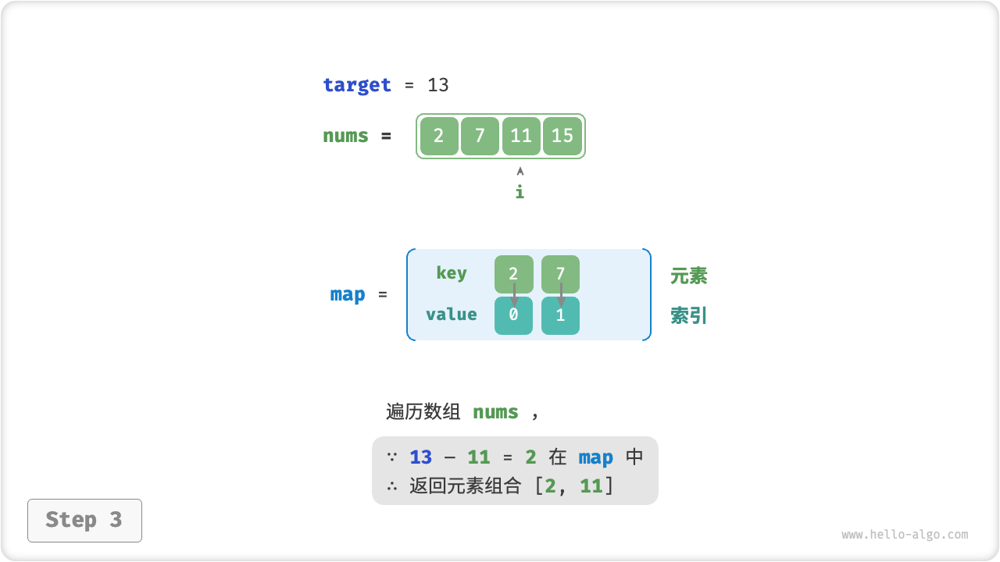

# 哈希优化策略

在算法题中，**我们常通过将线性查找替换为哈希查找来降低算法的时间复杂度**。我们借助一个算法题来加深理解。

!!! question

    给定一个整数数组 `nums` 和一个目标元素 `target` ，请在数组中搜索“和”为 `target` 的两个元素，并返回它们的数组索引。返回任意一个解即可。

## 线性查找：以时间换空间

考虑直接遍历所有可能的组合。如下图所示，我们开启一个两层循环，在每轮中判断两个整数的和是否为 `target` ，若是则返回它们的索引。


=== "Python"

    ```python title="two_sum.py"
    [class]{}-[func]{two_sum_brute_force}
    ```

=== "C++"

    ```cpp title="two_sum.cpp"
    [class]{}-[func]{twoSumBruteForce}
    ```

=== "Java"

    ```java title="two_sum.java"
    [class]{two_sum}-[func]{twoSumBruteForce}
    ```

=== "C#"

    ```csharp title="two_sum.cs"
    [class]{two_sum}-[func]{twoSumBruteForce}
    ```

=== "Go"

    ```go title="two_sum.go"
    [class]{}-[func]{twoSumBruteForce}
    ```

=== "Swift"

    ```swift title="two_sum.swift"
    [class]{}-[func]{twoSumBruteForce}
    ```

=== "JS"

    ```javascript title="two_sum.js"
    [class]{}-[func]{twoSumBruteForce}
    ```

=== "TS"

    ```typescript title="two_sum.ts"
    [class]{}-[func]{twoSumBruteForce}
    ```

=== "Dart"

    ```dart title="two_sum.dart"
    [class]{}-[func]{twoSumBruteForce}
    ```

=== "Rust"

    ```rust title="two_sum.rs"
    [class]{}-[func]{two_sum_brute_force}
    ```

=== "C"

    ```c title="two_sum.c"
    [class]{}-[func]{twoSumBruteForce}
    ```

=== "Zig"

    ```zig title="two_sum.zig"
    [class]{}-[func]{twoSumBruteForce}
    ```

此方法的时间复杂度为 $O(n^2)$ ，空间复杂度为 $O(1)$ ，在大数据量下非常耗时。

## 哈希查找：以空间换时间

考虑借助一个哈希表，键值对分别为数组元素和元素索引。循环遍历数组，每轮执行下图所示的步骤。

1. 判断数字 `target - nums[i]` 是否在哈希表中，若是则直接返回这两个元素的索引。
2. 将键值对 `nums[i]` 和索引 `i` 添加进哈希表。

=== "<1>"
    

=== "<2>"
    

=== "<3>"
    

实现代码如下所示，仅需单层循环即可。

=== "Python"

    ```python title="two_sum.py"
    [class]{}-[func]{two_sum_hash_table}
    ```

=== "C++"

    ```cpp title="two_sum.cpp"
    [class]{}-[func]{twoSumHashTable}
    ```

=== "Java"

    ```java title="two_sum.java"
    [class]{two_sum}-[func]{twoSumHashTable}
    ```

=== "C#"

    ```csharp title="two_sum.cs"
    [class]{two_sum}-[func]{twoSumHashTable}
    ```

=== "Go"

    ```go title="two_sum.go"
    [class]{}-[func]{twoSumHashTable}
    ```

=== "Swift"

    ```swift title="two_sum.swift"
    [class]{}-[func]{twoSumHashTable}
    ```

=== "JS"

    ```javascript title="two_sum.js"
    [class]{}-[func]{twoSumHashTable}
    ```

=== "TS"

    ```typescript title="two_sum.ts"
    [class]{}-[func]{twoSumHashTable}
    ```

=== "Dart"

    ```dart title="two_sum.dart"
    [class]{}-[func]{twoSumHashTable}
    ```

=== "Rust"

    ```rust title="two_sum.rs"
    [class]{}-[func]{two_sum_hash_table}
    ```

=== "C"

    ```c title="two_sum.c"
    [class]{hashTable}-[func]{}

    [class]{}-[func]{twoSumHashTable}
    ```

=== "Zig"

    ```zig title="two_sum.zig"
    [class]{}-[func]{twoSumHashTable}
    ```

此方法通过哈希查找将时间复杂度从 $O(n^2)$ 降低至 $O(n)$ ，大幅提升运行效率。

由于需要维护一个额外的哈希表，因此空间复杂度为 $O(n)$ 。**尽管如此，该方法的整体时空效率更为均衡，因此它是本题的最优解法**。
