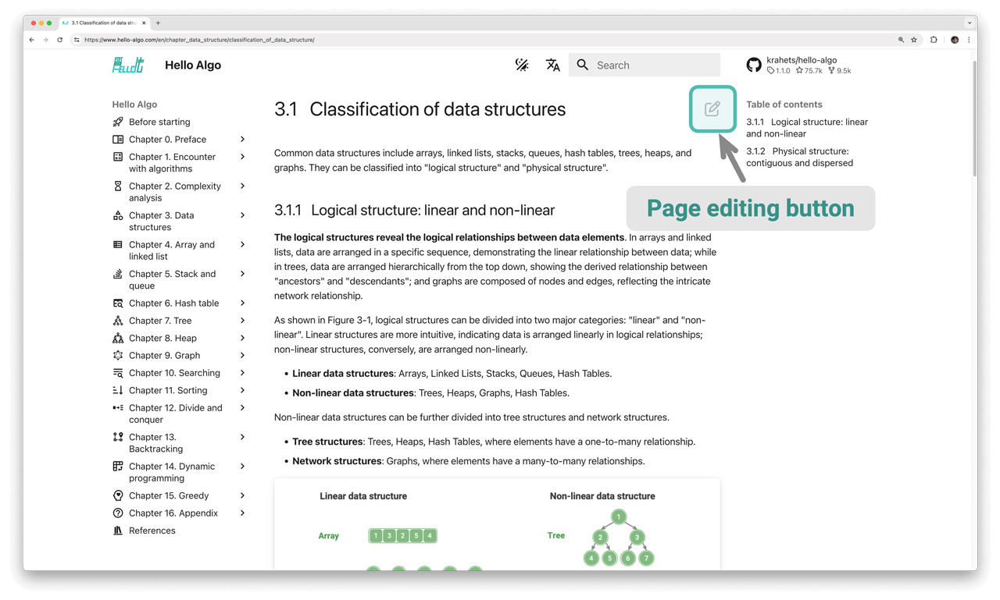

# Contributing

Due to the limited abilities of the author, some omissions and errors are inevitable in this book. Please understand. If you discover any typos, broken links, missing content, textual ambiguities, unclear explanations, or unreasonable text structures, please assist us in making corrections to provide readers with better quality learning resources.

The GitHub IDs of all [contributors](https://github.com/krahets/hello-algo/graphs/contributors) will be displayed on the repository, web, and PDF versions of the homepage of this book to thank them for their selfless contributions to the open-source community.

!!! success "The charm of open source"

    The interval between two printings of a paper book is often long, making content updates very inconvenient.
    
    In this open-source book, however, the content update cycle is shortened to just a few days or even hours.

### Content fine-tuning

As shown in the figure below, there is an "edit icon" in the upper right corner of each page. You can follow these steps to modify text or code.

1. Click the "edit icon". If prompted to "fork this repository", please agree to do so.
2. Modify the Markdown source file content, check the accuracy of the content, and try to keep the formatting consistent.
3. Fill in the modification description at the bottom of the page, then click the "Propose file change" button. After the page redirects, click the "Create pull request" button to initiate the pull request.



Figures cannot be directly modified and require the creation of a new [Issue](https://github.com/krahets/hello-algo/issues) or a comment to describe the problem. We will redraw and replace the figures as soon as possible.

### Content creation

If you are interested in participating in this open-source project, including translating code into other programming languages or expanding article content, then the following Pull Request workflow needs to be implemented.

1. Log in to GitHub and Fork the [code repository](https://github.com/krahets/hello-algo) of this book to your personal account.
2. Go to your Forked repository web page and use the `git clone` command to clone the repository to your local machine.
3. Create content locally and perform complete tests to verify the correctness of the code.
4. Commit the changes made locally, then push them to the remote repository.
5. Refresh the repository webpage and click the "Create pull request" button to initiate the pull request.

### Docker deployment

In the `hello-algo` root directory, execute the following Docker script to access the project at `http://localhost:8000`:

```shell
docker-compose up -d
```

Use the following command to remove the deployment:

```shell
docker-compose down
```
