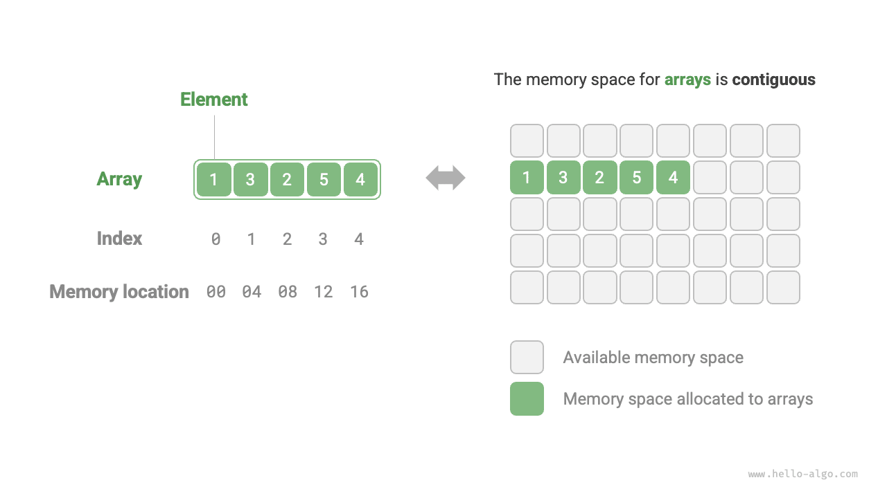
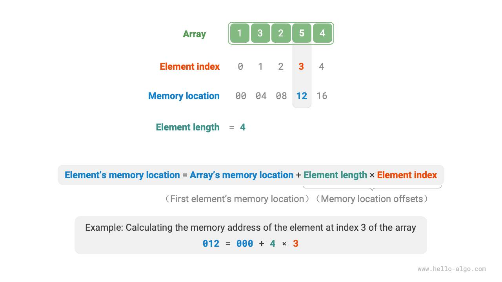
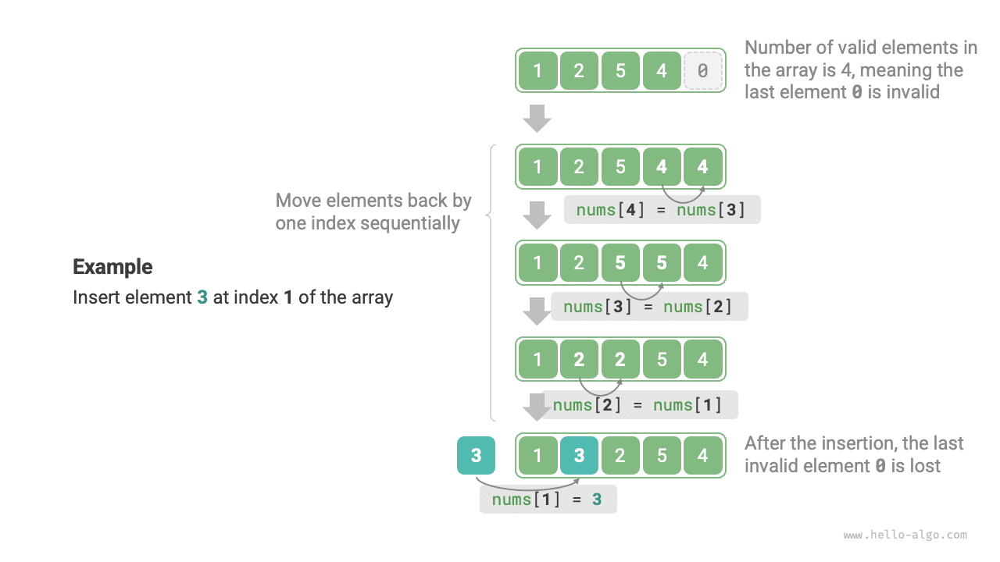
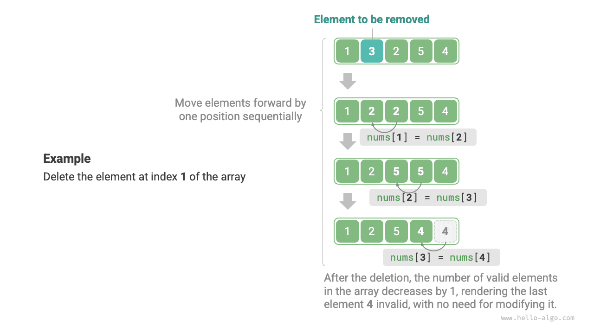

# Array

An "array" is a linear data structure that operates as a lineup of similar items, stored together in a computer's memory in contiguous spaces. It's like a sequence that maintains organized storage. Each item in this lineup has its unique 'spot' known as an "index". Please refer to the figure below to observe how arrays work and grasp these key terms.



## Common operations on arrays

### Initializing arrays

Arrays can be initialized in two ways depending on the needs: either without initial values or with specified initial values. When initial values are not specified, most programming languages will set the array elements to $0$:

=== "Python"

    ```python title="array.py"
    # Initialize array
    arr: list[int] = [0] * 5  # [ 0, 0, 0, 0, 0 ]
    nums: list[int] = [1, 3, 2, 5, 4]
    ```

=== "C++"

    ```cpp title="array.cpp"
    /* Initialize array */
    // Stored on stack
    int arr[5];
    int nums[5] = { 1, 3, 2, 5, 4 };
    // Stored on heap (manual memory release needed)
    int* arr1 = new int[5];
    int* nums1 = new int[5] { 1, 3, 2, 5, 4 };
    ```

=== "Java"

    ```java title="array.java"
    /* Initialize array */
    int[] arr = new int[5]; // { 0, 0, 0, 0, 0 }
    int[] nums = { 1, 3, 2, 5, 4 };
    ```

=== "C#"

    ```csharp title="array.cs"
    /* Initialize array */
    int[] arr = new int[5]; // [ 0, 0, 0, 0, 0 ]
    int[] nums = [1, 3, 2, 5, 4];
    ```

=== "Go"

    ```go title="array.go"
    /* Initialize array */
    var arr [5]int
    // In Go, specifying the length ([5]int) denotes an array, while not specifying it ([]int) denotes a slice.
    // Since Go's arrays are designed to have compile-time fixed length, only constants can be used to specify the length.
    // For convenience in implementing the extend() method, the Slice will be considered as an Array here.
    nums := []int{1, 3, 2, 5, 4}
    ```

=== "Swift"

    ```swift title="array.swift"
    /* Initialize array */
    let arr = Array(repeating: 0, count: 5) // [0, 0, 0, 0, 0]
    let nums = [1, 3, 2, 5, 4]
    ```

=== "JS"

    ```javascript title="array.js"
    /* Initialize array */
    var arr = new Array(5).fill(0);
    var nums = [1, 3, 2, 5, 4];
    ```

=== "TS"

    ```typescript title="array.ts"
    /* Initialize array */
    let arr: number[] = new Array(5).fill(0);
    let nums: number[] = [1, 3, 2, 5, 4];
    ```

=== "Dart"

    ```dart title="array.dart"
    /* Initialize array */
    List<int> arr = List.filled(5, 0); // [0, 0, 0, 0, 0]
    List<int> nums = [1, 3, 2, 5, 4];
    ```

=== "Rust"

    ```rust title="array.rs"
    /* Initialize array */
    let arr: Vec<i32> = vec![0; 5]; // [0, 0, 0, 0, 0]
    let nums: Vec<i32> = vec![1, 3, 2, 5, 4];
    ```

=== "C"

    ```c title="array.c"
    /* Initialize array */
    int arr[5] = { 0 }; // { 0, 0, 0, 0, 0 }
    int nums[5] = { 1, 3, 2, 5, 4 };
    ```

=== "Kotlin"

    ```kotlin title="array.kt"

    ```

=== "Zig"

    ```zig title="array.zig"
    // Initialize array
    var arr = [_]i32{0} ** 5; // { 0, 0, 0, 0, 0 }
    var nums = [_]i32{ 1, 3, 2, 5, 4 };
    ```

### Accessing elements

Elements in an array are stored in contiguous memory spaces, making it simpler to compute each element's memory address. The formula shown in the Figure below aids in determining an element's memory address, utilizing the array's memory address (specifically, the first element's address) and the element's index. This computation streamlines direct access to the desired element.



As observed in the above illustration, array indexing conventionally begins at $0$. While this might appear counterintuitive, considering counting usually starts at $1$, within the address calculation formula, **an index is essentially an offset from the memory address**. For the first element's address, this offset is $0$, validating its index as $0$.

Accessing elements in an array is highly efficient, allowing us to randomly access any element in $O(1)$ time.

```src
[file]{array}-[class]{}-[func]{random_access}
```

### Inserting elements

Array elements are tightly packed in memory, with no space available to accommodate additional data between them. Illustrated in Figure below, inserting an element in the middle of an array requires shifting all subsequent elements back by one position to create room for the new element.



It's important to note that due to the fixed length of an array, inserting an element will unavoidably result in the loss of the last element in the array. Solutions to address this issue will be explored in the "List" chapter.

```src
[file]{array}-[class]{}-[func]{insert}
```

### Deleting elements

Similarly, as depicted in the figure below, to delete an element at index $i$, all elements following index $i$ must be moved forward by one position.



Please note that after deletion, the former last element becomes "meaningless," hence requiring no specific modification.

```src
[file]{array}-[class]{}-[func]{remove}
```

In summary, the insertion and deletion operations in arrays present the following disadvantages:

- **High time complexity**: Both insertion and deletion in an array have an average time complexity of $O(n)$, where $n$ is the length of the array.
- **Loss of elements**: Due to the fixed length of arrays, elements that exceed the array's capacity are lost during insertion.
- **Waste of memory**: Initializing a longer array and utilizing only the front part results in "meaningless" end elements during insertion, leading to some wasted memory space.

### Traversing arrays

In most programming languages, we can traverse an array either by using indices or by directly iterating over each element:

```src
[file]{array}-[class]{}-[func]{traverse}
```

### Finding elements

Locating a specific element within an array involves iterating through the array, checking each element to determine if it matches the desired value.

Because arrays are linear data structures, this operation is commonly referred to as "linear search."

```src
[file]{array}-[class]{}-[func]{find}
```

### Expanding arrays

In complex system environments, ensuring the availability of memory space after an array for safe capacity extension becomes challenging. Consequently, in most programming languages, **the length of an array is immutable**.

To expand an array,  it's necessary to create a larger array and then copy the elements from the original array. This operation has a time complexity of $O(n)$ and can be time-consuming for large arrays. The code are as follows:

```src
[file]{array}-[class]{}-[func]{extend}
```

## Advantages and limitations of arrays

Arrays are stored in contiguous memory spaces and consist of elements of the same type. This approach provides substantial prior information that systems can leverage to optimize the efficiency of data structure operations.

- **High space efficiency**: Arrays allocate a contiguous block of memory for data, eliminating the need for additional structural overhead.
- **Support for random access**: Arrays allow $O(1)$ time access to any element.
- **Cache locality**: When accessing array elements, the computer not only loads them but also caches the surrounding data, utilizing high-speed cache to enchance subsequent operation speeds.

However, continuous space storage is a double-edged sword, with the following limitations:

- **Low efficiency in insertion and deletion**: As arrays accumulate many elements, inserting or deleting elements requires shifting a large number of elements.
- **Fixed length**: The length of an array is fixed after initialization. Expanding an array requires copying all data to a new array, incurring significant costs.
- **Space wastage**: If the allocated array size exceeds the what is necessary, the extra space is wasted.

## Typical applications of arrays

Arrays are fundamental and widely used data structures. They find frequent application in various algorithms and serve in the implementation of complex data structures.

- **Random access**: Arrays are ideal for storing data when random sampling is required. By generating a random sequence based on indices, we can achieve random sampling efficiently.
- **Sorting and searching**: Arrays are the most commonly used data structure for sorting and searching algorithms.  Techniques like quick sort, merge sort, binary search, etc., are primarily operate on arrays.
- **Lookup tables**: Arrays serve as efficient lookup tables for quick element or relationship retrieval. For instance, mapping characters to ASCII codes becomes seamless by using the ASCII code values as indices and storing corresponding elements in the array.
- **Machine learning**: Within the domain of neural networks, arrays play a pivotal role in executing crucial linear algebra operations involving vectors, matrices, and tensors. Arrays serve as the primary and most extensively used data structure in neural network programming.
- **Data structure implementation**:  Arrays serve as the building blocks for implementing various data structures like stacks, queues, hash tables, heaps, graphs, etc. For instance, the adjacency matrix representation of a graph is essentially a two-dimensional array.
