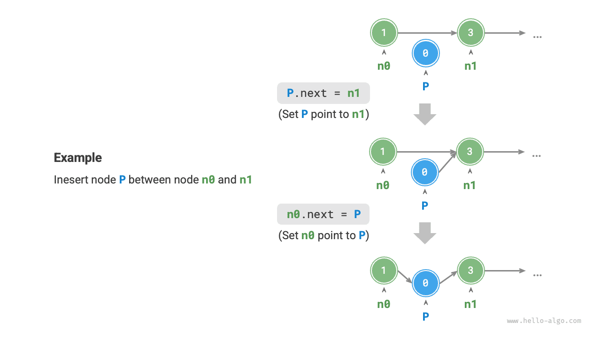
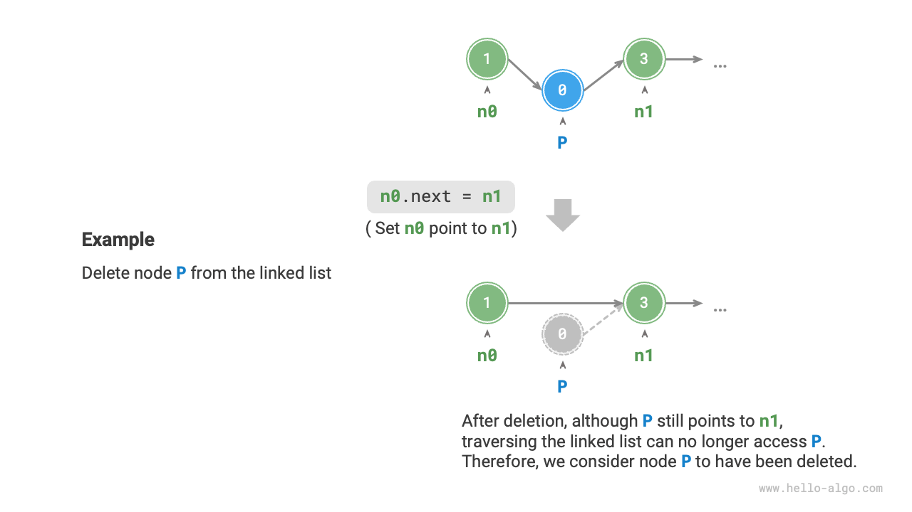
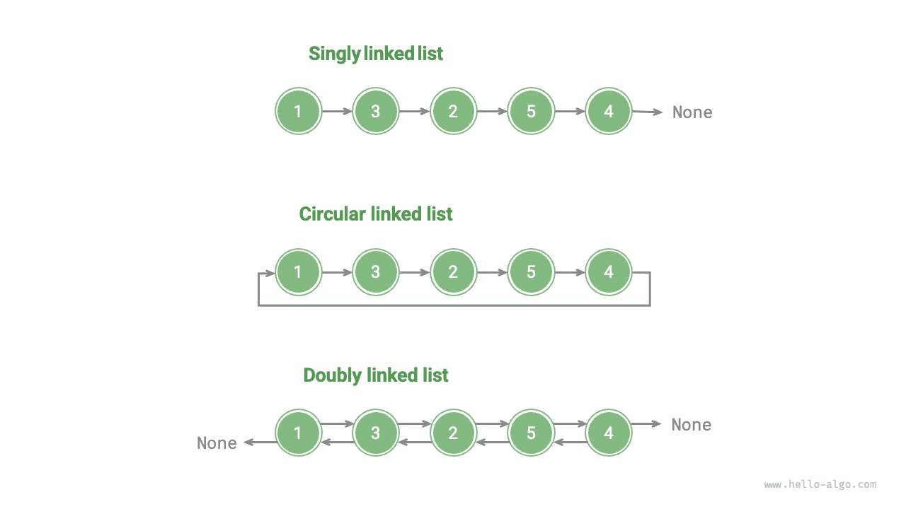

# Linked list

Memory space is a shared resource among all programs. In a complex system environment, available memory can be dispersed throughout the memory space. We understand that the memory allocated for an array must be continuous. However, for very large arrays, finding a sufficiently large contiguous memory space might be challenging. This is where the flexible advantage of linked lists becomes evident.

A <u>linked list</u> is a linear data structure in which each element is a node object, and the nodes are interconnected through "references". These references hold the memory addresses of subsequent nodes, enabling navigation from one node to the next.

The design of linked lists allows for their nodes to be distributed across memory locations without requiring contiguous memory addresses.


As shown in the figure above, we see that the basic building block of a linked list is the <u>node</u> object. Each node comprises two key components: the node's "value" and a "reference" to the next node.

- The first node in a linked list is the "head node", and the final one is the "tail node".
- The tail node points to "null", designated as `null` in Java, `nullptr` in C++, and `None` in Python.
- In languages that support pointers, like C, C++, Go, and Rust, this "reference" is typically implemented as a "pointer".

As the code below illustrates, a `ListNode` in a linked list, besides holding a value, must also maintain an additional reference (or pointer). Therefore, **a linked list occupies more memory space than an array when storing the same quantity of data.**.

=== "Python"

    ```python title=""
    class ListNode:
        """Linked list node class"""
        def __init__(self, val: int):
            self.val: int = val               # Node value
            self.next: ListNode | None = None # Reference to the next node
    ```

=== "C++"

    ```cpp title=""
    /* Linked list node structure */
    struct ListNode {
        int val;         // Node value
        ListNode *next;  // Pointer to the next node
        ListNode(int x) : val(x), next(nullptr) {}  // Constructor
    };
    ```

=== "Java"

    ```java title=""
    /* Linked list node class */
    class ListNode {
        int val;        // Node value
        ListNode next;  // Reference to the next node
        ListNode(int x) { val = x; }  // Constructor
    }
    ```

=== "C#"

    ```csharp title=""
    /* Linked list node class */
    class ListNode(int x) {  // Constructor
        int val = x;         // Node value
        ListNode? next;      // Reference to the next node
    }
    ```

=== "Go"

    ```go title=""
    /* Linked list node structure */
    type ListNode struct {
        Val  int       // Node value
        Next *ListNode // Pointer to the next node
    }

    // NewListNode Constructor, creates a new linked list
    func NewListNode(val int) *ListNode {
        return &ListNode{
            Val:  val,
            Next: nil,
        }
    }
    ```

=== "Swift"

    ```swift title=""
    /* Linked list node class */
    class ListNode {
        var val: Int // Node value
        var next: ListNode? // Reference to the next node

        init(x: Int) { // Constructor
            val = x
        }
    }
    ```

=== "JS"

    ```javascript title=""
    /* Linked list node class */
    class ListNode {
        constructor(val, next) {
            this.val = (val === undefined ? 0 : val);       // Node value
            this.next = (next === undefined ? null : next); // Reference to the next node
        }
    }
    ```

=== "TS"

    ```typescript title=""
    /* Linked list node class */
    class ListNode {
        val: number;
        next: ListNode | null;
        constructor(val?: number, next?: ListNode | null) {
            this.val = val === undefined ? 0 : val;        // Node value
            this.next = next === undefined ? null : next;  // Reference to the next node
        }
    }
    ```

=== "Dart"

    ```dart title=""
    /* Linked list node class */
    class ListNode {
      int val; // Node value
      ListNode? next; // Reference to the next node
      ListNode(this.val, [this.next]); // Constructor
    }
    ```

=== "Rust"

    ```rust title=""
    use std::rc::Rc;
    use std::cell::RefCell;
    /* Linked list node class */
    #[derive(Debug)]
    struct ListNode {
        val: i32, // Node value
        next: Option<Rc<RefCell<ListNode>>>, // Pointer to the next node
    }
    ```

=== "C"

    ```c title=""
    /* Linked list node structure */
    typedef struct ListNode {
        int val;               // Node value
        struct ListNode *next; // Pointer to the next node
    } ListNode;

    /* Constructor */
    ListNode *newListNode(int val) {
        ListNode *node;
        node = (ListNode *) malloc(sizeof(ListNode));
        node->val = val;
        node->next = NULL;
        return node;
    }
    ```

=== "Kotlin"

    ```kotlin title=""

    ```

=== "Zig"

    ```zig title=""
    // Linked list node class
    pub fn ListNode(comptime T: type) type {
        return struct {
            const Self = @This();

            val: T = 0, // Node value
            next: ?*Self = null, // Pointer to the next node

            // Constructor
            pub fn init(self: *Self, x: i32) void {
                self.val = x;
                self.next = null;
            }
        };
    }
    ```

## Common operations on linked lists

### Initializing a linked list

Constructing a linked list is a two-step process: first, initializing each node object, and second, forming the reference links between the nodes. After initialization, we can traverse all nodes sequentially from the head node by following the `next` reference.

=== "Python"

    ```python title="linked_list.py"
    # Initialize linked list: 1 -> 3 -> 2 -> 5 -> 4
    # Initialize each node
    n0 = ListNode(1)
    n1 = ListNode(3)
    n2 = ListNode(2)
    n3 = ListNode(5)
    n4 = ListNode(4)
    # Build references between nodes
    n0.next = n1
    n1.next = n2
    n2.next = n3
    n3.next = n4
    ```

=== "C++"

    ```cpp title="linked_list.cpp"
    /* Initialize linked list: 1 -> 3 -> 2 -> 5 -> 4 */
    // Initialize each node
    ListNode* n0 = new ListNode(1);
    ListNode* n1 = new ListNode(3);
    ListNode* n2 = new ListNode(2);
    ListNode* n3 = new ListNode(5);
    ListNode* n4 = new ListNode(4);
    // Build references between nodes
    n0->next = n1;
    n1->next = n2;
    n2->next = n3;
    n3->next = n4;
    ```

=== "Java"

    ```java title="linked_list.java"
    /* Initialize linked list: 1 -> 3 -> 2 -> 5 -> 4 */
    // Initialize each node
    ListNode n0 = new ListNode(1);
    ListNode n1 = new ListNode(3);
    ListNode n2 = new ListNode(2);
    ListNode n3 = new ListNode(5);
    ListNode n4 = new ListNode(4);
    // Build references between nodes
    n0.next = n1;
    n1.next = n2;
    n2.next = n3;
    n3.next = n4;
    ```

=== "C#"

    ```csharp title="linked_list.cs"
    /* Initialize linked list: 1 -> 3 -> 2 -> 5 -> 4 */
    // Initialize each node
    ListNode n0 = new(1);
    ListNode n1 = new(3);
    ListNode n2 = new(2);
    ListNode n3 = new(5);
    ListNode n4 = new(4);
    // Build references between nodes
    n0.next = n1;
    n1.next = n2;
    n2.next = n3;
    n3.next = n4;
    ```

=== "Go"

    ```go title="linked_list.go"
    /* Initialize linked list: 1 -> 3 -> 2 -> 5 -> 4 */
    // Initialize each node
    n0 := NewListNode(1)
    n1 := NewListNode(3)
    n2 := NewListNode(2)
    n3 := NewListNode(5)
    n4 := NewListNode(4)
    // Build references between nodes
    n0.Next = n1
    n1.Next = n2
    n2.Next = n3
    n3.Next = n4
    ```

=== "Swift"

    ```swift title="linked_list.swift"
    /* Initialize linked list: 1 -> 3 -> 2 -> 5 -> 4 */
    // Initialize each node
    let n0 = ListNode(x: 1)
    let n1 = ListNode(x: 3)
    let n2 = ListNode(x: 2)
    let n3 = ListNode(x: 5)
    let n4 = ListNode(x: 4)
    // Build references between nodes
    n0.next = n1
    n1.next = n2
    n2.next = n3
    n3.next = n4
    ```

=== "JS"

    ```javascript title="linked_list.js"
    /* Initialize linked list: 1 -> 3 -> 2 -> 5 -> 4 */
    // Initialize each node
    const n0 = new ListNode(1);
    const n1 = new ListNode(3);
    const n2 = new ListNode(2);
    const n3 = new ListNode(5);
    const n4 = new ListNode(4);
    // Build references between nodes
    n0.next = n1;
    n1.next = n2;
    n2.next = n3;
    n3.next = n4;
    ```

=== "TS"

    ```typescript title="linked_list.ts"
    /* Initialize linked list: 1 -> 3 -> 2 -> 5 -> 4 */
    // Initialize each node
    const n0 = new ListNode(1);
    const n1 = new ListNode(3);
    const n2 = new ListNode(2);
    const n3 = new ListNode(5);
    const n4 = new ListNode(4);
    // Build references between nodes
    n0.next = n1;
    n1.next = n2;
    n2.next = n3;
    n3.next = n4;
    ```

=== "Dart"

    ```dart title="linked_list.dart"
    /* Initialize linked list: 1 -> 3 -> 2 -> 5 -> 4 */
    // Initialize each node
    ListNode n0 = ListNode(1);
    ListNode n1 = ListNode(3);
    ListNode n2 = ListNode(2);
    ListNode n3 = ListNode(5);
    ListNode n4 = ListNode(4);
    // Build references between nodes
    n0.next = n1;
    n1.next = n2;
    n2.next = n3;
    n3.next = n4;
    ```

=== "Rust"

    ```rust title="linked_list.rs"
    /* Initialize linked list: 1 -> 3 -> 2 -> 5 -> 4 */
    // Initialize each node
    let n0 = Rc::new(RefCell::new(ListNode { val: 1, next: None }));
    let n1 = Rc::new(RefCell::new(ListNode { val: 3, next: None }));
    let n2 = Rc::new(RefCell::new(ListNode { val: 2, next: None }));
    let n3 = Rc::new(RefCell::new(ListNode { val: 5, next: None }));
    let n4 = Rc::new(RefCell::new(ListNode { val: 4, next: None }));

    // Build references between nodes
    n0.borrow_mut().next = Some(n1.clone());
    n1.borrow_mut().next = Some(n2.clone());
    n2.borrow_mut().next = Some(n3.clone());
    n3.borrow_mut().next = Some(n4.clone());
    ```

=== "C"

    ```c title="linked_list.c"
    /* Initialize linked list: 1 -> 3 -> 2 -> 5 -> 4 */
    // Initialize each node
    ListNode* n0 = newListNode(1);
    ListNode* n1 = newListNode(3);
    ListNode* n2 = newListNode(2);
    ListNode* n3 = newListNode(5);
    ListNode* n4 = newListNode(4);
    // Build references between nodes
    n0->next = n1;
    n1->next = n2;
    n2->next = n3;
    n3->next = n4;
    ```

=== "Kotlin"

    ```kotlin title="linked_list.kt"

    ```

=== "Zig"

    ```zig title="linked_list.zig"
    // Initialize linked list
    // Initialize each node
    var n0 = inc.ListNode(i32){.val = 1};
    var n1 = inc.ListNode(i32){.val = 3};
    var n2 = inc.ListNode(i32){.val = 2};
    var n3 = inc.ListNode(i32){.val = 5};
    var n4 = inc.ListNode(i32){.val = 4};
    // Build references between nodes
    n0.next = &n1;
    n1.next = &n2;
    n2.next = &n3;
    n3.next = &n4;
    ```

The array as a whole is a variable, for instance, the array `nums` includes elements like `nums[0]`, `nums[1]`, and so on, whereas a linked list is made up of several distinct node objects. **We typically refer to a linked list by its head node**, for example, the linked list in the previous code snippet is referred to as `n0`.

### Inserting nodes

Inserting a node into a linked list is very easy. As shown in the figure below, let's assume we aim to insert a new node `P` between two adjacent nodes `n0` and `n1`. **This can be achieved by simply modifying two node references (pointers)**, with a time complexity of $O(1)$.

By comparison, inserting an element into an array has a time complexity of $O(n)$, which becomes less efficient when dealing with large data volumes.



```src
[file]{linked_list}-[class]{}-[func]{insert}
```

### Deleting nodes

As shown in the figure below, deleting a node from a linked list is also very easy, **involving only the modification of a single node's reference (pointer)**.

It's important to note that even though node `P` continues to point to `n1` after being deleted, it becomes inaccessible during linked list traversal. This effectively means that `P` is no longer a part of the linked list.



```src
[file]{linked_list}-[class]{}-[func]{remove}
```

### Accessing nodes

**Accessing nodes in a linked list is less efficient**. As previously mentioned, any element in an array can be accessed in $O(1)$ time. In contrast, with a linked list, the program involves starting from the head node and sequentially traversing through the nodes until the desired node is found. In other words, to access the $i$-th node in a linked list, the program must iterate through $i - 1$ nodes, resulting in a time complexity of $O(n)$.

```src
[file]{linked_list}-[class]{}-[func]{access}
```

### Finding nodes

Traverse the linked list to locate a node whose value matches `target`, and then output the index of that node within the linked list. This procedure is also an example of linear search. The corresponding code is provided below:

```src
[file]{linked_list}-[class]{}-[func]{find}
```

## Arrays vs. linked lists

The table below summarizes the characteristics of arrays and linked lists, and it also compares their efficiencies in various operations. Because they utilize opposing storage strategies, their respective properties and operational efficiencies exhibit distinct contrasts.

<p align="center"> Table <id> &nbsp; Efficiency comparison of arrays and linked lists </p>

|                    | Arrays                                           | Linked Lists            |
| ------------------ | ------------------------------------------------ | ----------------------- |
| Storage            | Contiguous Memory Space                          | Dispersed Memory Space  |
| Capacity Expansion | Fixed Length                                     | Flexible Expansion      |
| Memory Efficiency  | Less Memory per Element, Potential Space Wastage | More Memory per Element |
| Accessing Elements | $O(1)$                                           | $O(n)$                  |
| Adding Elements    | $O(n)$                                           | $O(1)$                  |
| Deleting Elements  | $O(n)$                                           | $O(1)$                  |

## Common types of linked lists

As shown in the figure below, there are three common types of linked lists.

- **Singly linked list**: This is the standard linked list described earlier. Nodes in a singly linked list include a value and a reference to the next node. The first node is known as the head node, and the last node, which points to null (`None`), is the tail node.
- **Circular linked list**: This is formed when the tail node of a singly linked list points back to the head node, creating a loop. In a circular linked list, any node can function as the head node.
- **Doubly linked list**: In contrast to a singly linked list, a doubly linked list maintains references in two directions. Each node contains references (pointer) to both its successor (the next node) and predecessor (the previous node). Although doubly linked lists offer more flexibility for traversing in either direction, they also consume more memory space.

=== "Python"

    ```python title=""
    class ListNode:
        """Bidirectional linked list node class"""
        def __init__(self, val: int):
            self.val: int = val                # Node value
            self.next: ListNode | None = None  # Reference to the successor node
            self.prev: ListNode | None = None  # Reference to a predecessor node
    ```

=== "C++"

    ```cpp title=""
    /* Bidirectional linked list node structure */
    struct ListNode {
        int val;         // Node value
        ListNode *next;  // Pointer to the successor node
        ListNode *prev;  // Pointer to the predecessor node
        ListNode(int x) : val(x), next(nullptr), prev(nullptr) {}  // Constructor
    };
    ```

=== "Java"

    ```java title=""
    /* Bidirectional linked list node class */
    class ListNode {
        int val;        // Node value
        ListNode next;  // Reference to the next node
        ListNode prev;  // Reference to the predecessor node
        ListNode(int x) { val = x; }  // Constructor
    }
    ```

=== "C#"

    ```csharp title=""
    /* Bidirectional linked list node class */
    class ListNode(int x) {  // Constructor
        int val = x;    // Node value
        ListNode next;  // Reference to the next node
        ListNode prev;  // Reference to the predecessor node
    }
    ```

=== "Go"

    ```go title=""
    /* Bidirectional linked list node structure */
    type DoublyListNode struct {
        Val  int             // Node value
        Next *DoublyListNode // Pointer to the successor node
        Prev *DoublyListNode // Pointer to the predecessor node
    }

    // NewDoublyListNode initialization
    func NewDoublyListNode(val int) *DoublyListNode {
        return &DoublyListNode{
            Val:  val,
            Next: nil,
            Prev: nil,
        }
    }
    ```

=== "Swift"

    ```swift title=""
    /* Bidirectional linked list node class */
    class ListNode {
        var val: Int // Node value
        var next: ListNode? // Reference to the next node
        var prev: ListNode? // Reference to the predecessor node

        init(x: Int) { // Constructor
            val = x
        }
    }
    ```

=== "JS"

    ```javascript title=""
    /* Bidirectional linked list node class */
    class ListNode {
        constructor(val, next, prev) {
            this.val = val  ===  undefined ? 0 : val;        // Node value
            this.next = next  ===  undefined ? null : next;  // Reference to the successor node
            this.prev = prev  ===  undefined ? null : prev;  // Reference to the predecessor node
        }
    }
    ```

=== "TS"

    ```typescript title=""
    /* Bidirectional linked list node class */
    class ListNode {
        val: number;
        next: ListNode | null;
        prev: ListNode | null;
        constructor(val?: number, next?: ListNode | null, prev?: ListNode | null) {
            this.val = val  ===  undefined ? 0 : val;        // Node value
            this.next = next  ===  undefined ? null : next;  // Reference to the successor node
            this.prev = prev  ===  undefined ? null : prev;  // Reference to the predecessor node
        }
    }
    ```

=== "Dart"

    ```dart title=""
    /* Bidirectional linked list node class */
    class ListNode {
        int val;        // Node value
        ListNode next;  // Reference to the next node
        ListNode prev;  // Reference to the predecessor node
        ListNode(this.val, [this.next, this.prev]);  // Constructor
    }
    ```

=== "Rust"

    ```rust title=""
    use std::rc::Rc;
    use std::cell::RefCell;

    /* Bidirectional linked list node type */
    #[derive(Debug)]
    struct ListNode {
        val: i32, // Node value
        next: Option<Rc<RefCell<ListNode>>>, // Pointer to successor node
        prev: Option<Rc<RefCell<ListNode>>>, // Pointer to predecessor node
    }

    /* Constructors */
    impl ListNode {
        fn new(val: i32) -> Self {
            ListNode {
                val,
                next: None,
                prev: None,
            }
        }
    }
    ```

=== "C"

    ```c title=""
    /* Bidirectional linked list node structure */
    typedef struct ListNode {
        int val;               // Node value
        struct ListNode *next; // Pointer to the successor node
        struct ListNode *prev; // Pointer to the predecessor node
    } ListNode;

    /* Constructors */
    ListNode *newListNode(int val) {
        ListNode *node, *next;
        node = (ListNode *) malloc(sizeof(ListNode));
        node->val = val;
        node->next = NULL;
        node->prev = NULL;
        return node;
    }
    ```

=== "Kotlin"

    ```kotlin title=""

    ```

=== "Zig"

    ```zig title=""
    // Bidirectional linked list node class
    pub fn ListNode(comptime T: type) type {
        return struct {
            const Self = @This();

            val: T = 0, // Node value
            next: ?*Self = null, // Pointer to the successor node
            prev: ?*Self = null, // Pointer to the predecessor node

            // Constructor
            pub fn init(self: *Self, x: i32) void {
                self.val = x;
                self.next = null;
                self.prev = null;
            }
        };
    }
    ```



## Typical applications of linked lists

Singly linked lists are frequently utilized in implementing stacks, queues, hash tables, and graphs.

- **Stacks and queues**: In singly linked lists, if insertions and deletions occur at the same end, it behaves like a stack (last-in-first-out). Conversely, if insertions are at one end and deletions at the other, it functions like a queue (first-in-first-out).
- **Hash tables**: Linked lists are used in chaining, a popular method for resolving hash collisions. Here, all collided elements are grouped into a linked list.
- **Graphs**: Adjacency lists, a standard method for graph representation, associate each graph vertex with a linked list. This list contains elements that represent vertices connected to the corresponding vertex.

Doubly linked lists are ideal for scenarios requiring rapid access to preceding and succeeding elements.

- **Advanced data structures**: In structures like red-black trees and B-trees, accessing a node's parent is essential. This is achieved by incorporating a reference to the parent node in each node, akin to a doubly linked list.
- **Browser history**: In web browsers, doubly linked lists facilitate navigating the history of visited pages when users click forward or back.
- **LRU algorithm**: Doubly linked lists are apt for Least Recently Used (LRU) cache eviction algorithms, enabling swift identification of the least recently used data and facilitating fast node addition and removal.

Circular linked lists are ideal for applications that require periodic operations, such as resource scheduling in operating systems.

- **Round-robin scheduling algorithm**: In operating systems, the round-robin scheduling algorithm is a common CPU scheduling method, requiring cycling through a group of processes. Each process is assigned a time slice, and upon expiration, the CPU rotates to the next process. This cyclical operation can be efficiently realized using a circular linked list, allowing for a fair and time-shared system among all processes.
- **Data buffers**: Circular linked lists are also used in data buffers, like in audio and video players, where the data stream is divided into multiple buffer blocks arranged in a circular fashion for seamless playback.
