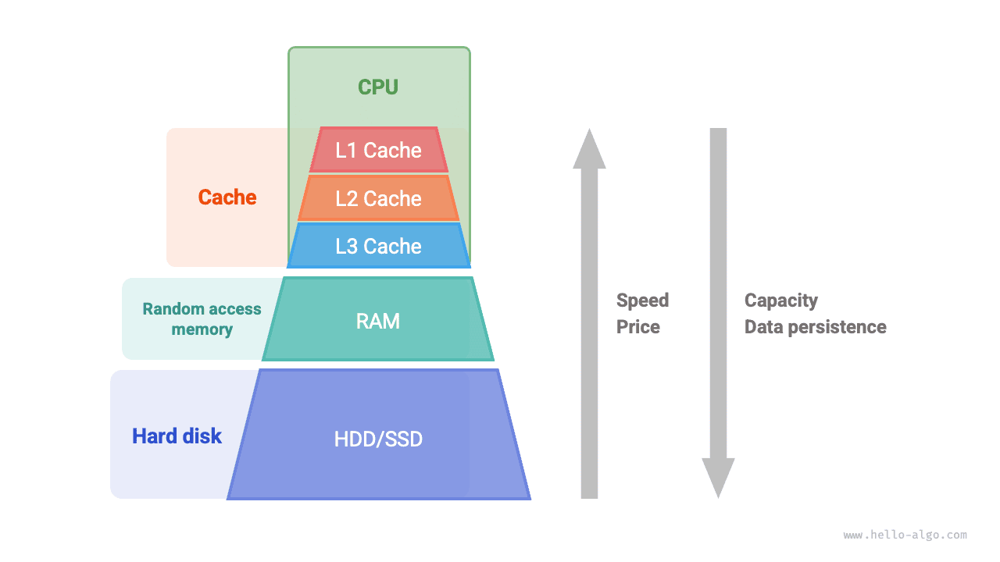
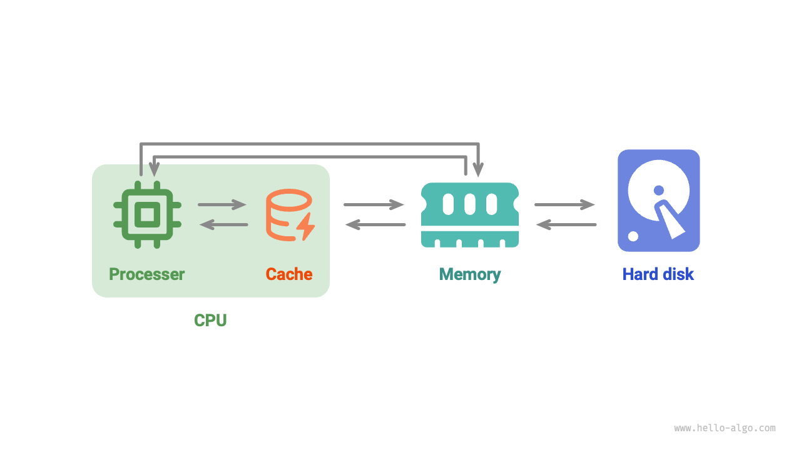

# Memory and cache *

In the first two sections of this chapter, we explored arrays and linked lists, two fundamental and important data structures, representing "continuous storage" and "dispersed storage" respectively.

In fact, **the physical structure largely determines the efficiency of a program's use of memory and cache**, which in turn affects the overall performance of the algorithm.

## Computer storage devices

There are three types of storage devices in computers: "hard disk," "random-access memory (RAM)," and "cache memory." The following table shows their different roles and performance characteristics in computer systems.

 Table <id> &nbsp; Computer storage devices 

|            | Hard Disk                                                      | Memory                                                                   | Cache                                                                                           |
| ---------- | -------------------------------------------------------------- | ------------------------------------------------------------------------ | ----------------------------------------------------------------------------------------------- |
| Usage      | Long-term storage of data, including OS, programs, files, etc. | Temporary storage of currently running programs and data being processed | Stores frequently accessed data and instructions, reducing the number of CPU accesses to memory |
| Volatility | Data is not lost after power off                               | Data is lost after power off                                             | Data is lost after power off                                                                    |
| Capacity   | Larger, TB level                                               | Smaller, GB level                                                        | Very small, MB level                                                                            |
| Speed      | Slower, several hundred to thousands MB/s                      | Faster, several tens of GB/s                                             | Very fast, several tens to hundreds of GB/s                                                     |
| Price      | Cheaper, several cents to yuan / GB                            | More expensive, tens to hundreds of yuan / GB                            | Very expensive, priced with CPU                                                                 |

We can imagine the computer storage system as a pyramid structure shown in the figure below. The storage devices closer to the top of the pyramid are faster, have smaller capacity, and are more costly. This multi-level design is not accidental, but the result of careful consideration by computer scientists and engineers.

- **Hard disks are difficult to replace with memory**. Firstly, data in memory is lost after power off, making it unsuitable for long-term data storage; secondly, the cost of memory is dozens of times that of hard disks, making it difficult to popularize in the consumer market.
- **It is difficult for caches to have both large capacity and high speed**. As the capacity of L1, L2, L3 caches gradually increases, their physical size becomes larger, increasing the physical distance from the CPU core, leading to increased data transfer time and higher element access latency. Under current technology, a multi-level cache structure is the best balance between capacity, speed, and cost.

!!! note

    The storage hierarchy of computers reflects a delicate balance between speed, capacity, and cost. In fact, this kind of trade-off is common in all industrial fields, requiring us to find the best balance between different advantages and limitations.

Overall, **hard disks are used for long-term storage of large amounts of data, memory is used for temporary storage of data being processed during program execution, and cache is used to store frequently accessed data and instructions** to improve program execution efficiency. Together, they ensure the efficient operation of computer systems.

As shown in the figure below, during program execution, data is read from the hard disk into memory for CPU computation. The cache can be considered a part of the CPU, **smartly loading data from memory** to provide fast data access to the CPU, significantly enhancing program execution efficiency and reducing reliance on slower memory.

## Memory efficiency of data structures

In terms of memory space utilization, arrays and linked lists have their advantages and limitations.

On one hand, **memory is limited and cannot be shared by multiple programs**, so we hope that data structures can use space as efficiently as possible. The elements of an array are tightly packed without extra space for storing references (pointers) between linked list nodes, making them more space-efficient. However, arrays require allocating sufficient continuous memory space at once, which may lead to memory waste, and array expansion also requires additional time and space costs. In contrast, linked lists allocate and reclaim memory dynamically on a per-node basis, providing greater flexibility.

On the other hand, during program execution, **as memory is repeatedly allocated and released, the degree of fragmentation of free memory becomes higher**, leading to reduced memory utilization efficiency. Arrays, due to their continuous storage method, are relatively less likely to cause memory fragmentation. In contrast, the elements of a linked list are dispersedly stored, and frequent insertion and deletion operations make memory fragmentation more likely.

## Cache efficiency of data structures

Although caches are much smaller in space capacity than memory, they are much faster and play a crucial role in program execution speed. Since the cache's capacity is limited and can only store a small part of frequently accessed data, when the CPU tries to access data not in the cache, a "cache miss" occurs, forcing the CPU to load the needed data from slower memory.

Clearly, **the fewer the cache misses, the higher the CPU's data read-write efficiency**, and the better the program performance. The proportion of successful data retrieval from the cache by the CPU is called the "cache hit rate," a metric often used to measure cache efficiency.

To achieve higher efficiency, caches adopt the following data loading mechanisms.

- **Cache lines**: Caches don't store and load data byte by byte but in units of cache lines. Compared to byte-by-byte transfer, the transmission of cache lines is more efficient.
- **Prefetch mechanism**: Processors try to predict data access patterns (such as sequential access, fixed stride jumping access, etc.) and load data into the cache according to specific patterns to improve the hit rate.
- **Spatial locality**: If data is accessed, data nearby is likely to be accessed in the near future. Therefore, when loading certain data, the cache also loads nearby data to improve the hit rate.
- **Temporal locality**: If data is accessed, it's likely to be accessed again in the near future. Caches use this principle to retain recently accessed data to improve the hit rate.

In fact, **arrays and linked lists have different cache utilization efficiencies**, mainly reflected in the following aspects.

- **Occupied space**: Linked list elements occupy more space than array elements, resulting in less effective data volume in the cache.
- **Cache lines**: Linked list data is scattered throughout memory, and since caches load "by line," the proportion of loading invalid data is higher.
- **Prefetch mechanism**: The data access pattern of arrays is more "predictable" than that of linked lists, meaning the system is more likely to guess which data will be loaded next.
- **Spatial locality**: Arrays are stored in concentrated memory spaces, so the data near the loaded data is more likely to be accessed next.

Overall, **arrays have a higher cache hit rate and are generally more efficient in operation than linked lists**. This makes data structures based on arrays more popular in solving algorithmic problems.

It should be noted that **high cache efficiency does not mean that arrays are always better than linked lists**. Which data structure to choose in actual applications should be based on specific requirements. For example, both arrays and linked lists can implement the "stack" data structure (which will be detailed in the next chapter), but they are suitable for different scenarios.

- In algorithm problems, we tend to choose stacks based on arrays because they provide higher operational efficiency and random access capabilities, with the only cost being the need to pre-allocate a certain amount of memory space for the array.
- If the data volume is very large, highly dynamic, and the expected size of the stack is difficult to estimate, then a stack based on a linked list is more appropriate. Linked lists can disperse a large amount of data in different parts of the memory and avoid the additional overhead of array expansion.
