# Backtracking algorithms

<u>Backtracking algorithm</u> is a method to solve problems by exhaustive search, where the core idea is to start from an initial state and brute force all possible solutions, recording the correct ones until a solution is found or all possible choices are exhausted without finding a solution.

Backtracking typically employs "depth-first search" to traverse the solution space. In the "Binary Tree" chapter, we mentioned that pre-order, in-order, and post-order traversals are all depth-first searches. Next, we use pre-order traversal to construct a backtracking problem to gradually understand the workings of the backtracking algorithm.

!!! question "Example One"

    Given a binary tree, search and record all nodes with a value of $7$, please return a list of nodes.

For this problem, we traverse this tree in pre-order and check if the current node's value is $7$. If it is, we add the node's value to the result list `res`. The relevant process is shown in the figure below:

```src
[file]{preorder_traversal_i_compact}-[class]{}-[func]{pre_order}
```

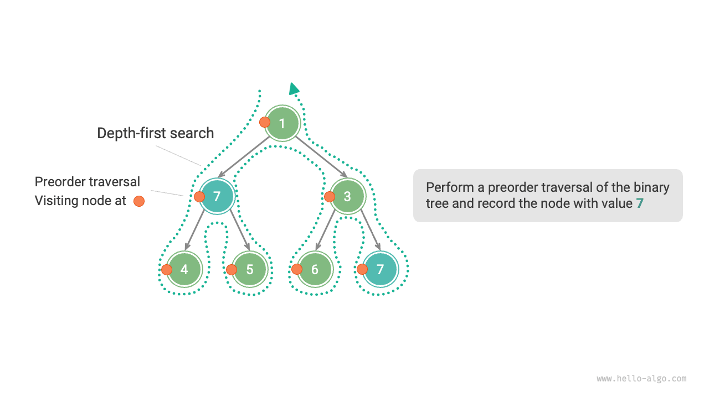

## Trying and retreating

**The reason it is called backtracking is that the algorithm uses a "try" and "retreat" strategy when searching the solution space**. When the algorithm encounters a state where it can no longer progress or fails to achieve a satisfying solution, it undoes the previous choice, reverts to the previous state, and tries other possible choices.

For Example One, visiting each node represents a "try", and passing a leaf node or returning to the parent node's `return` represents "retreat".

It's worth noting that **retreat is not merely about function returns**. We expand slightly on Example One for clarification.

!!! question "Example Two"

    In a binary tree, search for all nodes with a value of $7$ and **please return the paths from the root node to these nodes**.

Based on the code from Example One, we need to use a list `path` to record the visited node paths. When a node with a value of $7$ is reached, we copy `path` and add it to the result list `res`. After the traversal, `res` holds all the solutions. The code is as shown:

```src
[file]{preorder_traversal_ii_compact}-[class]{}-[func]{pre_order}
```

In each "try", we record the path by adding the current node to `path`; before "retreating", we need to pop the node from `path` **to restore the state before this attempt**.

Observe the process shown in the figure below, **we can understand trying and retreating as "advancing" and "undoing"**, two operations that are reverse to each other.

=== "<1>"
    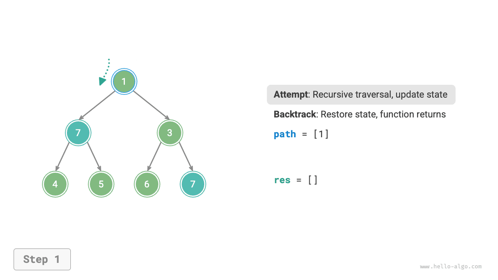

=== "<2>"
    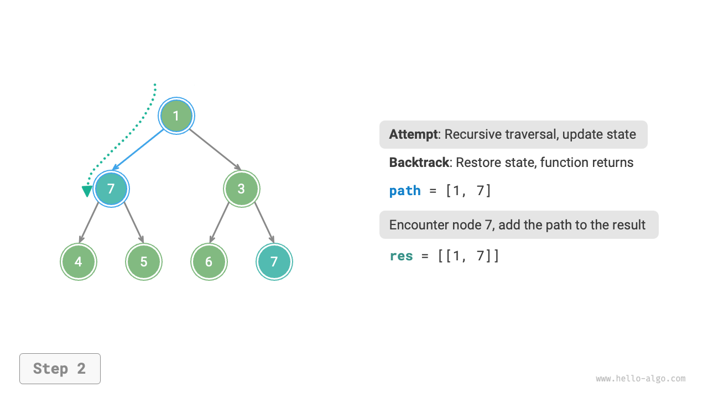

=== "<3>"
    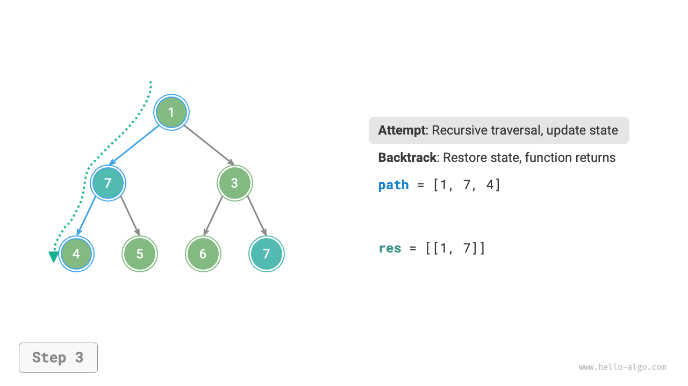

=== "<4>"
    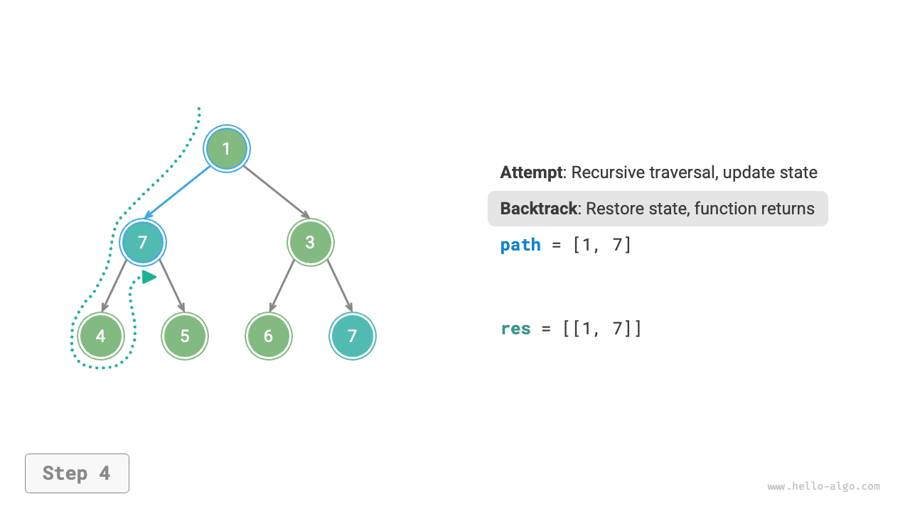

=== "<5>"
    

=== "<6>"
    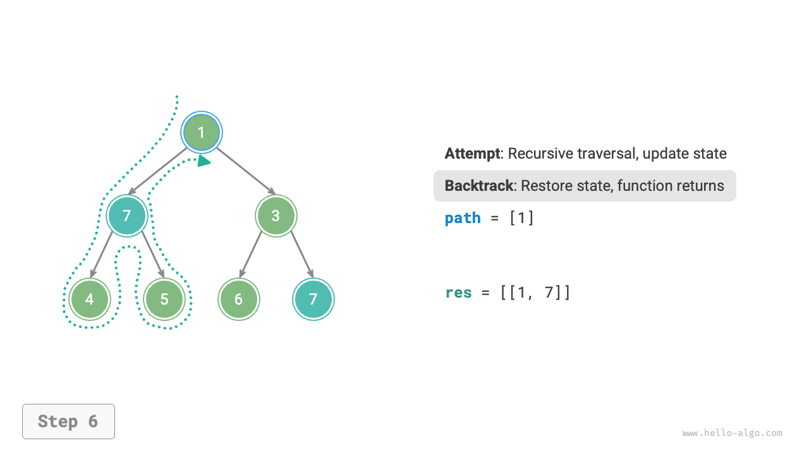

=== "<7>"
    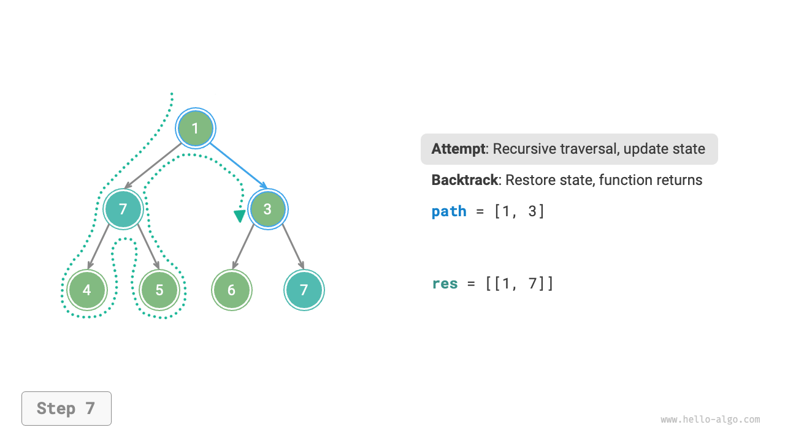

=== "<8>"
    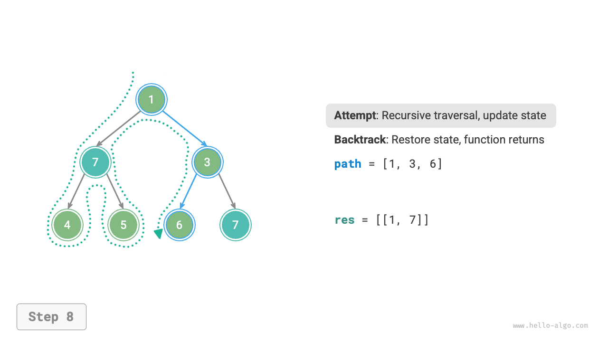

=== "<9>"
    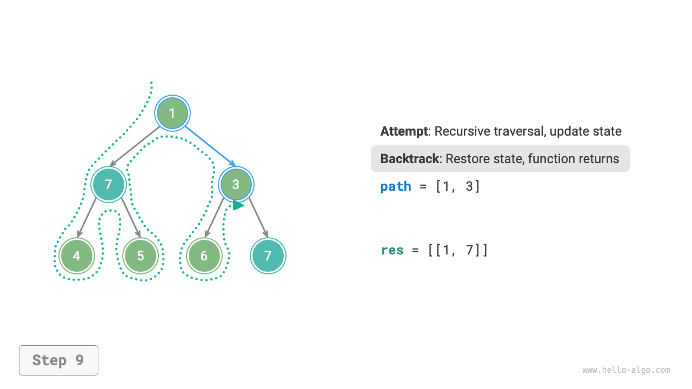

=== "<10>"
    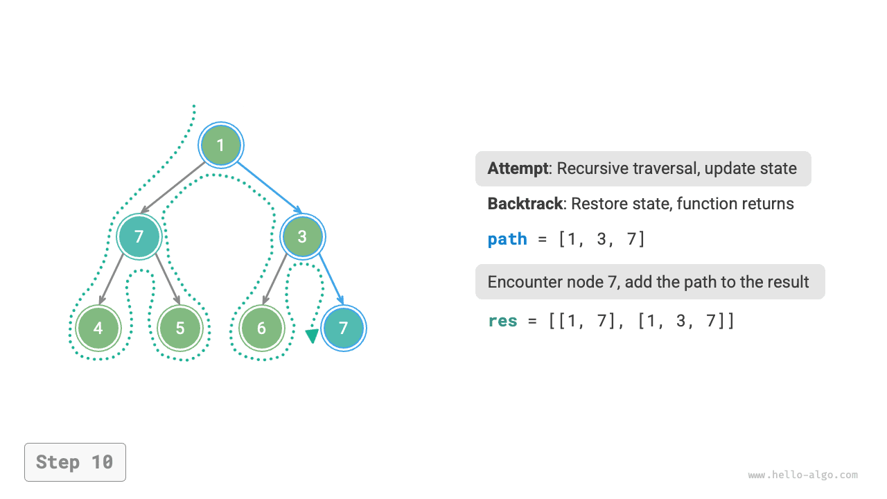

=== "<11>"
    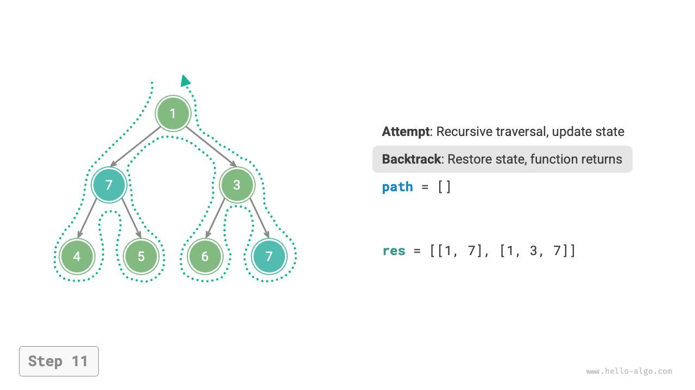

## Pruning

Complex backtracking problems usually involve one or more constraints, **which are often used for "pruning"**.

!!! question "Example Three"

    In a binary tree, search for all nodes with a value of $7$ and return the paths from the root to these nodes, **requiring that the paths do not contain nodes with a value of $3$**.

To meet the above constraints, **we need to add a pruning operation**: during the search process, if a node with a value of $3$ is encountered, it returns early, discontinuing further search. The code is as shown:

```src
[file]{preorder_traversal_iii_compact}-[class]{}-[func]{pre_order}
```

"Pruning" is a very vivid noun. As shown in the figure below, in the search process, **we "cut off" the search branches that do not meet the constraints**, avoiding many meaningless attempts, thus enhancing the search efficiency.

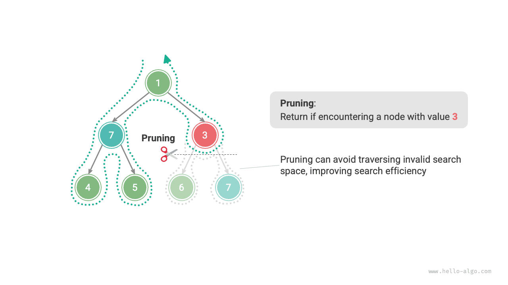

## Framework code

Next, we attempt to distill the main framework of "trying, retreating, and pruning" from backtracking to enhance the code's universality.

In the following framework code, `state` represents the current state of the problem, `choices` represents the choices available under the current state:

=== "Python"

    ```python title=""
    def backtrack(state: State, choices: list[choice], res: list[state]):
        """Backtracking algorithm framework"""
        # Check if it's a solution
        if is_solution(state):
            # Record the solution
            record_solution(state, res)
            # Stop searching
            return
        # Iterate through all choices
        for choice in choices:
            # Pruning: check if the choice is valid
            if is_valid(state, choice):
                # Try: make a choice, update the state
                make_choice(state, choice)
                backtrack(state, choices, res)
                # Retreat: undo the choice, revert to the previous state
                undo_choice(state, choice)
    ```

=== "C++"

    ```cpp title=""
    /* Backtracking algorithm framework */
    void backtrack(State *state, vector<Choice *> &choices, vector<State *> &res) {
        // Check if it's a solution
        if (isSolution(state)) {
            // Record the solution
            recordSolution(state, res);
            // Stop searching
            return;
        }
        // Iterate through all choices
        for (Choice choice : choices) {
            // Pruning: check if the choice is valid
            if (isValid(state, choice)) {
                // Try: make a choice, update the state
                makeChoice(state, choice);
                backtrack(state, choices, res);
                // Retreat: undo the choice, revert to the previous state
                undoChoice(state, choice);
            }
        }
    }
    ```

=== "Java"

    ```java title=""
    /* Backtracking algorithm framework */
    void backtrack(State state, List<Choice> choices, List<State> res) {
        // Check if it's a solution
        if (isSolution(state)) {
            // Record the solution
            recordSolution(state, res);
            // Stop searching
            return;
        }
        // Iterate through all choices
        for (Choice choice : choices) {
            // Pruning: check if the choice is valid
            if (isValid(state, choice)) {
                // Try: make a choice, update the state
                makeChoice(state, choice);
                backtrack(state, choices, res);
                // Retreat: undo the choice, revert to the previous state
                undoChoice(state, choice);
            }
        }
    }
    ```

=== "C#"

    ```csharp title=""
    /* Backtracking algorithm framework */
    void Backtrack(State state, List<Choice> choices, List<State> res) {
        // Check if it's a solution
        if (IsSolution(state)) {
            // Record the solution
            RecordSolution(state, res);
            // Stop searching
            return;
        }
        // Iterate through all choices
        foreach (Choice choice in choices) {
            // Pruning: check if the choice is valid
            if (IsValid(state, choice)) {
                // Try: make a choice, update the state
                MakeChoice(state, choice);
                Backtrack(state, choices, res);
                // Retreat: undo the choice, revert to the previous state
                UndoChoice(state, choice);
            }
        }
    }
    ```

=== "Go"

    ```go title=""
    /* Backtracking algorithm framework */
    func backtrack(state *State, choices []Choice, res *[]State) {
        // Check if it's a solution
        if isSolution(state) {
            // Record the solution
            recordSolution(state, res)
            // Stop searching
            return
        }
        // Iterate through all choices
        for _, choice := range choices {
            // Pruning: check if the choice is valid
            if isValid(state, choice) {
                // Try: make a choice, update the state
                makeChoice(state, choice)
                backtrack(state, choices, res)
                // Retreat: undo the choice, revert to the previous state
                undoChoice(state, choice)
            }
        }
    }
    ```

=== "Swift"

    ```swift title=""
    /* Backtracking algorithm framework */
    func backtrack(state: inout State, choices: [Choice], res: inout [State]) {
        // Check if it's a solution
        if isSolution(state: state) {
            // Record the solution
            recordSolution(state: state, res: &res)
            // Stop searching
            return
        }
        // Iterate through all choices
        for choice in choices {
            // Pruning: check if the choice is valid
            if isValid(state: state, choice: choice) {
                // Try: make a choice, update the state
                makeChoice(state: &state, choice: choice)
                backtrack(state: &state, choices: choices, res: &res)
                // Retreat: undo the choice, revert to the previous state
                undoChoice(state: &state, choice: choice)
            }
        }
    }
    ```

=== "JS"

    ```javascript title=""
    /* Backtracking algorithm framework */
    function backtrack(state, choices, res) {
        // Check if it's a solution
        if (isSolution(state)) {
            // Record the solution
            recordSolution(state, res);
            // Stop searching
            return;
        }
        // Iterate through all choices
        for (let choice of choices) {
            // Pruning: check if the choice is valid
            if (isValid(state, choice)) {
                // Try: make a choice, update the state
                makeChoice(state, choice);
                backtrack(state, choices, res);
                // Retreat: undo the choice, revert to the previous state
                undoChoice(state, choice);
            }
        }
    }
    ```

=== "TS"

    ```typescript title=""
    /* Backtracking algorithm framework */
    function backtrack(state: State, choices: Choice[], res: State[]): void {
        // Check if it's a solution
        if (isSolution(state)) {
            // Record the solution
            recordSolution(state, res);
            // Stop searching
            return;
        }
        // Iterate through all choices
        for (let choice of choices) {
            // Pruning: check if the choice is valid
            if (isValid(state, choice)) {
                // Try: make a choice, update the state
                makeChoice(state, choice);
                backtrack(state, choices, res);
                // Retreat: undo the choice, revert to the previous state
                undoChoice(state, choice);
            }
        }
    }
    ```

=== "Dart"

    ```dart title=""
    /* Backtracking algorithm framework */
    void backtrack(State state, List<Choice>, List<State> res) {
      // Check if it's a solution
      if (isSolution(state)) {
        // Record the solution
        recordSolution(state, res);
        // Stop searching
        return;
      }
      // Iterate through all choices
      for (Choice choice in choices) {
        // Pruning: check if the choice is valid
        if (isValid(state, choice)) {
          // Try: make a choice, update the state
          makeChoice(state, choice);
          backtrack(state, choices, res);
          // Retreat: undo the choice, revert to the previous state
          undoChoice(state, choice);
        }
      }
    }
    ```

=== "Rust"

    ```rust title=""
    /* Backtracking algorithm framework */
    fn backtrack(state: &mut State, choices: &Vec<Choice>, res: &mut Vec<State>) {
        // Check if it's a solution
        if is_solution(state) {
            // Record the solution
            record_solution(state, res);
            // Stop searching
            return;
        }
        // Iterate through all choices
        for choice in choices {
            // Pruning: check if the choice is valid
            if is_valid(state, choice) {
                // Try: make a choice, update the state
                make_choice(state, choice);
                backtrack(state, choices, res);
                // Retreat: undo the choice, revert to the previous state
                undo_choice(state, choice);
            }
        }
    }
    ```

=== "C"

    ```c title=""
    /* Backtracking algorithm framework */
    void backtrack(State *state, Choice *choices, int numChoices, State *res, int numRes) {
        // Check if it's a solution
        if (isSolution(state)) {
            // Record the solution
            recordSolution(state, res, numRes);
            // Stop searching
            return;
        }
        // Iterate through all choices
        for (int i = 0; i < numChoices; i++) {
            // Pruning: check if the choice is valid
            if (isValid(state, &choices[i])) {
                // Try: make a choice, update the state
                makeChoice(state, &choices[i]);
                backtrack(state, choices, numChoices, res, numRes);
                // Retreat: undo the choice, revert to the previous state
                undoChoice(state, &choices[i]);
            }
        }
    }
    ```

=== "Kotlin"

    ```kotlin title=""
    /* Backtracking algorithm framework */
    fun backtrack(state: State?, choices: List<Choice?>, res: List<State?>?) {
        // Check if it's a solution
        if (isSolution(state)) {
            // Record the solution
            recordSolution(state, res)
            // Stop searching
            return
        }
        // Iterate through all choices
        for (choice in choices) {
            // Pruning: check if the choice is valid
            if (isValid(state, choice)) {
                // Try: make a choice, update the state
                makeChoice(state, choice)
                backtrack(state, choices, res)
                // Retreat: undo the choice, revert to the previous state
                undoChoice(state, choice)
            }
        }
    }
    ```

=== "Ruby"

    ```ruby title=""

    ```

=== "Zig"

    ```zig title=""

    ```

Next, we solve Example Three based on the framework code. The `state` is the node traversal path, `choices` are the current node's left and right children, and the result `res` is the list of paths:

```src
[file]{preorder_traversal_iii_template}-[class]{}-[func]{backtrack}
```

As per the requirements, after finding a node with a value of $7$, the search should continue, **thus the `return` statement after recording the solution should be removed**. The figure below compares the search processes with and without retaining the `return` statement.

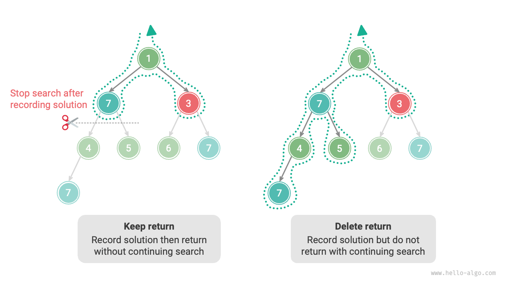

Compared to the implementation based on pre-order traversal, the code implementation based on the backtracking algorithm framework seems verbose, but it has better universality. In fact, **many backtracking problems can be solved within this framework**. We just need to define `state` and `choices` according to the specific problem and implement the methods in the framework.

## Common terminology

To analyze algorithmic problems more clearly, we summarize the meanings of commonly used terminology in backtracking algorithms and provide corresponding examples from Example Three as shown in the table below.

<p align="center"> Table <id> &nbsp; Common backtracking algorithm terminology </p>

| Term                        | Definition                                                                                                                                                          | Example Three                                                                                                                    |
| --------------------------- | ------------------------------------------------------------------------------------------------------------------------------------------------------------------- | -------------------------------------------------------------------------------------------------------------------------------- |
| Solution (solution)         | A solution is an answer that satisfies specific conditions of the problem, which may have one or more                                                               | All paths from the root node to node $7$ that meet the constraint                                                                |
| Constraint (constraint)     | Constraints are conditions in the problem that limit the feasibility of solutions, often used for pruning                                                           | Paths do not contain node $3$                                                                                                    |
| State (state)               | State represents the situation of the problem at a certain moment, including choices made                                                                           | Current visited node path, i.e., `path` node list                                                                                |
| Attempt (attempt)           | An attempt is the process of exploring the solution space based on available choices, including making choices, updating the state, and checking if it's a solution | Recursively visiting left (right) child nodes, adding nodes to `path`, checking if the node's value is $7$                       |
| Backtracking (backtracking) | Backtracking refers to the action of undoing previous choices and returning to the previous state when encountering states that do not meet the constraints         | When passing leaf nodes, ending node visits, encountering nodes with a value of $3$, terminating the search, and function return |
| Pruning (pruning)           | Pruning is a method to avoid meaningless search paths based on the characteristics and constraints of the problem, which can enhance search efficiency              | When encountering a node with a value of $3$, no further search is continued                                                     |

!!! tip

    Concepts like problems, solutions, states, etc., are universal, and are involved in divide and conquer, backtracking, dynamic programming, and greedy algorithms, among others.

## Advantages and limitations

The backtracking algorithm is essentially a depth-first search algorithm that attempts all possible solutions until a satisfying solution is found. The advantage of this method is that it can find all possible solutions, and with reasonable pruning operations, it can be highly efficient.

However, when dealing with large-scale or complex problems, **the operational efficiency of backtracking may be difficult to accept**.

- **Time**: Backtracking algorithms usually need to traverse all possible states in the state space, which can reach exponential or factorial time complexity.
- **Space**: In recursive calls, it is necessary to save the current state (such as paths, auxiliary variables for pruning, etc.). When the depth is very large, the space requirement may become significant.

Even so, **backtracking remains the best solution for certain search problems and constraint satisfaction problems**. For these problems, since it is unpredictable which choices can generate valid solutions, we must traverse all possible choices. In this case, **the key is how to optimize efficiency**, with common efficiency optimization methods being two types.

- **Pruning**: Avoid searching paths that definitely will not produce a solution, thus saving time and space.
- **Heuristic search**: Introduce some strategies or estimates during the search process to prioritize the paths that are most likely to produce valid solutions.

## Typical backtracking problems

Backtracking algorithms can be used to solve many search problems, constraint satisfaction problems, and combinatorial optimization problems.

**Search problems**: The goal of these problems is to find solutions that meet specific conditions.

- Full permutation problem: Given a set, find all possible permutations and combinations of it.
- Subset sum problem: Given a set and a target sum, find all subsets of the set that sum to the target.
- Tower of Hanoi problem: Given three rods and a series of different-sized discs, the goal is to move all the discs from one rod to another, moving only one disc at a time, and never placing a larger disc on a smaller one.

**Constraint satisfaction problems**: The goal of these problems is to find solutions that satisfy all the constraints.

- $n$ queens: Place $n$ queens on an $n \times n$ chessboard so that they do not attack each other.
- Sudoku: Fill a $9 \times 9$ grid with the numbers $1$ to $9$, ensuring that the numbers do not repeat in each row, each column, and each $3 \times 3$ subgrid.
- Graph coloring problem: Given an undirected graph, color each vertex with the fewest possible colors so that adjacent vertices have different colors.

**Combinatorial optimization problems**: The goal of these problems is to find the optimal solution within a combination space that meets certain conditions.

- 0-1 knapsack problem: Given a set of items and a backpack, each item has a certain value and weight. The goal is to choose items to maximize the total value within the backpack's capacity limit.
- Traveling salesman problem: In a graph, starting from one point, visit all other points exactly once and then return to the starting point, seeking the shortest path.
- Maximum clique problem: Given an undirected graph, find the largest complete subgraph, i.e., a subgraph where any two vertices are connected by an edge.

Please note that for many combinatorial optimization problems, backtracking is not the optimal solution.

- The 0-1 knapsack problem is usually solved using dynamic programming to achieve higher time efficiency.
- The traveling salesman is a well-known NP-Hard problem, commonly solved using genetic algorithms and ant colony algorithms, among others.
- The maximum clique problem is a classic problem in graph theory, which can be solved using greedy algorithms and other heuristic methods.
