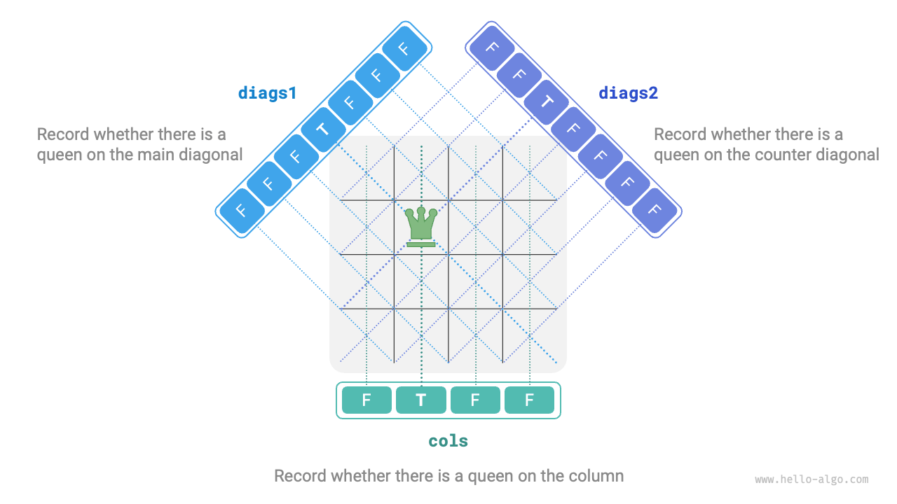

# N-Queens Problem

!!! question

    According to the rules of chess, a queen can attack pieces that share the same row, column, or diagonal line. Given $n$ queens and an $n \times n$ chessboard, find a placement scheme such that no two queens can attack each other.

As shown in the figure below, when $n = 4$, there are two solutions that can be found. From the perspective of the backtracking algorithm, an $n \times n$ chessboard has $n^2$ squares, which provide all the choices `choices`. During the process of placing queens one by one, the chessboard state changes continuously, and the chessboard at each moment represents the state `state`.


The figure below illustrates the three constraints of this problem: **multiple queens cannot be in the same row, the same column, or on the same diagonal**. It is worth noting that diagonals are divided into two types: the main diagonal `\` and the anti-diagonal `/`.


### Row-By-Row Placement Strategy

Since both the number of queens and the number of rows on the chessboard are $n$, we can easily derive a conclusion: **each row of the chessboard allows and only allows exactly one queen to be placed**.

This means we can adopt a row-by-row placement strategy: starting from the first row, place one queen in each row until the last row is completed.

The figure below shows the row-by-row placement process for the 4-queens problem. Due to space limitations, the figure only expands one search branch of the first row, and all schemes that do not satisfy the column constraint and diagonal constraints are pruned.


Essentially, **the row-by-row placement strategy serves a pruning function**, as it avoids all search branches where multiple queens appear in the same row.

### Column and Diagonal Pruning

To satisfy the column constraint, we can use a boolean array `cols` of length $n$ to record whether each column has a queen. Before each placement decision, we use `cols` to prune columns that already have queens, and dynamically update the state of `cols` during backtracking.

!!! tip

    Please note that the origin of the matrix is located in the upper-left corner, where the row index increases from top to bottom, and the column index increases from left to right.

So how do we handle diagonal constraints? Consider a square on the chessboard with row and column indices $(row, col)$. If we select a specific main diagonal in the matrix, we find that all squares on that diagonal have the same difference between their row and column indices, **meaning that $row - col$ is a constant value for all squares on the main diagonal**.

In other words, if two squares satisfy $row_1 - col_1 = row_2 - col_2$, they must be on the same main diagonal. Using this pattern, we can use the array `diags1` shown in the figure below to record whether there is a queen on each main diagonal.

Similarly, **for all squares on an anti-diagonal, the sum $row + col$ is a constant value**. We can likewise use the array `diags2` to handle anti-diagonal constraints.



### Code Implementation

Please note that in an $n$-dimensional square matrix, the range of $row - col$ is $[-n + 1, n - 1]$, and the range of $row + col$ is $[0, 2n - 2]$. Therefore, the number of both main diagonals and anti-diagonals is $2n - 1$, meaning the length of both arrays `diags1` and `diags2` is $2n - 1$.

```src
[file]{n_queens}-[class]{}-[func]{n_queens}
```

Placing $n$ queens row by row, considering the column constraint, from the first row to the last row there are $n$, $n-1$, $\dots$, $2$, $1$ choices, using $O(n!)$ time. When recording a solution, it is necessary to copy the matrix `state` and add it to `res`, and the copy operation uses $O(n^2)$ time. Therefore, **the overall time complexity is $O(n! \cdot n^2)$**. In practice, pruning based on diagonal constraints can also significantly reduce the search space, so the search efficiency is often better than the time complexity mentioned above.

The array `state` uses $O(n^2)$ space, and the arrays `cols`, `diags1`, and `diags2` each use $O(n)$ space. The maximum recursion depth is $n$, using $O(n)$ stack frame space. Therefore, **the space complexity is $O(n^2)$**.
