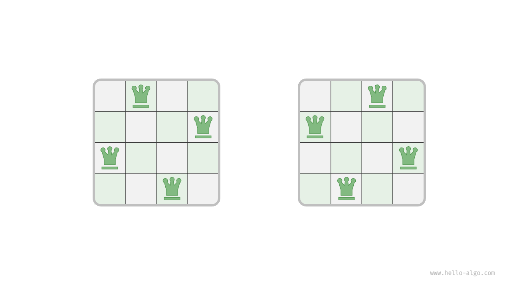
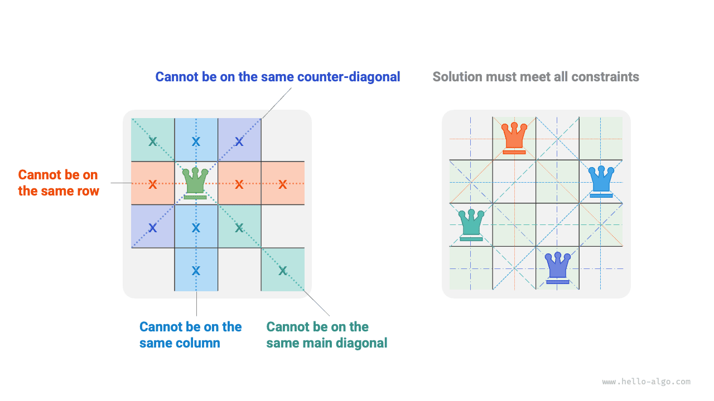
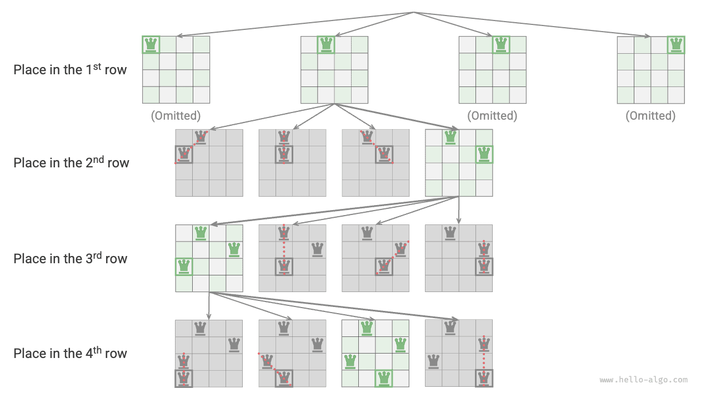

# n queens problem

!!! question

    According to the rules of chess, a queen can attack pieces in the same row, column, or on a diagonal line. Given $n$ queens and an $n \times n$ chessboard, find arrangements where no two queens can attack each other.

As shown in the figure below, when $n = 4$, there are two solutions. From the perspective of the backtracking algorithm, an $n \times n$ chessboard has $n^2$ squares, presenting all possible choices `choices`. The state of the chessboard `state` changes continuously as each queen is placed.



The figure below shows the three constraints of this problem: **multiple queens cannot be on the same row, column, or diagonal**. It is important to note that diagonals are divided into the main diagonal `\` and the secondary diagonal `/`.



### Row-by-row placing strategy

As the number of queens equals the number of rows on the chessboard, both being $n$, it is easy to conclude: **each row on the chessboard allows and only allows one queen to be placed**.

This means that we can adopt a row-by-row placing strategy: starting from the first row, place one queen per row until the last row is reached.

The figure below shows the row-by-row placing process for the 4 queens problem. Due to space limitations, the figure only expands one search branch of the first row, and prunes any placements that do not meet the column and diagonal constraints.



Essentially, **the row-by-row placing strategy serves as a pruning function**, avoiding all search branches that would place multiple queens in the same row.

### Column and diagonal pruning

To satisfy column constraints, we can use a boolean array `cols` of length $n$ to track whether a queen occupies each column. Before each placement decision, `cols` is used to prune the columns that already have queens, and it is dynamically updated during backtracking.

!!! tip

    Note that the origin of the chessboard is located in the upper left corner, where the row index increases from top to bottom, and the column index increases from left to right.

How about the diagonal constraints? Let the row and column indices of a cell on the chessboard be $(row, col)$. By selecting a specific main diagonal, we notice that the difference $row - col$ is the same for all cells on that diagonal, **meaning that $row - col$ is a constant value on that diagonal**.

Thus, if two cells satisfy $row_1 - col_1 = row_2 - col_2$, they are definitely on the same main diagonal. Using this pattern, we can utilize the array `diags1` shown in the figure below to track whether a queen is on any main diagonal.

Similarly, **the sum $row + col$ is a constant value for all cells on a secondary diagonal**. We can also use the array `diags2` to handle secondary diagonal constraints.


### Code implementation

Please note, in an $n$-dimensional matrix, the range of $row - col$ is $[-n + 1, n - 1]$, and the range of $row + col$ is $[0, 2n - 2]$, thus the number of both main and secondary diagonals is $2n - 1$, meaning the length of both arrays `diags1` and `diags2` is $2n - 1$.

```src
[file]{n_queens}-[class]{}-[func]{n_queens}
```

Placing $n$ queens row-by-row, considering column constraints, from the first row to the last row there are $n$, $n-1$, $\dots$, $2$, $1$ choices, using $O(n!)$ time. When recording a solution, it is necessary to copy the matrix `state` and add it to `res`, with the copying operation using $O(n^2)$ time. Therefore, **the overall time complexity is $O(n! \cdot n^2)$**. In practice, pruning based on diagonal constraints can significantly reduce the search space, thus often the search efficiency is better than the above time complexity.

Array `state` uses $O(n^2)$ space, and arrays `cols`, `diags1`, and `diags2` each use $O(n)$ space. The maximum recursion depth is $n$, using $O(n)$ stack space. Therefore, **the space complexity is $O(n^2)$**.
