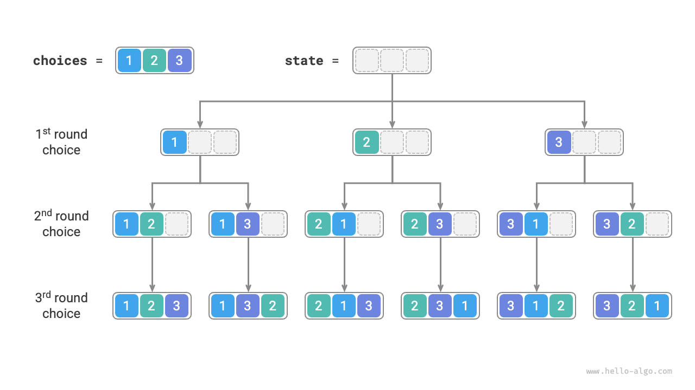
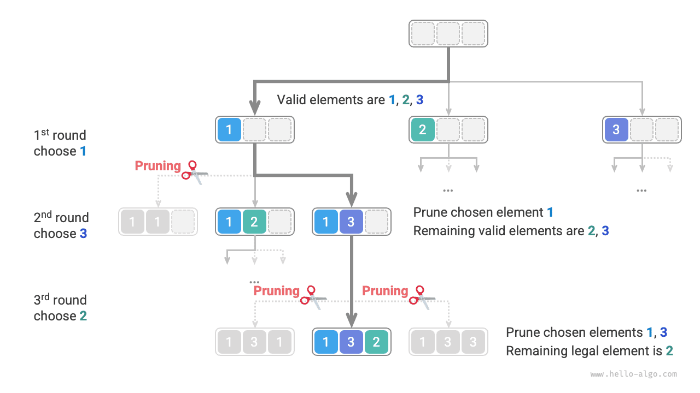
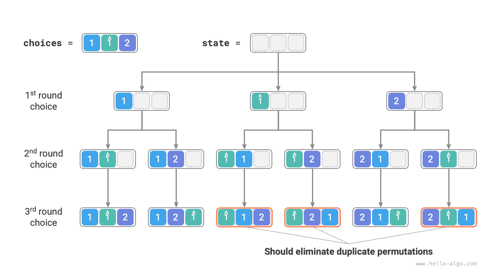
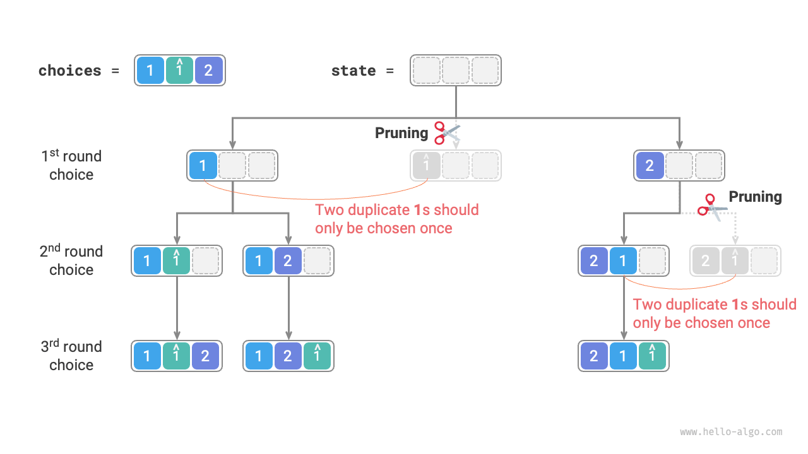
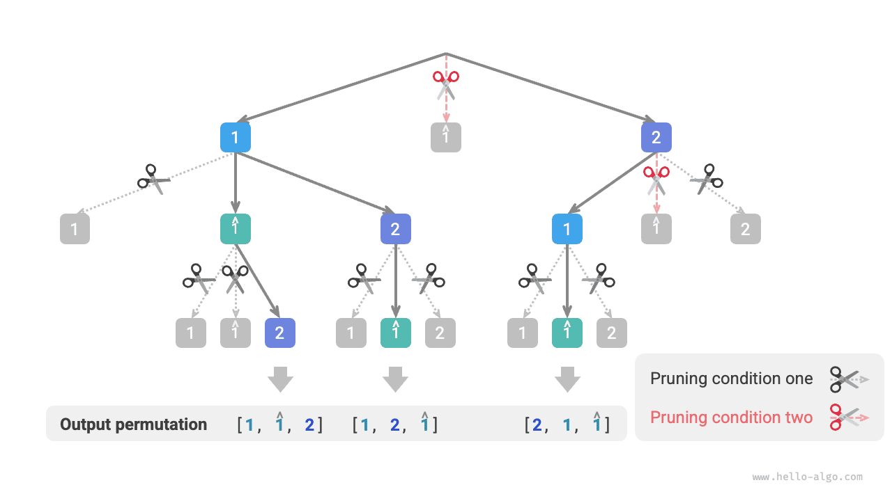

# Permutation problem

The permutation problem is a typical application of the backtracking algorithm. It involves finding all possible arrangements (permutations) of elements from a given set, such as an array or a string.

The table below shows several examples, including input arrays and their corresponding permutations.

<p align="center"> Table <id> &nbsp; Permutation examples </p>

| Input array | Permutations                                                       |
| :---------- | :----------------------------------------------------------------- |
| $[1]$       | $[1]$                                                              |
| $[1, 2]$    | $[1, 2], [2, 1]$                                                   |
| $[1, 2, 3]$ | $[1, 2, 3], [1, 3, 2], [2, 1, 3], [2, 3, 1], [3, 1, 2], [3, 2, 1]$ |

## Cases without duplicate elements

!!! question

    Given an integer array with no duplicate elements, return all possible permutations.

From a backtracking perspective, **we can view the process of generating permutations as a series of choices.** Suppose the input array is $[1, 2, 3]$. If we choose $1$ first, then $3$, and finally $2$, we get the permutation $[1, 3, 2]$. "Backtracking" means undoing a previous choice and exploring alternative options.

From a coding perspective, the candidate set `choices` consists of all elements in the input array, while `state` holds the elements selected so far. Since each element can only be chosen once, **all elements in `state` must be unique**.

As illustrated in the figure below, we can expand the search process into a recursive tree, where each node represents the current `state`. Starting from the root node, after three rounds of selections, we reach the leaf nodes—each corresponding to a permutation.



### Repeated-choice pruning

To ensure each element is selected only once, we introduce a boolean array `selected`, where `selected[i]` indicates whether `choices[i]` has been chosen. We then base our pruning steps on this array:

- After choosing `choice[i]`, set `selected[i]` to $\text{True}$ to mark it as chosen.
- While iterating through `choices`, skip all elements marked as chosen (i.e., prune those branches).

As shown in the figure below, suppose we choose 1 in the first round, then 3 in the second round, and finally 2 in the third round. We need to prune the branch for element 1 in the second round and the branches for elements 1 and 3 in the third round.



From the figure, we can see that this pruning process reduces the search space from $O(n^n)$ to $O(n!)$.

### Code implementation

With this understanding, we can "fill in the blanks" of our framework code. To keep the overall code concise, we won’t implement each part of the framework separately but instead expand everything in the `backtrack()` function:

```src
[file]{permutations_i}-[class]{}-[func]{permutations_i}
```

## Considering duplicate elements

!!! question

    Given an integer array**that may contain duplicate elements**, return all unique permutations.

Suppose the input array is $[1, 1, 2]$. To distinguish between the two identical elements $1$, we label the second one as $\hat{1}$.

As shown in the figure below, half of the permutations produced by this method are duplicates:



So how can we eliminate these duplicate permutations? One direct approach is to use a hash set to remove duplicates after generating all permutations. However, this is less elegant **because branches that produce duplicates are inherently unnecessary and should be pruned in advance,** thus improving the algorithm’s efficiency.

### Equal-element pruning

Looking at the figure below, in the first round, choosing $1$ or $\hat{1}$ leads to the same permutations, so we prune $\hat{1}$.

Similarly, after choosing $2$ in the first round, choosing $1$ or $\hat{1}$ in the second round also leads to duplicate branches, so we prune $\hat{1}$ then as well.

Essentially, **our goal is to ensure that multiple identical elements are only selected once per round of choices.**



### Code implementation

Based on the code from the previous problem, we introduce a hash set `duplicated` in each round. This set keeps track of elements we have already attempted, so we can prune duplicates:

```src
[file]{permutations_ii}-[class]{}-[func]{permutations_ii}
```

Assuming all elements are distinct, there are $n!$ (factorial) permutations of $n$ elements. Recording each result requires copying a list of length $n$, which takes $O(n)$ time. **Hence, the total time complexity is $O(n!n)$.**

The maximum recursion depth is $n$, using $O(n)$ stack space. The `selected` array also requires $O(n)$ space. Because there can be up to $n$ separate `duplicated` sets at any one time, they collectively occupy $O(n^2)$ space. **Therefore, the space complexity is $O(n^2)$.**

### Comparing the two pruning methods

Although both `selected` and `duplicated` serve as pruning mechanisms, they target different issues:

- **Repeated-choice pruning**(via `selected`): There is a single `selected` array for the entire search, indicating which elements are already in the current state. This prevents the same element from appearing more than once in `state`.
- **Equal-element pruning**(via `duplicated`): Each call to the `backtrack` function uses its own `duplicated` set, recording which elements have already been chosen in that specific iteration (`for` loop). This ensures that equal elements are selected only once per round of choices.

The figure below shows the scope of these two pruning strategies. Each node in the tree represents a choice; the path from the root to any leaf corresponds to one complete permutation.


