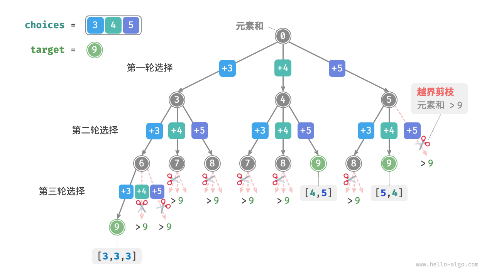
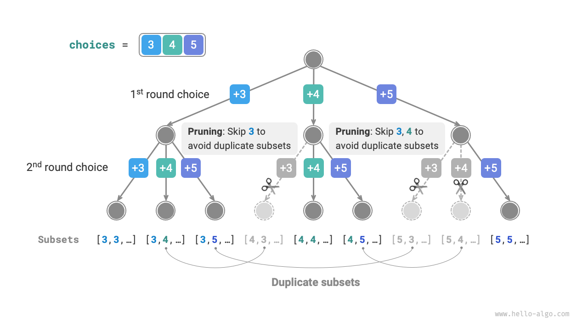
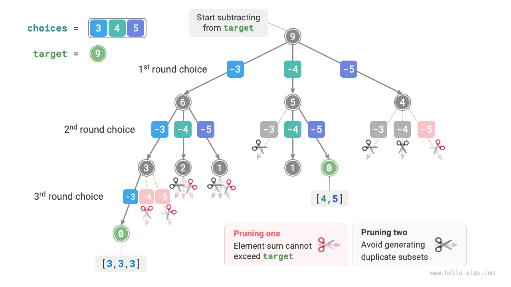
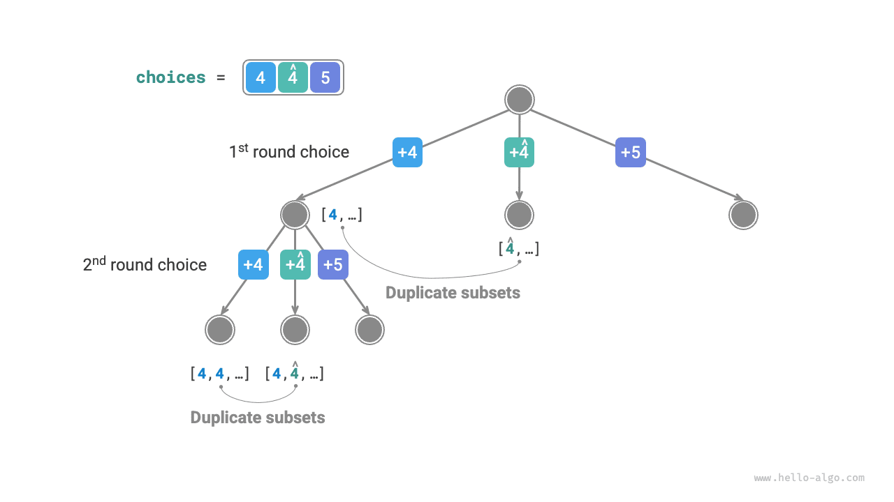
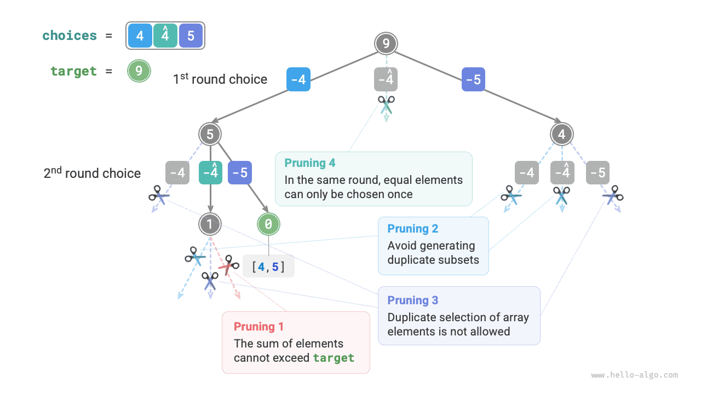

# Subset sum problem

## Case without duplicate elements

!!! question

    Given an array of positive integers `nums` and a target positive integer `target`, find all possible combinations such that the sum of the elements in the combination equals `target`. The given array has no duplicate elements, and each element can be chosen multiple times. Please return these combinations as a list, which should not contain duplicate combinations.

For example, for the input set $\{3, 4, 5\}$ and target integer $9$, the solutions are $\{3, 3, 3\}, \{4, 5\}$. Note the following two points.

- Elements in the input set can be chosen an unlimited number of times.
- Subsets do not distinguish the order of elements, for example $\{4, 5\}$ and $\{5, 4\}$ are the same subset.

### Reference permutation solution

Similar to the permutation problem, we can imagine the generation of subsets as a series of choices, updating the "element sum" in real-time during the choice process. When the element sum equals `target`, the subset is recorded in the result list.

Unlike the permutation problem, **elements in this problem can be chosen an unlimited number of times**, thus there is no need to use a `selected` boolean list to record whether an element has been chosen. We can make minor modifications to the permutation code to initially solve the problem:

```src
[file]{subset_sum_i_naive}-[class]{}-[func]{subset_sum_i_naive}
```

Inputting the array $[3, 4, 5]$ and target element $9$ into the above code yields the results $[3, 3, 3], [4, 5], [5, 4]$. **Although it successfully finds all subsets with a sum of $9$, it includes the duplicate subset $[4, 5]$ and $[5, 4]$**.

This is because the search process distinguishes the order of choices, however, subsets do not distinguish the choice order. As shown in the figure below, choosing $4$ before $5$ and choosing $5$ before $4$ are different branches, but correspond to the same subset.



To eliminate duplicate subsets, **a straightforward idea is to deduplicate the result list**. However, this method is very inefficient for two reasons.

- When there are many array elements, especially when `target` is large, the search process produces a large number of duplicate subsets.
- Comparing subsets (arrays) for differences is very time-consuming, requiring arrays to be sorted first, then comparing the differences of each element in the arrays.

### Duplicate subset pruning

**We consider deduplication during the search process through pruning**. Observing the figure below, duplicate subsets are generated when choosing array elements in different orders, for example in the following situations.

1. When choosing $3$ in the first round and $4$ in the second round, all subsets containing these two elements are generated, denoted as $[3, 4, \dots]$.
2. Later, when $4$ is chosen in the first round, **the second round should skip $3$** because the subset $[4, 3, \dots]$ generated by this choice completely duplicates the subset from step `1.`.

In the search process, each layer's choices are tried one by one from left to right, so the more to the right a branch is, the more it is pruned.

1. First two rounds choose $3$ and $5$, generating subset $[3, 5, \dots]$.
2. First two rounds choose $4$ and $5$, generating subset $[4, 5, \dots]$.
3. If $5$ is chosen in the first round, **then the second round should skip $3$ and $4$** as the subsets $[5, 3, \dots]$ and $[5, 4, \dots]$ completely duplicate the subsets described in steps `1.` and `2.`.



In summary, given the input array $[x_1, x_2, \dots, x_n]$, the choice sequence in the search process should be $[x_{i_1}, x_{i_2}, \dots, x_{i_m}]$, which needs to satisfy $i_1 \leq i_2 \leq \dots \leq i_m$. **Any choice sequence that does not meet this condition will cause duplicates and should be pruned**.

### Code implementation

To implement this pruning, we initialize the variable `start`, which indicates the starting point for traversal. **After making the choice $x_{i}$, set the next round to start from index $i$**. This will ensure the choice sequence satisfies $i_1 \leq i_2 \leq \dots \leq i_m$, thereby ensuring the uniqueness of the subsets.

Besides, we have made the following two optimizations to the code.

- Before starting the search, sort the array `nums`. In the traversal of all choices, **end the loop directly when the subset sum exceeds `target`** as subsequent elements are larger and their subset sum will definitely exceed `target`.
- Eliminate the element sum variable `total`, **by performing subtraction on `target` to count the element sum**. When `target` equals $0$, record the solution.

```src
[file]{subset_sum_i}-[class]{}-[func]{subset_sum_i}
```

The figure below shows the overall backtracking process after inputting the array $[3, 4, 5]$ and target element $9$ into the above code.



## Considering cases with duplicate elements

!!! question

    Given an array of positive integers `nums` and a target positive integer `target`, find all possible combinations such that the sum of the elements in the combination equals `target`. **The given array may contain duplicate elements, and each element can only be chosen once**. Please return these combinations as a list, which should not contain duplicate combinations.

Compared to the previous question, **this question's input array may contain duplicate elements**, introducing new problems. For example, given the array $[4, \hat{4}, 5]$ and target element $9$, the existing code's output results in $[4, 5], [\hat{4}, 5]$, resulting in duplicate subsets.

**The reason for this duplication is that equal elements are chosen multiple times in a certain round**. In the figure below, the first round has three choices, two of which are $4$, generating two duplicate search branches, thus outputting duplicate subsets; similarly, the two $4$s in the second round also produce duplicate subsets.



### Equal element pruning

To solve this issue, **we need to limit equal elements to being chosen only once per round**. The implementation is quite clever: since the array is sorted, equal elements are adjacent. This means that in a certain round of choices, if the current element is equal to its left-hand element, it means it has already been chosen, so skip the current element directly.

At the same time, **this question stipulates that each array element can only be chosen once**. Fortunately, we can also use the variable `start` to meet this constraint: after making the choice $x_{i}$, set the next round to start from index $i + 1$ going forward. This not only eliminates duplicate subsets but also avoids repeated selection of elements.

### Code implementation

```src
[file]{subset_sum_ii}-[class]{}-[func]{subset_sum_ii}
```

The figure below shows the backtracking process for the array $[4, 4, 5]$ and target element $9$, including four types of pruning operations. Please combine the illustration with the code comments to understand the entire search process and how each type of pruning operation works.


