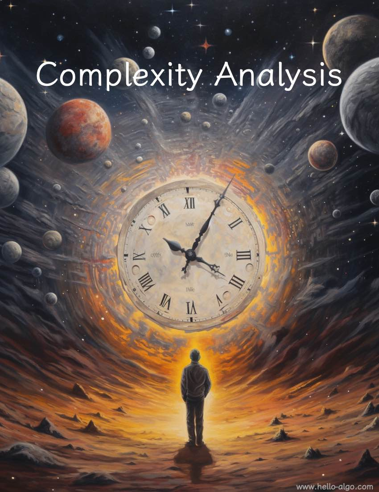

# Complexity analysis

!!! abstract

    Complexity analysis is like a space-time navigator in the vast universe of algorithms.

    It guides us in exploring deeper within the the dimensions of time and space, seeking more elegant solutions.
