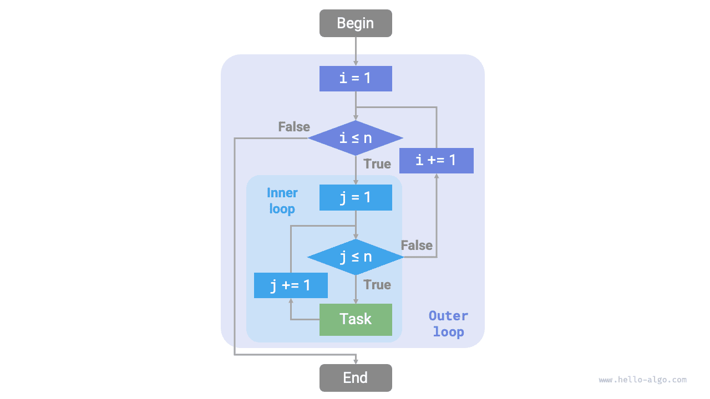
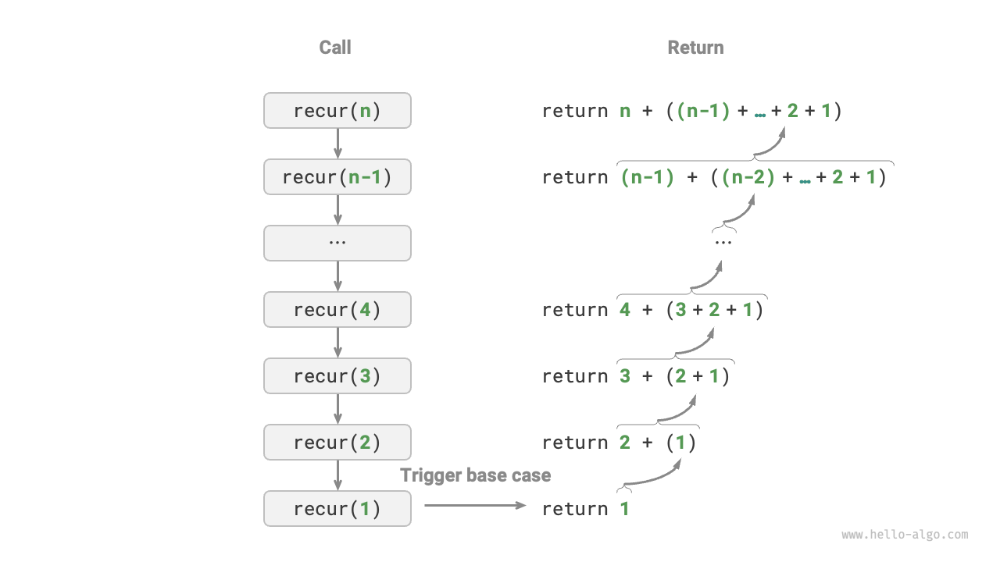
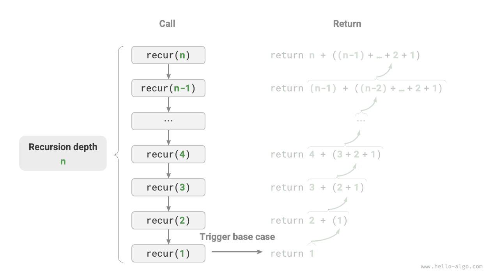
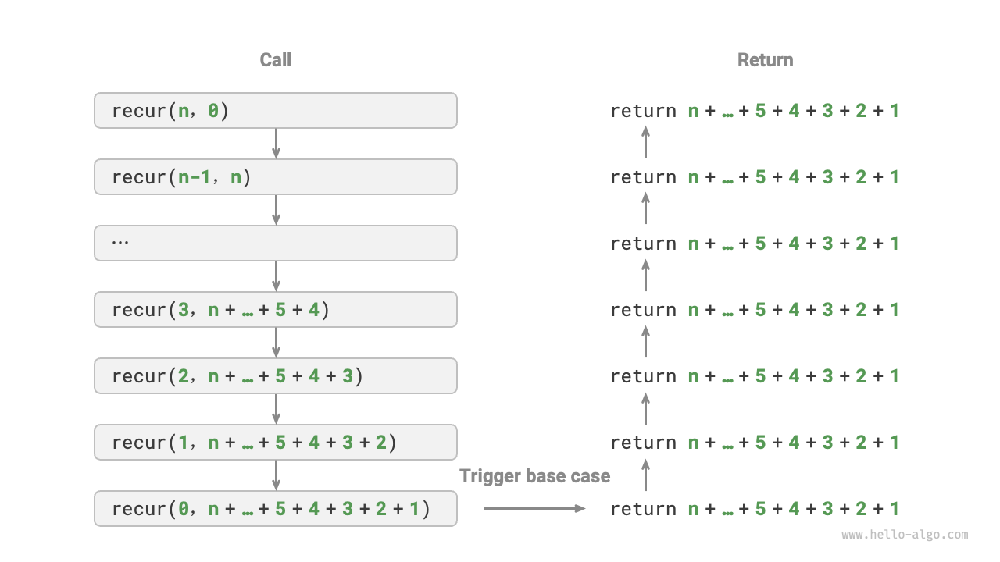
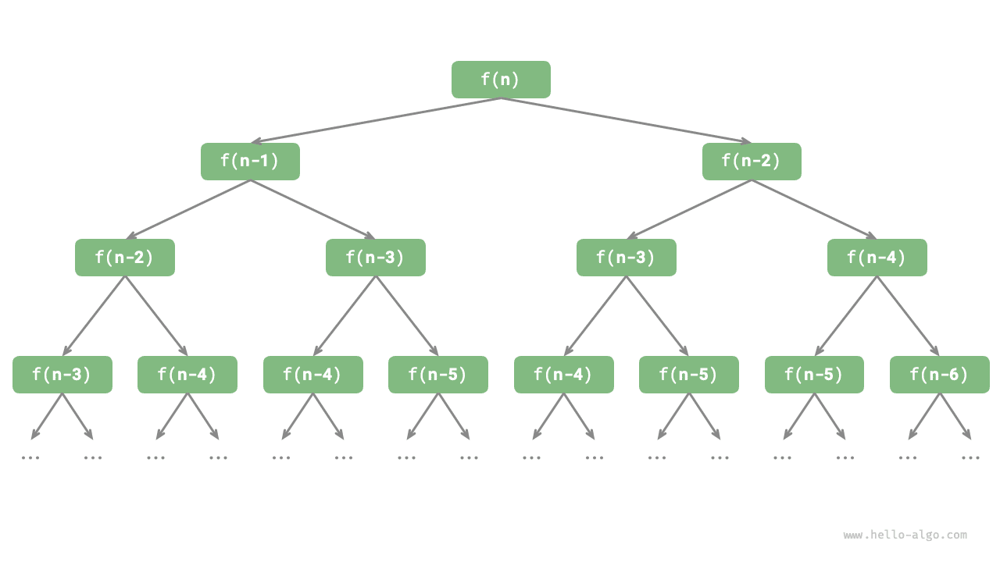

# Iteration and recursion

In algorithms, the repeated execution of a task is quite common and is closely related to the analysis of complexity. Therefore, before delving into the concepts of time complexity and space complexity, let's first explore how to implement repetitive tasks in programming. This involves understanding two fundamental programming control structures: iteration and recursion.

## Iteration

<u>Iteration</u> is a control structure for repeatedly performing a task. In iteration, a program repeats a block of code as long as a certain condition is met until this condition is no longer satisfied.

### For loops

The `for` loop is one of the most common forms of iteration, and **it's particularly suitable when the number of iterations is known in advance**.

The following function uses a `for` loop to perform a summation of $1 + 2 + \dots + n$, with the sum being stored in the variable `res`. It's important to note that in Python, `range(a, b)` creates an interval that is inclusive of `a` but exclusive of `b`, meaning it iterates over the range from $a$ up to $b−1$.

```src
[file]{iteration}-[class]{}-[func]{for_loop}
```

The figure below represents this sum function.


The number of operations in this summation function is proportional to the size of the input data $n$, or in other words, it has a linear relationship. **This "linear relationship" is what time complexity describes**. This topic will be discussed in more detail in the next section.

### While loops

Similar to `for` loops, `while` loops are another approach for implementing iteration. In a `while` loop, the program checks a condition at the beginning of each iteration; if the condition is true, the execution continues, otherwise, the loop ends.

Below we use a `while` loop to implement the sum $1 + 2 + \dots + n$.

```src
[file]{iteration}-[class]{}-[func]{while_loop}
```

**`while` loops provide more flexibility than `for` loops**, especially since they allow for custom initialization and modification of the condition variable at each step.

For example, in the following code, the condition variable $i$ is updated twice each round, which would be inconvenient to implement with a `for` loop.

```src
[file]{iteration}-[class]{}-[func]{while_loop_ii}
```

Overall, **`for` loops are more concise, while `while` loops are more flexible**. Both can implement iterative structures. Which one to use should be determined based on the specific requirements of the problem.

### Nested loops

We can nest one loop structure within another. Below is an example using `for` loops:

```src
[file]{iteration}-[class]{}-[func]{nested_for_loop}
```

The figure below represents this nested loop.



In such cases, the number of operations of the function is proportional to $n^2$, meaning the algorithm's runtime and the size of the input data $n$ has a 'quadratic relationship.'

We can further increase the complexity by adding more nested loops, each level of nesting effectively "increasing the dimension," which raises the time complexity to "cubic," "quartic," and so on.

## Recursion

<u>Recursion</u> is an algorithmic strategy where a function solves a problem by calling itself. It primarily involves two phases:

1. **Calling**: This is where the program repeatedly calls itself, often with progressively smaller or simpler arguments, moving towards the "termination condition."
2. **Returning**: Upon triggering the "termination condition," the program begins to return from the deepest recursive function, aggregating the results of each layer.

From an implementation perspective, recursive code mainly includes three elements.

1. **Termination Condition**: Determines when to switch from "calling" to "returning."
2. **Recursive Call**: Corresponds to "calling," where the function calls itself, usually with smaller or more simplified parameters.
3. **Return Result**: Corresponds to "returning," where the result of the current recursion level is returned to the previous layer.

Observe the following code, where simply calling the function `recur(n)` can compute the sum of $1 + 2 + \dots + n$:

```src
[file]{recursion}-[class]{}-[func]{recur}
```

The figure below shows the recursive process of this function.



Although iteration and recursion can achieve the same results from a computational standpoint, **they represent two entirely different paradigms of thinking and problem-solving**.

- **Iteration**: Solves problems "from the bottom up." It starts with the most basic steps, and then repeatedly adds or accumulates these steps until the task is complete.
- **Recursion**: Solves problems "from the top down." It breaks down the original problem into smaller sub-problems, each of which has the same form as the original problem. These sub-problems are then further decomposed into even smaller sub-problems, stopping at the base case whose solution is known.

Let's take the earlier example of the summation function, defined as $f(n) = 1 + 2 + \dots + n$.

- **Iteration**: In this approach, we simulate the summation process within a loop. Starting from $1$ and traversing to $n$, we perform the summation operation in each iteration to eventually compute $f(n)$.
- **Recursion**: Here, the problem is broken down into a sub-problem: $f(n) = n + f(n-1)$. This decomposition continues recursively until reaching the base case, $f(1) = 1$, at which point the recursion terminates.

### Call stack

Every time a recursive function calls itself, the system allocates memory for the newly initiated function to store local variables, the return address, and other relevant information. This leads to two primary outcomes.

- The function's context data is stored in a memory area called "stack frame space" and is only released after the function returns. Therefore, **recursion generally consumes more memory space than iteration**.
- Recursive calls introduce additional overhead. **Hence, recursion is usually less time-efficient than loops.**

As shown in the figure below, there are $n$ unreturned recursive functions before triggering the termination condition, indicating a **recursion depth of $n$**.



In practice, the depth of recursion allowed by programming languages is usually limited, and excessively deep recursion can lead to stack overflow errors.

### Tail recursion

Interestingly, **if a function performs its recursive call as the very last step before returning,** it can be optimized by the compiler or interpreter to be as space-efficient as iteration. This scenario is known as <u>tail recursion</u>.

- **Regular recursion**: In standard recursion, when the function returns to the previous level, it continues to execute more code, requiring the system to save the context of the previous call.
- **Tail recursion**: Here, the recursive call is the final operation before the function returns. This means that upon returning to the previous level, no further actions are needed, so the system does not need to save the context of the previous level.

For example, in calculating $1 + 2 + \dots + n$, we can make the result variable `res` a parameter of the function, thereby achieving tail recursion:

```src
[file]{recursion}-[class]{}-[func]{tail_recur}
```

The execution process of tail recursion is shown in the figure below. Comparing regular recursion and tail recursion, the point of the summation operation is different.

- **Regular recursion**: The summation operation occurs during the "returning" phase, requiring another summation after each layer returns.
- **Tail recursion**: The summation operation occurs during the "calling" phase, and the "returning" phase only involves returning through each layer.



!!! tip

    Note that many compilers or interpreters do not support tail recursion optimization. For example, Python does not support tail recursion optimization by default, so even if the function is in the form of tail recursion, it may still encounter stack overflow issues.

### Recursion tree

When dealing with algorithms related to "divide and conquer", recursion often offers a more intuitive approach and more readable code than iteration. Take the "Fibonacci sequence" as an example.

!!! question

    Given a Fibonacci sequence $0, 1, 1, 2, 3, 5, 8, 13, \dots$, find the $n$th number in the sequence.

Let the $n$th number of the Fibonacci sequence be $f(n)$, it's easy to deduce two conclusions:

- The first two numbers of the sequence are $f(1) = 0$ and $f(2) = 1$.
- Each number in the sequence is the sum of the two preceding ones, that is, $f(n) = f(n - 1) + f(n - 2)$.

Using the recursive relation, and considering the first two numbers as termination conditions, we can write the recursive code. Calling `fib(n)` will yield the $n$th number of the Fibonacci sequence:

```src
[file]{recursion}-[class]{}-[func]{fib}
```

Observing the above code, we see that it recursively calls two functions within itself, **meaning that one call generates two branching calls**. As illustrated in the figure below, this continuous recursive calling eventually creates a <u>recursion tree</u> with a depth of $n$.



Fundamentally, recursion embodies the paradigm of "breaking down a problem into smaller sub-problems." This divide-and-conquer strategy is crucial.

- From an algorithmic perspective, many important strategies like searching, sorting, backtracking, divide-and-conquer, and dynamic programming directly or indirectly use this way of thinking.
- From a data structure perspective, recursion is naturally suited for dealing with linked lists, trees, and graphs, as they are well suited for analysis using the divide-and-conquer approach.

## Comparison

Summarizing the above content, the following table shows the differences between iteration and recursion in terms of implementation, performance, and applicability.

<p align="center"> Table: Comparison of iteration and recursion characteristics </p>

|                   | Iteration                                                   | Recursion                                                                                                                        |
| ----------------- | ----------------------------------------------------------- | -------------------------------------------------------------------------------------------------------------------------------- |
| Approach          | Loop structure                                              | Function calls itself                                                                                                            |
| Time Efficiency   | Generally higher efficiency, no function call overhead      | Each function call generates overhead                                                                                            |
| Memory Usage      | Typically uses a fixed size of memory space                 | Accumulative function calls can use a substantial amount of stack frame space                                                    |
| Suitable Problems | Suitable for simple loop tasks, intuitive and readable code | Suitable for problem decomposition, like trees, graphs, divide-and-conquer, backtracking, etc., concise and clear code structure |

!!! tip

    If you find the following content difficult to understand, consider revisiting it after reading the "Stack" chapter.

So, what is the intrinsic connection between iteration and recursion? Taking the above recursive function as an example, the summation operation occurs during the recursion's "return" phase. This means that the initially called function is the last to complete its summation operation, **mirroring the "last in, first out" principle of a stack**.

Recursive terms like "call stack" and "stack frame space" hint at the close relationship between recursion and stacks.

1. **Calling**: When a function is called, the system allocates a new stack frame on the "call stack" for that function, storing local variables, parameters, return addresses, and other data.
2. **Returning**: When a function completes execution and returns, the corresponding stack frame is removed from the "call stack," restoring the execution environment of the previous function.

Therefore, **we can use an explicit stack to simulate the behavior of the call stack**, thus transforming recursion into an iterative form:

```src
[file]{recursion}-[class]{}-[func]{for_loop_recur}
```

Observing the above code, when recursion is transformed into iteration, the code becomes more complex. Although iteration and recursion can often be transformed into each other, it's not always advisable to do so for two reasons:

- The transformed code may become more challenging to understand and less readable.
- For some complex problems, simulating the behavior of the system's call stack can be quite challenging.

In conclusion, **whether to choose iteration or recursion depends on the specific nature of the problem**. In programming practice, it's crucial to weigh the pros and cons of both and choose the most suitable approach for the situation at hand.
