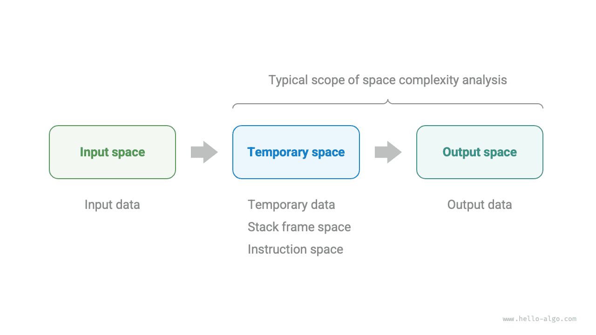
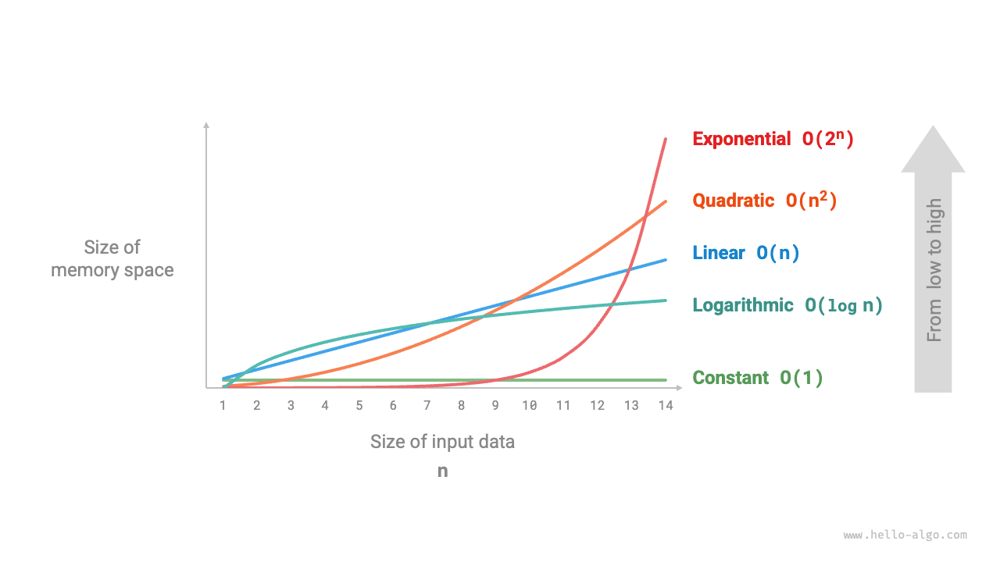
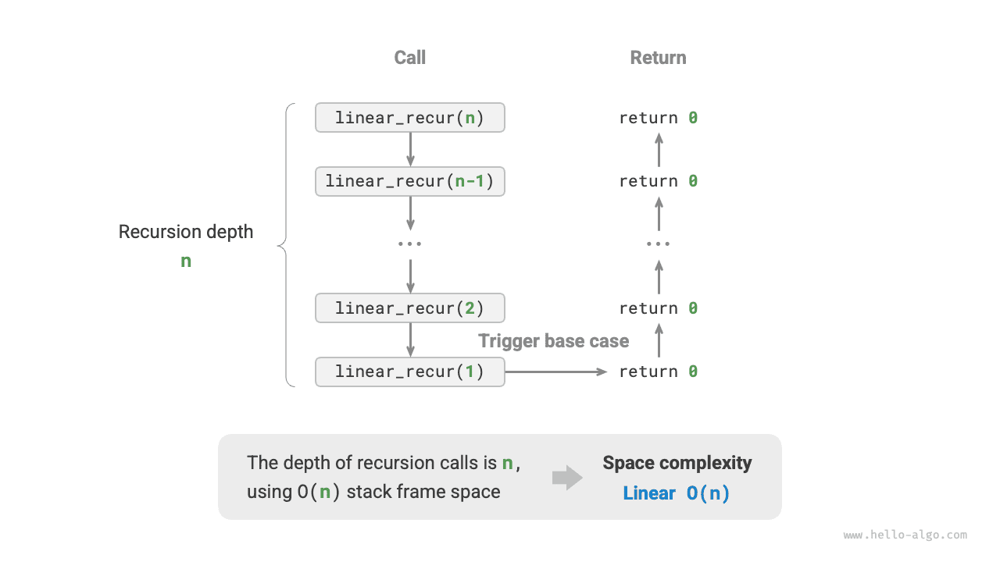
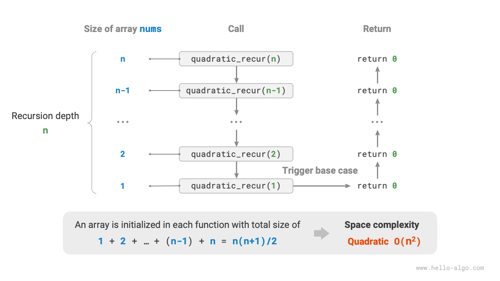
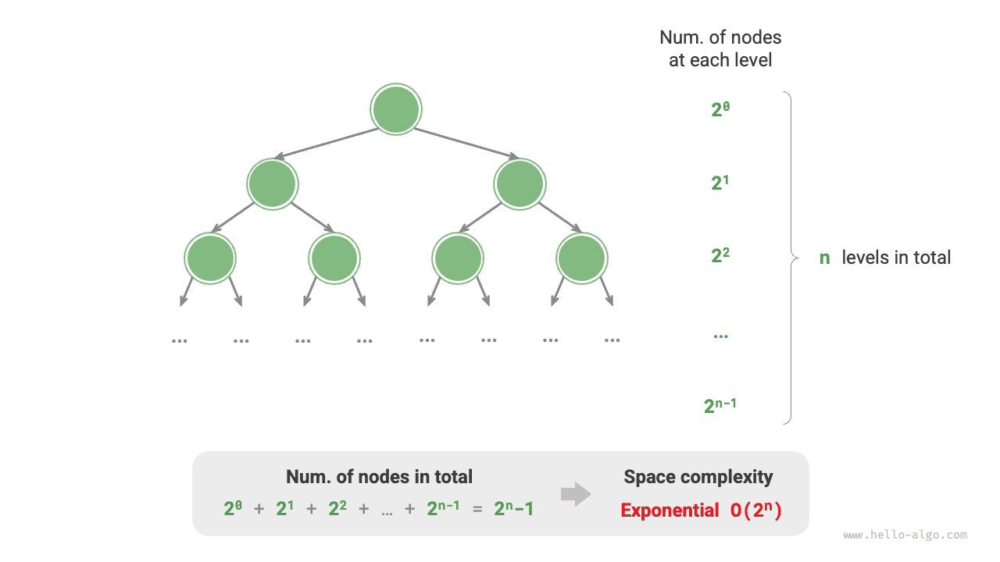

# Space Complexity

<u>Space complexity</u> measures the growth trend of memory space occupied by an algorithm as the data size increases. This concept is very similar to time complexity, except that "running time" is replaced with "occupied memory space".

## Algorithm-Related Space

The memory space used by an algorithm during execution mainly includes the following types.

- **Input space**: Used to store the input data of the algorithm.
- **Temporary space**: Used to store variables, objects, function contexts, and other data during the algorithm's execution.
- **Output space**: Used to store the output data of the algorithm.

In general, the scope of space complexity statistics is "temporary space" plus "output space".

Temporary space can be further divided into three parts.

- **Temporary data**: Used to save various constants, variables, objects, etc., during the algorithm's execution.
- **Stack frame space**: Used to save the context data of called functions. The system creates a stack frame at the top of the stack each time a function is called, and the stack frame space is released after the function returns.
- **Instruction space**: Used to save compiled program instructions, which are usually ignored in actual statistics.

When analyzing the space complexity of a program, **we usually count three parts: temporary data, stack frame space, and output data**, as shown in the following figure.



The related code is as follows:

=== "Python"

    ```python title=""
    class Node:
        """Class"""
        def __init__(self, x: int):
            self.val: int = x              # Node value
            self.next: Node | None = None  # Reference to the next node

    def function() -> int:
        """Function"""
        # Perform some operations...
        return 0

    def algorithm(n) -> int:  # Input data
        A = 0                 # Temporary data (constant, usually represented by uppercase letters)
        b = 0                 # Temporary data (variable)
        node = Node(0)        # Temporary data (object)
        c = function()        # Stack frame space (function call)
        return A + b + c      # Output data
    ```

=== "C++"

    ```cpp title=""
    /* Structure */
    struct Node {
        int val;
        Node *next;
        Node(int x) : val(x), next(nullptr) {}
    };

    /* Function */
    int func() {
        // Perform some operations...
        return 0;
    }

    int algorithm(int n) {        // Input data
        const int a = 0;          // Temporary data (constant)
        int b = 0;                // Temporary data (variable)
        Node* node = new Node(0); // Temporary data (object)
        int c = func();           // Stack frame space (function call)
        return a + b + c;         // Output data
    }
    ```

=== "Java"

    ```java title=""
    /* Class */
    class Node {
        int val;
        Node next;
        Node(int x) { val = x; }
    }

    /* Function */
    int function() {
        // Perform some operations...
        return 0;
    }

    int algorithm(int n) {        // Input data
        final int a = 0;          // Temporary data (constant)
        int b = 0;                // Temporary data (variable)
        Node node = new Node(0);  // Temporary data (object)
        int c = function();       // Stack frame space (function call)
        return a + b + c;         // Output data
    }
    ```

=== "C#"

    ```csharp title=""
    /* Class */
    class Node(int x) {
        int val = x;
        Node next;
    }

    /* Function */
    int Function() {
        // Perform some operations...
        return 0;
    }

    int Algorithm(int n) {        // Input data
        const int a = 0;          // Temporary data (constant)
        int b = 0;                // Temporary data (variable)
        Node node = new(0);       // Temporary data (object)
        int c = Function();       // Stack frame space (function call)
        return a + b + c;         // Output data
    }
    ```

=== "Go"

    ```go title=""
    /* Structure */
    type node struct {
        val  int
        next *node
    }

    /* Create node structure */
    func newNode(val int) *node {
        return &node{val: val}
    }

    /* Function */
    func function() int {
        // Perform some operations...
        return 0
    }

    func algorithm(n int) int { // Input data
        const a = 0             // Temporary data (constant)
        b := 0                  // Temporary data (variable)
        newNode(0)              // Temporary data (object)
        c := function()         // Stack frame space (function call)
        return a + b + c        // Output data
    }
    ```

=== "Swift"

    ```swift title=""
    /* Class */
    class Node {
        var val: Int
        var next: Node?

        init(x: Int) {
            val = x
        }
    }

    /* Function */
    func function() -> Int {
        // Perform some operations...
        return 0
    }

    func algorithm(n: Int) -> Int { // Input data
        let a = 0             // Temporary data (constant)
        var b = 0             // Temporary data (variable)
        let node = Node(x: 0) // Temporary data (object)
        let c = function()    // Stack frame space (function call)
        return a + b + c      // Output data
    }
    ```

=== "JS"

    ```javascript title=""
    /* Class */
    class Node {
        val;
        next;
        constructor(val) {
            this.val = val === undefined ? 0 : val; // Node value
            this.next = null;                       // Reference to the next node
        }
    }

    /* Function */
    function constFunc() {
        // Perform some operations
        return 0;
    }

    function algorithm(n) {       // Input data
        const a = 0;              // Temporary data (constant)
        let b = 0;                // Temporary data (variable)
        const node = new Node(0); // Temporary data (object)
        const c = constFunc();    // Stack frame space (function call)
        return a + b + c;         // Output data
    }
    ```

=== "TS"

    ```typescript title=""
    /* Class */
    class Node {
        val: number;
        next: Node | null;
        constructor(val?: number) {
            this.val = val === undefined ? 0 : val; // Node value
            this.next = null;                       // Reference to the next node
        }
    }

    /* Function */
    function constFunc(): number {
        // Perform some operations
        return 0;
    }

    function algorithm(n: number): number { // Input data
        const a = 0;                        // Temporary data (constant)
        let b = 0;                          // Temporary data (variable)
        const node = new Node(0);           // Temporary data (object)
        const c = constFunc();              // Stack frame space (function call)
        return a + b + c;                   // Output data
    }
    ```

=== "Dart"

    ```dart title=""
    /* Class */
    class Node {
      int val;
      Node next;
      Node(this.val, [this.next]);
    }

    /* Function */
    int function() {
      // Perform some operations...
      return 0;
    }

    int algorithm(int n) {  // Input data
      const int a = 0;      // Temporary data (constant)
      int b = 0;            // Temporary data (variable)
      Node node = Node(0);  // Temporary data (object)
      int c = function();   // Stack frame space (function call)
      return a + b + c;     // Output data
    }
    ```

=== "Rust"

    ```rust title=""
    use std::rc::Rc;
    use std::cell::RefCell;

    /* Structure */
    struct Node {
        val: i32,
        next: Option<Rc<RefCell<Node>>>,
    }

    /* Create Node structure */
    impl Node {
        fn new(val: i32) -> Self {
            Self { val: val, next: None }
        }
    }

    /* Function */
    fn function() -> i32 {
        // Perform some operations...
        return 0;
    }

    fn algorithm(n: i32) -> i32 {       // Input data
        const a: i32 = 0;               // Temporary data (constant)
        let mut b = 0;                  // Temporary data (variable)
        let node = Node::new(0);        // Temporary data (object)
        let c = function();             // Stack frame space (function call)
        return a + b + c;               // Output data
    }
    ```

=== "C"

    ```c title=""
    /* Function */
    int func() {
        // Perform some operations...
        return 0;
    }

    int algorithm(int n) { // Input data
        const int a = 0;   // Temporary data (constant)
        int b = 0;         // Temporary data (variable)
        int c = func();    // Stack frame space (function call)
        return a + b + c;  // Output data
    }
    ```

=== "Kotlin"

    ```kotlin title=""
    /* Class */
    class Node(var _val: Int) {
        var next: Node? = null
    }

    /* Function */
    fun function(): Int {
        // Perform some operations...
        return 0
    }

    fun algorithm(n: Int): Int { // Input data
        val a = 0                // Temporary data (constant)
        var b = 0                // Temporary data (variable)
        val node = Node(0)       // Temporary data (object)
        val c = function()       // Stack frame space (function call)
        return a + b + c         // Output data
    }
    ```

=== "Ruby"

    ```ruby title=""
    ### Class ###
    class Node
        attr_accessor :val      # Node value
        attr_accessor :next     # Reference to the next node

        def initialize(x)
            @val = x
        end
    end

    ### Function ###
    def function
        # Perform some operations...
        0
    end

    ### Algorithm ###
    def algorithm(n)        # Input data
        a = 0               # Temporary data (constant)
        b = 0               # Temporary data (variable)
        node = Node.new(0)  # Temporary data (object)
        c = function        # Stack frame space (function call)
        a + b + c           # Output data
    end
    ```

## Calculation Method

The calculation method for space complexity is roughly the same as for time complexity, except that the statistical object is changed from "number of operations" to "size of space used".

Unlike time complexity, **we usually only focus on the worst-case space complexity**. This is because memory space is a hard requirement, and we must ensure that sufficient memory space is reserved for all input data.

Observe the following code. The "worst case" in worst-case space complexity has two meanings.

1. **Based on the worst input data**: When $n < 10$, the space complexity is $O(1)$; but when $n > 10$, the initialized array `nums` occupies $O(n)$ space, so the worst-case space complexity is $O(n)$.
2. **Based on the peak memory during algorithm execution**: For example, before executing the last line, the program occupies $O(1)$ space; when initializing the array `nums`, the program occupies $O(n)$ space, so the worst-case space complexity is $O(n)$.

=== "Python"

    ```python title=""
    def algorithm(n: int):
        a = 0               # O(1)
        b = [0] * 10000     # O(1)
        if n > 10:
            nums = [0] * n  # O(n)
    ```

=== "C++"

    ```cpp title=""
    void algorithm(int n) {
        int a = 0;               // O(1)
        vector<int> b(10000);    // O(1)
        if (n > 10)
            vector<int> nums(n); // O(n)
    }
    ```

=== "Java"

    ```java title=""
    void algorithm(int n) {
        int a = 0;                   // O(1)
        int[] b = new int[10000];    // O(1)
        if (n > 10)
            int[] nums = new int[n]; // O(n)
    }
    ```

=== "C#"

    ```csharp title=""
    void Algorithm(int n) {
        int a = 0;                   // O(1)
        int[] b = new int[10000];    // O(1)
        if (n > 10) {
            int[] nums = new int[n]; // O(n)
        }
    }
    ```

=== "Go"

    ```go title=""
    func algorithm(n int) {
        a := 0                      // O(1)
        b := make([]int, 10000)     // O(1)
        var nums []int
        if n > 10 {
            nums := make([]int, n)  // O(n)
        }
        fmt.Println(a, b, nums)
    }
    ```

=== "Swift"

    ```swift title=""
    func algorithm(n: Int) {
        let a = 0 // O(1)
        let b = Array(repeating: 0, count: 10000) // O(1)
        if n > 10 {
            let nums = Array(repeating: 0, count: n) // O(n)
        }
    }
    ```

=== "JS"

    ```javascript title=""
    function algorithm(n) {
        const a = 0;                   // O(1)
        const b = new Array(10000);    // O(1)
        if (n > 10) {
            const nums = new Array(n); // O(n)
        }
    }
    ```

=== "TS"

    ```typescript title=""
    function algorithm(n: number): void {
        const a = 0;                   // O(1)
        const b = new Array(10000);    // O(1)
        if (n > 10) {
            const nums = new Array(n); // O(n)
        }
    }
    ```

=== "Dart"

    ```dart title=""
    void algorithm(int n) {
      int a = 0;                            // O(1)
      List<int> b = List.filled(10000, 0);  // O(1)
      if (n > 10) {
        List<int> nums = List.filled(n, 0); // O(n)
      }
    }
    ```

=== "Rust"

    ```rust title=""
    fn algorithm(n: i32) {
        let a = 0;                              // O(1)
        let b = [0; 10000];                     // O(1)
        if n > 10 {
            let nums = vec![0; n as usize];     // O(n)
        }
    }
    ```

=== "C"

    ```c title=""
    void algorithm(int n) {
        int a = 0;               // O(1)
        int b[10000];            // O(1)
        if (n > 10)
            int nums[n] = {0};   // O(n)
    }
    ```

=== "Kotlin"

    ```kotlin title=""
    fun algorithm(n: Int) {
        val a = 0                    // O(1)
        val b = IntArray(10000)      // O(1)
        if (n > 10) {
            val nums = IntArray(n)   // O(n)
        }
    }
    ```

=== "Ruby"

    ```ruby title=""
    def algorithm(n)
        a = 0                           # O(1)
        b = Array.new(10000)            # O(1)
        nums = Array.new(n) if n > 10   # O(n)
    end
    ```

**In recursive functions, it is necessary to count the stack frame space**. Observe the following code:

=== "Python"

    ```python title=""
    def function() -> int:
        # Perform some operations
        return 0

    def loop(n: int):
        """Loop has space complexity of O(1)"""
        for _ in range(n):
            function()

    def recur(n: int):
        """Recursion has space complexity of O(n)"""
        if n == 1:
            return
        return recur(n - 1)
    ```

=== "C++"

    ```cpp title=""
    int func() {
        // Perform some operations
        return 0;
    }
    /* Loop has space complexity of O(1) */
    void loop(int n) {
        for (int i = 0; i < n; i++) {
            func();
        }
    }
    /* Recursion has space complexity of O(n) */
    void recur(int n) {
        if (n == 1) return;
        recur(n - 1);
    }
    ```

=== "Java"

    ```java title=""
    int function() {
        // Perform some operations
        return 0;
    }
    /* Loop has space complexity of O(1) */
    void loop(int n) {
        for (int i = 0; i < n; i++) {
            function();
        }
    }
    /* Recursion has space complexity of O(n) */
    void recur(int n) {
        if (n == 1) return;
        recur(n - 1);
    }
    ```

=== "C#"

    ```csharp title=""
    int Function() {
        // Perform some operations
        return 0;
    }
    /* Loop has space complexity of O(1) */
    void Loop(int n) {
        for (int i = 0; i < n; i++) {
            Function();
        }
    }
    /* Recursion has space complexity of O(n) */
    int Recur(int n) {
        if (n == 1) return 1;
        return Recur(n - 1);
    }
    ```

=== "Go"

    ```go title=""
    func function() int {
        // Perform some operations
        return 0
    }

    /* Loop has space complexity of O(1) */
    func loop(n int) {
        for i := 0; i < n; i++ {
            function()
        }
    }

    /* Recursion has space complexity of O(n) */
    func recur(n int) {
        if n == 1 {
            return
        }
        recur(n - 1)
    }
    ```

=== "Swift"

    ```swift title=""
    @discardableResult
    func function() -> Int {
        // Perform some operations
        return 0
    }

    /* Loop has space complexity of O(1) */
    func loop(n: Int) {
        for _ in 0 ..< n {
            function()
        }
    }

    /* Recursion has space complexity of O(n) */
    func recur(n: Int) {
        if n == 1 {
            return
        }
        recur(n: n - 1)
    }
    ```

=== "JS"

    ```javascript title=""
    function constFunc() {
        // Perform some operations
        return 0;
    }
    /* Loop has space complexity of O(1) */
    function loop(n) {
        for (let i = 0; i < n; i++) {
            constFunc();
        }
    }
    /* Recursion has space complexity of O(n) */
    function recur(n) {
        if (n === 1) return;
        return recur(n - 1);
    }
    ```

=== "TS"

    ```typescript title=""
    function constFunc(): number {
        // Perform some operations
        return 0;
    }
    /* Loop has space complexity of O(1) */
    function loop(n: number): void {
        for (let i = 0; i < n; i++) {
            constFunc();
        }
    }
    /* Recursion has space complexity of O(n) */
    function recur(n: number): void {
        if (n === 1) return;
        return recur(n - 1);
    }
    ```

=== "Dart"

    ```dart title=""
    int function() {
      // Perform some operations
      return 0;
    }
    /* Loop has space complexity of O(1) */
    void loop(int n) {
      for (int i = 0; i < n; i++) {
        function();
      }
    }
    /* Recursion has space complexity of O(n) */
    void recur(int n) {
      if (n == 1) return;
      recur(n - 1);
    }
    ```

=== "Rust"

    ```rust title=""
    fn function() -> i32 {
        // Perform some operations
        return 0;
    }
    /* Loop has space complexity of O(1) */
    fn loop(n: i32) {
        for i in 0..n {
            function();
        }
    }
    /* Recursion has space complexity of O(n) */
    fn recur(n: i32) {
        if n == 1 {
            return;
        }
        recur(n - 1);
    }
    ```

=== "C"

    ```c title=""
    int func() {
        // Perform some operations
        return 0;
    }
    /* Loop has space complexity of O(1) */
    void loop(int n) {
        for (int i = 0; i < n; i++) {
            func();
        }
    }
    /* Recursion has space complexity of O(n) */
    void recur(int n) {
        if (n == 1) return;
        recur(n - 1);
    }
    ```

=== "Kotlin"

    ```kotlin title=""
    fun function(): Int {
        // Perform some operations
        return 0
    }
    /* Loop has space complexity of O(1) */
    fun loop(n: Int) {
        for (i in 0..<n) {
            function()
        }
    }
    /* Recursion has space complexity of O(n) */
    fun recur(n: Int) {
        if (n == 1) return
        return recur(n - 1)
    }
    ```

=== "Ruby"

    ```ruby title=""
    def function
        # Perform some operations
        0
    end

    ### Loop has space complexity of O(1) ###
    def loop(n)
        (0...n).each { function }
    end

    ### Recursion has space complexity of O(n) ###
    def recur(n)
        return if n == 1
        recur(n - 1)
    end
    ```

The time complexity of both functions `loop()` and `recur()` is $O(n)$, but their space complexities are different.

- The function `loop()` calls `function()` $n$ times in a loop. In each iteration, `function()` returns and releases its stack frame space, so the space complexity remains $O(1)$.
- The recursive function `recur()` has $n$ unreturned `recur()` instances existing simultaneously during execution, thus occupying $O(n)$ stack frame space.

## Common Types

Let the input data size be $n$. The following figure shows common types of space complexity (arranged from low to high).

$$
\begin{aligned}
O(1) < O(\log n) < O(n) < O(n^2) < O(2^n) \newline
\text{Constant} < \text{Logarithmic} < \text{Linear} < \text{Quadratic} < \text{Exponential}
\end{aligned}
$$



### Constant Order $O(1)$

Constant order is common in constants, variables, and objects whose quantity is independent of the input data size $n$.

It should be noted that memory occupied by initializing variables or calling functions in a loop is released when entering the next iteration, so it does not accumulate space, and the space complexity remains $O(1)$:

```src
[file]{space_complexity}-[class]{}-[func]{constant}
```

### Linear Order $O(n)$

Linear order is common in arrays, linked lists, stacks, queues, etc., where the number of elements is proportional to $n$:

```src
[file]{space_complexity}-[class]{}-[func]{linear}
```

As shown in the following figure, the recursion depth of this function is $n$, meaning that there are $n$ unreturned `linear_recur()` functions existing simultaneously, using $O(n)$ stack frame space:

```src
[file]{space_complexity}-[class]{}-[func]{linear_recur}
```



### Quadratic Order $O(n^2)$

Quadratic order is common in matrices and graphs, where the number of elements is quadratically related to $n$:

```src
[file]{space_complexity}-[class]{}-[func]{quadratic}
```

As shown in the following figure, the recursion depth of this function is $n$, and an array is initialized in each recursive function with lengths of $n$, $n-1$, $\dots$, $2$, $1$, with an average length of $n / 2$, thus occupying $O(n^2)$ space overall:

```src
[file]{space_complexity}-[class]{}-[func]{quadratic_recur}
```



### Exponential Order $O(2^n)$

Exponential order is common in binary trees. Observe the following figure: a "full binary tree" with $n$ levels has $2^n - 1$ nodes, occupying $O(2^n)$ space:

```src
[file]{space_complexity}-[class]{}-[func]{build_tree}
```



### Logarithmic Order $O(\log n)$

Logarithmic order is common in divide-and-conquer algorithms. For example, merge sort: given an input array of length $n$, each recursion divides the array in half from the midpoint, forming a recursion tree of height $\log n$, using $O(\log n)$ stack frame space.

Another example is converting a number to a string. Given a positive integer $n$, it has $\lfloor \log_{10} n \rfloor + 1$ digits, i.e., the corresponding string length is $\lfloor \log_{10} n \rfloor + 1$, so the space complexity is $O(\log_{10} n + 1) = O(\log n)$.

## Trading Time for Space

Ideally, we hope that both the time complexity and space complexity of an algorithm can reach optimal. However, in practice, optimizing both time complexity and space complexity simultaneously is usually very difficult.

**Reducing time complexity usually comes at the cost of increasing space complexity, and vice versa**. The approach of sacrificing memory space to improve algorithm execution speed is called "trading space for time"; conversely, it is called "trading time for space".

The choice of which approach depends on which aspect we value more. In most cases, time is more precious than space, so "trading space for time" is usually the more common strategy. Of course, when the data volume is very large, controlling space complexity is also very important.
