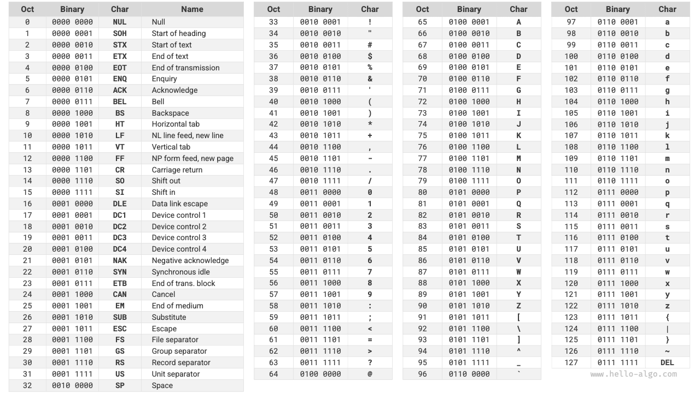
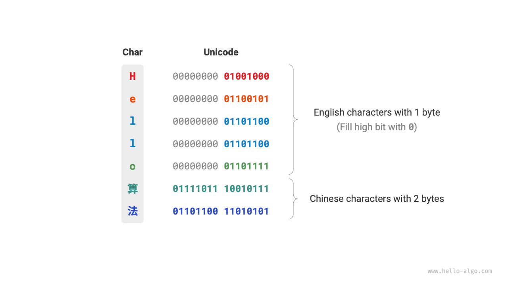
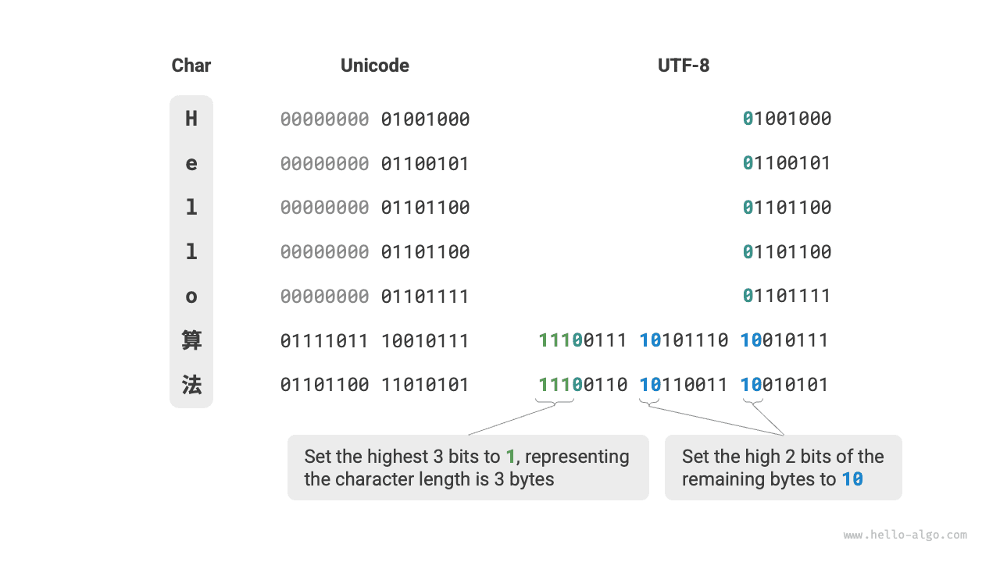

# Character encoding *

In the computer system, all data is stored in binary form, and characters (represented by char) are no exception. To represent characters, we need to develop a "character set" that defines a one-to-one mapping between each character and binary numbers. With the character set, computers can convert binary numbers to characters by looking up the table.

## ASCII character set

The "ASCII code" is one of the earliest character sets, officially known as the American Standard Code for Information Interchange. It uses 7 binary digits (the lower 7 bits of a byte) to represent a character, allowing for a maximum of 128 different characters. As shown in the figure below, ASCII includes uppercase and lowercase English letters, numbers 0 ~ 9, various punctuation marks, and certain control characters (such as newline and tab).

However, **ASCII can only represent English characters**. With the globalization of computers, a character set called "EASCII" was developed to represent more languages. It expands from the 7-bit structure of ASCII to 8 bits, enabling the representation of 256 characters.

Globally, various region-specific EASCII character sets have been introduced. The first 128 characters of these sets are consistent with the ASCII, while the remaining 128 characters are defined differently to accommodate the requirements of different languages.

## GBK character set

Later, it was found that **EASCII still could not meet the character requirements of many languages**. For instance, there are nearly a hundred thousand Chinese characters, with several thousand used regularly. In 1980, the Standardization Administration of China released the "GB2312" character set, which included 6763 Chinese characters, essentially fulfilling the computer processing needs for the Chinese language.

However, GB2312 could not handle some rare and traditional characters. The "GBK" character set expands GB2312 and includes 21886 Chinese characters. In the GBK encoding scheme, ASCII characters are represented with one byte, while Chinese characters use two bytes.

## Unicode character set

With the rapid evolution of computer technology and a plethora of character sets and encoding standards, numerous problems arose. On the one hand, these character sets generally only defined characters for specific languages and could not function properly in multilingual environments. On the other hand, the existence of multiple character set standards for the same language caused garbled text when information was exchanged between computers using different encoding standards.

Researchers of that era thought: **What if a comprehensive character set encompassing all global languages and symbols was developed? Wouldn't this resolve the issues associated with cross-linguistic environments and garbled text?** Inspired by this idea, the extensive character set, Unicode, was born.

"Unicode" is referred to as "统一码" (Unified Code) in Chinese, theoretically capable of accommodating over a million characters. It aims to incorporate characters from all over the world into a single set, providing a universal character set for processing and displaying various languages and reducing the issues of garbled text due to different encoding standards.

Since its release in 1991, Unicode has continually expanded to include new languages and characters. As of September 2022, Unicode contains 149,186 characters, including characters, symbols, and even emojis from various languages. In the vast Unicode character set, commonly used characters occupy 2 bytes, while some rare characters may occupy 3 or even 4 bytes.

Unicode is a universal character set that assigns a number (called a "code point") to each character, **but it does not specify how these character code points should be stored in a computer system**. One might ask: How does a system interpret Unicode code points of varying lengths within a text? For example, given a 2-byte code, how does the system determine if it represents a single 2-byte character or two 1-byte characters?

A straightforward solution to this problem is to store all characters as equal-length encodings. As shown in the figure below, each character in "Hello" occupies 1 byte, while each character in "算法" (algorithm) occupies 2 bytes. We could encode all characters in "Hello 算法" as 2 bytes by padding the higher bits with zeros. This method would enable the system to interpret a character every 2 bytes, recovering the content of the phrase.

However, as ASCII has shown us, encoding English only requires 1 byte. Using the above approach would double the space occupied by English text compared to ASCII encoding, which is a waste of memory space. Therefore, a more efficient Unicode encoding method is needed.

## UTF-8 encoding

Currently, UTF-8 has become the most widely used Unicode encoding method internationally. **It is a variable-length encoding**, using 1 to 4 bytes to represent a character, depending on the complexity of the character. ASCII characters need only 1 byte, Latin and Greek letters require 2 bytes, commonly used Chinese characters need 3 bytes, and some other rare characters need 4 bytes.

The encoding rules for UTF-8 are not complex and can be divided into two cases:

- For 1-byte characters, set the highest bit to $0$, and the remaining 7 bits to the Unicode code point. Notably, ASCII characters occupy the first 128 code points in the Unicode set. This means that **UTF-8 encoding is backward compatible with ASCII**. This implies that UTF-8 can be used to parse ancient ASCII text.
- For characters of length $n$ bytes (where $n > 1$), set the highest $n$ bits of the first byte to $1$, and the $(n + 1)^{\text{th}}$ bit to $0$; starting from the second byte, set the highest 2 bits of each byte to $10$; the rest of the bits are used to fill the Unicode code point.

The figure below shows the UTF-8 encoding for "Hello算法". It can be observed that since the highest $n$ bits are set to $1$, the system can determine the length of the character as $n$ by counting the number of highest bits set to $1$.

But why set the highest 2 bits of the remaining bytes to $10$? Actually, this $10$ serves as a kind of checksum. If the system starts parsing text from an incorrect byte, the $10$ at the beginning of the byte can help the system quickly detect anomalies.

The reason for using $10$ as a checksum is that, under UTF-8 encoding rules, it's impossible for the highest two bits of a character to be $10$. This can be proven by contradiction: If the highest two bits of a character are $10$, it indicates that the character's length is $1$, corresponding to ASCII. However, the highest bit of an ASCII character should be $0$, which contradicts the assumption.

Apart from UTF-8, other common encoding methods include:

- **UTF-16 encoding**: Uses 2 or 4 bytes to represent a character. All ASCII characters and commonly used non-English characters are represented with 2 bytes; a few characters require 4 bytes. For 2-byte characters, the UTF-16 encoding equals the Unicode code point.
- **UTF-32 encoding**: Every character uses 4 bytes. This means UTF-32 occupies more space than UTF-8 and UTF-16, especially for texts with a high proportion of ASCII characters.

From the perspective of storage space, using UTF-8 to represent English characters is very efficient because it only requires 1 byte; using UTF-16 to encode some non-English characters (such as Chinese) can be more efficient because it only requires 2 bytes, while UTF-8 might need 3 bytes.

From a compatibility perspective, UTF-8 is the most versatile, with many tools and libraries supporting UTF-8 as a priority.

## Character encoding in programming languages

Historically, many programming languages utilized fixed-length encodings such as UTF-16 or UTF-32 for processing strings during program execution. This allows strings to be handled as arrays, offering several advantages:

- **Random access**: Strings encoded in UTF-16 can be accessed randomly with ease. For UTF-8, which is a variable-length encoding, locating the $i^{th}$ character requires traversing the string from the start to the $i^{th}$ position, taking $O(n)$ time.
- **Character counting**: Similar to random access, counting the number of characters in a UTF-16 encoded string is an $O(1)$ operation. However, counting characters in a UTF-8 encoded string requires traversing the entire string.
- **String operations**: Many string operations like splitting, concatenating, inserting, and deleting are easier on UTF-16 encoded strings. These operations generally require additional computation on UTF-8 encoded strings to ensure the validity of the UTF-8 encoding.

The design of character encoding schemes in programming languages is an interesting topic involving various factors:

- Java’s `String` type uses UTF-16 encoding, with each character occupying 2 bytes. This was based on the initial belief that 16 bits were sufficient to represent all possible characters and proven incorrect later. As the Unicode standard expanded beyond 16 bits, characters in Java may now be represented by a pair of 16-bit values, known as “surrogate pairs.”
- JavaScript and TypeScript use UTF-16 encoding for similar reasons as Java. When JavaScript was first introduced by Netscape in 1995, Unicode was still in its early stages, and 16-bit encoding was sufficient to represent all Unicode characters.
- C# uses UTF-16 encoding, largely because the .NET platform, designed by Microsoft, and many Microsoft technologies, including the Windows operating system, extensively use UTF-16 encoding.

Due to the underestimation of character counts, these languages had to use "surrogate pairs" to represent Unicode characters exceeding 16 bits. This approach has its drawbacks: strings containing surrogate pairs may have characters occupying 2 or 4 bytes, losing the advantage of fixed-length encoding. Additionally, handling surrogate pairs adds complexity and debugging difficulty to programming.

Addressing these challenges, some languages have adopted alternative encoding strategies:

- Python’s `str` type uses Unicode encoding with a flexible representation where the storage length of characters depends on the largest Unicode code point in the string. If all characters are ASCII, each character occupies 1 byte, 2 bytes for characters within the Basic Multilingual Plane (BMP), and 4 bytes for characters beyond the BMP.
- Go’s `string` type internally uses UTF-8 encoding. Go also provides the `rune` type for representing individual Unicode code points.
- Rust’s `str` and `String` types use UTF-8 encoding internally. Rust also offers the `char` type for individual Unicode code points.

It’s important to note that the above discussion pertains to how strings are stored in programming languages, **which is different from how strings are stored in files or transmitted over networks**. For file storage or network transmission, strings are usually encoded in UTF-8 format for optimal compatibility and space efficiency.
