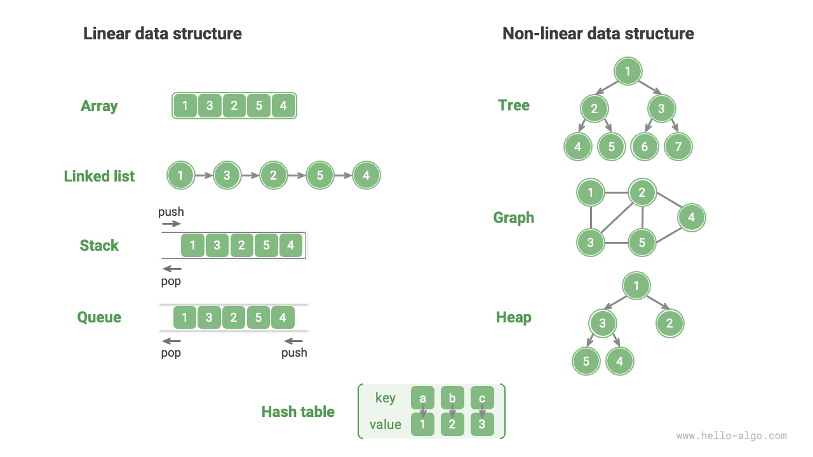
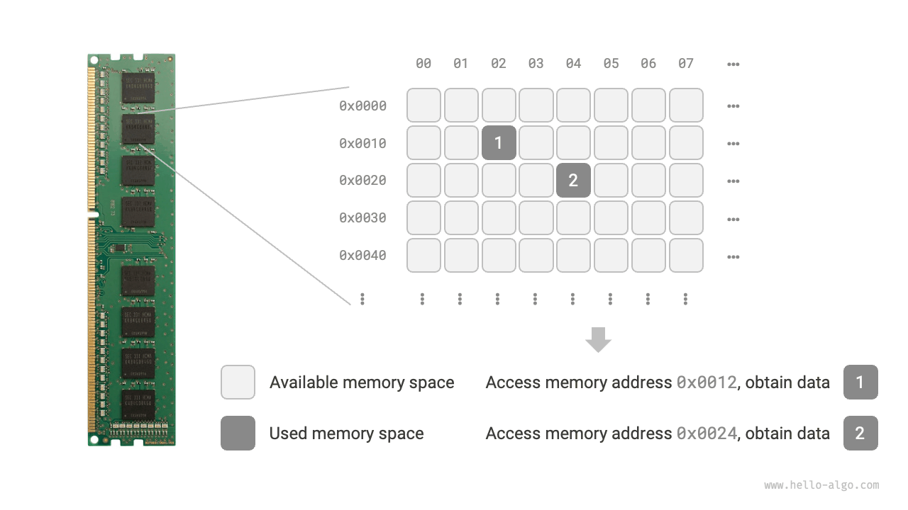
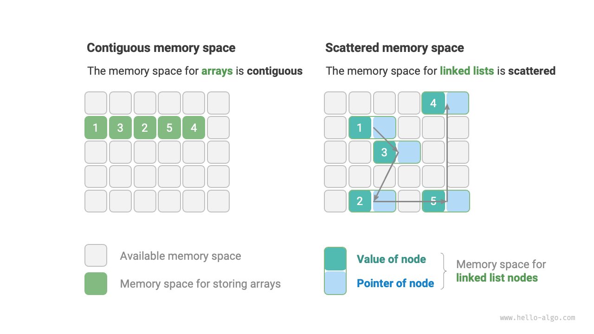

# Classification of data structures

Common data structures include arrays, linked lists, stacks, queues, hash tables, trees, heaps, and graphs. They can be classified into "logical structure" and "physical structure".

## Logical structure: linear and non-linear

**The logical structures reveal the logical relationships between data elements**. In arrays and linked lists, data are arranged in a specific sequence, demonstrating the linear relationship between data; while in trees, data are arranged hierarchically from the top down, showing the derived relationship between "ancestors" and "descendants"; and graphs are composed of nodes and edges, reflecting the intricate network relationship.

As shown in the figure below, logical structures can be divided into two major categories: "linear" and "non-linear". Linear structures are more intuitive, indicating data is arranged linearly in logical relationships; non-linear structures, conversely, are arranged non-linearly.

- **Linear data structures**: Arrays, Linked Lists, Stacks, Queues, Hash Tables.
- **Non-linear data structures**: Trees, Heaps, Graphs, Hash Tables.

Non-linear data structures can be further divided into tree structures and network structures.

- **Tree structures**: Trees, Heaps, Hash Tables, where elements have a one-to-many relationship.
- **Network structures**: Graphs, where elements have a many-to-many relationships.

## Physical structure: contiguous and dispersed

**During the execution of an algorithm, the data being processed is stored in memory**. The figure below shows a computer memory stick where each black square is a physical memory space. We can think of memory as a vast Excel spreadsheet, with each cell capable of storing a certain amount of data.

**The system accesses the data at the target location by means of a memory address**. As shown in the figure below, the computer assigns a unique identifier to each cell in the table according to specific rules, ensuring that each memory space has a unique memory address. With these addresses, the program can access the data stored in memory.

!!! tip

    It's worth noting that comparing memory to an Excel spreadsheet is a simplified analogy. The actual working mechanism of memory is more complex, involving concepts like address space, memory management, cache mechanisms, virtual memory, and physical memory.

Memory is a shared resource for all programs. When a block of memory is occupied by one program, it cannot be simultaneously used by other programs. **Therefore, considering memory resources is crucial in designing data structures and algorithms**. For instance, the algorithm's peak memory usage should not exceed the remaining free memory of the system; if there is a lack of contiguous memory blocks, then the data structure chosen must be able to be stored in non-contiguous memory blocks.

As illustrated in the figure below, **the physical structure reflects the way data is stored in computer memory** and it can be divided into contiguous space storage (arrays) and non-contiguous space storage (linked lists). The two types of physical structures exhibit complementary characteristics in terms of time efficiency and space efficiency.

**It is worth noting that all data structures are implemented based on arrays, linked lists, or a combination of both**. For example, stacks and queues can be implemented using either arrays or linked lists; while implementations of hash tables may involve both arrays and linked lists.

- **Array-based implementations**: Stacks, Queues, Hash Tables, Trees, Heaps, Graphs, Matrices, Tensors (arrays with dimensions $\geq 3$).
- **Linked-list-based implementations**: Stacks, Queues, Hash Tables, Trees, Heaps, Graphs, etc.

Data structures implemented based on arrays are also called “Static Data Structures,” meaning their length cannot be changed after initialization. Conversely, those based on linked lists are called “Dynamic Data Structures,” which can still adjust their size during program execution.

!!! tip

    If you find it challenging to comprehend the physical structure, it is recommended that you read the next chapter, "Arrays and Linked Lists," and revisit this section later.
