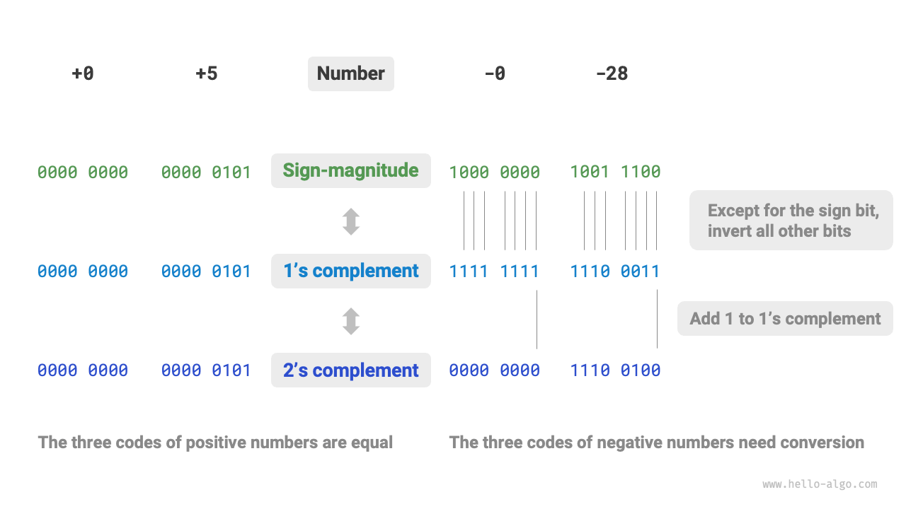

# Number encoding *

!!! tip

    In this book, chapters marked with an asterisk '*' are optional readings. If you are short on time or find them challenging, you may skip these initially and return to them after completing the essential chapters.

## Integer encoding

In the table from the previous section, we observed that all integer types can represent one more negative number than positive numbers, such as the `byte` range of $[-128, 127]$. This phenomenon seems counterintuitive, and its underlying reason involves knowledge of sign-magnitude, one's complement, and two's complement encoding.

Firstly, it's important to note that **numbers are stored in computers using the two's complement form**. Before analyzing why this is the case, let's define these three encoding methods:

- **Sign-magnitude**: The highest bit of a binary representation of a number is considered the sign bit, where $0$ represents a positive number and $1$ represents a negative number. The remaining bits represent the value of the number.
- **One's complement**: The one's complement of a positive number is the same as its sign-magnitude. For negative numbers, it's obtained by inverting all bits except the sign bit.
- **Two's complement**: The two's complement of a positive number is the same as its sign-magnitude. For negative numbers, it's obtained by adding $1$ to their one's complement.

The figure below illustrates the conversions among sign-magnitude, one's complement, and two's complement:

Although <u>sign-magnitude</u> is the most intuitive, it has limitations. For one, **negative numbers in sign-magnitude cannot be directly used in calculations**. For example, in sign-magnitude, calculating $1 + (-2)$ results in $-3$, which is incorrect.

$$
\begin{aligned}
& 1 + (-2) \newline
& \rightarrow 0000 \; 0001 + 1000 \; 0010 \newline
& = 1000 \; 0011 \newline
& \rightarrow -3
\end{aligned}
$$

To address this, computers introduced the <u>one's complement</u>. If we convert to one's complement and calculate $1 + (-2)$, then convert the result back to sign-magnitude, we get the correct result of $-1$.

$$
\begin{aligned}
& 1 + (-2) \newline
& \rightarrow 0000 \; 0001 \; \text{(Sign-magnitude)} + 1000 \; 0010 \; \text{(Sign-magnitude)} \newline
& = 0000 \; 0001 \; \text{(One's complement)} + 1111 \; 1101 \; \text{(One's complement)} \newline
& = 1111 \; 1110 \; \text{(One's complement)} \newline
& = 1000 \; 0001 \; \text{(Sign-magnitude)} \newline
& \rightarrow -1
\end{aligned}
$$

Additionally, **there are two representations of zero in sign-magnitude**: $+0$ and $-0$. This means two different binary encodings for zero, which could lead to ambiguity. For example, in conditional checks, not differentiating between positive and negative zero might result in incorrect outcomes. Addressing this ambiguity would require additional checks, potentially reducing computational efficiency.

$$
\begin{aligned}
+0 & \rightarrow 0000 \; 0000 \newline
-0 & \rightarrow 1000 \; 0000
\end{aligned}
$$

Like sign-magnitude, one's complement also suffers from the positive and negative zero ambiguity. Therefore, computers further introduced the <u>two's complement</u>. Let's observe the conversion process for negative zero in sign-magnitude, one's complement, and two's complement:

$$
\begin{aligned}
-0 \rightarrow \; & 1000 \; 0000 \; \text{(Sign-magnitude)} \newline
= \; & 1111 \; 1111 \; \text{(One's complement)} \newline
= 1 \; & 0000 \; 0000 \; \text{(Two's complement)} \newline
\end{aligned}
$$

Adding $1$ to the one's complement of negative zero produces a carry, but with `byte` length being only 8 bits, the carried-over $1$ to the 9th bit is discarded. Therefore, **the two's complement of negative zero is $0000 \; 0000$**, the same as positive zero, thus resolving the ambiguity.

One last puzzle is the $[-128, 127]$ range for `byte`, with an additional negative number, $-128$. We observe that for the interval $[-127, +127]$, all integers have corresponding sign-magnitude, one's complement, and two's complement, allowing for mutual conversion between them.

However, **the two's complement $1000 \; 0000$ is an exception without a corresponding sign-magnitude**. According to the conversion method, its sign-magnitude would be $0000 \; 0000$, indicating zero. This presents a contradiction because its two's complement should represent itself. Computers designate this special two's complement $1000 \; 0000$ as representing $-128$. In fact, the calculation of $(-1) + (-127)$ in two's complement results in $-128$.

$$
\begin{aligned}
& (-127) + (-1) \newline
& \rightarrow 1111 \; 1111 \; \text{(Sign-magnitude)} + 1000 \; 0001 \; \text{(Sign-magnitude)} \newline
& = 1000 \; 0000 \; \text{(One's complement)} + 1111 \; 1110 \; \text{(One's complement)} \newline
& = 1000 \; 0001 \; \text{(Two's complement)} + 1111 \; 1111 \; \text{(Two's complement)} \newline
& = 1000 \; 0000 \; \text{(Two's complement)} \newline
& \rightarrow -128
\end{aligned}
$$

As you might have noticed, all these calculations are additions, hinting at an important fact: **computers' internal hardware circuits are primarily designed around addition operations**. This is because addition is simpler to implement in hardware compared to other operations like multiplication, division, and subtraction, allowing for easier parallelization and faster computation.

It's important to note that this doesn't mean computers can only perform addition. **By combining addition with basic logical operations, computers can execute a variety of other mathematical operations**. For example, the subtraction $a - b$ can be translated into $a + (-b)$; multiplication and division can be translated into multiple additions or subtractions.

We can now summarize the reason for using two's complement in computers: with two's complement representation, computers can use the same circuits and operations to handle both positive and negative number addition, eliminating the need for special hardware circuits for subtraction and avoiding the ambiguity of positive and negative zero. This greatly simplifies hardware design and enhances computational efficiency.

The design of two's complement is quite ingenious, and due to space constraints, we'll stop here. Interested readers are encouraged to explore further.

## Floating-point number encoding

You might have noticed something intriguing: despite having the same length of 4 bytes, why does a `float` have a much larger range of values compared to an `int`? This seems counterintuitive, as one would expect the range to shrink for `float` since it needs to represent fractions.

In fact, **this is due to the different representation method used by floating-point numbers (`float`)**. Let's consider a 32-bit binary number as:

$$
b_{31} b_{30} b_{29} \ldots b_2 b_1 b_0
$$

According to the IEEE 754 standard, a 32-bit `float` consists of the following three parts:

- Sign bit $\mathrm{S}$: Occupies 1 bit, corresponding to $b_{31}$.
- Exponent bit $\mathrm{E}$: Occupies 8 bits, corresponding to $b_{30} b_{29} \ldots b_{23}$.
- Fraction bit $\mathrm{N}$: Occupies 23 bits, corresponding to $b_{22} b_{21} \ldots b_0$.

The value of a binary `float` number is calculated as:

$$
\text{val} = (-1)^{b_{31}} \times 2^{\left(b_{30} b_{29} \ldots b_{23}\right)_2 - 127} \times \left(1 . b_{22} b_{21} \ldots b_0\right)_2
$$

Converted to a decimal formula, this becomes:

$$
\text{val} = (-1)^{\mathrm{S}} \times 2^{\mathrm{E} - 127} \times (1 + \mathrm{N})
$$

The range of each component is:

$$
\begin{aligned}
\mathrm{S} \in & \{ 0, 1\}, \quad \mathrm{E} \in \{ 1, 2, \dots, 254 \} \newline
(1 + \mathrm{N}) = & (1 + \sum_{i=1}^{23} b_{23-i} \times 2^{-i}) \subset [1, 2 - 2^{-23}]
\end{aligned}
$$

Observing the figure above, given an example data $\mathrm{S} = 0$, $\mathrm{E} = 124$, $\mathrm{N} = 2^{-2} + 2^{-3} = 0.375$, we have:

$$
\text{val} = (-1)^0 \times 2^{124 - 127} \times (1 + 0.375) = 0.171875
$$

Now we can answer the initial question: **The representation of `float` includes an exponent bit, leading to a much larger range than `int`**. Based on the above calculation, the maximum positive number representable by `float` is approximately $2^{254 - 127} \times (2 - 2^{-23}) \approx 3.4 \times 10^{38}$, and the minimum negative number is obtained by switching the sign bit.

**However, the trade-off for `float`'s expanded range is a sacrifice in precision**. The integer type `int` uses all 32 bits to represent the number, with values evenly distributed; but due to the exponent bit, the larger the value of a `float`, the greater the difference between adjacent numbers.

As shown in the table below, exponent bits $\mathrm{E} = 0$ and $\mathrm{E} = 255$ have special meanings, **used to represent zero, infinity, $\mathrm{NaN}$, etc.**

 Table <id> &nbsp; Meaning of exponent bits 

| Exponent Bit E     | Fraction Bit $\mathrm{N} = 0$ | Fraction Bit $\mathrm{N} \ne 0$ | Calculation Formula                                                    |
| ------------------ | ----------------------------- | ------------------------------- | ---------------------------------------------------------------------- |
| $0$                | $\pm 0$                       | Subnormal Numbers               | $(-1)^{\mathrm{S}} \times 2^{-126} \times (0.\mathrm{N})$              |
| $1, 2, \dots, 254$ | Normal Numbers                | Normal Numbers                  | $(-1)^{\mathrm{S}} \times 2^{(\mathrm{E} -127)} \times (1.\mathrm{N})$ |
| $255$              | $\pm \infty$                  | $\mathrm{NaN}$                  |                                                                        |

It's worth noting that subnormal numbers significantly improve the precision of floating-point numbers. The smallest positive normal number is $2^{-126}$, and the smallest positive subnormal number is $2^{-126} \times 2^{-23}$.

Double-precision `double` also uses a similar representation method to `float`, which is not elaborated here for brevity.
