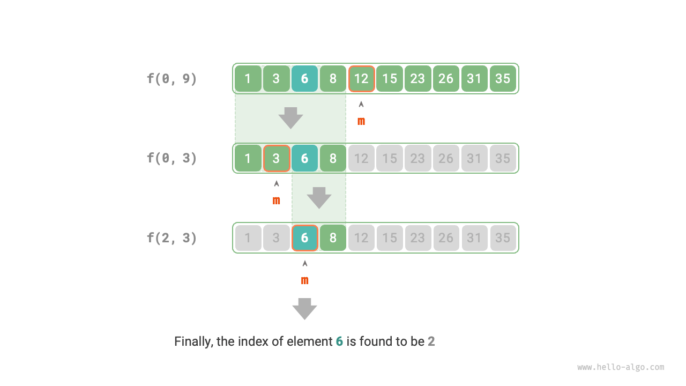

# 12.2 &nbsp; Divide and conquer search strategy

We have learned that search algorithms fall into two main categories.

- **Brute-force search**: It is implemented by traversing the data structure, with a time complexity of $O(n)$.
- **Adaptive search**: It utilizes a unique data organization form or prior information, and its time complexity can reach $O(\log n)$ or even $O(1)$.

In fact, **search algorithms with a time complexity of $O(\log n)$ are usually based on the divide-and-conquer strategy**, such as binary search and trees.

- Each step of binary search divides the problem (searching for a target element in an array) into a smaller problem (searching for the target element in half of the array), continuing until the array is empty or the target element is found.
- Trees represent the divide-and-conquer idea, where in data structures like binary search trees, AVL trees, and heaps, the time complexity of various operations is $O(\log n)$.

The divide-and-conquer strategy of binary search is as follows.

- **The problem can be divided**: Binary search recursively divides the original problem (searching in an array) into subproblems (searching in half of the array), achieved by comparing the middle element with the target element.
- **Subproblems are independent**: In binary search, each round handles one subproblem, unaffected by other subproblems.
- **The solutions of subproblems do not need to be merged**: Binary search aims to find a specific element, so there is no need to merge the solutions of subproblems. When a subproblem is solved, the original problem is also solved.

Divide-and-conquer can enhance search efficiency because brute-force search can only eliminate one option per round, **whereas divide-and-conquer can eliminate half of the options**.

### 1. &nbsp; Implementing binary search based on divide-and-conquer

In previous chapters, binary search was implemented based on iteration. Now, we implement it based on divide-and-conquer (recursion).

!!! question

    Given an ordered array `nums` of length $n$, where all elements are unique, please find the element `target`.

From a divide-and-conquer perspective, we denote the subproblem corresponding to the search interval $[i, j]$ as $f(i, j)$.

Starting from the original problem $f(0, n-1)$, perform the binary search through the following steps.

1. Calculate the midpoint $m$ of the search interval $[i, j]$, and use it to eliminate half of the search interval.
2. Recursively solve the subproblem reduced by half in size, which could be $f(i, m-1)$ or $f(m+1, j)$.
3. Repeat steps `1.` and `2.`, until `target` is found or the interval is empty and returns.

The diagram below shows the divide-and-conquer process of binary search for element $6$ in an array.

{ class="animation-figure" }

<p align="center"> Figure 12-4 &nbsp; The divide-and-conquer process of binary search </p>

In the implementation code, we declare a recursive function `dfs()` to solve the problem $f(i, j)$:

=== "Python"

    ```python title="binary_search_recur.py"
    def dfs(nums: list[int], target: int, i: int, j: int) -> int:
        """Binary search: problem f(i, j)"""
        # If the interval is empty, indicating no target element, return -1
        if i > j:
            return -1
        # Calculate midpoint index m
        m = (i + j) // 2
        if nums[m] < target:
            # Recursive subproblem f(m+1, j)
            return dfs(nums, target, m + 1, j)
        elif nums[m] > target:
            # Recursive subproblem f(i, m-1)
            return dfs(nums, target, i, m - 1)
        else:
            # Found the target element, thus return its index
            return m

    def binary_search(nums: list[int], target: int) -> int:
        """Binary search"""
        n = len(nums)
        # Solve problem f(0, n-1)
        return dfs(nums, target, 0, n - 1)
    ```

=== "C++"

    ```cpp title="binary_search_recur.cpp"
    [class]{}-[func]{dfs}

    [class]{}-[func]{binarySearch}
    ```

=== "Java"

    ```java title="binary_search_recur.java"
    /* Binary search: problem f(i, j) */
    int dfs(int[] nums, int target, int i, int j) {
        // If the interval is empty, indicating no target element, return -1
        if (i > j) {
            return -1;
        }
        // Calculate midpoint index m
        int m = (i + j) / 2;
        if (nums[m] < target) {
            // Recursive subproblem f(m+1, j)
            return dfs(nums, target, m + 1, j);
        } else if (nums[m] > target) {
            // Recursive subproblem f(i, m-1)
            return dfs(nums, target, i, m - 1);
        } else {
            // Found the target element, thus return its index
            return m;
        }
    }

    /* Binary search */
    int binarySearch(int[] nums, int target) {
        int n = nums.length;
        // Solve problem f(0, n-1)
        return dfs(nums, target, 0, n - 1);
    }
    ```

=== "C#"

    ```csharp title="binary_search_recur.cs"
    [class]{binary_search_recur}-[func]{DFS}

    [class]{binary_search_recur}-[func]{BinarySearch}
    ```

=== "Go"

    ```go title="binary_search_recur.go"
    [class]{}-[func]{dfs}

    [class]{}-[func]{binarySearch}
    ```

=== "Swift"

    ```swift title="binary_search_recur.swift"
    [class]{}-[func]{dfs}

    [class]{}-[func]{binarySearch}
    ```

=== "JS"

    ```javascript title="binary_search_recur.js"
    [class]{}-[func]{dfs}

    [class]{}-[func]{binarySearch}
    ```

=== "TS"

    ```typescript title="binary_search_recur.ts"
    [class]{}-[func]{dfs}

    [class]{}-[func]{binarySearch}
    ```

=== "Dart"

    ```dart title="binary_search_recur.dart"
    [class]{}-[func]{dfs}

    [class]{}-[func]{binarySearch}
    ```

=== "Rust"

    ```rust title="binary_search_recur.rs"
    [class]{}-[func]{dfs}

    [class]{}-[func]{binary_search}
    ```

=== "C"

    ```c title="binary_search_recur.c"
    [class]{}-[func]{dfs}

    [class]{}-[func]{binarySearch}
    ```

=== "Kotlin"

    ```kotlin title="binary_search_recur.kt"
    [class]{}-[func]{dfs}

    [class]{}-[func]{binarySearch}
    ```

=== "Ruby"

    ```ruby title="binary_search_recur.rb"
    [class]{}-[func]{dfs}

    [class]{}-[func]{binary_search}
    ```

=== "Zig"

    ```zig title="binary_search_recur.zig"
    [class]{}-[func]{dfs}

    [class]{}-[func]{binarySearch}
    ```
