# Building binary tree problem

!!! question

    Given the pre-order traversal `preorder` and in-order traversal `inorder` of a binary tree, construct the binary tree and return the root node of the binary tree. Assume that there are no duplicate values in the nodes of the binary tree (as shown in the figure below).

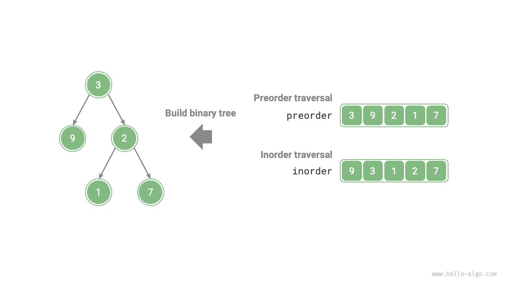

### Determining if it is a divide and conquer problem

The original problem of constructing a binary tree from `preorder` and `inorder` is a typical divide and conquer problem.

- **The problem can be decomposed**: From the perspective of divide and conquer, we can divide the original problem into two subproblems: building the left subtree and building the right subtree, plus one operation: initializing the root node. For each subtree (subproblem), we can still use the above division method, dividing it into smaller subtrees (subproblems), until the smallest subproblem (empty subtree) is reached.
- **The subproblems are independent**: The left and right subtrees are independent of each other, with no overlap. When building the left subtree, we only need to focus on the parts of the in-order and pre-order traversals that correspond to the left subtree. The same applies to the right subtree.
- **Solutions to subproblems can be combined**: Once the solutions for the left and right subtrees (solutions to subproblems) are obtained, we can link them to the root node to obtain the solution to the original problem.

### How to divide the subtrees

Based on the above analysis, this problem can be solved using divide and conquer, **but how do we use the pre-order traversal `preorder` and in-order traversal `inorder` to divide the left and right subtrees?**

By definition, `preorder` and `inorder` can be divided into three parts.

- Pre-order traversal: `[ Root | Left Subtree | Right Subtree ]`, for example, the tree in the figure corresponds to `[ 3 | 9 | 2 1 7 ]`.
- In-order traversal: `[ Left Subtree | Root | Right Subtree ]`, for example, the tree in the figure corresponds to `[ 9 | 3 | 1 2 7 ]`.

Using the data in the figure above, we can obtain the division results as shown in the figure below.

1. The first element 3 in the pre-order traversal is the value of the root node.
2. Find the index of the root node 3 in `inorder`, and use this index to divide `inorder` into `[ 9 | 3 ｜ 1 2 7 ]`.
3. Based on the division results of `inorder`, it is easy to determine the number of nodes in the left and right subtrees as 1 and 3, respectively, thus dividing `preorder` into `[ 3 | 9 | 2 1 7 ]`.

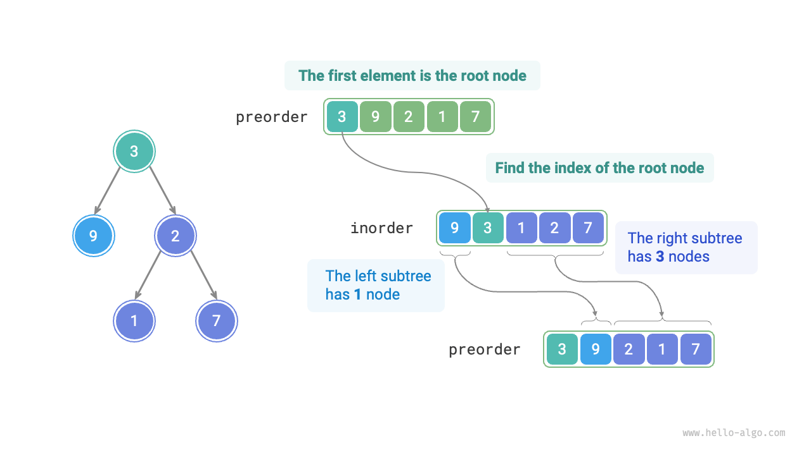

### Describing subtree intervals based on variables

Based on the above division method, **we have now obtained the index intervals of the root, left subtree, and right subtree in `preorder` and `inorder`**. To describe these index intervals, we need the help of several pointer variables.

- Let the index of the current tree's root node in `preorder` be denoted as $i$.
- Let the index of the current tree's root node in `inorder` be denoted as $m$.
- Let the index interval of the current tree in `inorder` be denoted as $[l, r]$.

As shown in the table below, the above variables can represent the index of the root node in `preorder` as well as the index intervals of the subtrees in `inorder`.

<p align="center"> Table <id> &nbsp; Indexes of the root node and subtrees in pre-order and in-order traversals </p>

|               | Root node index in `preorder` | Subtree index interval in `inorder` |
| ------------- | ----------------------------- | ----------------------------------- |
| Current tree  | $i$                           | $[l, r]$                            |
| Left subtree  | $i + 1$                       | $[l, m-1]$                          |
| Right subtree | $i + 1 + (m - l)$             | $[m+1, r]$                          |

Please note, the meaning of $(m-l)$ in the right subtree root index is "the number of nodes in the left subtree", which is suggested to be understood in conjunction with the figure below.

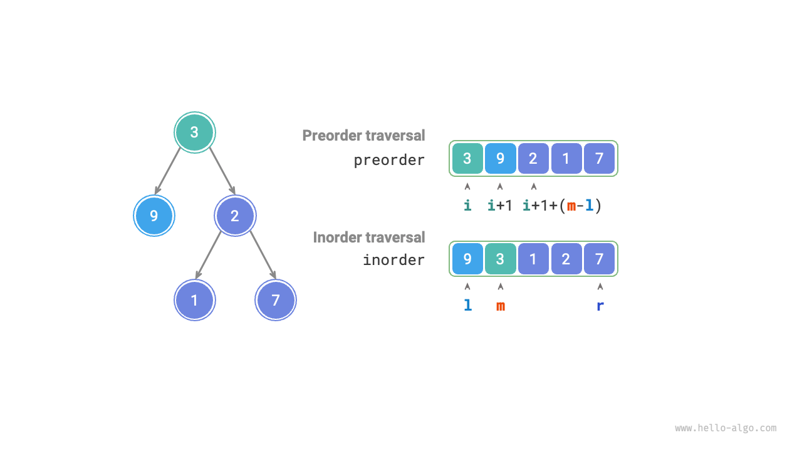

### Code implementation

To improve the efficiency of querying $m$, we use a hash table `hmap` to store the mapping of elements in `inorder` to their indexes:

```src
[file]{build_tree}-[class]{}-[func]{build_tree}
```

The figure below shows the recursive process of building the binary tree, where each node is established during the "descending" process, and each edge (reference) is established during the "ascending" process.

=== "<1>"
    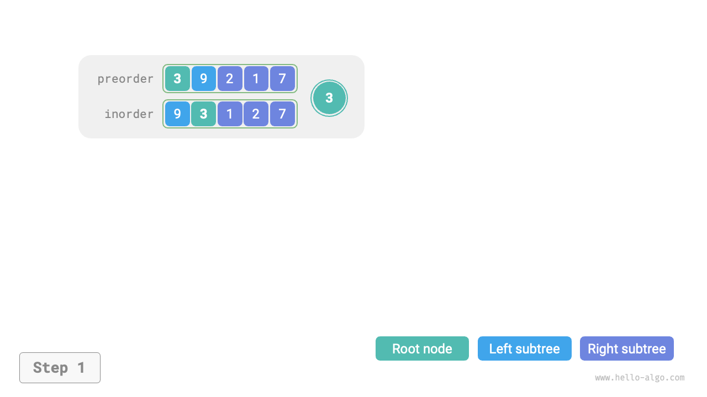

=== "<2>"
    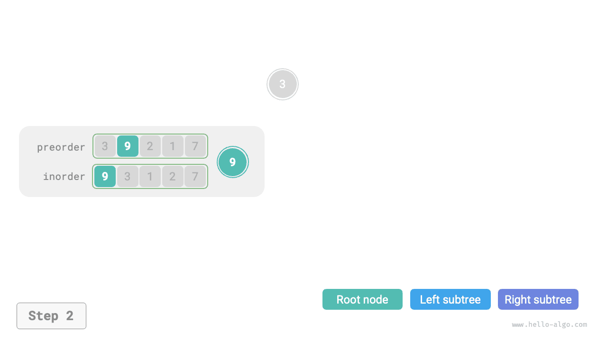

=== "<3>"
    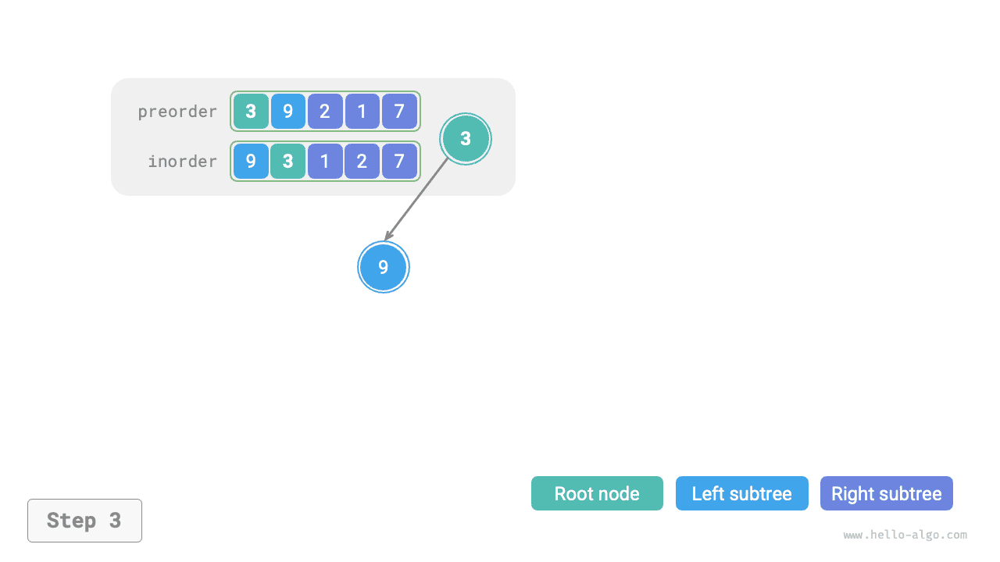

=== "<4>"
    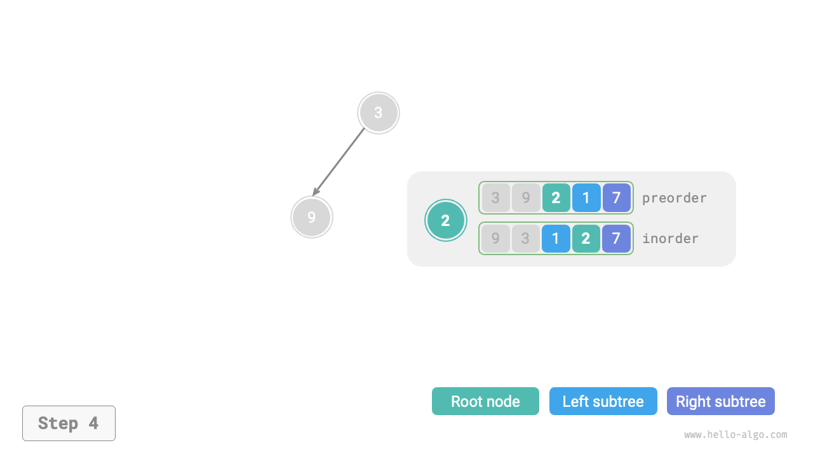

=== "<5>"
    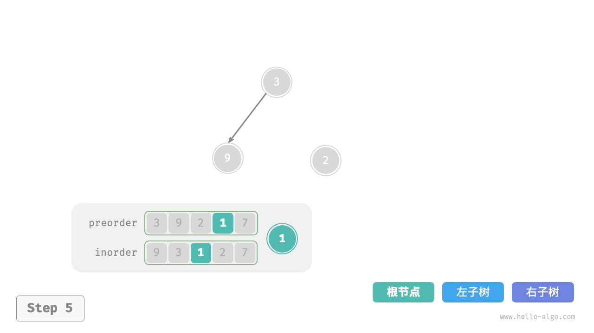

=== "<6>"
    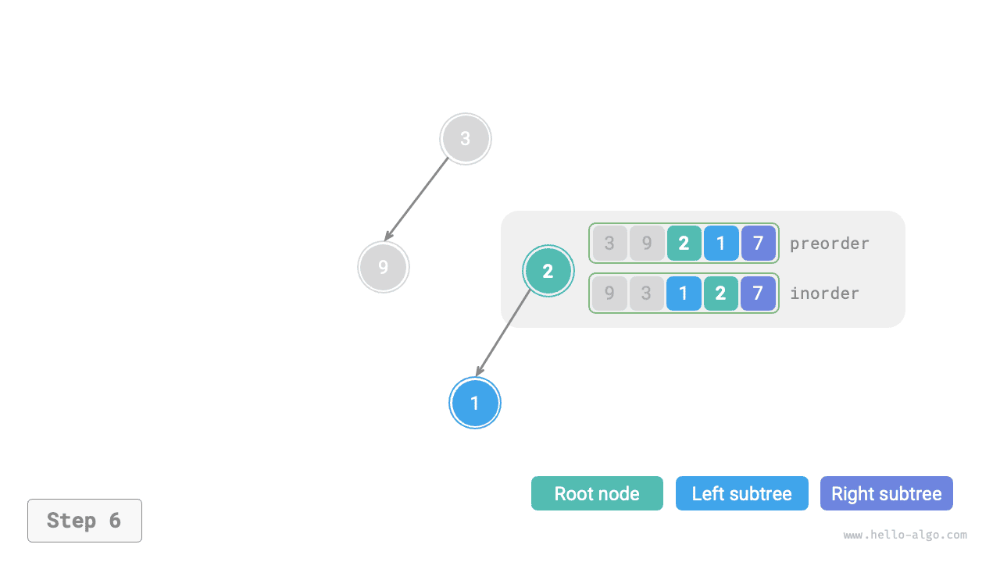

=== "<7>"
    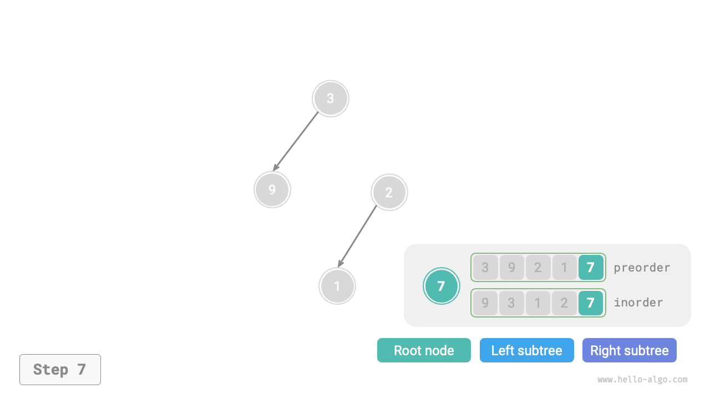

=== "<8>"
    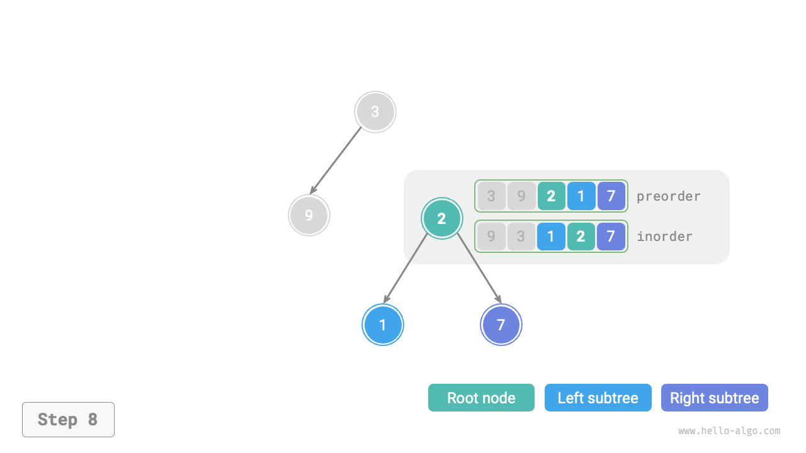

=== "<9>"
    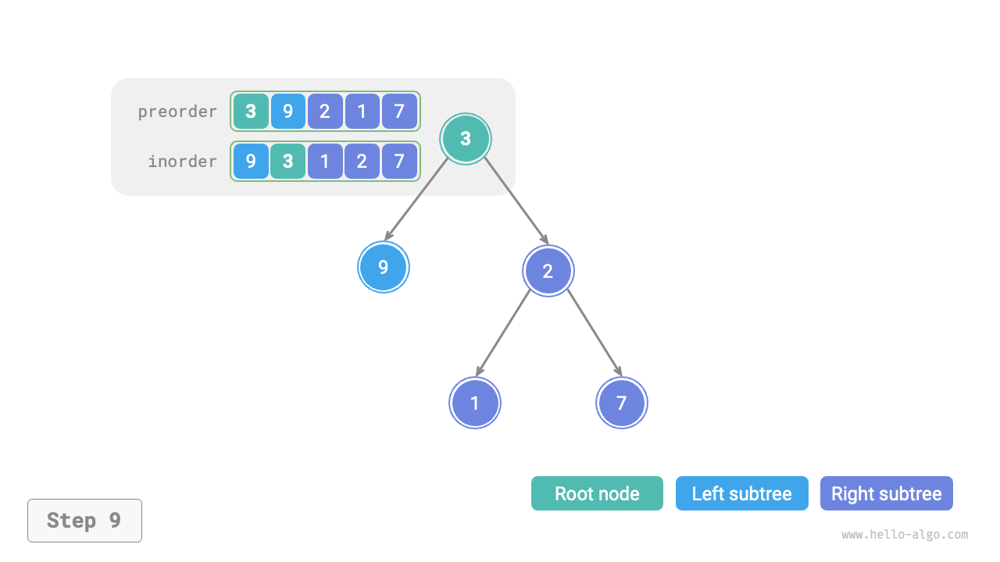

Each recursive function's division results of `preorder` and `inorder` are shown in the figure below.

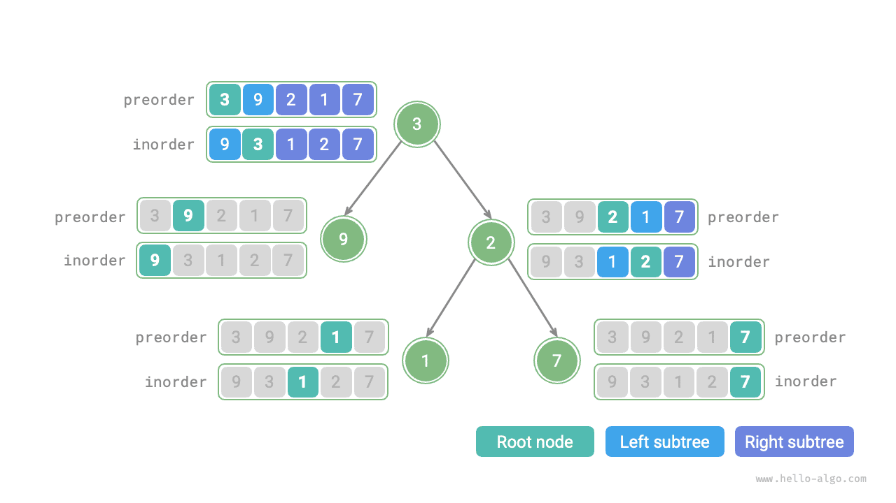

Assuming the number of nodes in the tree is $n$, initializing each node (executing a recursive function `dfs()`) takes $O(1)$ time. **Thus, the overall time complexity is $O(n)$**.

The hash table stores the mapping of `inorder` elements to their indexes, with a space complexity of $O(n)$. In the worst case, when the binary tree degenerates into a linked list, the recursive depth reaches $n$, using $O(n)$ stack frame space. **Therefore, the overall space complexity is $O(n)$**.
