# Tower of Hanoi Problem

In both merge sorting and building binary trees, we decompose the original problem into two subproblems, each half the size of the original problem. However, for the Tower of Hanoi, we adopt a different decomposition strategy.

!!! question

    Given three pillars, denoted as `A`, `B`, and `C`. Initially, pillar `A` is stacked with $n$ discs, arranged in order from top to bottom from smallest to largest. Our task is to move these $n$ discs to pillar `C`, maintaining their original order (as shown in the figure below). The following rules must be followed during the disc movement process:
    
    1. A disc can only be picked up from the top of a pillar and placed on top of another pillar.
    2. Only one disc can be moved at a time.
    3. A smaller disc must always be on top of a larger disc.

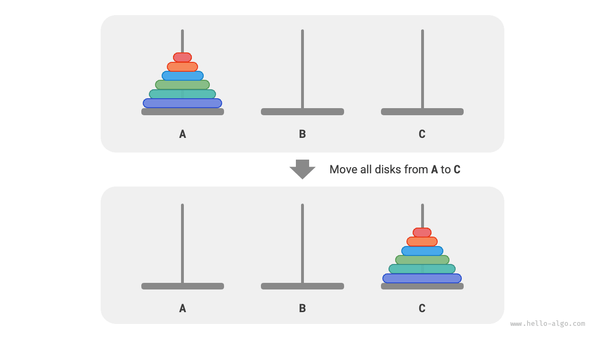

**We denote the Tower of Hanoi of size $i$ as $f(i)$**. For example, $f(3)$ represents the Tower of Hanoi of moving $3$ discs from `A` to `C`.

### Consider the base case

As shown in the figure below, for the problem $f(1)$, i.e., when there is only one disc, we can directly move it from `A` to `C`.

=== "<1>"
    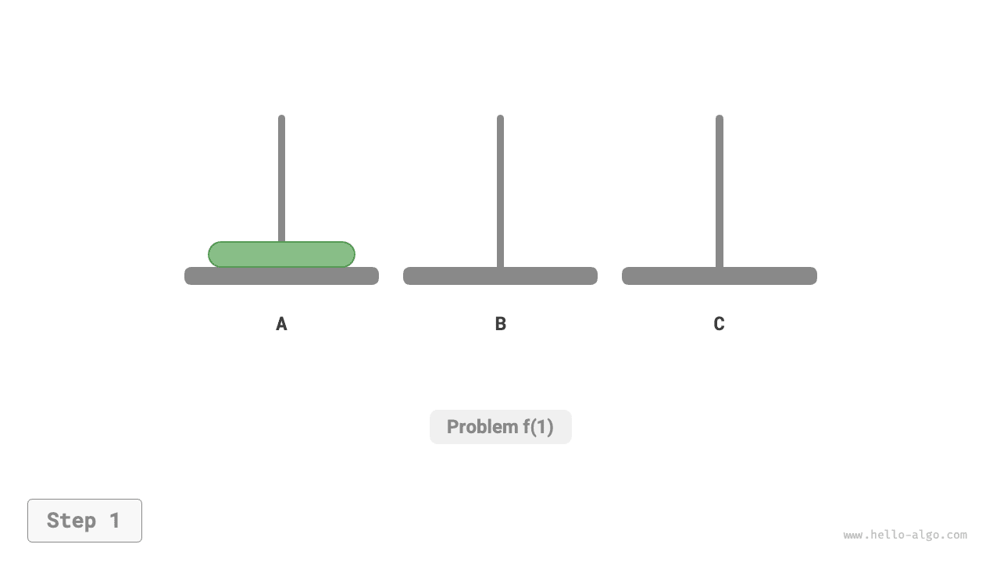

=== "<2>"
    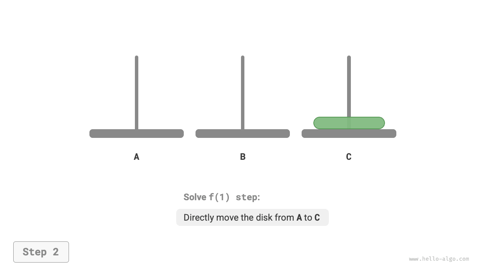

As shown in the figure below, for the problem $f(2)$, i.e., when there are two discs, **since the smaller disc must always be above the larger disc, `B` is needed to assist in the movement**.

1. First, move the smaller disc from `A` to `B`.
2. Then move the larger disc from `A` to `C`.
3. Finally, move the smaller disc from `B` to `C`.

=== "<1>"
    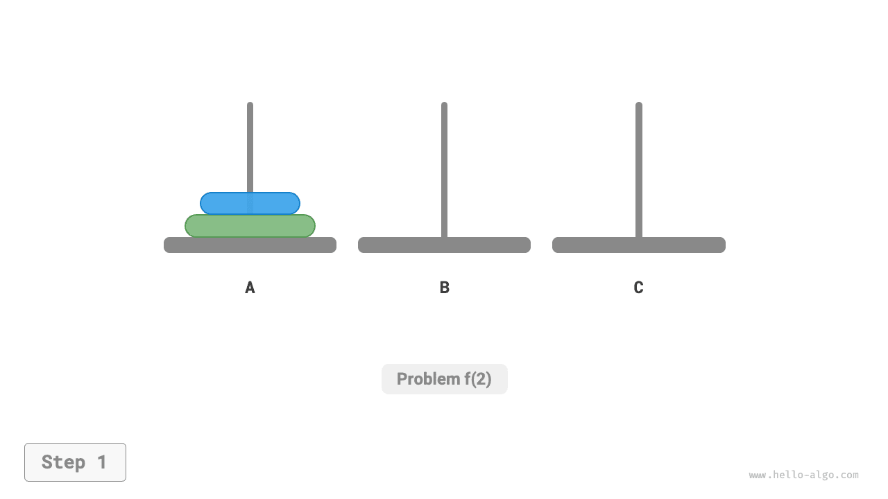

=== "<2>"
    

=== "<3>"
    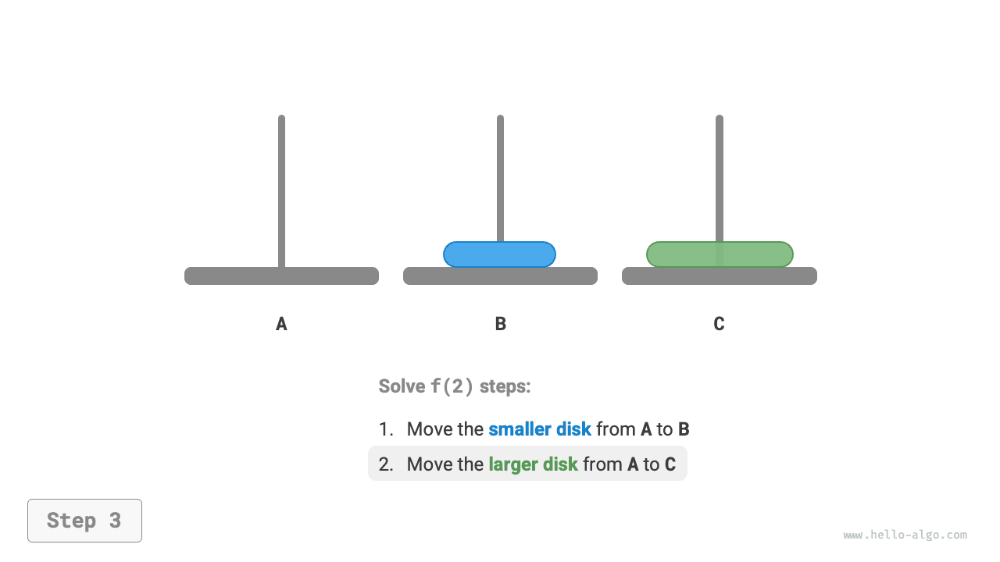

=== "<4>"
    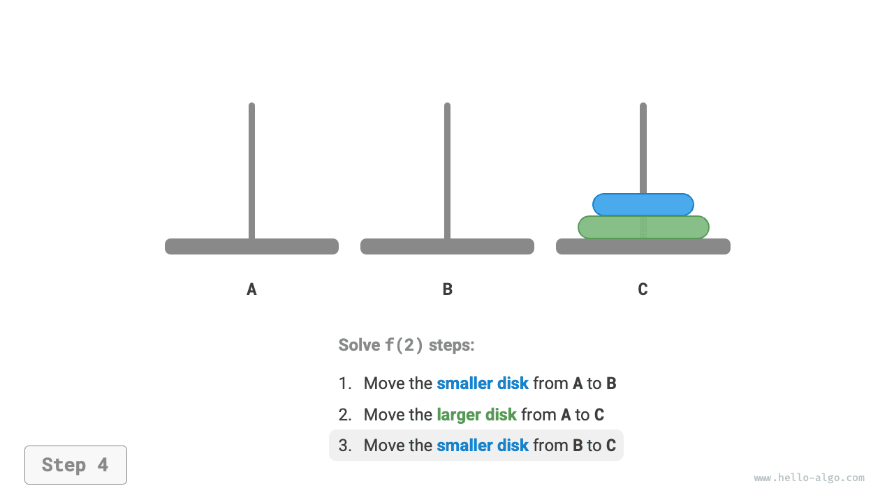

The process of solving the problem $f(2)$ can be summarized as: **moving two discs from `A` to `C` with the help of `B`**. Here, `C` is called the target pillar, and `B` is called the buffer pillar.

### Decomposition of subproblems

For the problem $f(3)$, i.e., when there are three discs, the situation becomes slightly more complicated.

Since we already know the solutions to $f(1)$ and $f(2)$, we can think from a divide-and-conquer perspective and **consider the two top discs on `A` as a unit**, performing the steps shown in the figure below. This way, the three discs are successfully moved from `A` to `C`.

1. Let `B` be the target pillar and `C` the buffer pillar, and move the two discs from `A` to `B`.
2. Move the remaining disc from `A` directly to `C`.
3. Let `C` be the target pillar and `A` the buffer pillar, and move the two discs from `B` to `C`.

=== "<1>"
    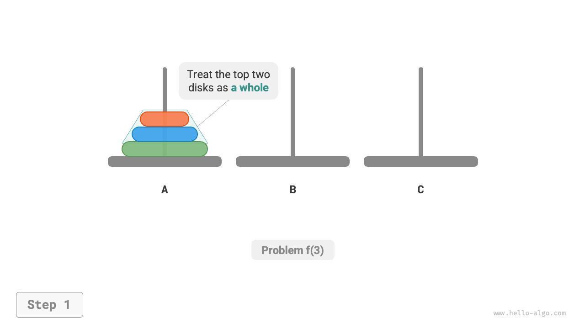

=== "<2>"
    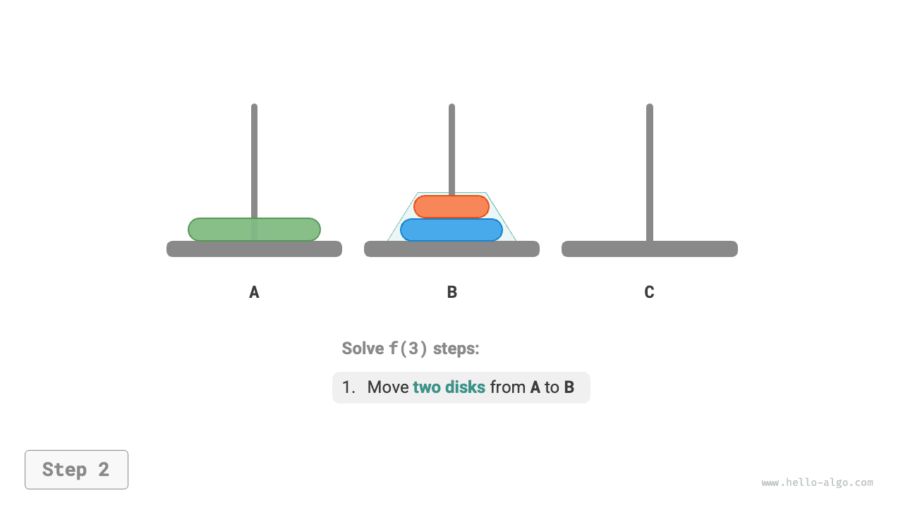

=== "<3>"
    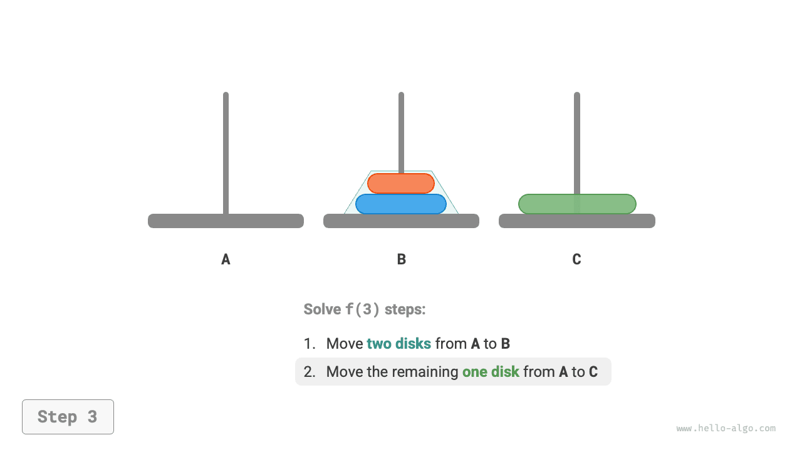

=== "<4>"
    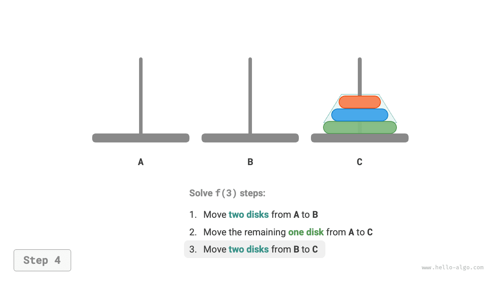

Essentially, **we divide the problem $f(3)$ into two subproblems $f(2)$ and one subproblem $f(1)$**. By solving these three subproblems in order, the original problem is resolved. This indicates that the subproblems are independent, and their solutions can be merged.

From this, we can summarize the divide-and-conquer strategy for solving the Tower of Hanoi shown in the figure below: divide the original problem $f(n)$ into two subproblems $f(n-1)$ and one subproblem $f(1)$, and solve these three subproblems in the following order.

1. Move $n-1$ discs with the help of `C` from `A` to `B`.
2. Move the remaining one disc directly from `A` to `C`.
3. Move $n-1$ discs with the help of `A` from `B` to `C`.

For these two subproblems $f(n-1)$, **they can be recursively divided in the same manner** until the smallest subproblem $f(1)$ is reached. The solution to $f(1)$ is already known and requires only one move.

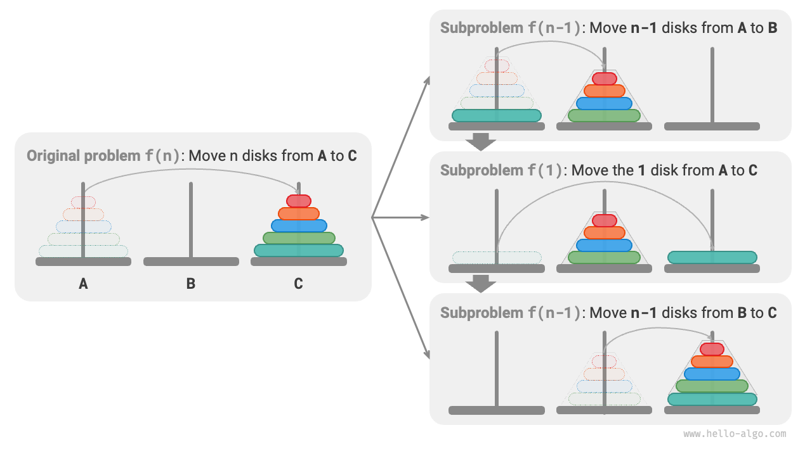

### Code implementation

In the code, we declare a recursive function `dfs(i, src, buf, tar)` whose role is to move the $i$ discs on top of pillar `src` with the help of buffer pillar `buf` to the target pillar `tar`:

```src
[file]{hanota}-[class]{}-[func]{solve_hanota}
```

As shown in the figure below, the Tower of Hanoi forms a recursive tree with a height of $n$, each node representing a subproblem, corresponding to an open `dfs()` function, **thus the time complexity is $O(2^n)$, and the space complexity is $O(n)$**.

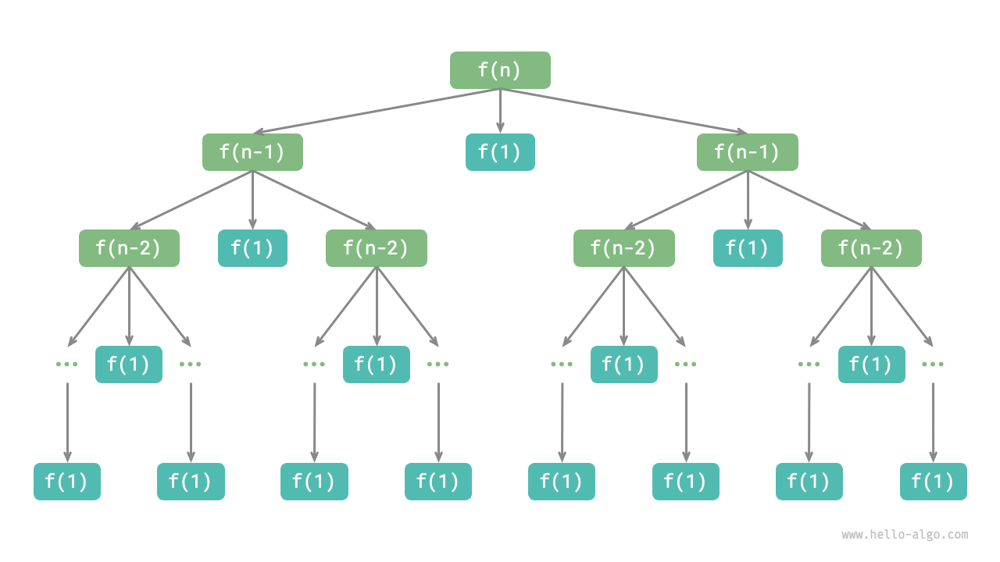

!!! quote

    The Tower of Hanoi originates from an ancient legend. In a temple in ancient India, monks had three tall diamond pillars and $64$ differently sized golden discs. The monks continuously moved the discs, believing that when the last disc is correctly placed, the world would end.

    However, even if the monks moved a disc every second, it would take about $2^{64} \approx 1.84×10^{19}$ seconds, approximately 585 billion years, far exceeding current estimates of the age of the universe. Thus, if the legend is true, we probably do not need to worry about the world ending.
