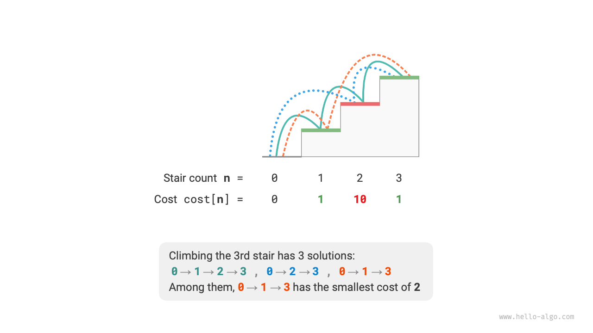
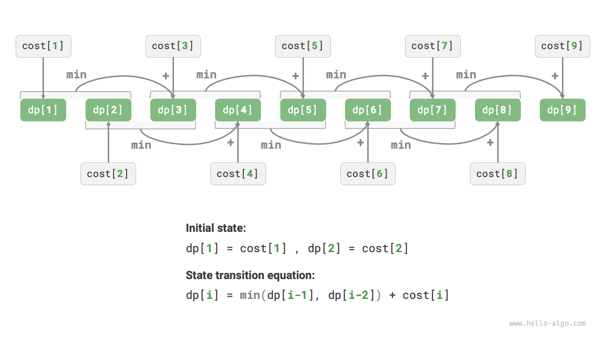
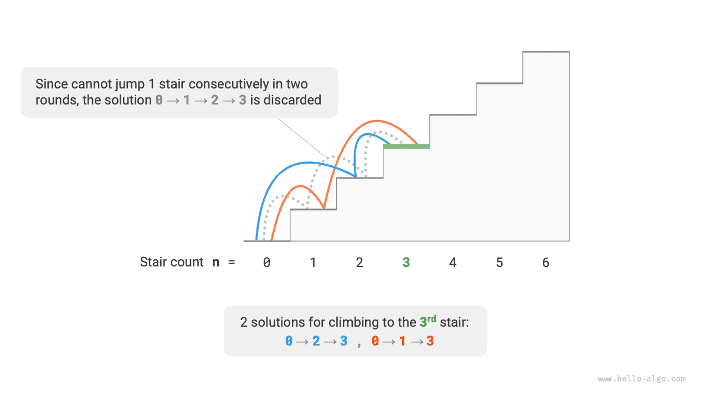
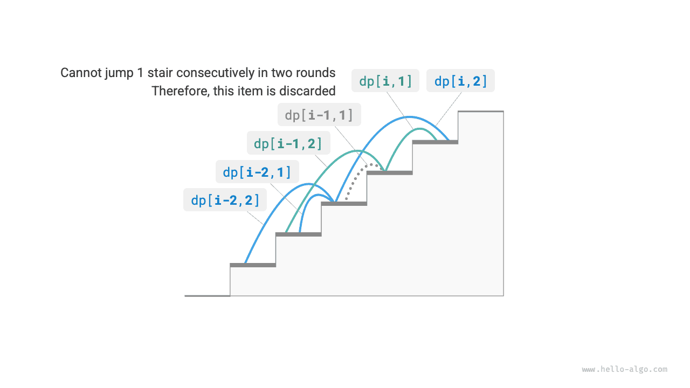

# Characteristics of dynamic programming problems

In the previous section, we learned how dynamic programming solves the original problem by decomposing it into subproblems. In fact, subproblem decomposition is a general algorithmic approach, with different emphases in divide and conquer, dynamic programming, and backtracking.

- Divide and conquer algorithms recursively divide the original problem into multiple independent subproblems until the smallest subproblems are reached, and combine the solutions of the subproblems during backtracking to ultimately obtain the solution to the original problem.
- Dynamic programming also decomposes the problem recursively, but the main difference from divide and conquer algorithms is that the subproblems in dynamic programming are interdependent, and many overlapping subproblems will appear during the decomposition process.
- Backtracking algorithms exhaust all possible solutions through trial and error and avoid unnecessary search branches by pruning. The solution to the original problem consists of a series of decision steps, and we can consider each sub-sequence before each decision step as a subproblem.

In fact, dynamic programming is commonly used to solve optimization problems, which not only include overlapping subproblems but also have two other major characteristics: optimal substructure and statelessness.

## Optimal substructure

We make a slight modification to the stair climbing problem to make it more suitable to demonstrate the concept of optimal substructure.

!!! question "Minimum cost of climbing stairs"

    Given a staircase, you can step up 1 or 2 steps at a time, and each step on the staircase has a non-negative integer representing the cost you need to pay at that step. Given a non-negative integer array $cost$, where $cost[i]$ represents the cost you need to pay at the $i$-th step, $cost[0]$ is the ground (starting point). What is the minimum cost required to reach the top?

As shown in the figure below, if the costs of the 1st, 2nd, and 3rd steps are $1$, $10$, and $1$ respectively, then the minimum cost to climb to the 3rd step from the ground is $2$.



Let $dp[i]$ be the cumulative cost of climbing to the $i$-th step. Since the $i$-th step can only come from the $i-1$ or $i-2$ step, $dp[i]$ can only be either $dp[i-1] + cost[i]$ or $dp[i-2] + cost[i]$. To minimize the cost, we should choose the smaller of the two:

$$
dp[i] = \min(dp[i-1], dp[i-2]) + cost[i]
$$

This leads us to the meaning of optimal substructure: **The optimal solution to the original problem is constructed from the optimal solutions of subproblems**.

This problem obviously has optimal substructure: we select the better one from the optimal solutions of the two subproblems, $dp[i-1]$ and $dp[i-2]$, and use it to construct the optimal solution for the original problem $dp[i]$.

So, does the stair climbing problem from the previous section have optimal substructure? Its goal is to solve for the number of solutions, which seems to be a counting problem, but if we ask in another way: "Solve for the maximum number of solutions". We surprisingly find that **although the problem has changed, the optimal substructure has emerged**: the maximum number of solutions at the $n$-th step equals the sum of the maximum number of solutions at the $n-1$ and $n-2$ steps. Thus, the interpretation of optimal substructure is quite flexible and will have different meanings in different problems.

According to the state transition equation, and the initial states $dp[1] = cost[1]$ and $dp[2] = cost[2]$, we can obtain the dynamic programming code:

```src
[file]{min_cost_climbing_stairs_dp}-[class]{}-[func]{min_cost_climbing_stairs_dp}
```

The figure below shows the dynamic programming process for the above code.



This problem can also be space-optimized, compressing one dimension to zero, reducing the space complexity from $O(n)$ to $O(1)$:

```src
[file]{min_cost_climbing_stairs_dp}-[class]{}-[func]{min_cost_climbing_stairs_dp_comp}
```

## Statelessness

Statelessness is one of the important characteristics that make dynamic programming effective in solving problems. Its definition is: **Given a certain state, its future development is only related to the current state and unrelated to all past states experienced**.

Taking the stair climbing problem as an example, given state $i$, it will develop into states $i+1$ and $i+2$, corresponding to jumping 1 step and 2 steps respectively. When making these two choices, we do not need to consider the states before state $i$, as they do not affect the future of state $i$.

However, if we add a constraint to the stair climbing problem, the situation changes.

!!! question "Stair climbing with constraints"

    Given a staircase with $n$ steps, you can go up 1 or 2 steps each time, **but you cannot jump 1 step twice in a row**. How many ways are there to climb to the top?

As shown in the figure below, there are only 2 feasible options for climbing to the 3rd step, among which the option of jumping 1 step three times in a row does not meet the constraint condition and is therefore discarded.



In this problem, if the last round was a jump of 1 step, then the next round must be a jump of 2 steps. This means that **the next step choice cannot be independently determined by the current state (current stair step), but also depends on the previous state (last round's stair step)**.

It is not difficult to find that this problem no longer satisfies statelessness, and the state transition equation $dp[i] = dp[i-1] + dp[i-2]$ also fails, because $dp[i-1]$ represents this round's jump of 1 step, but it includes many "last round was a jump of 1 step" options, which, to meet the constraint, cannot be directly included in $dp[i]$.

For this, we need to expand the state definition: **State $[i, j]$ represents being on the $i$-th step and the last round was a jump of $j$ steps**, where $j \in \{1, 2\}$. This state definition effectively distinguishes whether the last round was a jump of 1 step or 2 steps, and we can judge accordingly where the current state came from.

- When the last round was a jump of 1 step, the round before last could only choose to jump 2 steps, that is, $dp[i, 1]$ can only be transferred from $dp[i-1, 2]$.
- When the last round was a jump of 2 steps, the round before last could choose to jump 1 step or 2 steps, that is, $dp[i, 2]$ can be transferred from $dp[i-2, 1]$ or $dp[i-2, 2]$.

As shown in the figure below, $dp[i, j]$ represents the number of solutions for state $[i, j]$. At this point, the state transition equation is:

$$
\begin{cases}
dp[i, 1] = dp[i-1, 2] \\
dp[i, 2] = dp[i-2, 1] + dp[i-2, 2]
\end{cases}
$$



In the end, returning $dp[n, 1] + dp[n, 2]$ will do, the sum of the two representing the total number of solutions for climbing to the $n$-th step:

```src
[file]{climbing_stairs_constraint_dp}-[class]{}-[func]{climbing_stairs_constraint_dp}
```

In the above cases, since we only need to consider the previous state, we can still meet the statelessness by expanding the state definition. However, some problems have very serious "state effects".

!!! question "Stair climbing with obstacle generation"

    Given a staircase with $n$ steps, you can go up 1 or 2 steps each time. **It is stipulated that when climbing to the $i$-th step, the system automatically places an obstacle on the $2i$-th step, and thereafter all rounds are not allowed to jump to the $2i$-th step**. For example, if the first two rounds jump to the 2nd and 3rd steps, then later you cannot jump to the 4th and 6th steps. How many ways are there to climb to the top?

In this problem, the next jump depends on all past states, as each jump places obstacles on higher steps, affecting future jumps. For such problems, dynamic programming often struggles to solve.

In fact, many complex combinatorial optimization problems (such as the traveling salesman problem) do not satisfy statelessness. For these kinds of problems, we usually choose to use other methods, such as heuristic search, genetic algorithms, reinforcement learning, etc., to obtain usable local optimal solutions within a limited time.
