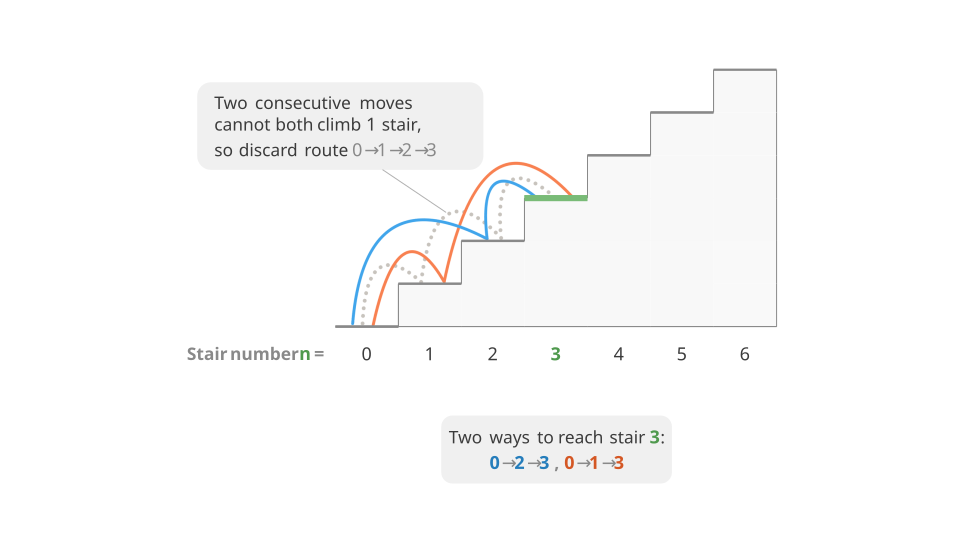
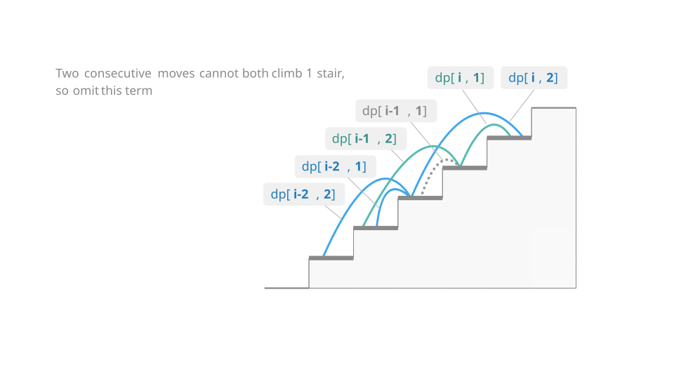

# 14.2 &nbsp; Properties of dynamic programming problems

In the previous section, we saw how dynamic programming solves a problem by breaking it into subproblems. This is a general algorithmic technique. Divide and conquer, dynamic programming, and backtracking each use it differently.

- Divide and conquer recursively splits a problem into independent subproblems until it reaches the smallest ones. As the recursion unwinds, it combines their solutions to solve the original problem.
- Dynamic programming also breaks problems down recursively. The main difference from divide and conquer is that its subproblems depend on one another, so many of them overlap.
- Backtracking enumerates all possible solutions by trying choices and undoing them. Pruning avoids unnecessary search branches. A solution consists of a series of decisions, and we can treat the sequence leading up to each decision as a subproblem.

Dynamic programming is often used for optimization problems. Along with overlapping subproblems, these problems have two other important properties: optimal substructure and the no-aftereffect property.

## 14.2.1 &nbsp; Optimal substructure

Let's modify the stair-climbing problem slightly to illustrate optimal substructure.

!!! question "Minimum cost to climb stairs"

    On a staircase, each move takes you up $1$ or $2$ stairs. Each stair is labeled with a nonnegative integer, the cost of landing on it. Given a nonnegative integer array $cost$, where $cost[i]$ is the cost of stair $i$ and $cost[0]$ corresponds to the ground (the starting point), find the minimum total cost to reach the top.

In Figure 14-6, stairs $1$, $2$, and $3$ cost $1$, $10$, and $1$, respectively. The minimum cost to climb from the ground to stair $3$ is $2$.

{ class="animation-figure" }

<p align="center"> Figure 14-6 &nbsp; Minimum cost to reach stair 3 </p>

Let $dp[i]$ be the cumulative cost to reach stair $i$. We can reach stair $i$ only from stair $i - 1$ or $i - 2$, so $dp[i]$ must be either $dp[i - 1] + cost[i]$ or $dp[i - 2] + cost[i]$. To minimize the cost, we take the smaller value:

$$
dp[i] = \min(dp[i-1], dp[i-2]) + cost[i]
$$

This illustrates optimal substructure: **an optimal solution to the original problem is built from optimal solutions to its subproblems**.

Our problem has optimal substructure: we choose the better of the two optimal subproblem solutions, $dp[i-1]$ and $dp[i-2]$, and use it to construct the optimal solution to $dp[i]$.

Does the stair-climbing problem in the previous section also have optimal substructure? Finding the number of ways seems like a counting problem. But try asking for the “maximum number of ways.” Now **the question is equivalent, yet the optimal substructure becomes apparent**: the maximum number of ways to reach stair $n$ equals the sum of the maximum numbers of ways to reach stairs $n-1$ and $n-2$. The interpretation of optimal substructure can vary with the problem.

With the recurrence and the initial states $dp[1] = cost[1]$ and $dp[2] = cost[2]$, we can write the dynamic programming solution:

=== "Python"

    ```python title="min_cost_climbing_stairs_dp.py"
    def min_cost_climbing_stairs_dp(cost: list[int]) -> int:
        """Minimum cost to climb stairs with dynamic programming"""
        n = len(cost) - 1
        if n == 1 or n == 2:
            return cost[n]
        # Initialize the dp table to store subproblem solutions
        dp = [0] * (n + 1)
        # Base cases: set the solutions to the smallest subproblems
        dp[1], dp[2] = cost[1], cost[2]
        # State transition: solve larger subproblems using smaller ones
        for i in range(3, n + 1):
            dp[i] = min(dp[i - 1], dp[i - 2]) + cost[i]
        return dp[n]
    ```

=== "C++"

    ```cpp title="min_cost_climbing_stairs_dp.cpp"
    /* Minimum cost to climb stairs with dynamic programming */
    int minCostClimbingStairsDP(vector<int> &cost) {
        int n = cost.size() - 1;
        if (n == 1 || n == 2)
            return cost[n];
        // Initialize the dp table to store subproblem solutions
        vector<int> dp(n + 1);
        // Base cases: set the solutions to the smallest subproblems
        dp[1] = cost[1];
        dp[2] = cost[2];
        // State transition: solve larger subproblems using smaller ones
        for (int i = 3; i <= n; i++) {
            dp[i] = min(dp[i - 1], dp[i - 2]) + cost[i];
        }
        return dp[n];
    }
    ```

=== "Java"

    ```java title="min_cost_climbing_stairs_dp.java"
    /* Minimum cost to climb stairs with dynamic programming */
    int minCostClimbingStairsDP(int[] cost) {
        int n = cost.length - 1;
        if (n == 1 || n == 2)
            return cost[n];
        // Initialize the dp table to store subproblem solutions
        int[] dp = new int[n + 1];
        // Base cases: set the solutions to the smallest subproblems
        dp[1] = cost[1];
        dp[2] = cost[2];
        // State transition: solve larger subproblems using smaller ones
        for (int i = 3; i <= n; i++) {
            dp[i] = Math.min(dp[i - 1], dp[i - 2]) + cost[i];
        }
        return dp[n];
    }
    ```

=== "C#"

    ```csharp title="min_cost_climbing_stairs_dp.cs"
    /* Minimum cost to climb stairs with dynamic programming */
    int MinCostClimbingStairsDP(int[] cost) {
        int n = cost.Length - 1;
        if (n == 1 || n == 2)
            return cost[n];
        // Initialize the dp table to store subproblem solutions
        int[] dp = new int[n + 1];
        // Base cases: set the solutions to the smallest subproblems
        dp[1] = cost[1];
        dp[2] = cost[2];
        // State transition: solve larger subproblems using smaller ones
        for (int i = 3; i <= n; i++) {
            dp[i] = Math.Min(dp[i - 1], dp[i - 2]) + cost[i];
        }
        return dp[n];
    }
    ```

=== "Go"

    ```go title="min_cost_climbing_stairs_dp.go"
    /* Minimum cost to climb stairs with dynamic programming */
    func minCostClimbingStairsDP(cost []int) int {
        n := len(cost) - 1
        if n == 1 || n == 2 {
            return cost[n]
        }
        min := func(a, b int) int {
            if a < b {
                return a
            }
            return b
        }
        // Initialize the dp table to store subproblem solutions
        dp := make([]int, n+1)
        // Base cases: set the solutions to the smallest subproblems
        dp[1] = cost[1]
        dp[2] = cost[2]
        // State transition: solve larger subproblems using smaller ones
        for i := 3; i <= n; i++ {
            dp[i] = min(dp[i-1], dp[i-2]) + cost[i]
        }
        return dp[n]
    }
    ```

=== "Swift"

    ```swift title="min_cost_climbing_stairs_dp.swift"
    /* Minimum cost to climb stairs with dynamic programming */
    func minCostClimbingStairsDP(cost: [Int]) -> Int {
        let n = cost.count - 1
        if n == 1 || n == 2 {
            return cost[n]
        }
        // Initialize the dp table to store subproblem solutions
        var dp = Array(repeating: 0, count: n + 1)
        // Base cases: set the solutions to the smallest subproblems
        dp[1] = cost[1]
        dp[2] = cost[2]
        // State transition: solve larger subproblems using smaller ones
        for i in 3 ... n {
            dp[i] = min(dp[i - 1], dp[i - 2]) + cost[i]
        }
        return dp[n]
    }
    ```

=== "JS"

    ```javascript title="min_cost_climbing_stairs_dp.js"
    /* Minimum cost to climb stairs with dynamic programming */
    function minCostClimbingStairsDP(cost) {
        const n = cost.length - 1;
        if (n === 1 || n === 2) {
            return cost[n];
        }
        // Initialize the dp table to store subproblem solutions
        const dp = new Array(n + 1);
        // Base cases: set the solutions to the smallest subproblems
        dp[1] = cost[1];
        dp[2] = cost[2];
        // State transition: solve larger subproblems using smaller ones
        for (let i = 3; i <= n; i++) {
            dp[i] = Math.min(dp[i - 1], dp[i - 2]) + cost[i];
        }
        return dp[n];
    }
    ```

=== "TS"

    ```typescript title="min_cost_climbing_stairs_dp.ts"
    /* Minimum cost to climb stairs with dynamic programming */
    function minCostClimbingStairsDP(cost: Array<number>): number {
        const n = cost.length - 1;
        if (n === 1 || n === 2) {
            return cost[n];
        }
        // Initialize the dp table to store subproblem solutions
        const dp = new Array(n + 1);
        // Base cases: set the solutions to the smallest subproblems
        dp[1] = cost[1];
        dp[2] = cost[2];
        // State transition: solve larger subproblems using smaller ones
        for (let i = 3; i <= n; i++) {
            dp[i] = Math.min(dp[i - 1], dp[i - 2]) + cost[i];
        }
        return dp[n];
    }
    ```

=== "Dart"

    ```dart title="min_cost_climbing_stairs_dp.dart"
    /* Minimum cost to climb stairs with dynamic programming */
    int minCostClimbingStairsDP(List<int> cost) {
      int n = cost.length - 1;
      if (n == 1 || n == 2) return cost[n];
      // Initialize the dp table to store subproblem solutions
      List<int> dp = List.filled(n + 1, 0);
      // Base cases: set the solutions to the smallest subproblems
      dp[1] = cost[1];
      dp[2] = cost[2];
      // State transition: solve larger subproblems using smaller ones
      for (int i = 3; i <= n; i++) {
        dp[i] = min(dp[i - 1], dp[i - 2]) + cost[i];
      }
      return dp[n];
    }
    ```

=== "Rust"

    ```rust title="min_cost_climbing_stairs_dp.rs"
    /* Minimum cost to climb stairs with dynamic programming */
    fn min_cost_climbing_stairs_dp(cost: &[i32]) -> i32 {
        let n = cost.len() - 1;
        if n == 1 || n == 2 {
            return cost[n];
        }
        // Initialize the dp table to store subproblem solutions
        let mut dp = vec![-1; n + 1];
        // Base cases: set the solutions to the smallest subproblems
        dp[1] = cost[1];
        dp[2] = cost[2];
        // State transition: solve larger subproblems using smaller ones
        for i in 3..=n {
            dp[i] = cmp::min(dp[i - 1], dp[i - 2]) + cost[i];
        }
        dp[n]
    }
    ```

=== "C"

    ```c title="min_cost_climbing_stairs_dp.c"
    /* Minimum cost to climb stairs with dynamic programming */
    int minCostClimbingStairsDP(int cost[], int costSize) {
        int n = costSize - 1;
        if (n == 1 || n == 2)
            return cost[n];
        // Initialize the dp table to store subproblem solutions
        int *dp = calloc(n + 1, sizeof(int));
        // Base cases: set the solutions to the smallest subproblems
        dp[1] = cost[1];
        dp[2] = cost[2];
        // State transition: solve larger subproblems using smaller ones
        for (int i = 3; i <= n; i++) {
            dp[i] = myMin(dp[i - 1], dp[i - 2]) + cost[i];
        }
        int res = dp[n];
        // Free the memory
        free(dp);
        return res;
    }
    ```

=== "Kotlin"

    ```kotlin title="min_cost_climbing_stairs_dp.kt"
    /* Minimum cost to climb stairs with dynamic programming */
    fun minCostClimbingStairsDP(cost: IntArray): Int {
        val n = cost.size - 1
        if (n == 1 || n == 2) return cost[n]
        // Initialize the dp table to store subproblem solutions
        val dp = IntArray(n + 1)
        // Base cases: set the solutions to the smallest subproblems
        dp[1] = cost[1]
        dp[2] = cost[2]
        // State transition: solve larger subproblems using smaller ones
        for (i in 3..n) {
            dp[i] = min(dp[i - 1], dp[i - 2]) + cost[i]
        }
        return dp[n]
    }
    ```

=== "Ruby"

    ```ruby title="min_cost_climbing_stairs_dp.rb"
    ### Minimum cost to climb stairs with dynamic programming ###
    def min_cost_climbing_stairs_dp(cost)
      n = cost.length - 1
      return cost[n] if n == 1 || n == 2
      # Initialize the dp table to store subproblem solutions
      dp = Array.new(n + 1, 0)
      # Base cases: set the solutions to the smallest subproblems
      dp[1], dp[2] = cost[1], cost[2]
      # State transition: solve larger subproblems using smaller ones
      (3...(n + 1)).each { |i| dp[i] = [dp[i - 1], dp[i - 2]].min + cost[i] }
      dp[n]
    end
    ```

??? pythontutor "Visualize execution"

    <div style="height: 549px; width: 100%;"><iframe class="pythontutor-iframe" title="Visualize execution" src="https://pythontutor.com/iframe-embed.html#code=def%20min_cost_climbing_stairs_dp%28cost%3A%20list%5Bint%5D%29%20-%3E%20int%3A%0A%20%20%20%20%22%22%22Minimum%20cost%20to%20climb%20stairs%20with%20dynamic%20programming%22%22%22%0A%20%20%20%20n%20%3D%20len%28cost%29%20-%201%0A%20%20%20%20if%20n%20%3D%3D%201%20or%20n%20%3D%3D%202%3A%0A%20%20%20%20%20%20%20%20return%20cost%5Bn%5D%0A%20%20%20%20%23%20Initialize%20the%20dp%20table%20to%20store%20subproblem%20solutions%0A%20%20%20%20dp%20%3D%20%5B0%5D%20%2A%20%28n%20%2B%201%29%0A%20%20%20%20%23%20Base%20cases%3A%20set%20the%20solutions%20to%20the%20smallest%20subproblems%0A%20%20%20%20dp%5B1%5D,%20dp%5B2%5D%20%3D%20cost%5B1%5D,%20cost%5B2%5D%0A%20%20%20%20%23%20State%20transition%3A%20solve%20larger%20subproblems%20using%20smaller%20ones%0A%20%20%20%20for%20i%20in%20range%283,%20n%20%2B%201%29%3A%0A%20%20%20%20%20%20%20%20dp%5Bi%5D%20%3D%20min%28dp%5Bi%20-%201%5D,%20dp%5Bi%20-%202%5D%29%20%2B%20cost%5Bi%5D%0A%20%20%20%20return%20dp%5Bn%5D%0A%0A%0A%22%22%22Driver%20Code%22%22%22%0Aif%20__name__%20%3D%3D%20%22__main__%22%3A%0A%20%20%20%20cost%20%3D%20%5B0,%201,%2010,%201,%201,%201,%2010,%201,%201,%2010,%201%5D%0A%20%20%20%20print%28f%22Input%20stair%20costs%3A%20%7Bcost%7D%22%29%0A%0A%20%20%20%20res%20%3D%20min_cost_climbing_stairs_dp%28cost%29%0A%20%20%20%20print%28f%22Minimum%20cost%20to%20climb%20the%20stairs%3A%20%7Bres%7D%22%29&codeDivHeight=472&codeDivWidth=350&cumulative=false&curInstr=4&heapPrimitives=nevernest&origin=opt-frontend.js&py=311&rawInputLstJSON=%5B%5D&textReferences=false"> </iframe></div>
    <div style="margin-top: 5px;"><a href="https://pythontutor.com/iframe-embed.html#code=def%20min_cost_climbing_stairs_dp%28cost%3A%20list%5Bint%5D%29%20-%3E%20int%3A%0A%20%20%20%20%22%22%22Minimum%20cost%20to%20climb%20stairs%20with%20dynamic%20programming%22%22%22%0A%20%20%20%20n%20%3D%20len%28cost%29%20-%201%0A%20%20%20%20if%20n%20%3D%3D%201%20or%20n%20%3D%3D%202%3A%0A%20%20%20%20%20%20%20%20return%20cost%5Bn%5D%0A%20%20%20%20%23%20Initialize%20the%20dp%20table%20to%20store%20subproblem%20solutions%0A%20%20%20%20dp%20%3D%20%5B0%5D%20%2A%20%28n%20%2B%201%29%0A%20%20%20%20%23%20Base%20cases%3A%20set%20the%20solutions%20to%20the%20smallest%20subproblems%0A%20%20%20%20dp%5B1%5D,%20dp%5B2%5D%20%3D%20cost%5B1%5D,%20cost%5B2%5D%0A%20%20%20%20%23%20State%20transition%3A%20solve%20larger%20subproblems%20using%20smaller%20ones%0A%20%20%20%20for%20i%20in%20range%283,%20n%20%2B%201%29%3A%0A%20%20%20%20%20%20%20%20dp%5Bi%5D%20%3D%20min%28dp%5Bi%20-%201%5D,%20dp%5Bi%20-%202%5D%29%20%2B%20cost%5Bi%5D%0A%20%20%20%20return%20dp%5Bn%5D%0A%0A%0A%22%22%22Driver%20Code%22%22%22%0Aif%20__name__%20%3D%3D%20%22__main__%22%3A%0A%20%20%20%20cost%20%3D%20%5B0,%201,%2010,%201,%201,%201,%2010,%201,%201,%2010,%201%5D%0A%20%20%20%20print%28f%22Input%20stair%20costs%3A%20%7Bcost%7D%22%29%0A%0A%20%20%20%20res%20%3D%20min_cost_climbing_stairs_dp%28cost%29%0A%20%20%20%20print%28f%22Minimum%20cost%20to%20climb%20the%20stairs%3A%20%7Bres%7D%22%29&codeDivHeight=800&codeDivWidth=600&cumulative=false&curInstr=4&heapPrimitives=nevernest&origin=opt-frontend.js&py=311&rawInputLstJSON=%5B%5D&textReferences=false" target="_blank" rel="noopener noreferrer">View full screen ></a></div>

Figure 14-7 shows how the code fills the states.

{ class="animation-figure" }

<p align="center"> Figure 14-7 &nbsp; Finding the minimum cost to climb stairs with dynamic programming </p>

We can also save space by replacing the one-dimensional array with scalar variables, reducing space complexity from $O(n)$ to $O(1)$:

=== "Python"

    ```python title="min_cost_climbing_stairs_dp.py"
    def min_cost_climbing_stairs_dp_comp(cost: list[int]) -> int:
        """Minimum cost to climb stairs with space-optimized dynamic programming"""
        n = len(cost) - 1
        if n == 1 or n == 2:
            return cost[n]
        a, b = cost[1], cost[2]
        for i in range(3, n + 1):
            a, b = b, min(a, b) + cost[i]
        return b
    ```

=== "C++"

    ```cpp title="min_cost_climbing_stairs_dp.cpp"
    /* Minimum cost to climb stairs with space-optimized dynamic programming */
    int minCostClimbingStairsDPComp(vector<int> &cost) {
        int n = cost.size() - 1;
        if (n == 1 || n == 2)
            return cost[n];
        int a = cost[1], b = cost[2];
        for (int i = 3; i <= n; i++) {
            int tmp = b;
            b = min(a, tmp) + cost[i];
            a = tmp;
        }
        return b;
    }
    ```

=== "Java"

    ```java title="min_cost_climbing_stairs_dp.java"
    /* Minimum cost to climb stairs with space-optimized dynamic programming */
    int minCostClimbingStairsDPComp(int[] cost) {
        int n = cost.length - 1;
        if (n == 1 || n == 2)
            return cost[n];
        int a = cost[1], b = cost[2];
        for (int i = 3; i <= n; i++) {
            int tmp = b;
            b = Math.min(a, tmp) + cost[i];
            a = tmp;
        }
        return b;
    }
    ```

=== "C#"

    ```csharp title="min_cost_climbing_stairs_dp.cs"
    /* Minimum cost to climb stairs with space-optimized dynamic programming */
    int MinCostClimbingStairsDPComp(int[] cost) {
        int n = cost.Length - 1;
        if (n == 1 || n == 2)
            return cost[n];
        int a = cost[1], b = cost[2];
        for (int i = 3; i <= n; i++) {
            int tmp = b;
            b = Math.Min(a, tmp) + cost[i];
            a = tmp;
        }
        return b;
    }
    ```

=== "Go"

    ```go title="min_cost_climbing_stairs_dp.go"
    /* Minimum cost to climb stairs with space-optimized dynamic programming */
    func minCostClimbingStairsDPComp(cost []int) int {
        n := len(cost) - 1
        if n == 1 || n == 2 {
            return cost[n]
        }
        min := func(a, b int) int {
            if a < b {
                return a
            }
            return b
        }
        // Base cases: set the solutions to the smallest subproblems
        a, b := cost[1], cost[2]
        // State transition: solve larger subproblems using smaller ones
        for i := 3; i <= n; i++ {
            tmp := b
            b = min(a, tmp) + cost[i]
            a = tmp
        }
        return b
    }
    ```

=== "Swift"

    ```swift title="min_cost_climbing_stairs_dp.swift"
    /* Minimum cost to climb stairs with space-optimized dynamic programming */
    func minCostClimbingStairsDPComp(cost: [Int]) -> Int {
        let n = cost.count - 1
        if n == 1 || n == 2 {
            return cost[n]
        }
        var (a, b) = (cost[1], cost[2])
        for i in 3 ... n {
            (a, b) = (b, min(a, b) + cost[i])
        }
        return b
    }
    ```

=== "JS"

    ```javascript title="min_cost_climbing_stairs_dp.js"
    /* Minimum cost to climb stairs with space-optimized dynamic programming */
    function minCostClimbingStairsDPComp(cost) {
        const n = cost.length - 1;
        if (n === 1 || n === 2) {
            return cost[n];
        }
        let a = cost[1],
            b = cost[2];
        for (let i = 3; i <= n; i++) {
            const tmp = b;
            b = Math.min(a, tmp) + cost[i];
            a = tmp;
        }
        return b;
    }
    ```

=== "TS"

    ```typescript title="min_cost_climbing_stairs_dp.ts"
    /* Minimum cost to climb stairs with space-optimized dynamic programming */
    function minCostClimbingStairsDPComp(cost: Array<number>): number {
        const n = cost.length - 1;
        if (n === 1 || n === 2) {
            return cost[n];
        }
        let a = cost[1],
            b = cost[2];
        for (let i = 3; i <= n; i++) {
            const tmp = b;
            b = Math.min(a, tmp) + cost[i];
            a = tmp;
        }
        return b;
    }
    ```

=== "Dart"

    ```dart title="min_cost_climbing_stairs_dp.dart"
    /* Minimum cost to climb stairs with space-optimized dynamic programming */
    int minCostClimbingStairsDPComp(List<int> cost) {
      int n = cost.length - 1;
      if (n == 1 || n == 2) return cost[n];
      int a = cost[1], b = cost[2];
      for (int i = 3; i <= n; i++) {
        int tmp = b;
        b = min(a, tmp) + cost[i];
        a = tmp;
      }
      return b;
    }
    ```

=== "Rust"

    ```rust title="min_cost_climbing_stairs_dp.rs"
    /* Minimum cost to climb stairs with space-optimized dynamic programming */
    fn min_cost_climbing_stairs_dp_comp(cost: &[i32]) -> i32 {
        let n = cost.len() - 1;
        if n == 1 || n == 2 {
            return cost[n];
        };
        let (mut a, mut b) = (cost[1], cost[2]);
        for i in 3..=n {
            let tmp = b;
            b = cmp::min(a, tmp) + cost[i];
            a = tmp;
        }
        b
    }
    ```

=== "C"

    ```c title="min_cost_climbing_stairs_dp.c"
    /* Minimum cost to climb stairs with space-optimized dynamic programming */
    int minCostClimbingStairsDPComp(int cost[], int costSize) {
        int n = costSize - 1;
        if (n == 1 || n == 2)
            return cost[n];
        int a = cost[1], b = cost[2];
        for (int i = 3; i <= n; i++) {
            int tmp = b;
            b = myMin(a, tmp) + cost[i];
            a = tmp;
        }
        return b;
    }
    ```

=== "Kotlin"

    ```kotlin title="min_cost_climbing_stairs_dp.kt"
    /* Minimum cost to climb stairs with space-optimized dynamic programming */
    fun minCostClimbingStairsDPComp(cost: IntArray): Int {
        val n = cost.size - 1
        if (n == 1 || n == 2) return cost[n]
        var a = cost[1]
        var b = cost[2]
        for (i in 3..n) {
            val tmp = b
            b = min(a, tmp) + cost[i]
            a = tmp
        }
        return b
    }
    ```

=== "Ruby"

    ```ruby title="min_cost_climbing_stairs_dp.rb"
    ### Minimum cost to climb stairs with space-optimized dynamic programming ###
    def min_cost_climbing_stairs_dp_comp(cost)
      n = cost.length - 1
      return cost[n] if n == 1 || n == 2
      a, b = cost[1], cost[2]
      (3...(n + 1)).each { |i| a, b = b, [a, b].min + cost[i] }
      b
    end
    ```

??? pythontutor "Visualize execution"

    <div style="height: 513px; width: 100%;"><iframe class="pythontutor-iframe" title="Visualize execution" src="https://pythontutor.com/iframe-embed.html#code=def%20min_cost_climbing_stairs_dp_comp%28cost%3A%20list%5Bint%5D%29%20-%3E%20int%3A%0A%20%20%20%20%22%22%22Minimum%20cost%20to%20climb%20stairs%20with%20space-optimized%20dynamic%20programming%22%22%22%0A%20%20%20%20n%20%3D%20len%28cost%29%20-%201%0A%20%20%20%20if%20n%20%3D%3D%201%20or%20n%20%3D%3D%202%3A%0A%20%20%20%20%20%20%20%20return%20cost%5Bn%5D%0A%20%20%20%20a,%20b%20%3D%20cost%5B1%5D,%20cost%5B2%5D%0A%20%20%20%20for%20i%20in%20range%283,%20n%20%2B%201%29%3A%0A%20%20%20%20%20%20%20%20a,%20b%20%3D%20b,%20min%28a,%20b%29%20%2B%20cost%5Bi%5D%0A%20%20%20%20return%20b%0A%0A%0A%22%22%22Driver%20Code%22%22%22%0Aif%20__name__%20%3D%3D%20%22__main__%22%3A%0A%20%20%20%20cost%20%3D%20%5B0,%201,%2010,%201,%201,%201,%2010,%201,%201,%2010,%201%5D%0A%20%20%20%20print%28f%22Input%20stair%20costs%3A%20%7Bcost%7D%22%29%0A%0A%20%20%20%20res%20%3D%20min_cost_climbing_stairs_dp_comp%28cost%29%0A%20%20%20%20print%28f%22Minimum%20cost%20to%20climb%20the%20stairs%3A%20%7Bres%7D%22%29&codeDivHeight=472&codeDivWidth=350&cumulative=false&curInstr=5&heapPrimitives=nevernest&origin=opt-frontend.js&py=311&rawInputLstJSON=%5B%5D&textReferences=false"> </iframe></div>
    <div style="margin-top: 5px;"><a href="https://pythontutor.com/iframe-embed.html#code=def%20min_cost_climbing_stairs_dp_comp%28cost%3A%20list%5Bint%5D%29%20-%3E%20int%3A%0A%20%20%20%20%22%22%22Minimum%20cost%20to%20climb%20stairs%20with%20space-optimized%20dynamic%20programming%22%22%22%0A%20%20%20%20n%20%3D%20len%28cost%29%20-%201%0A%20%20%20%20if%20n%20%3D%3D%201%20or%20n%20%3D%3D%202%3A%0A%20%20%20%20%20%20%20%20return%20cost%5Bn%5D%0A%20%20%20%20a,%20b%20%3D%20cost%5B1%5D,%20cost%5B2%5D%0A%20%20%20%20for%20i%20in%20range%283,%20n%20%2B%201%29%3A%0A%20%20%20%20%20%20%20%20a,%20b%20%3D%20b,%20min%28a,%20b%29%20%2B%20cost%5Bi%5D%0A%20%20%20%20return%20b%0A%0A%0A%22%22%22Driver%20Code%22%22%22%0Aif%20__name__%20%3D%3D%20%22__main__%22%3A%0A%20%20%20%20cost%20%3D%20%5B0,%201,%2010,%201,%201,%201,%2010,%201,%201,%2010,%201%5D%0A%20%20%20%20print%28f%22Input%20stair%20costs%3A%20%7Bcost%7D%22%29%0A%0A%20%20%20%20res%20%3D%20min_cost_climbing_stairs_dp_comp%28cost%29%0A%20%20%20%20print%28f%22Minimum%20cost%20to%20climb%20the%20stairs%3A%20%7Bres%7D%22%29&codeDivHeight=800&codeDivWidth=600&cumulative=false&curInstr=5&heapPrimitives=nevernest&origin=opt-frontend.js&py=311&rawInputLstJSON=%5B%5D&textReferences=false" target="_blank" rel="noopener noreferrer">View full screen ></a></div>

## 14.2.2 &nbsp; The no-aftereffect property

An important reason dynamic programming works is the no-aftereffect property: **given a state, what happens next depends only on that state, regardless of the states visited on the way there**.

In stair climbing, state $i$ can lead to $i+1$ or $i+2$ by climbing $1$ or $2$ stairs, respectively. Neither choice requires us to consider any state before $i$. Those states have no effect on what we can do from $i$.

Adding a constraint to the stair-climbing problem changes the picture.

!!! question "Climbing stairs with a constraint"

    A staircase has $n$ stairs. Each move climbs $1$ or $2$ stairs, **but you cannot climb $1$ stair twice in a row**. How many ways can you reach the top?

As the figure shows, only $2$ ways to reach stair $3$ remain. Climbing $1$ stair three times in a row violates the constraint and is ruled out.

{ class="animation-figure" }

<p align="center"> Figure 14-8 &nbsp; Number of ways to reach stair 3 with the constraint </p>

If the previous move climbed $1$ stair, the next move must climb $2$ stairs. Thus **the current state (the stair we are on) no longer determines the next choice by itself. The choice also depends on the previous state (the stair we came from)**.

With the state defined this way, the no-aftereffect property no longer holds and the recurrence $dp[i] = dp[i-1] + dp[i-2]$ breaks down. The term $dp[i-1]$ counts ways to make a final move of $1$ stair, including many where the preceding move also climbed $1$ stair. To respect the constraint, we cannot add all of $dp[i-1]$ to $dp[i]$.

We therefore extend the state definition: **state $[i, j]$ means we are on stair $i$ and the last move climbed $j$ stairs**, where $j \in \{1, 2\}$. Distinguishing a final move of $1$ stair from one of $2$ stairs lets us identify the possible predecessors.

- If the last move climbed $1$ stair, the preceding move must have climbed $2$ stairs. Thus $dp[i, 1]$ can come only from $dp[i-1, 2]$.
- If the last move climbed $2$ stairs, the preceding move could have climbed $1$ or $2$ stairs. Thus $dp[i, 2]$ can come from $dp[i-2, 1]$ or $dp[i-2, 2]$.

With this definition, $dp[i, j]$ counts the ways to reach state $[i, j]$, as shown below. The recurrence becomes:

$$
\begin{cases}
dp[i, 1] = dp[i-1, 2] \\
dp[i, 2] = dp[i-2, 1] + dp[i-2, 2]
\end{cases}
$$

{ class="animation-figure" }

<p align="center"> Figure 14-9 &nbsp; Recurrence with the stair-climbing constraint </p>

Finally, return $dp[n, 1] + dp[n, 2]$. The sum counts all ways to reach stair $n$:

=== "Python"

    ```python title="climbing_stairs_constraint_dp.py"
    def climbing_stairs_constraint_dp(n: int) -> int:
        """Constrained stair climbing with dynamic programming"""
        if n == 1 or n == 2:
            return 1
        # Initialize the dp table to store subproblem solutions
        dp = [[0] * 3 for _ in range(n + 1)]
        # Base cases: set the solutions to the smallest subproblems
        dp[1][1], dp[1][2] = 1, 0
        dp[2][1], dp[2][2] = 0, 1
        # State transition: solve larger subproblems using smaller ones
        for i in range(3, n + 1):
            dp[i][1] = dp[i - 1][2]
            dp[i][2] = dp[i - 2][1] + dp[i - 2][2]
        return dp[n][1] + dp[n][2]
    ```

=== "C++"

    ```cpp title="climbing_stairs_constraint_dp.cpp"
    /* Constrained stair climbing with dynamic programming */
    int climbingStairsConstraintDP(int n) {
        if (n == 1 || n == 2) {
            return 1;
        }
        // Initialize the dp table to store subproblem solutions
        vector<vector<int>> dp(n + 1, vector<int>(3, 0));
        // Base cases: set the solutions to the smallest subproblems
        dp[1][1] = 1;
        dp[1][2] = 0;
        dp[2][1] = 0;
        dp[2][2] = 1;
        // State transition: solve larger subproblems using smaller ones
        for (int i = 3; i <= n; i++) {
            dp[i][1] = dp[i - 1][2];
            dp[i][2] = dp[i - 2][1] + dp[i - 2][2];
        }
        return dp[n][1] + dp[n][2];
    }
    ```

=== "Java"

    ```java title="climbing_stairs_constraint_dp.java"
    /* Constrained stair climbing with dynamic programming */
    int climbingStairsConstraintDP(int n) {
        if (n == 1 || n == 2) {
            return 1;
        }
        // Initialize the dp table to store subproblem solutions
        int[][] dp = new int[n + 1][3];
        // Base cases: set the solutions to the smallest subproblems
        dp[1][1] = 1;
        dp[1][2] = 0;
        dp[2][1] = 0;
        dp[2][2] = 1;
        // State transition: solve larger subproblems using smaller ones
        for (int i = 3; i <= n; i++) {
            dp[i][1] = dp[i - 1][2];
            dp[i][2] = dp[i - 2][1] + dp[i - 2][2];
        }
        return dp[n][1] + dp[n][2];
    }
    ```

=== "C#"

    ```csharp title="climbing_stairs_constraint_dp.cs"
    /* Constrained stair climbing with dynamic programming */
    int ClimbingStairsConstraintDP(int n) {
        if (n == 1 || n == 2) {
            return 1;
        }
        // Initialize the dp table to store subproblem solutions
        int[,] dp = new int[n + 1, 3];
        // Base cases: set the solutions to the smallest subproblems
        dp[1, 1] = 1;
        dp[1, 2] = 0;
        dp[2, 1] = 0;
        dp[2, 2] = 1;
        // State transition: solve larger subproblems using smaller ones
        for (int i = 3; i <= n; i++) {
            dp[i, 1] = dp[i - 1, 2];
            dp[i, 2] = dp[i - 2, 1] + dp[i - 2, 2];
        }
        return dp[n, 1] + dp[n, 2];
    }
    ```

=== "Go"

    ```go title="climbing_stairs_constraint_dp.go"
    /* Constrained stair climbing with dynamic programming */
    func climbingStairsConstraintDP(n int) int {
        if n == 1 || n == 2 {
            return 1
        }
        // Initialize the dp table to store subproblem solutions
        dp := make([][3]int, n+1)
        // Base cases: set the solutions to the smallest subproblems
        dp[1][1] = 1
        dp[1][2] = 0
        dp[2][1] = 0
        dp[2][2] = 1
        // State transition: solve larger subproblems using smaller ones
        for i := 3; i <= n; i++ {
            dp[i][1] = dp[i-1][2]
            dp[i][2] = dp[i-2][1] + dp[i-2][2]
        }
        return dp[n][1] + dp[n][2]
    }
    ```

=== "Swift"

    ```swift title="climbing_stairs_constraint_dp.swift"
    /* Constrained stair climbing with dynamic programming */
    func climbingStairsConstraintDP(n: Int) -> Int {
        if n == 1 || n == 2 {
            return 1
        }
        // Initialize the dp table to store subproblem solutions
        var dp = Array(repeating: Array(repeating: 0, count: 3), count: n + 1)
        // Base cases: set the solutions to the smallest subproblems
        dp[1][1] = 1
        dp[1][2] = 0
        dp[2][1] = 0
        dp[2][2] = 1
        // State transition: solve larger subproblems using smaller ones
        for i in 3 ... n {
            dp[i][1] = dp[i - 1][2]
            dp[i][2] = dp[i - 2][1] + dp[i - 2][2]
        }
        return dp[n][1] + dp[n][2]
    }
    ```

=== "JS"

    ```javascript title="climbing_stairs_constraint_dp.js"
    /* Constrained stair climbing with dynamic programming */
    function climbingStairsConstraintDP(n) {
        if (n === 1 || n === 2) {
            return 1;
        }
        // Initialize the dp table to store subproblem solutions
        const dp = Array.from(new Array(n + 1), () => new Array(3));
        // Base cases: set the solutions to the smallest subproblems
        dp[1][1] = 1;
        dp[1][2] = 0;
        dp[2][1] = 0;
        dp[2][2] = 1;
        // State transition: solve larger subproblems using smaller ones
        for (let i = 3; i <= n; i++) {
            dp[i][1] = dp[i - 1][2];
            dp[i][2] = dp[i - 2][1] + dp[i - 2][2];
        }
        return dp[n][1] + dp[n][2];
    }
    ```

=== "TS"

    ```typescript title="climbing_stairs_constraint_dp.ts"
    /* Constrained stair climbing with dynamic programming */
    function climbingStairsConstraintDP(n: number): number {
        if (n === 1 || n === 2) {
            return 1;
        }
        // Initialize the dp table to store subproblem solutions
        const dp = Array.from({ length: n + 1 }, () => new Array(3));
        // Base cases: set the solutions to the smallest subproblems
        dp[1][1] = 1;
        dp[1][2] = 0;
        dp[2][1] = 0;
        dp[2][2] = 1;
        // State transition: solve larger subproblems using smaller ones
        for (let i = 3; i <= n; i++) {
            dp[i][1] = dp[i - 1][2];
            dp[i][2] = dp[i - 2][1] + dp[i - 2][2];
        }
        return dp[n][1] + dp[n][2];
    }
    ```

=== "Dart"

    ```dart title="climbing_stairs_constraint_dp.dart"
    /* Constrained stair climbing with dynamic programming */
    int climbingStairsConstraintDP(int n) {
      if (n == 1 || n == 2) {
        return 1;
      }
      // Initialize the dp table to store subproblem solutions
      List<List<int>> dp = List.generate(n + 1, (index) => List.filled(3, 0));
      // Base cases: set the solutions to the smallest subproblems
      dp[1][1] = 1;
      dp[1][2] = 0;
      dp[2][1] = 0;
      dp[2][2] = 1;
      // State transition: solve larger subproblems using smaller ones
      for (int i = 3; i <= n; i++) {
        dp[i][1] = dp[i - 1][2];
        dp[i][2] = dp[i - 2][1] + dp[i - 2][2];
      }
      return dp[n][1] + dp[n][2];
    }
    ```

=== "Rust"

    ```rust title="climbing_stairs_constraint_dp.rs"
    /* Constrained stair climbing with dynamic programming */
    fn climbing_stairs_constraint_dp(n: usize) -> i32 {
        if n == 1 || n == 2 {
            return 1;
        };
        // Initialize the dp table to store subproblem solutions
        let mut dp = vec![vec![-1; 3]; n + 1];
        // Base cases: set the solutions to the smallest subproblems
        dp[1][1] = 1;
        dp[1][2] = 0;
        dp[2][1] = 0;
        dp[2][2] = 1;
        // State transition: solve larger subproblems using smaller ones
        for i in 3..=n {
            dp[i][1] = dp[i - 1][2];
            dp[i][2] = dp[i - 2][1] + dp[i - 2][2];
        }
        dp[n][1] + dp[n][2]
    }
    ```

=== "C"

    ```c title="climbing_stairs_constraint_dp.c"
    /* Constrained stair climbing with dynamic programming */
    int climbingStairsConstraintDP(int n) {
        if (n == 1 || n == 2) {
            return 1;
        }
        // Initialize the dp table to store subproblem solutions
        int **dp = malloc((n + 1) * sizeof(int *));
        for (int i = 0; i <= n; i++) {
            dp[i] = calloc(3, sizeof(int));
        }
        // Base cases: set the solutions to the smallest subproblems
        dp[1][1] = 1;
        dp[1][2] = 0;
        dp[2][1] = 0;
        dp[2][2] = 1;
        // State transition: solve larger subproblems using smaller ones
        for (int i = 3; i <= n; i++) {
            dp[i][1] = dp[i - 1][2];
            dp[i][2] = dp[i - 2][1] + dp[i - 2][2];
        }
        int res = dp[n][1] + dp[n][2];
        // Free the memory
        for (int i = 0; i <= n; i++) {
            free(dp[i]);
        }
        free(dp);
        return res;
    }
    ```

=== "Kotlin"

    ```kotlin title="climbing_stairs_constraint_dp.kt"
    /* Constrained stair climbing with dynamic programming */
    fun climbingStairsConstraintDP(n: Int): Int {
        if (n == 1 || n == 2) {
            return 1
        }
        // Initialize the dp table to store subproblem solutions
        val dp = Array(n + 1) { IntArray(3) }
        // Base cases: set the solutions to the smallest subproblems
        dp[1][1] = 1
        dp[1][2] = 0
        dp[2][1] = 0
        dp[2][2] = 1
        // State transition: solve larger subproblems using smaller ones
        for (i in 3..n) {
            dp[i][1] = dp[i - 1][2]
            dp[i][2] = dp[i - 2][1] + dp[i - 2][2]
        }
        return dp[n][1] + dp[n][2]
    }
    ```

=== "Ruby"

    ```ruby title="climbing_stairs_constraint_dp.rb"
    ### Constrained stair climbing with dynamic programming ###
    def climbing_stairs_constraint_dp(n)
      return 1 if n == 1 || n == 2

      # Initialize the dp table to store subproblem solutions
      dp = Array.new(n + 1) { Array.new(3, 0) }
      # Base cases: set the solutions to the smallest subproblems
      dp[1][1], dp[1][2] = 1, 0
      dp[2][1], dp[2][2] = 0, 1
      # State transition: solve larger subproblems using smaller ones
      for i in 3...(n + 1)
        dp[i][1] = dp[i - 1][2]
        dp[i][2] = dp[i - 2][1] + dp[i - 2][2]
      end

      dp[n][1] + dp[n][2]
    end
    ```

??? pythontutor "Visualize execution"

    <div style="height: 549px; width: 100%;"><iframe class="pythontutor-iframe" title="Visualize execution" src="https://pythontutor.com/iframe-embed.html#code=def%20climbing_stairs_constraint_dp%28n%3A%20int%29%20-%3E%20int%3A%0A%20%20%20%20%22%22%22Constrained%20stair%20climbing%20with%20dynamic%20programming%22%22%22%0A%20%20%20%20if%20n%20%3D%3D%201%20or%20n%20%3D%3D%202%3A%0A%20%20%20%20%20%20%20%20return%201%0A%20%20%20%20%23%20Initialize%20the%20dp%20table%20to%20store%20subproblem%20solutions%0A%20%20%20%20dp%20%3D%20%5B%5B0%5D%20%2A%203%20for%20_%20in%20range%28n%20%2B%201%29%5D%0A%20%20%20%20%23%20Base%20cases%3A%20set%20the%20solutions%20to%20the%20smallest%20subproblems%0A%20%20%20%20dp%5B1%5D%5B1%5D,%20dp%5B1%5D%5B2%5D%20%3D%201,%200%0A%20%20%20%20dp%5B2%5D%5B1%5D,%20dp%5B2%5D%5B2%5D%20%3D%200,%201%0A%20%20%20%20%23%20State%20transition%3A%20solve%20larger%20subproblems%20using%20smaller%20ones%0A%20%20%20%20for%20i%20in%20range%283,%20n%20%2B%201%29%3A%0A%20%20%20%20%20%20%20%20dp%5Bi%5D%5B1%5D%20%3D%20dp%5Bi%20-%201%5D%5B2%5D%0A%20%20%20%20%20%20%20%20dp%5Bi%5D%5B2%5D%20%3D%20dp%5Bi%20-%202%5D%5B1%5D%20%2B%20dp%5Bi%20-%202%5D%5B2%5D%0A%20%20%20%20return%20dp%5Bn%5D%5B1%5D%20%2B%20dp%5Bn%5D%5B2%5D%0A%0A%0A%22%22%22Driver%20Code%22%22%22%0Aif%20__name__%20%3D%3D%20%22__main__%22%3A%0A%20%20%20%20n%20%3D%209%0A%0A%20%20%20%20res%20%3D%20climbing_stairs_constraint_dp%28n%29%0A%20%20%20%20print%28f%22Climbing%20%7Bn%7D%20stairs%3A%20%7Bres%7D%20ways%22%29&codeDivHeight=472&codeDivWidth=350&cumulative=false&curInstr=4&heapPrimitives=nevernest&origin=opt-frontend.js&py=311&rawInputLstJSON=%5B%5D&textReferences=false"> </iframe></div>
    <div style="margin-top: 5px;"><a href="https://pythontutor.com/iframe-embed.html#code=def%20climbing_stairs_constraint_dp%28n%3A%20int%29%20-%3E%20int%3A%0A%20%20%20%20%22%22%22Constrained%20stair%20climbing%20with%20dynamic%20programming%22%22%22%0A%20%20%20%20if%20n%20%3D%3D%201%20or%20n%20%3D%3D%202%3A%0A%20%20%20%20%20%20%20%20return%201%0A%20%20%20%20%23%20Initialize%20the%20dp%20table%20to%20store%20subproblem%20solutions%0A%20%20%20%20dp%20%3D%20%5B%5B0%5D%20%2A%203%20for%20_%20in%20range%28n%20%2B%201%29%5D%0A%20%20%20%20%23%20Base%20cases%3A%20set%20the%20solutions%20to%20the%20smallest%20subproblems%0A%20%20%20%20dp%5B1%5D%5B1%5D,%20dp%5B1%5D%5B2%5D%20%3D%201,%200%0A%20%20%20%20dp%5B2%5D%5B1%5D,%20dp%5B2%5D%5B2%5D%20%3D%200,%201%0A%20%20%20%20%23%20State%20transition%3A%20solve%20larger%20subproblems%20using%20smaller%20ones%0A%20%20%20%20for%20i%20in%20range%283,%20n%20%2B%201%29%3A%0A%20%20%20%20%20%20%20%20dp%5Bi%5D%5B1%5D%20%3D%20dp%5Bi%20-%201%5D%5B2%5D%0A%20%20%20%20%20%20%20%20dp%5Bi%5D%5B2%5D%20%3D%20dp%5Bi%20-%202%5D%5B1%5D%20%2B%20dp%5Bi%20-%202%5D%5B2%5D%0A%20%20%20%20return%20dp%5Bn%5D%5B1%5D%20%2B%20dp%5Bn%5D%5B2%5D%0A%0A%0A%22%22%22Driver%20Code%22%22%22%0Aif%20__name__%20%3D%3D%20%22__main__%22%3A%0A%20%20%20%20n%20%3D%209%0A%0A%20%20%20%20res%20%3D%20climbing_stairs_constraint_dp%28n%29%0A%20%20%20%20print%28f%22Climbing%20%7Bn%7D%20stairs%3A%20%7Bres%7D%20ways%22%29&codeDivHeight=800&codeDivWidth=600&cumulative=false&curInstr=4&heapPrimitives=nevernest&origin=opt-frontend.js&py=311&rawInputLstJSON=%5B%5D&textReferences=false" target="_blank" rel="noopener noreferrer">View full screen ></a></div>

Here we needed information from just one earlier state. Extending the state definition restored the no-aftereffect property. In some problems, however, the influence of earlier states is much harder to capture.

!!! question "Climbing stairs with obstacles that appear along the way"

    A staircase has $n$ stairs, and each move climbs $1$ or $2$ stairs. **Whenever you land on stair $i$, the system places an obstacle on stair $2i$. You cannot land on stair $2i$ on any later move**. For example, if your first two moves land on stairs $2$ and $3$, then stairs $4$ and $6$ are off-limits thereafter. How many ways can you reach the top?

The next move depends on all previous states. Each move places an obstacle farther up the staircase and affects future moves. Dynamic programming often struggles with such problems.

Many complex combinatorial optimization problems, such as the traveling salesperson problem, exhibit this dependence on the past. For such problems, we often turn to methods such as heuristic search, genetic algorithms, or reinforcement learning to find a usable local optimum within a limited time.
