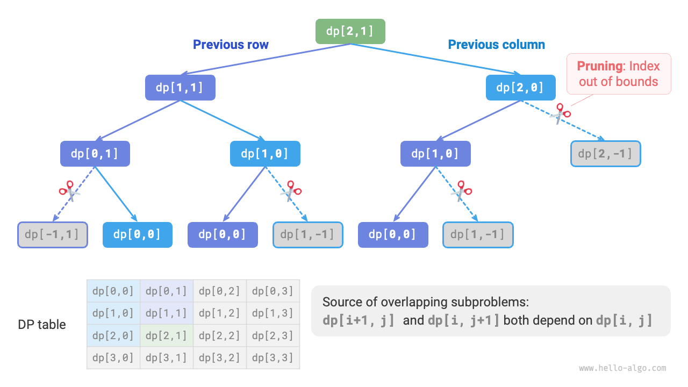

# Dynamic Programming Problem-Solving Approach

The previous two sections introduced the main characteristics of dynamic programming problems. Next, let us explore two more practical issues together.

1. How to determine whether a problem is a dynamic programming problem?
2. What is the complete process for solving a dynamic programming problem, and where should we start?

## Problem Determination

Generally speaking, if a problem contains overlapping subproblems, optimal substructure, and satisfies no aftereffects, then it is usually suitable for solving with dynamic programming. However, it is difficult to directly extract these characteristics from the problem description. Therefore, we usually relax the conditions and **first observe whether the problem is suitable for solving with backtracking (exhaustive search)**.

**Problems suitable for solving with backtracking usually satisfy the "decision tree model"**, which means the problem can be described using a tree structure, where each node represents a decision and each path represents a sequence of decisions.

In other words, if a problem contains an explicit concept of decisions, and the solution is generated through a series of decisions, then it satisfies the decision tree model and can usually be solved using backtracking.

On this basis, dynamic programming problems also have some "bonus points" for determination.

- The problem contains descriptions such as maximum (minimum) or most (least), indicating optimization.
- The problem's state can be represented using a list, multi-dimensional matrix, or tree, and a state has a recurrence relation with its surrounding states.

Correspondingly, there are also some "penalty points".

- The goal of the problem is to find all possible solutions, rather than finding the optimal solution.
- The problem description has obvious permutation and combination characteristics, requiring the return of specific multiple solutions.

If a problem satisfies the decision tree model and has relatively obvious "bonus points", we can assume it is a dynamic programming problem and verify it during the solving process.

## Problem-Solving Steps

The problem-solving process for dynamic programming varies depending on the nature and difficulty of the problem, but generally follows these steps: describe decisions, define states, establish the $dp$ table, derive state transition equations, determine boundary conditions, etc.

To illustrate the problem-solving steps more vividly, we use a classic problem "minimum path sum" as an example.

!!! question

    Given an $n \times m$ two-dimensional grid `grid`, where each cell in the grid contains a non-negative integer representing the cost of that cell. A robot starts from the top-left cell and can only move down or right at each step until reaching the bottom-right cell. Return the minimum path sum from the top-left to the bottom-right.

The figure below shows an example where the minimum path sum for the given grid is $13$.


**Step 1: Think about the decisions in each round, define the state, and thus obtain the $dp$ table**

The decision in each round of this problem is to move one step down or right from the current cell. Let the row and column indices of the current cell be $[i, j]$. After moving down or right, the indices become $[i+1, j]$ or $[i, j+1]$. Therefore, the state should include two variables, the row index and column index, denoted as $[i, j]$.

State $[i, j]$ corresponds to the subproblem: **the minimum path sum from the starting point $[0, 0]$ to $[i, j]$**, denoted as $dp[i, j]$.

From this, we obtain the two-dimensional $dp$ matrix shown in the figure below, whose size is the same as the input grid $grid$.


!!! note

    The dynamic programming and backtracking processes can be described as a sequence of decisions, and the state consists of all decision variables. It should contain all variables describing the progress of problem-solving, and should contain sufficient information to derive the next state.

    Each state corresponds to a subproblem, and we define a $dp$ table to store the solutions to all subproblems. Each independent variable of the state is a dimension of the $dp$ table. Essentially, the $dp$ table is a mapping between states and solutions to subproblems.

**Step 2: Identify the optimal substructure, and then derive the state transition equation**

For state $[i, j]$, it can only be transferred from the cell above $[i-1, j]$ or the cell to the left $[i, j-1]$. Therefore, the optimal substructure is: the minimum path sum to reach $[i, j]$ is determined by the smaller of the minimum path sums of $[i, j-1]$ and $[i-1, j]$.

Based on the above analysis, the state transition equation shown in the figure below can be derived:

$$
dp[i, j] = \min(dp[i-1, j], dp[i, j-1]) + grid[i, j]
$$


!!! note

    Based on the defined $dp$ table, think about the relationship between the original problem and subproblems, and find the method to construct the optimal solution to the original problem from the optimal solutions to the subproblems, which is the optimal substructure.

    Once we identify the optimal substructure, we can use it to construct the state transition equation.

**Step 3: Determine boundary conditions and state transition order**

In this problem, states in the first row can only come from the state to their left, and states in the first column can only come from the state above them. Therefore, the first row $i = 0$ and first column $j = 0$ are boundary conditions.

As shown in the figure below, since each cell is transferred from the cell to its left and the cell above it, we use loops to traverse the matrix, with the outer loop traversing rows and the inner loop traversing columns.


!!! note

    Boundary conditions in dynamic programming are used to initialize the $dp$ table, and in search are used for pruning.

    The core of state transition order is to ensure that when computing the solution to the current problem, all the smaller subproblems it depends on have already been computed correctly.

Based on the above analysis, we can directly write the dynamic programming code. However, subproblem decomposition is a top-down approach, so implementing in the order "brute force search $\rightarrow$ memoization $\rightarrow$ dynamic programming" is more aligned with thinking habits.

### Method 1: Brute Force Search

Starting from state $[i, j]$, continuously decompose into smaller states $[i-1, j]$ and $[i, j-1]$. The recursive function includes the following elements.

- **Recursive parameters**: state $[i, j]$.
- **Return value**: minimum path sum from $[0, 0]$ to $[i, j]$, which is $dp[i, j]$.
- **Termination condition**: when $i = 0$ and $j = 0$, return cost $grid[0, 0]$.
- **Pruning**: when $i < 0$ or $j < 0$, the index is out of bounds, return cost $+\infty$, representing infeasibility.

The implementation code is as follows:

```src
[file]{min_path_sum}-[class]{}-[func]{min_path_sum_dfs}
```

The figure below shows the recursion tree rooted at $dp[2, 1]$, which includes some overlapping subproblems whose number will increase sharply as the size of grid `grid` grows.

Essentially, the reason for overlapping subproblems is: **there are multiple paths from the top-left corner to reach a certain cell**.



Each state has two choices, down and right, so the total number of steps from the top-left corner to the bottom-right corner is $m + n - 2$, giving a worst-case time complexity of $O(2^{m + n})$, where $n$ and $m$ are the number of rows and columns of the grid, respectively. Note that this calculation does not account for situations near the grid boundaries, where only one choice remains when reaching the grid boundary, so the actual number of paths will be somewhat less.

### Method 2: Memoization

We introduce a memo list `mem` of the same size as grid `grid` to record the solutions to subproblems and prune overlapping subproblems:

```src
[file]{min_path_sum}-[class]{}-[func]{min_path_sum_dfs_mem}
```

As shown in the figure below, after introducing memoization, all subproblem solutions only need to be computed once, so the time complexity depends on the total number of states, which is the grid size $O(nm)$.


### Method 3: Dynamic Programming

Implement the dynamic programming solution based on iteration, as shown in the code below:

```src
[file]{min_path_sum}-[class]{}-[func]{min_path_sum_dp}
```

The figure below shows the state transition process for minimum path sum, which traverses the entire grid, **thus the time complexity is $O(nm)$**.

The array `dp` has size $n \times m$, **thus the space complexity is $O(nm)$**.

=== "<1>"
    

=== "<2>"
    

=== "<3>"
    

=== "<4>"
    

=== "<5>"
    

=== "<6>"
    

=== "<7>"
    

=== "<8>"
    

=== "<9>"
    

=== "<10>"
    

=== "<11>"
    

=== "<12>"
    

### Space Optimization

Since each cell is only related to the cell to its left and the cell above it, we can use a single-row array to implement the $dp$ table.

Note that since the array `dp` can only represent the state of one row, we cannot initialize the first column state in advance, but rather update it when traversing each row:

```src
[file]{min_path_sum}-[class]{}-[func]{min_path_sum_dp_comp}
```
