# Edit distance problem

Edit distance, also known as Levenshtein distance, refers to the minimum number of modifications required to transform one string into another, commonly used in information retrieval and natural language processing to measure the similarity between two sequences.

!!! question

    Given two strings $s$ and $t$, return the minimum number of edits required to transform $s$ into $t$.

    You can perform three types of edits on a string: insert a character, delete a character, or replace a character with any other character.

As shown in the figure below, transforming `kitten` into `sitting` requires 3 edits, including 2 replacements and 1 insertion; transforming `hello` into `algo` requires 3 steps, including 2 replacements and 1 deletion.

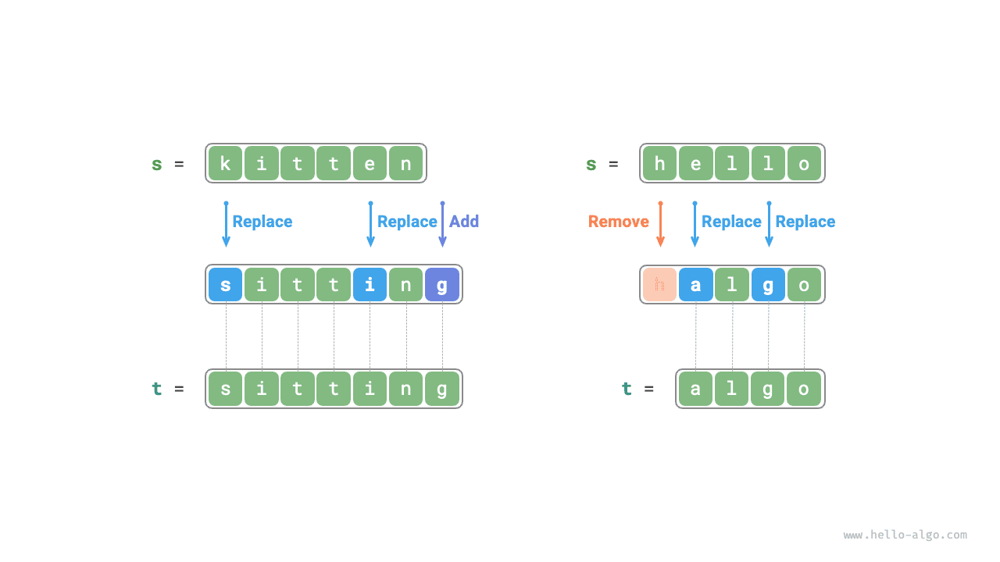

**The edit distance problem can naturally be explained with a decision tree model**. Strings correspond to tree nodes, and a round of decision (an edit operation) corresponds to an edge of the tree.

As shown in the figure below, with unrestricted operations, each node can derive many edges, each corresponding to one operation, meaning there are many possible paths to transform `hello` into `algo`.

From the perspective of the decision tree, the goal of this problem is to find the shortest path between the node `hello` and the node `algo`.

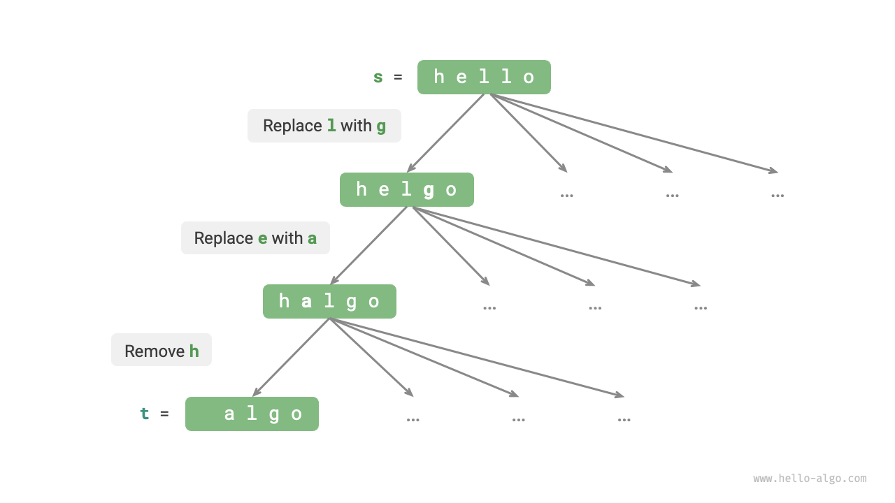

### Dynamic programming approach

**Step one: Think about each round of decision, define the state, thus obtaining the $dp$ table**

Each round of decision involves performing one edit operation on string $s$.

We aim to gradually reduce the problem size during the edit process, which enables us to construct subproblems. Let the lengths of strings $s$ and $t$ be $n$ and $m$, respectively. We first consider the tail characters of both strings $s[n-1]$ and $t[m-1]$.

- If $s[n-1]$ and $t[m-1]$ are the same, we can skip them and directly consider $s[n-2]$ and $t[m-2]$.
- If $s[n-1]$ and $t[m-1]$ are different, we need to perform one edit on $s$ (insert, delete, replace) so that the tail characters of the two strings match, allowing us to skip them and consider a smaller-scale problem.

Thus, each round of decision (edit operation) in string $s$ changes the remaining characters in $s$ and $t$ to be matched. Therefore, the state is the $i$-th and $j$-th characters currently considered in $s$ and $t$, denoted as $[i, j]$.

State $[i, j]$ corresponds to the subproblem: **The minimum number of edits required to change the first $i$ characters of $s$ into the first $j$ characters of $t$**.

From this, we obtain a two-dimensional $dp$ table of size $(i+1) \times (j+1)$.

**Step two: Identify the optimal substructure and then derive the state transition equation**

Consider the subproblem $dp[i, j]$, whose corresponding tail characters of the two strings are $s[i-1]$ and $t[j-1]$, which can be divided into three scenarios as shown in the figure below.

1. Add $t[j-1]$ after $s[i-1]$, then the remaining subproblem is $dp[i, j-1]$.
2. Delete $s[i-1]$, then the remaining subproblem is $dp[i-1, j]$.
3. Replace $s[i-1]$ with $t[j-1]$, then the remaining subproblem is $dp[i-1, j-1]$.

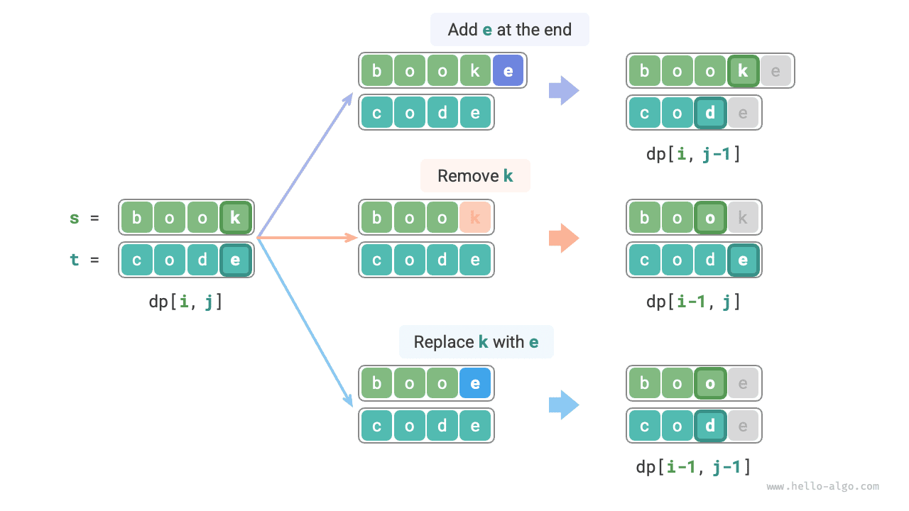

Based on the analysis above, we can determine the optimal substructure: The minimum number of edits for $dp[i, j]$ is the minimum among $dp[i, j-1]$, $dp[i-1, j]$, and $dp[i-1, j-1]$, plus the edit step $1$. The corresponding state transition equation is:

$$
dp[i, j] = \min(dp[i, j-1], dp[i-1, j], dp[i-1, j-1]) + 1
$$

Please note, **when $s[i-1]$ and $t[j-1]$ are the same, no edit is required for the current character**, in which case the state transition equation is:

$$
dp[i, j] = dp[i-1, j-1]
$$

**Step three: Determine the boundary conditions and the order of state transitions**

When both strings are empty, the number of edits is $0$, i.e., $dp[0, 0] = 0$. When $s$ is empty but $t$ is not, the minimum number of edits equals the length of $t$, that is, the first row $dp[0, j] = j$. When $s$ is not empty but $t$ is, the minimum number of edits equals the length of $s$, that is, the first column $dp[i, 0] = i$.

Observing the state transition equation, solving $dp[i, j]$ depends on the solutions to the left, above, and upper left, so a double loop can be used to traverse the entire $dp$ table in the correct order.

### Code implementation

```src
[file]{edit_distance}-[class]{}-[func]{edit_distance_dp}
```

As shown in the figure below, the process of state transition in the edit distance problem is very similar to that in the knapsack problem, which can be seen as filling a two-dimensional grid.

=== "<1>"
    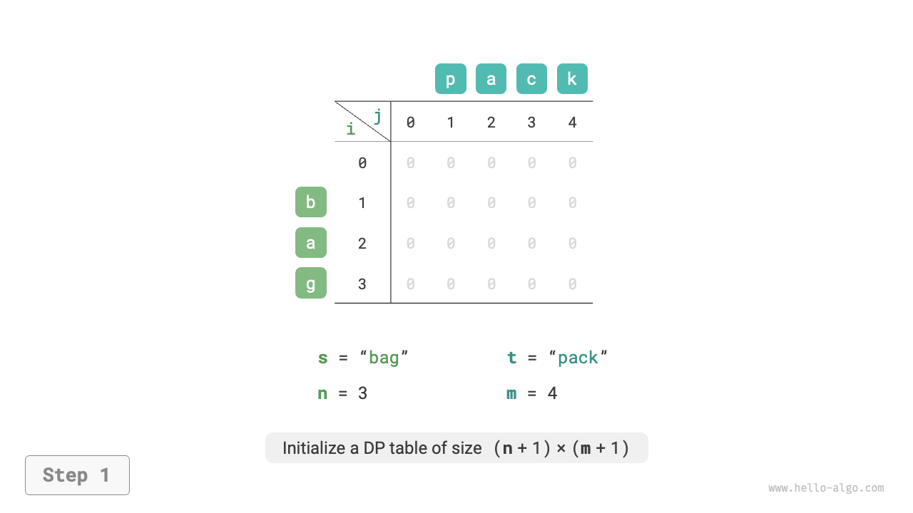

=== "<2>"
    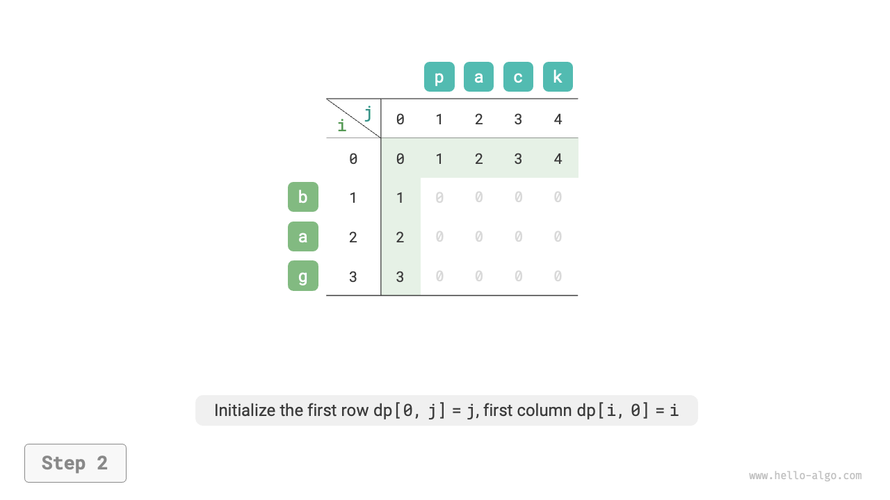

=== "<3>"
    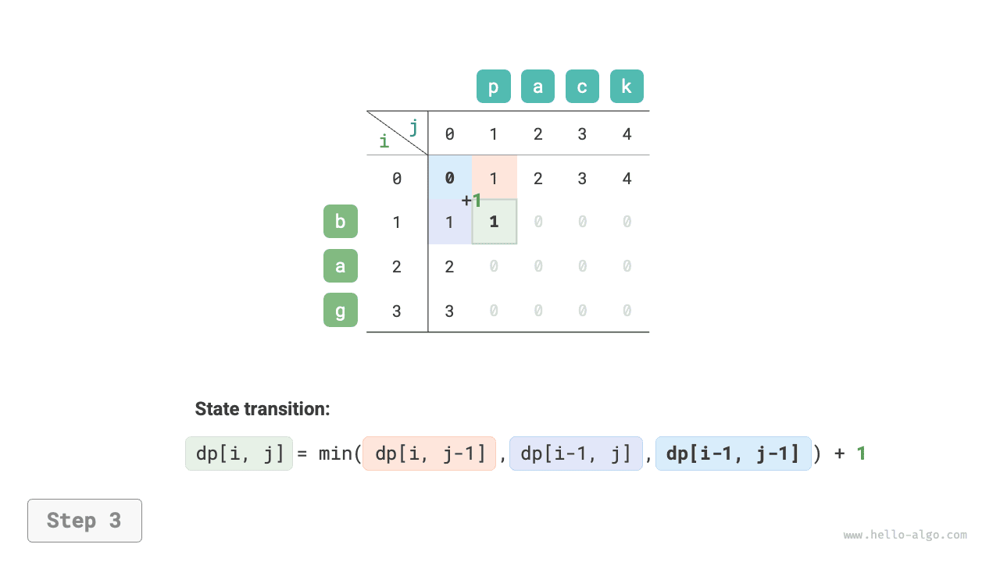

=== "<4>"
    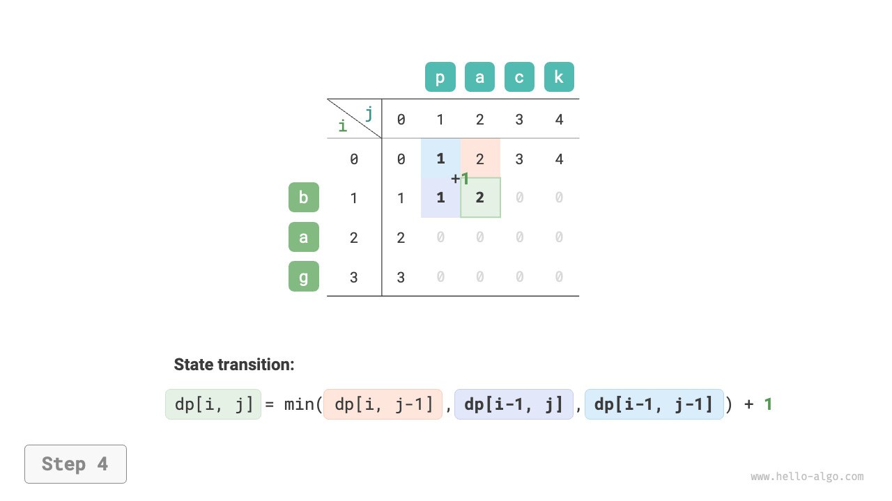

=== "<5>"
    

=== "<6>"
    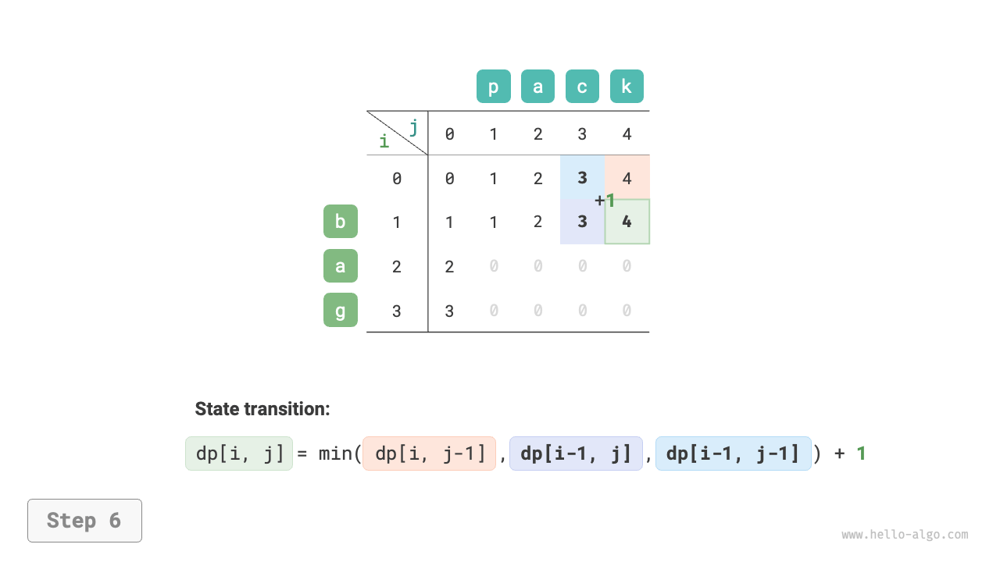

=== "<7>"
    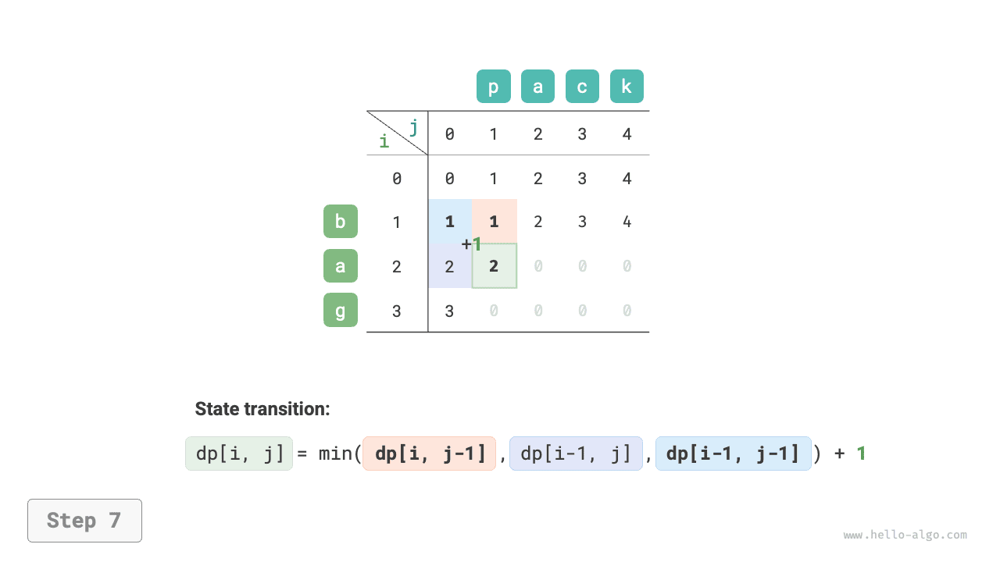

=== "<8>"
    

=== "<9>"
    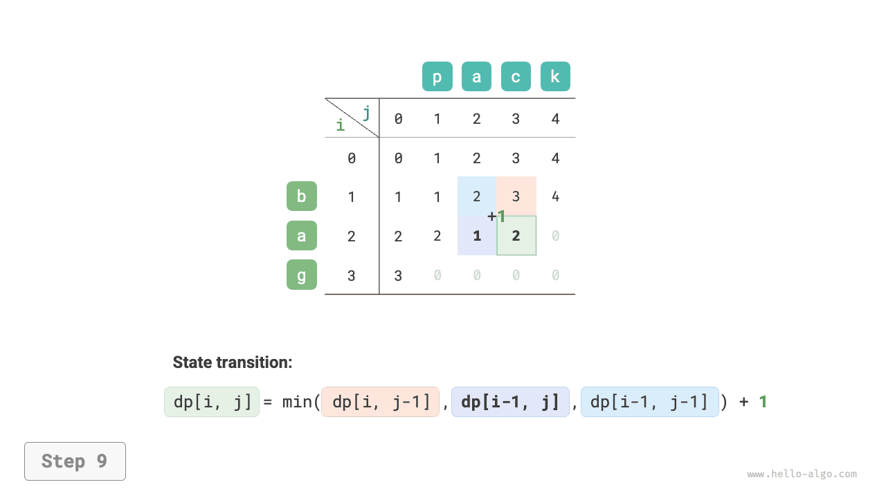

=== "<10>"
    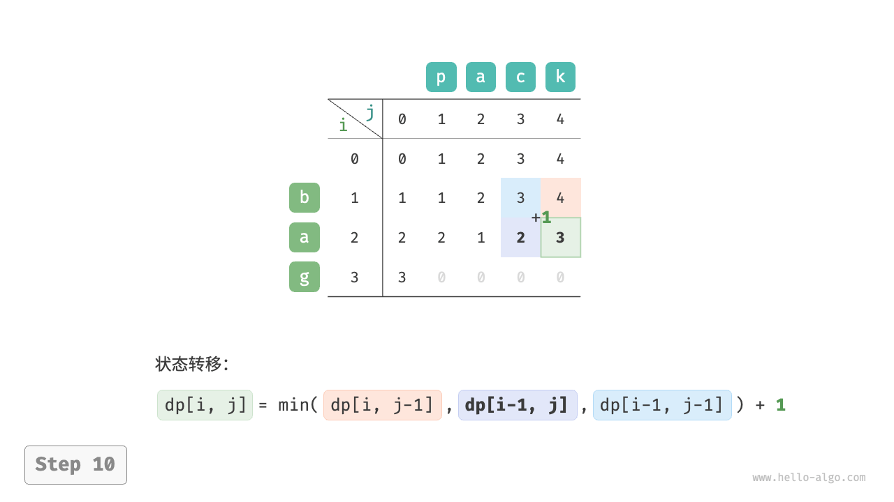

=== "<11>"
    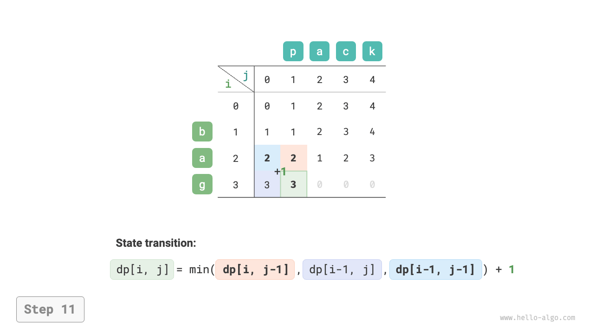

=== "<12>"
    

=== "<13>"
    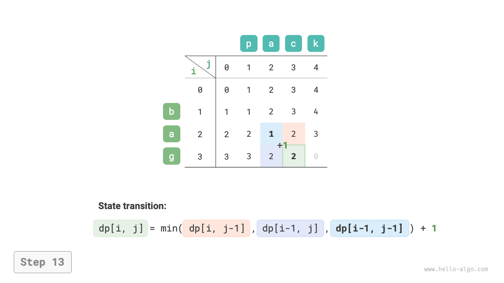

=== "<14>"
    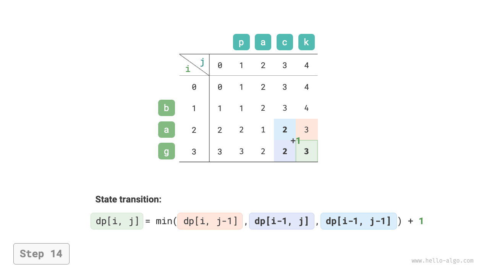

=== "<15>"
    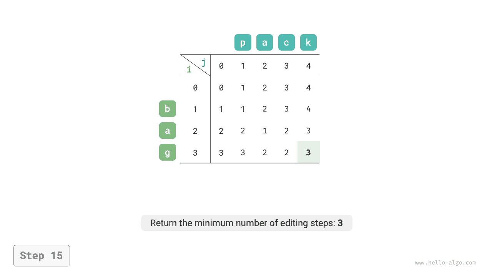

### Space optimization

Since $dp[i, j]$ is derived from the solutions above $dp[i-1, j]$, to the left $dp[i, j-1]$, and to the upper left $dp[i-1, j-1]$, and direct traversal will lose the upper left solution $dp[i-1, j-1]$, and reverse traversal cannot build $dp[i, j-1]$ in advance, therefore, both traversal orders are not feasible.

For this reason, we can use a variable `leftup` to temporarily store the solution from the upper left $dp[i-1, j-1]$, thus only needing to consider the solutions to the left and above. This situation is similar to the unbounded knapsack problem, allowing for direct traversal. The code is as follows:

```src
[file]{edit_distance}-[class]{}-[func]{edit_distance_dp_comp}
```
