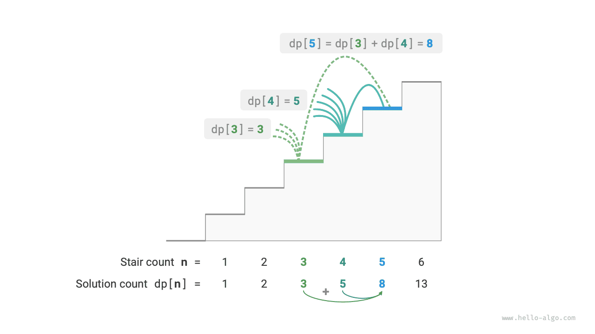
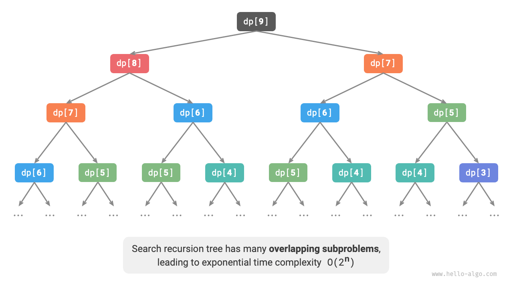
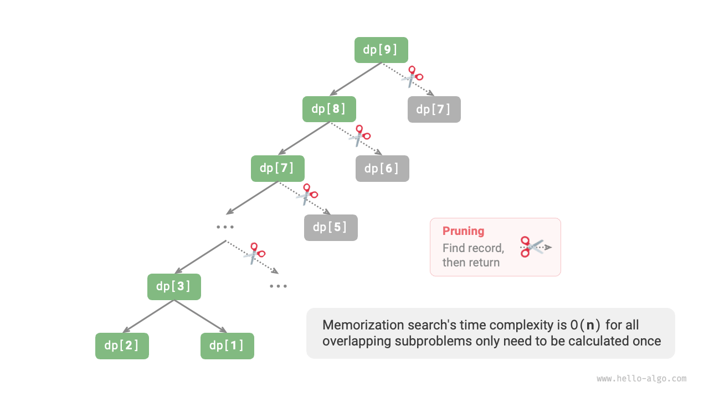
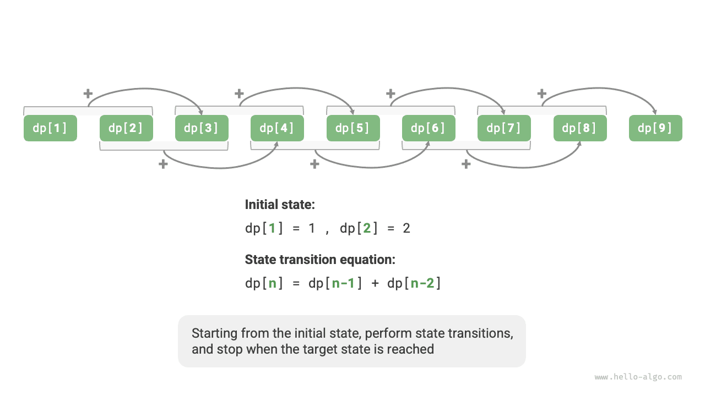

# Introduction to dynamic programming

<u>Dynamic programming</u> is an important algorithmic paradigm that decomposes a problem into a series of smaller subproblems, and stores the solutions of these subproblems to avoid redundant computations, thereby significantly improving time efficiency.

In this section, we start with a classic problem, first presenting its brute force backtracking solution, identifying the overlapping subproblems, and then gradually deriving a more efficient dynamic programming solution.

!!! question "Climbing stairs"

    Given a staircase with $n$ steps, where you can climb $1$ or $2$ steps at a time, how many different ways are there to reach the top?

As shown in the figure below, there are $3$ ways to reach the top of a $3$-step staircase.


This problem aims to calculate the number of ways by **using backtracking to exhaust all possibilities**. Specifically, it considers the problem of climbing stairs as a multi-round choice process: starting from the ground, choosing to move up either $1$ or $2$ steps each round, incrementing the count of ways upon reaching the top of the stairs, and pruning the process when it exceeds the top. The code is as follows:

```src
[file]{climbing_stairs_backtrack}-[class]{}-[func]{climbing_stairs_backtrack}
```

## Method 1: Brute force search

Backtracking algorithms do not explicitly decompose the problem into subproblems. Instead, they treat the problem as a sequence of decision steps, exploring all possibilities through trial and pruning.

We can analyze this problem using a decomposition approach. Let $dp[i]$ represent the number of ways to reach the $i^{th}$ step. In this case, $dp[i]$ is the original problem, and its subproblems are:

$$
dp[i-1], dp[i-2], \dots, dp[2], dp[1]
$$

Since each move can only advance $1$ or $2$ steps, when we stand on the $i^{th}$ step, the previous step must have been either on the $i-1^{th}$ or the $i-2^{th}$ step. In other words, we can only reach the $i^{th}$ from the $i-1^{th}$ or $i-2^{th}$ step.

This leads to an important conclusion: **the number of ways to reach the $i-1^{th}$ step plus the number of ways to reach the $i-2^{th}$ step equals the number of ways to reach the $i^{th}$ step**. The formula is as follows:

$$
dp[i] = dp[i-1] + dp[i-2]
$$

This means that in the stair climbing problem, there is a recursive relationship between the subproblems, **the solution to the original problem can be constructed from the solutions to the subproblems**. The figure below shows this recursive relationship.



We can obtain the brute force search solution according to the recursive formula. Starting with $dp[n]$, **we recursively break a larger problem into the sum of two smaller subproblems**, until reaching the smallest subproblems $dp[1]$ and $dp[2]$ where the solutions are known, with $dp[1] = 1$ and $dp[2] = 2$, representing $1$ and $2$ ways to climb to the first and second steps, respectively.

Observe the following code, which, like standard backtracking code, belongs to depth-first search but is more concise:

```src
[file]{climbing_stairs_dfs}-[class]{}-[func]{climbing_stairs_dfs}
```

The figure below shows the recursive tree formed by brute force search. For the problem $dp[n]$, the depth of its recursive tree is $n$, with a time complexity of $O(2^n)$. This exponential growth causes the program to run much more slowly when $n$ is large, leading to long wait times.



Observing the figure above, **the exponential time complexity is caused by 'overlapping subproblems'**. For example, $dp[9]$ is broken down into $dp[8]$ and $dp[7]$, and $dp[8]$ is further broken into $dp[7]$ and $dp[6]$, both containing the subproblem $dp[7]$.

Thus, subproblems include even smaller overlapping subproblems, endlessly. A vast majority of computational resources are wasted on these overlapping subproblems.

## Method 2: Memoized search

To enhance algorithm efficiency, **we hope that all overlapping subproblems are calculated only once**. For this purpose, we declare an array `mem` to record the solution of each subproblem, and prune overlapping subproblems during the search process.

1. When $dp[i]$ is calculated for the first time, we record it in `mem[i]` for later use.
2. When $dp[i]$ needs to be calculated again, we can directly retrieve the result from `mem[i]`, thus avoiding redundant calculations of that subproblem.

The code is as follows:

```src
[file]{climbing_stairs_dfs_mem}-[class]{}-[func]{climbing_stairs_dfs_mem}
```

Observe the figure below, **after memoization, all overlapping subproblems need to be calculated only once, optimizing the time complexity to $O(n)$**, which is a significant leap.



## Method 3: Dynamic programming

**Memoized search is a 'top-down' method**: we start with the original problem (root node), recursively break larger subproblems into smaller ones until the solutions to the smallest known subproblems (leaf nodes) are reached. Subsequently, by backtracking, we collect the solutions of the subproblems, constructing the solution to the original problem.

On the contrary, **dynamic programming is a 'bottom-up' method**: starting with the solutions to the smallest subproblems, it iteratively constructs the solutions to larger subproblems until the original problem is solved.

Since dynamic programming does not involve backtracking, it only requires iteration using loops and does not need recursion. In the following code, we initialize an array `dp` to store the solutions to subproblems, serving the same recording function as the array `mem` in memoized search:

```src
[file]{climbing_stairs_dp}-[class]{}-[func]{climbing_stairs_dp}
```

The figure below simulates the execution process of the above code.



Like the backtracking algorithm, dynamic programming also uses the concept of "states" to represent specific stages in problem solving, each state corresponding to a subproblem and its local optimal solution. For example, the state of the climbing stairs problem is defined as the current step number $i$.

Based on the above content, we can summarize the commonly used terminology in dynamic programming.

- The array `dp` is referred to as the <u>DP table</u>, with $dp[i]$ representing the solution to the subproblem corresponding to state $i$.
- The states corresponding to the smallest subproblems (steps $1$ and $2$) are called <u>initial states</u>.
- The recursive formula $dp[i] = dp[i-1] + dp[i-2]$ is called the <u>state transition equation</u>.

## Space optimization

Observant readers may have noticed that **since $dp[i]$ is only related to $dp[i-1]$ and $dp[i-2]$, we do not need to use an array `dp` to store the solutions to all subproblems**, but can simply use two variables to progress iteratively. The code is as follows:

```src
[file]{climbing_stairs_dp}-[class]{}-[func]{climbing_stairs_dp_comp}
```

Observing the above code, since the space occupied by the array `dp` is eliminated, the space complexity is reduced from $O(n)$ to $O(1)$.

In many dynamic programming problems, the current state depends only on a limited number of previous states, allowing us to retain only the necessary states and save memory space by "dimension reduction". **This space optimization technique is known as 'rolling variable' or 'rolling array'**.
