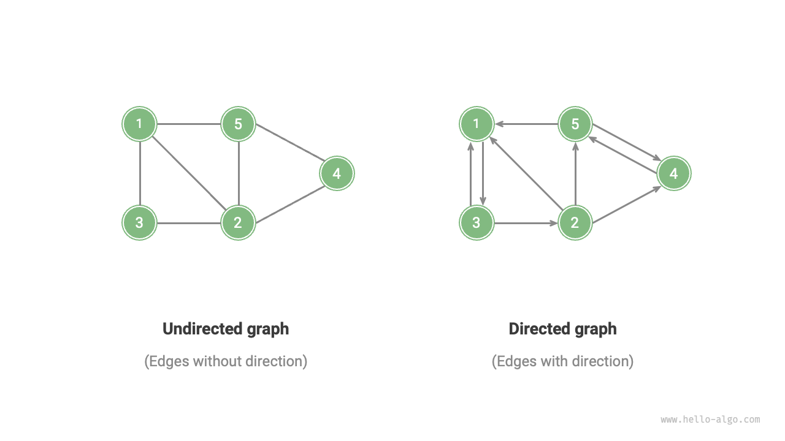
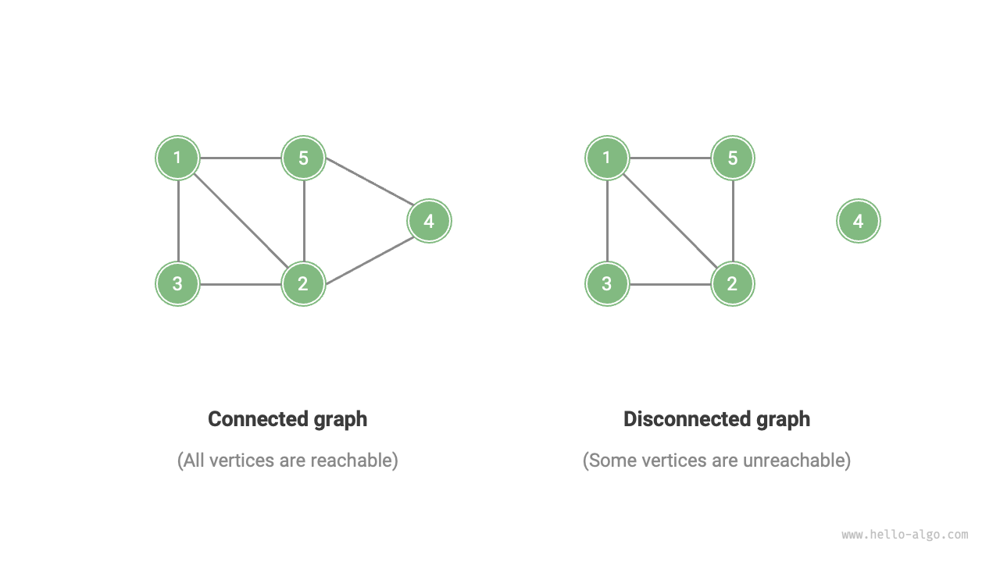
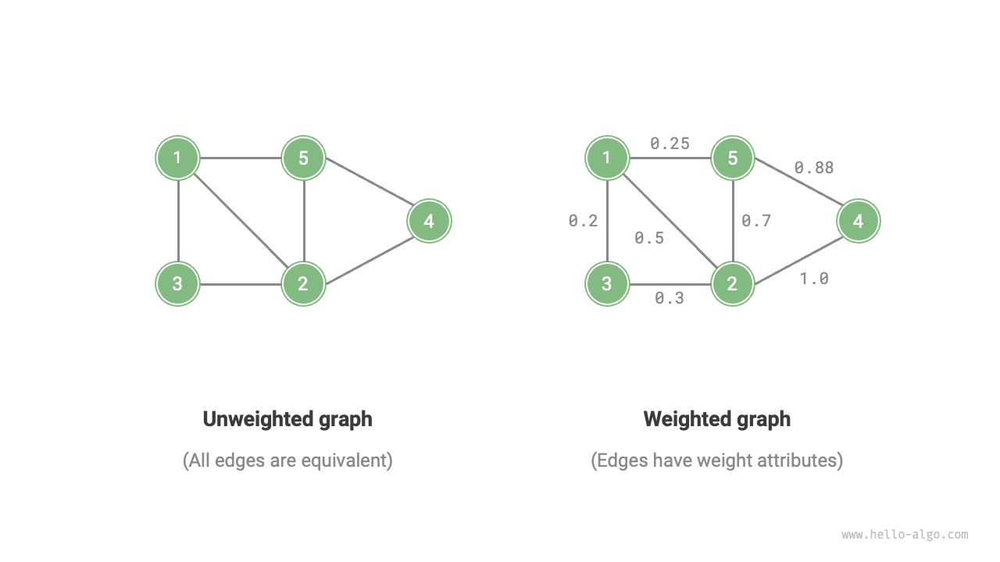
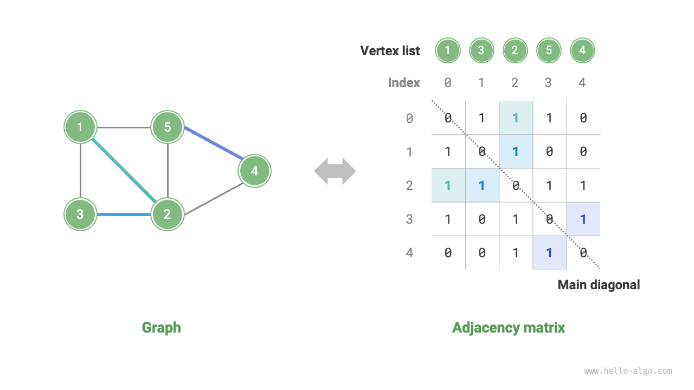
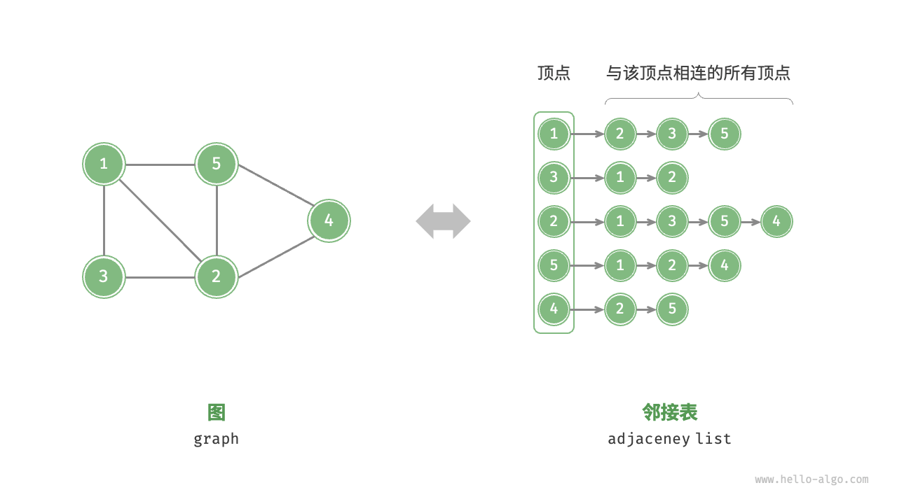

# Graph

A <u>graph</u> is a type of nonlinear data structure, consisting of <u>vertices</u> and <u>edges</u>. A graph $G$ can be abstractly represented as a collection of a set of vertices $V$ and a set of edges $E$. The following example shows a graph containing 5 vertices and 7 edges.

$$
\begin{aligned}
V & = \{ 1, 2, 3, 4, 5 \} \newline
E & = \{ (1,2), (1,3), (1,5), (2,3), (2,4), (2,5), (4,5) \} \newline
G & = \{ V, E \} \newline
\end{aligned}
$$

If vertices are viewed as nodes and edges as references (pointers) connecting the nodes, graphs can be seen as a data structure that extends from linked lists. As shown in the figure below, **compared to linear relationships (linked lists) and divide-and-conquer relationships (trees), network relationships (graphs) are more complex due to their higher degree of freedom**.

## Common types and terminologies of graphs

Graphs can be divided into  <u>undirected graphs</u> and <u>directed graphs</u> depending on whether edges have direction, as shown in the figure below.

- In undirected graphs, edges represent a "bidirectional" connection between two vertices, for example, the "friends" in Facebook.
- In directed graphs, edges have directionality, that is, the edges $A \rightarrow B$ and $A \leftarrow B$ are independent of each other. For example, the "follow" and "followed" relationship on Instagram or TikTok.

Depending on whether all vertices are connected, graphs can be divided into <u>connected graphs</u> and <u>disconnected graphs</u>, as shown in the figure below.

- For connected graphs, it is possible to reach any other vertex starting from an arbitrary vertex.
- For disconnected graphs, there is at least one vertex that cannot be reached from an arbitrary starting vertex.

We can also add a weight variable to edges, resulting in <u>weighted graphs</u> as shown in the figure below. For example, in Instagram, the system sorts your follower and following list by the level of interaction between you and other users (likes, views, comments, etc.). Such an interaction network can be represented by a weighted graph.

Graph data structures include the following commonly used terms.

- <u>Adjacency</u>: When there is an edge connecting two vertices, these two vertices are said to be "adjacent". In the figure above, the adjacent vertices of vertex 1 are vertices 2, 3, and 5.
- <u>Path</u>: The sequence of edges passed from vertex A to vertex B is called a path from A to B. In the figure above, the edge sequence 1-5-2-4 is a path from vertex 1 to vertex 4.
- <u>Degree</u>: The number of edges a vertex has. For directed graphs, <u>in-degree</u> refers to how many edges point to the vertex, and <u>out-degree</u> refers to how many edges point out from the vertex.

## Representation of graphs

Common representations of graphs include "adjacency matrix" and "adjacency list". The following examples use undirected graphs.

### Adjacency matrix

Let the number of vertices in the graph be $n$, the <u>adjacency matrix</u> uses an $n \times n$ matrix to represent the graph, where each row (column) represents a vertex, and the matrix elements represent edges, with $1$ or $0$ indicating whether there is an edge between two vertices.

As shown in the figure below, let the adjacency matrix be $M$, and the list of vertices be $V$, then the matrix element $M[i, j] = 1$ indicates there is an edge between vertex $V[i]$ and vertex $V[j]$, conversely $M[i, j] = 0$ indicates there is no edge between the two vertices.

Adjacency matrices have the following characteristics.

- A vertex cannot be connected to itself, so the elements on the main diagonal of the adjacency matrix are meaningless.
- For undirected graphs, edges in both directions are equivalent, thus the adjacency matrix is symmetric with regard to the main diagonal.
- By replacing the elements of the adjacency matrix from $1$ and $0$ to weights, we can represent weighted graphs.

When representing graphs with adjacency matrices, it is possible to directly access matrix elements to obtain edges, resulting in efficient operations of addition, deletion, lookup, and modification, all with a time complexity of $O(1)$. However, the space complexity of the matrix is $O(n^2)$, which consumes more memory.

### Adjacency list

The <u>adjacency list</u> uses $n$ linked lists to represent the graph, with each linked list node representing a vertex. The $i$-th linked list corresponds to vertex $i$ and contains all adjacent vertices (vertices connected to that vertex). The figure below shows an example of a graph stored using an adjacency list.

The adjacency list only stores actual edges, and the total number of edges is often much less than $n^2$, making it more space-efficient. However, finding edges in the adjacency list requires traversing the linked list, so its time efficiency is not as good as that of the adjacency matrix.

Observing the figure above, **the structure of the adjacency list is very similar to the "chaining" in hash tables, hence we can use similar methods to optimize efficiency**. For example, when the linked list is long, it can be transformed into an AVL tree or red-black tree, thus optimizing the time efficiency from $O(n)$ to $O(\log n)$; the linked list can also be transformed into a hash table, thus reducing the time complexity to $O(1)$.

## Common applications of graphs

As shown in the table below, many real-world systems can be modeled with graphs, and corresponding problems can be reduced to graph computing problems.

 Table <id> &nbsp; Common graphs in real life 

|                 | Vertices         | Edges                                         | Graph Computing Problem          |
| --------------- | ---------------- | --------------------------------------------- | -------------------------------- |
| Social Networks | Users            | Follow / Followed                                   | Potential Following Recommendations |
| Subway Lines    | Stations         | Connectivity Between Stations                 | Shortest Route Recommendations   |
| Solar System    | Celestial Bodies | Gravitational Forces Between Celestial Bodies | Planetary Orbit Calculations     |
