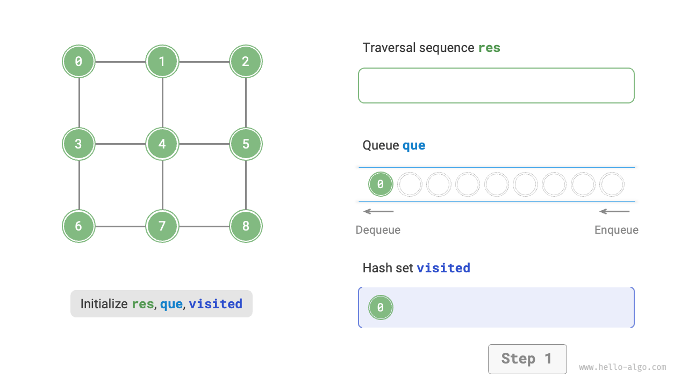
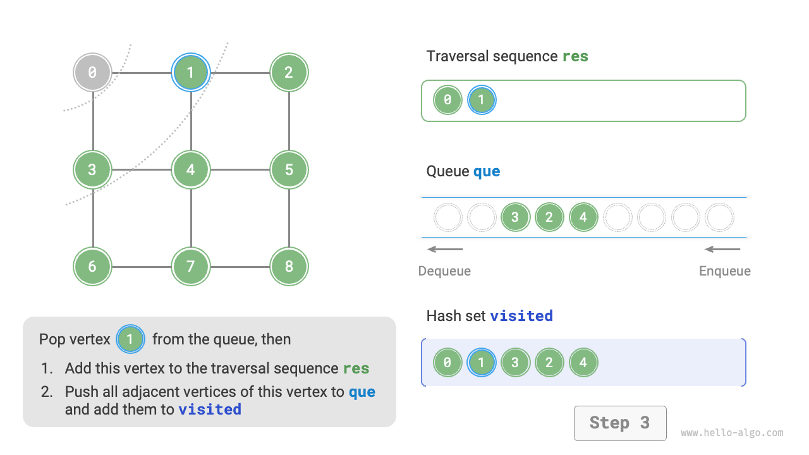
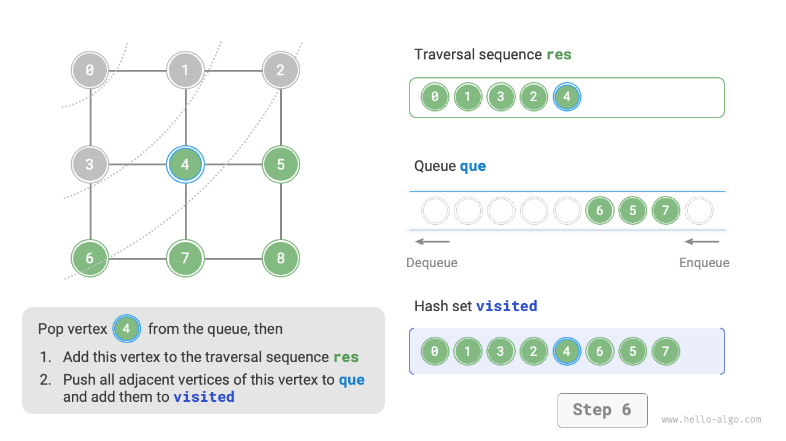
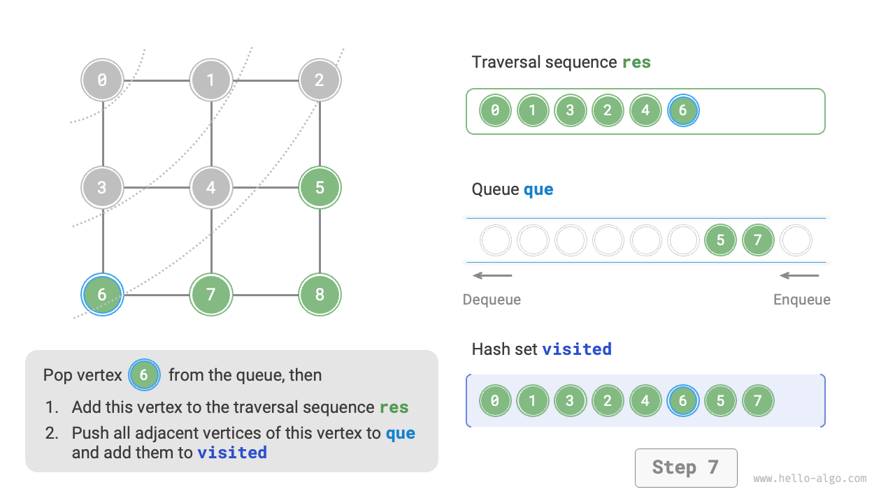
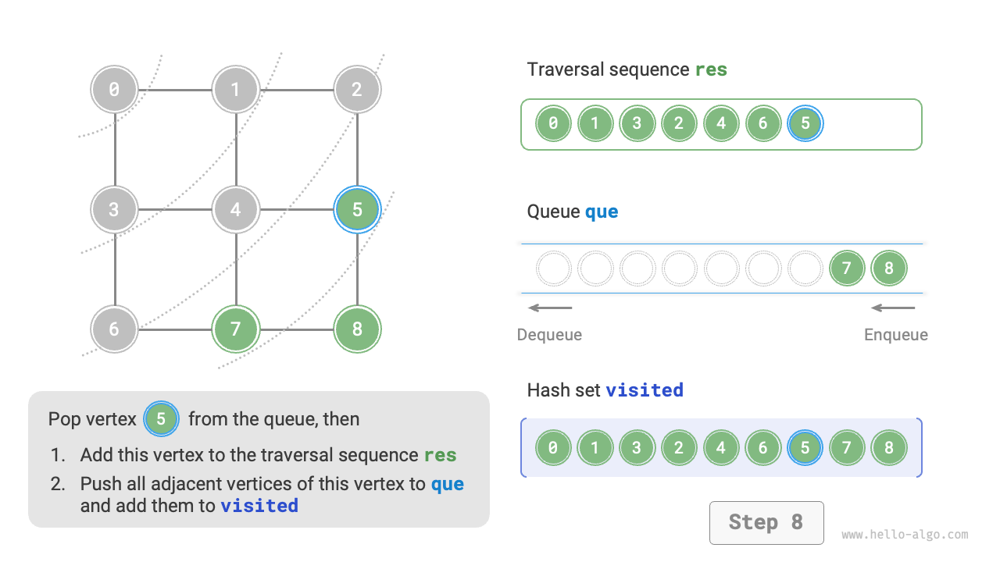
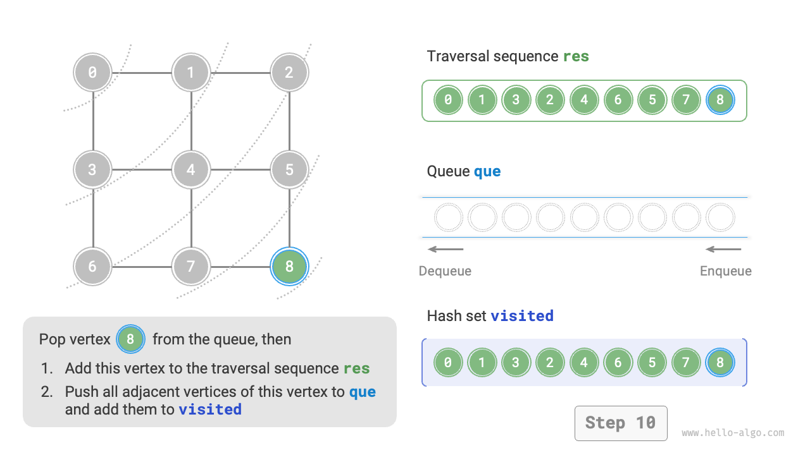
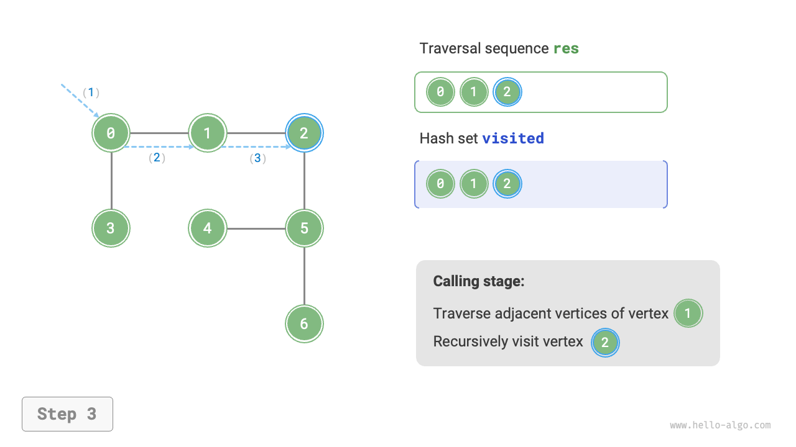
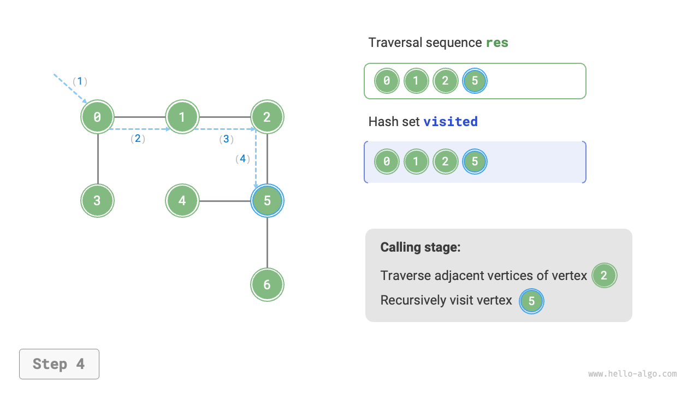
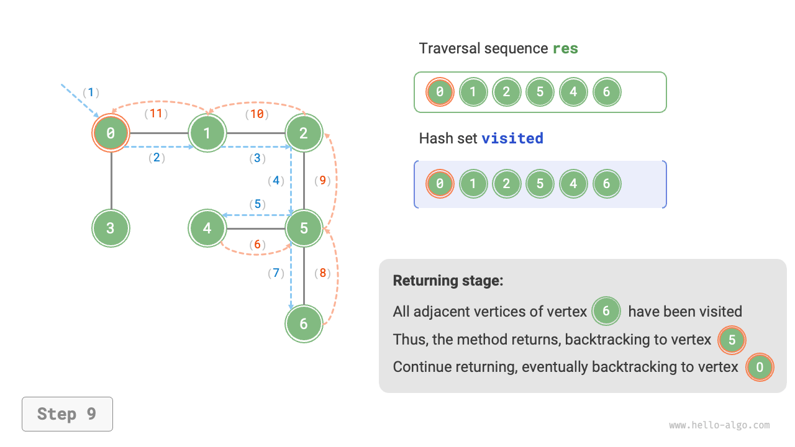

# Graph Traversal

Trees represent "one-to-many" relationships, while graphs have a higher degree of freedom and can represent any "many-to-many" relationships. Therefore, we can view trees as a special case of graphs. Clearly, **tree traversal operations are also a special case of graph traversal operations**.

Both graphs and trees require the application of search algorithms to implement traversal operations. Graph traversal methods can also be divided into two types: <u>breadth-first traversal</u> and <u>depth-first traversal</u>.

## Breadth-First Search

**Breadth-first search is a near-to-far traversal method that, starting from a certain node, always prioritizes visiting the nearest vertices and expands outward layer by layer**. As shown in the figure below, starting from the top-left vertex, first traverse all adjacent vertices of that vertex, then traverse all adjacent vertices of the next vertex, and so on, until all vertices have been visited.


### Algorithm Implementation

BFS is typically implemented with the help of a queue, as shown in the code below. The queue has a "first in, first out" property, which aligns with the BFS idea of "near to far".

1. Add the starting vertex `startVet` to the queue and begin the loop.
2. In each iteration of the loop, pop the vertex at the front of the queue and record it as visited, then add all adjacent vertices of that vertex to the back of the queue.
3. Repeat step `2.` until all vertices have been visited.

To prevent revisiting vertices, we use a hash set `visited` to record which nodes have been visited.

!!! tip

    A hash set can be viewed as a hash table that stores only `key` without storing `value`. It can perform addition, deletion, lookup, and modification operations on `key` in $O(1)$ time complexity. Based on the uniqueness of `key`, hash sets are typically used for data deduplication and similar scenarios.

```src
[file]{graph_bfs}-[class]{}-[func]{graph_bfs}
```

The code is relatively abstract; it is recommended to refer to the figure below to deepen understanding.

=== "<1>"
    

=== "<2>"
    

=== "<3>"
    

=== "<4>"
    

=== "<5>"
    

=== "<6>"
    

=== "<7>"
    

=== "<8>"
    

=== "<9>"
    

=== "<10>"
    

=== "<11>"
    

!!! question "Is the breadth-first traversal sequence unique?"

    Not unique. Breadth-first search only requires traversing in a "near to far" order, **and the traversal order of vertices at the same distance can be arbitrarily shuffled**. Taking the figure above as an example, the visit order of vertices $1$ and $3$ can be swapped, as can the visit order of vertices $2$, $4$, and $6$.

### Complexity Analysis

**Time complexity**: All vertices will be enqueued and dequeued once, using $O(|V|)$ time; in the process of traversing adjacent vertices, since it is an undirected graph, all edges will be visited $2$ times, using $O(2|E|)$ time; overall using $O(|V| + |E|)$ time.

**Space complexity**: The list `res`, hash set `visited`, and queue `que` can contain at most $|V|$ vertices, using $O(|V|)$ space.

## Depth-First Search

**Depth-first search is a traversal method that prioritizes going as far as possible, then backtracks when no path remains**. As shown in the figure below, starting from the top-left vertex, visit an adjacent vertex of the current vertex, continuing until reaching a dead end, then return and continue going as far as possible before returning again, and so on, until all vertices have been traversed.


### Algorithm Implementation

This "go as far as possible then return" algorithm paradigm is typically implemented using recursion. Similar to breadth-first search, in depth-first search we also need a hash set `visited` to record visited vertices and avoid revisiting.

```src
[file]{graph_dfs}-[class]{}-[func]{graph_dfs}
```

The algorithm flow of depth-first search is shown in the figure below.

- **Straight dashed lines represent downward recursion**, indicating that a new recursive method has been initiated to visit a new vertex.
- **Curved dashed lines represent upward backtracking**, indicating that this recursive method has returned to the position where it was initiated.

To deepen understanding, it is recommended to combine the figure below with the code to mentally simulate (or draw out) the entire DFS process, including when each recursive method is initiated and when it returns.

=== "<1>"
    

=== "<2>"
    

=== "<3>"
    

=== "<4>"
    

=== "<5>"
    

=== "<6>"
    

=== "<7>"
    

=== "<8>"
    

=== "<9>"
    

=== "<10>"
    

=== "<11>"
    

!!! question "Is the depth-first traversal sequence unique?"

    Similar to breadth-first search, the order of depth-first traversal sequences is also not unique. Given a certain vertex, exploring in any direction first is valid, meaning the order of adjacent vertices can be arbitrarily shuffled, all being depth-first search.

    Taking tree traversal as an example, "root $\rightarrow$ left $\rightarrow$ right", "left $\rightarrow$ root $\rightarrow$ right", and "left $\rightarrow$ right $\rightarrow$ root" correspond to pre-order, in-order, and post-order traversals, respectively. They represent three different traversal priorities, yet all three belong to depth-first search.

### Complexity Analysis

**Time complexity**: All vertices will be visited $1$ time, using $O(|V|)$ time; all edges will be visited $2$ times, using $O(2|E|)$ time; overall using $O(|V| + |E|)$ time.

**Space complexity**: The list `res` and hash set `visited` can contain at most $|V|$ vertices, and the maximum recursion depth is $|V|$, therefore using $O(|V|)$ space.
