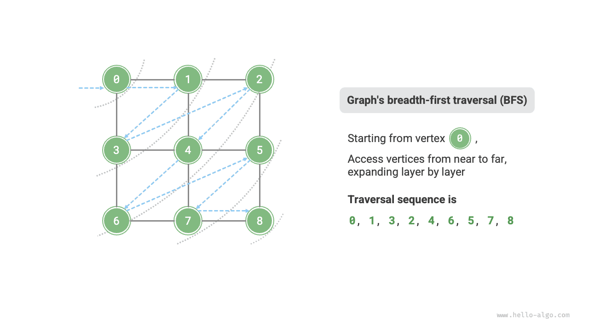
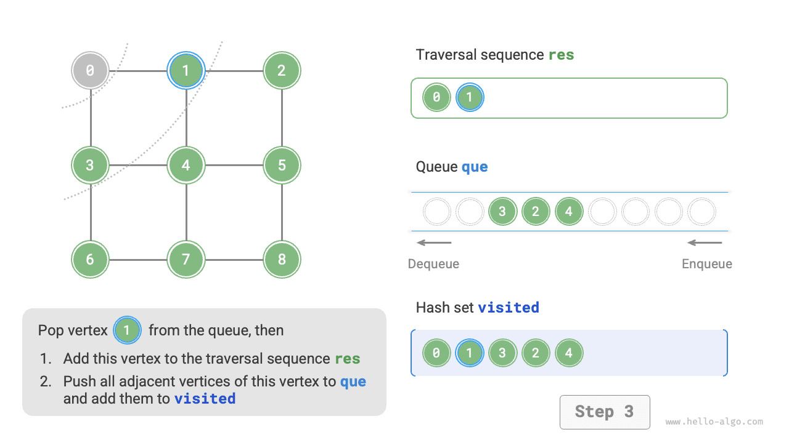
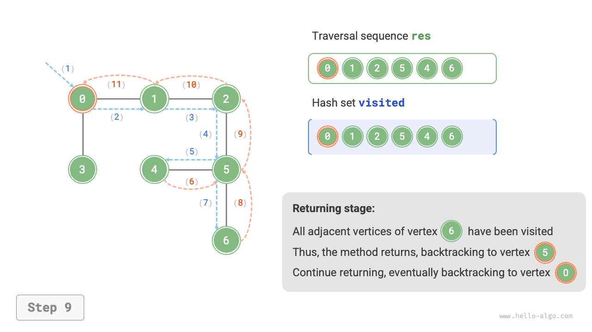
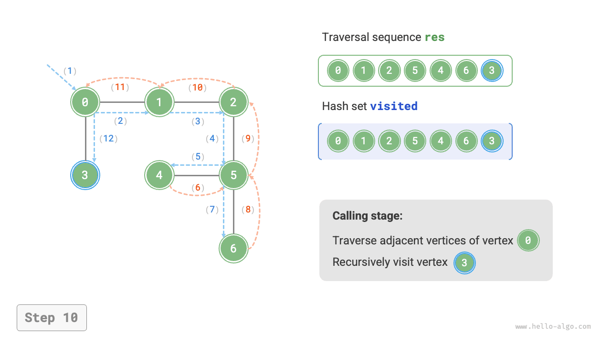
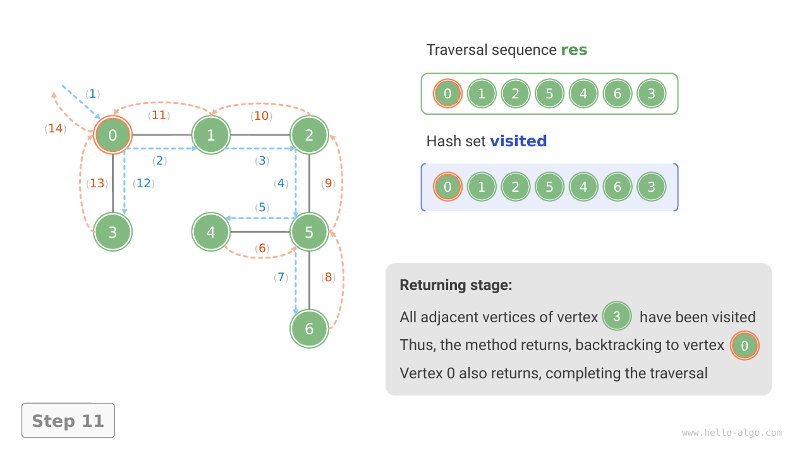

# 9.3 &nbsp; Graph traversal

A tree represents one-to-many relationships, whereas a graph allows more freedom and can represent arbitrary many-to-many relationships. We can therefore view a tree as a special case of a graph. Accordingly, **tree traversal is also a special case of graph traversal**.

Both graphs and trees use search algorithms for traversal. Graph traversal can likewise be divided into two types: <u>breadth-first traversal</u> and <u>depth-first traversal</u>.

## 9.3.1 &nbsp; Breadth-first traversal

**Breadth-first traversal visits vertices from near to far. Starting from a vertex, it always visits the nearest vertices first and expands outward layer by layer**. In Figure 9-9, we start at the top-left vertex and visit all its adjacent vertices, then visit all the adjacent vertices of the next vertex, and so on until every vertex has been visited.

{ class="animation-figure" }

<p align="center"> Figure 9-9 &nbsp; Breadth-first traversal of a graph </p>

### 1. &nbsp; Algorithm implementation

BFS is usually implemented with a queue, as shown in the code below. A queue's first-in, first-out behavior fits the near-to-far order of BFS.

1. Enqueue the starting vertex `startVet` and begin the loop.
2. In each iteration, dequeue the vertex at the front and record the visit, then enqueue all its adjacent vertices at the rear.
3. Repeat step `2.` until every vertex has been visited.

To avoid visiting a vertex more than once, we use a hash set `visited` to track which vertices have already been visited.

!!! tip

    A hash set can be viewed as a hash table that stores only `key` entries, with no `value` entries. Adding, removing, looking up, and modifying a `key` take $O(1)$ time. Because every `key` is unique, hash sets are commonly used to remove duplicate data.

=== "Python"

    ```python title="graph_bfs.py"
    def graph_bfs(graph: GraphAdjList, start_vet: Vertex) -> list[Vertex]:
        """Breadth-first traversal"""
        # Represent the graph with an adjacency list to access all neighbors of a given vertex
        # Vertex traversal sequence
        res = []
        # Hash set recording visited vertices
        visited = set[Vertex]([start_vet])
        # Use a queue to implement BFS
        que = deque[Vertex]([start_vet])
        # Starting from start_vet, loop until all reachable vertices have been visited
        while len(que) > 0:
            vet = que.popleft()  # Dequeue the front vertex
            res.append(vet)  # Record the visited vertex
            # Traverse all neighbors of this vertex
            for adj_vet in graph.adj_list[vet]:
                if adj_vet in visited:
                    continue  # Skip vertices that have already been visited
                que.append(adj_vet)  # Enqueue only unvisited vertices
                visited.add(adj_vet)  # Mark this vertex as visited
        # Return the vertex traversal sequence
        return res
    ```

=== "C++"

    ```cpp title="graph_bfs.cpp"
    /* Breadth-first traversal */
    // Represent the graph with an adjacency list to access all neighbors of a given vertex
    vector<Vertex *> graphBFS(GraphAdjList &graph, Vertex *startVet) {
        // Vertex traversal sequence
        vector<Vertex *> res;
        // Hash set recording visited vertices
        unordered_set<Vertex *> visited = {startVet};
        // Use a queue to implement BFS
        queue<Vertex *> que;
        que.push(startVet);
        // Starting from startVet, continue until all reachable vertices have been visited
        while (!que.empty()) {
            Vertex *vet = que.front();
            que.pop();          // Dequeue the front vertex
            res.push_back(vet); // Record the visited vertex
            // Traverse all neighbors of this vertex
            for (auto adjVet : graph.adjList[vet]) {
                if (visited.count(adjVet))
                    continue;            // Skip vertices that have already been visited
                que.push(adjVet);        // Enqueue only unvisited vertices
                visited.emplace(adjVet); // Mark this vertex as visited
            }
        }
        // Return the vertex traversal sequence
        return res;
    }
    ```

=== "Java"

    ```java title="graph_bfs.java"
    /* Breadth-first traversal */
    // Represent the graph with an adjacency list to access all neighbors of a given vertex
    List<Vertex> graphBFS(GraphAdjList graph, Vertex startVet) {
        // Vertex traversal sequence
        List<Vertex> res = new ArrayList<>();
        // Hash set recording visited vertices
        Set<Vertex> visited = new HashSet<>();
        visited.add(startVet);
        // Use a queue to implement BFS
        Queue<Vertex> que = new LinkedList<>();
        que.offer(startVet);
        // Starting from startVet, loop until all reachable vertices have been visited
        while (!que.isEmpty()) {
            Vertex vet = que.poll(); // Dequeue the front vertex
            res.add(vet);            // Record the visited vertex
            // Traverse all neighbors of this vertex
            for (Vertex adjVet : graph.adjList.get(vet)) {
                if (visited.contains(adjVet))
                    continue;        // Skip vertices that have already been visited
                que.offer(adjVet);   // Enqueue only unvisited vertices
                visited.add(adjVet); // Mark this vertex as visited
            }
        }
        // Return the vertex traversal sequence
        return res;
    }
    ```

=== "C#"

    ```csharp title="graph_bfs.cs"
    /* Breadth-first traversal */
    // Represent the graph with an adjacency list to access all neighbors of a given vertex
    List<Vertex> GraphBFS(GraphAdjList graph, Vertex startVet) {
        // Vertex traversal sequence
        List<Vertex> res = [];
        // Hash set recording visited vertices
        HashSet<Vertex> visited = [startVet];
        // Use a queue to implement BFS
        Queue<Vertex> que = new();
        que.Enqueue(startVet);
        // Starting from startVet, loop until all reachable vertices have been visited
        while (que.Count > 0) {
            Vertex vet = que.Dequeue(); // Dequeue the front vertex
            res.Add(vet);               // Record the visited vertex
            foreach (Vertex adjVet in graph.adjList[vet]) {
                if (visited.Contains(adjVet)) {
                    continue;          // Skip vertices that have already been visited
                }
                que.Enqueue(adjVet);   // Enqueue only unvisited vertices
                visited.Add(adjVet);   // Mark this vertex as visited
            }
        }

        // Return the vertex traversal sequence
        return res;
    }
    ```

=== "Go"

    ```go title="graph_bfs.go"
    /* Breadth-first traversal */
    // Represent the graph with an adjacency list to access all neighbors of a given vertex
    func graphBFS(g *graphAdjList, startVet Vertex) []Vertex {
        // Vertex traversal sequence
        res := make([]Vertex, 0)
        // Hash set recording visited vertices
        visited := make(map[Vertex]struct{})
        visited[startVet] = struct{}{}
        // Use a queue for BFS, represented here by a slice
        queue := make([]Vertex, 0)
        queue = append(queue, startVet)
        // Starting from startVet, loop until all reachable vertices have been visited
        for len(queue) > 0 {
            // Dequeue the front vertex
            vet := queue[0]
            queue = queue[1:]
            // Record the visited vertex
            res = append(res, vet)
            // Traverse all neighbors of this vertex
            for _, adjVet := range g.adjList[vet] {
                _, isExist := visited[adjVet]
                // Enqueue only unvisited vertices
                if !isExist {
                    queue = append(queue, adjVet)
                    visited[adjVet] = struct{}{}
                }
            }
        }
        // Return the vertex traversal sequence
        return res
    }
    ```

=== "Swift"

    ```swift title="graph_bfs.swift"
    /* Breadth-first traversal */
    // Represent the graph with an adjacency list to access all neighbors of a given vertex
    func graphBFS(graph: GraphAdjList, startVet: Vertex) -> [Vertex] {
        // Vertex traversal sequence
        var res: [Vertex] = []
        // Hash set recording visited vertices
        var visited: Set<Vertex> = [startVet]
        // Use a queue to implement BFS
        var que: [Vertex] = [startVet]
        // Starting from startVet, loop until all reachable vertices have been visited
        while !que.isEmpty {
            let vet = que.removeFirst() // Dequeue the front vertex
            res.append(vet) // Record the visited vertex
            // Traverse all neighbors of this vertex
            for adjVet in graph.adjList[vet] ?? [] {
                if visited.contains(adjVet) {
                    continue // Skip vertices that have already been visited
                }
                que.append(adjVet) // Enqueue only unvisited vertices
                visited.insert(adjVet) // Mark this vertex as visited
            }
        }
        // Return the vertex traversal sequence
        return res
    }
    ```

=== "JS"

    ```javascript title="graph_bfs.js"
    /* Breadth-first traversal */
    // Represent the graph with an adjacency list to access all neighbors of a given vertex
    function graphBFS(graph, startVet) {
        // Vertex traversal sequence
        const res = [];
        // Hash set recording visited vertices
        const visited = new Set();
        visited.add(startVet);
        // Use a queue to implement BFS
        const que = [startVet];
        // Starting from startVet, loop until all reachable vertices have been visited
        while (que.length) {
            const vet = que.shift(); // Dequeue the front vertex
            res.push(vet); // Record the visited vertex
            // Traverse all neighbors of this vertex
            for (const adjVet of graph.adjList.get(vet) ?? []) {
                if (visited.has(adjVet)) {
                    continue; // Skip vertices that have already been visited
                }
                que.push(adjVet); // Enqueue only unvisited vertices
                visited.add(adjVet); // Mark this vertex as visited
            }
        }
        // Return the vertex traversal sequence
        return res;
    }
    ```

=== "TS"

    ```typescript title="graph_bfs.ts"
    /* Breadth-first traversal */
    // Represent the graph with an adjacency list to access all neighbors of a given vertex
    function graphBFS(graph: GraphAdjList, startVet: Vertex): Vertex[] {
        // Vertex traversal sequence
        const res: Vertex[] = [];
        // Hash set recording visited vertices
        const visited: Set<Vertex> = new Set();
        visited.add(startVet);
        // Use a queue to implement BFS
        const que = [startVet];
        // Starting from startVet, loop until all reachable vertices have been visited
        while (que.length) {
            const vet = que.shift(); // Dequeue the front vertex
            res.push(vet); // Record the visited vertex
            // Traverse all neighbors of this vertex
            for (const adjVet of graph.adjList.get(vet) ?? []) {
                if (visited.has(adjVet)) {
                    continue; // Skip vertices that have already been visited
                }
                que.push(adjVet); // Enqueue only unvisited vertices
                visited.add(adjVet); // Mark this vertex as visited
            }
        }
        // Return the vertex traversal sequence
        return res;
    }
    ```

=== "Dart"

    ```dart title="graph_bfs.dart"
    /* Breadth-first traversal */
    List<Vertex> graphBFS(GraphAdjList graph, Vertex startVet) {
      // Represent the graph with an adjacency list to access all neighbors of a given vertex
      // Vertex traversal sequence
      List<Vertex> res = [];
      // Hash set recording visited vertices
      Set<Vertex> visited = {};
      visited.add(startVet);
      // Use a queue to implement BFS
      Queue<Vertex> que = Queue();
      que.add(startVet);
      // Starting from startVet, loop until all reachable vertices have been visited
      while (que.isNotEmpty) {
        Vertex vet = que.removeFirst(); // Dequeue the front vertex
        res.add(vet); // Record the visited vertex
        // Traverse all neighbors of this vertex
        for (Vertex adjVet in graph.adjList[vet]!) {
          if (visited.contains(adjVet)) {
            continue; // Skip vertices that have already been visited
          }
          que.add(adjVet); // Enqueue only unvisited vertices
          visited.add(adjVet); // Mark this vertex as visited
        }
      }
      // Return the vertex traversal sequence
      return res;
    }
    ```

=== "Rust"

    ```rust title="graph_bfs.rs"
    /* Breadth-first traversal */
    // Represent the graph with an adjacency list to access all neighbors of a given vertex
    fn graph_bfs(graph: GraphAdjList, start_vet: Vertex) -> Vec<Vertex> {
        // Vertex traversal sequence
        let mut res = vec![];
        // Hash set recording visited vertices
        let mut visited = HashSet::new();
        visited.insert(start_vet);
        // Use a queue to implement BFS
        let mut que = VecDeque::new();
        que.push_back(start_vet);
        // Start at start_vet and loop until all reachable vertices have been visited
        while let Some(vet) = que.pop_front() {
            res.push(vet); // Record the visited vertex

            // Traverse all neighbors of this vertex
            if let Some(adj_vets) = graph.adj_list.get(&vet) {
                for &adj_vet in adj_vets {
                    if visited.contains(&adj_vet) {
                        continue; // Skip vertices that have already been visited
                    }
                    que.push_back(adj_vet); // Enqueue only unvisited vertices
                    visited.insert(adj_vet); // Mark this vertex as visited
                }
            }
        }
        // Return the vertex traversal sequence
        res
    }
    ```

=== "C"

    ```c title="graph_bfs.c"
    /* Vertex queue structure */
    typedef struct {
        Vertex *vertices[MAX_SIZE];
        int front, rear, size;
    } Queue;

    /* Constructor */
    Queue *newQueue() {
        Queue *q = (Queue *)malloc(sizeof(Queue));
        q->front = q->rear = q->size = 0;
        return q;
    }

    /* Check whether the queue is empty */
    int isEmpty(Queue *q) {
        return q->size == 0;
    }

    /* Enqueue operation */
    void enqueue(Queue *q, Vertex *vet) {
        q->vertices[q->rear] = vet;
        q->rear = (q->rear + 1) % MAX_SIZE;
        q->size++;
    }

    /* Dequeue operation */
    Vertex *dequeue(Queue *q) {
        Vertex *vet = q->vertices[q->front];
        q->front = (q->front + 1) % MAX_SIZE;
        q->size--;
        return vet;
    }

    /* Check whether a vertex has been visited */
    int isVisited(Vertex **visited, int size, Vertex *vet) {
        // Search for the vertex with a linear scan in O(n) time
        for (int i = 0; i < size; i++) {
            if (visited[i] == vet)
                return 1;
        }
        return 0;
    }

    /* Breadth-first traversal */
    // Represent the graph with an adjacency list to access all neighbors of a given vertex
    void graphBFS(GraphAdjList *graph, Vertex *startVet, Vertex **res, int *resSize, Vertex **visited, int *visitedSize) {
        // Use a queue to implement BFS
        Queue *queue = newQueue();
        enqueue(queue, startVet);
        visited[(*visitedSize)++] = startVet;
        // Starting from startVet, continue until all reachable vertices have been visited
        while (!isEmpty(queue)) {
            Vertex *vet = dequeue(queue); // Dequeue the front vertex
            res[(*resSize)++] = vet;      // Record the visited vertex
            // Traverse all neighbors of this vertex
            AdjListNode *node = findNode(graph, vet);
            while (node != NULL) {
                // Skip vertices that have already been visited
                if (!isVisited(visited, *visitedSize, node->vertex)) {
                    enqueue(queue, node->vertex);             // Enqueue only unvisited vertices
                    visited[(*visitedSize)++] = node->vertex; // Mark this vertex as visited
                }
                node = node->next;
            }
        }
        // Free memory
        free(queue);
    }
    ```

=== "Kotlin"

    ```kotlin title="graph_bfs.kt"
    /* Breadth-first traversal */
    // Represent the graph with an adjacency list to access all neighbors of a given vertex
    fun graphBFS(graph: GraphAdjList, startVet: Vertex): MutableList<Vertex?> {
        // Vertex traversal sequence
        val res = mutableListOf<Vertex?>()
        // Hash set recording visited vertices
        val visited = HashSet<Vertex>()
        visited.add(startVet)
        // Use a queue to implement BFS
        val que = LinkedList<Vertex>()
        que.offer(startVet)
        // Starting from startVet, loop until all reachable vertices have been visited
        while (!que.isEmpty()) {
            val vet = que.poll() // Dequeue the front vertex
            res.add(vet)         // Record the visited vertex
            // Traverse all neighbors of this vertex
            for (adjVet in graph.adjList[vet]!!) {
                if (visited.contains(adjVet))
                    continue        // Skip vertices that have already been visited
                que.offer(adjVet)   // Enqueue only unvisited vertices
                visited.add(adjVet) // Mark this vertex as visited
            }
        }
        // Return the vertex traversal sequence
        return res
    }
    ```

=== "Ruby"

    ```ruby title="graph_bfs.rb"
    ### Breadth-first traversal ###
    def graph_bfs(graph, start_vet)
      # Represent the graph with an adjacency list to access all neighbors of a given vertex
      # Vertex traversal sequence
      res = []
      # Hash set recording visited vertices
      visited = Set.new([start_vet])
      # Use a queue to implement BFS
      que = [start_vet]
      # Start from start_vet and loop until all reachable vertices have been visited
      while que.length > 0
        vet = que.shift # Dequeue the front vertex
        res << vet # Record the visited vertex
        # Traverse all neighbors of this vertex
        for adj_vet in graph.adj_list[vet]
          next if visited.include?(adj_vet) # Skip vertices that have already been visited
          que << adj_vet # Enqueue only unvisited vertices
          visited.add(adj_vet) # Mark this vertex as visited
        end
      end
      # Return the vertex traversal sequence
      res
    end
    ```

??? pythontutor "Visualize execution"

    <div style="height: 549px; width: 100%;"><iframe class="pythontutor-iframe" title="Visualize execution" src="https://pythontutor.com/iframe-embed.html#code=from%20collections%20import%20deque%0A%0Aclass%20Vertex%3A%0A%20%20%20%20%22%22%22Vertex%20class%22%22%22%0A%20%20%20%20def%20__init__%28self,%20val%3A%20int%29%3A%0A%20%20%20%20%20%20%20%20self.val%20%3D%20val%0A%0Adef%20vals_to_vets%28vals%3A%20list%5Bint%5D%29%20-%3E%20list%5B%22Vertex%22%5D%3A%0A%20%20%20%20%22%22%22Given%20the%20list%20of%20values%20vals,%20return%20the%20list%20of%20vertices%20vets%22%22%22%0A%20%20%20%20return%20%5BVertex%28val%29%20for%20val%20in%20vals%5D%0A%0Aclass%20GraphAdjList%3A%0A%20%20%20%20%22%22%22Undirected%20graph%20class%20implemented%20with%20an%20adjacency%20list%22%22%22%0A%0A%20%20%20%20def%20__init__%28self,%20edges%3A%20list%5Blist%5BVertex%5D%5D%29%3A%0A%20%20%20%20%20%20%20%20%22%22%22Constructor%22%22%22%0A%20%20%20%20%20%20%20%20self.adj_list%20%3D%20dict%5BVertex,%20list%5BVertex%5D%5D%28%29%0A%20%20%20%20%20%20%20%20for%20edge%20in%20edges%3A%0A%20%20%20%20%20%20%20%20%20%20%20%20self.add_vertex%28edge%5B0%5D%29%0A%20%20%20%20%20%20%20%20%20%20%20%20self.add_vertex%28edge%5B1%5D%29%0A%20%20%20%20%20%20%20%20%20%20%20%20self.add_edge%28edge%5B0%5D,%20edge%5B1%5D%29%0A%0A%20%20%20%20def%20add_edge%28self,%20vet1%3A%20Vertex,%20vet2%3A%20Vertex%29%3A%0A%20%20%20%20%20%20%20%20%22%22%22Add%20an%20edge%22%22%22%0A%20%20%20%20%20%20%20%20if%20vet1%20not%20in%20self.adj_list%20or%20vet2%20not%20in%20self.adj_list%20or%20vet1%20%3D%3D%20vet2%3A%0A%20%20%20%20%20%20%20%20%20%20%20%20raise%20ValueError%28%29%0A%20%20%20%20%20%20%20%20self.adj_list%5Bvet1%5D.append%28vet2%29%0A%20%20%20%20%20%20%20%20self.adj_list%5Bvet2%5D.append%28vet1%29%0A%0A%20%20%20%20def%20add_vertex%28self,%20vet%3A%20Vertex%29%3A%0A%20%20%20%20%20%20%20%20%22%22%22Add%20a%20vertex%22%22%22%0A%20%20%20%20%20%20%20%20if%20vet%20in%20self.adj_list%3A%0A%20%20%20%20%20%20%20%20%20%20%20%20return%0A%20%20%20%20%20%20%20%20self.adj_list%5Bvet%5D%20%3D%20%5B%5D%0A%0A%0Adef%20graph_bfs%28graph%3A%20GraphAdjList,%20start_vet%3A%20Vertex%29%20-%3E%20list%5BVertex%5D%3A%0A%20%20%20%20%22%22%22Breadth-first%20traversal%22%22%22%0A%20%20%20%20%23%20Vertex%20traversal%20sequence%0A%20%20%20%20res%20%3D%20%5B%5D%0A%20%20%20%20%23%20Hash%20set%20for%20recording%20visited%20vertices%0A%20%20%20%20visited%20%3D%20set%5BVertex%5D%28%5Bstart_vet%5D%29%0A%20%20%20%20%23%20Use%20a%20queue%20to%20implement%20BFS%0A%20%20%20%20que%20%3D%20deque%5BVertex%5D%28%5Bstart_vet%5D%29%0A%20%20%20%20%23%20Starting%20from%20start_vet,%20loop%20until%20all%20reachable%20vertices%20have%20been%20visited%0A%20%20%20%20while%20len%28que%29%20%3E%200%3A%0A%20%20%20%20%20%20%20%20vet%20%3D%20que.popleft%28%29%20%20%23%20Dequeue%20the%20front%20vertex%0A%20%20%20%20%20%20%20%20res.append%28vet%29%20%20%23%20Record%20the%20visited%20vertex%0A%20%20%20%20%20%20%20%20%23%20Traverse%20all%20neighbors%20of%20this%20vertex%0A%20%20%20%20%20%20%20%20for%20adj_vet%20in%20graph.adj_list%5Bvet%5D%3A%0A%20%20%20%20%20%20%20%20%20%20%20%20if%20adj_vet%20in%20visited%3A%0A%20%20%20%20%20%20%20%20%20%20%20%20%20%20%20%20continue%20%20%23%20Skip%20vertices%20that%20have%20already%20been%20visited%0A%20%20%20%20%20%20%20%20%20%20%20%20que.append%28adj_vet%29%20%20%23%20Enqueue%20only%20unvisited%20vertices%0A%20%20%20%20%20%20%20%20%20%20%20%20visited.add%28adj_vet%29%20%20%23%20Mark%20this%20vertex%20as%20visited%0A%20%20%20%20%23%20Return%20the%20vertex%20traversal%20sequence%0A%20%20%20%20return%20res%0A%0A%22%22%22Driver%20code%22%22%22%0Aif%20__name__%20%3D%3D%20%22__main__%22%3A%0A%20%20%20%20%23%20Initialize%20the%20undirected%20graph%0A%20%20%20%20v%20%3D%20vals_to_vets%28%5B0,%201,%202,%203,%204%5D%29%0A%20%20%20%20edges%20%3D%20%5B%0A%20%20%20%20%20%20%20%20%5Bv%5B0%5D,%20v%5B1%5D%5D,%0A%20%20%20%20%20%20%20%20%5Bv%5B0%5D,%20v%5B3%5D%5D,%0A%20%20%20%20%20%20%20%20%5Bv%5B1%5D,%20v%5B2%5D%5D,%0A%20%20%20%20%20%20%20%20%5Bv%5B1%5D,%20v%5B4%5D%5D,%0A%20%20%20%20%20%20%20%20%5Bv%5B3%5D,%20v%5B4%5D%5D,%0A%20%20%20%20%5D%0A%20%20%20%20graph%20%3D%20GraphAdjList%28edges%29%0A%20%20%20%20del%20edges%0A%0A%20%20%20%20%23%20Breadth-first%20traversal%0A%20%20%20%20res%20%3D%20graph_bfs%28graph,%20v%5B0%5D%29&codeDivHeight=472&codeDivWidth=350&cumulative=false&curInstr=131&heapPrimitives=nevernest&origin=opt-frontend.js&py=311&rawInputLstJSON=%5B%5D&textReferences=false"> </iframe></div>
    <div style="margin-top: 5px;"><a href="https://pythontutor.com/iframe-embed.html#code=from%20collections%20import%20deque%0A%0Aclass%20Vertex%3A%0A%20%20%20%20%22%22%22Vertex%20class%22%22%22%0A%20%20%20%20def%20__init__%28self,%20val%3A%20int%29%3A%0A%20%20%20%20%20%20%20%20self.val%20%3D%20val%0A%0Adef%20vals_to_vets%28vals%3A%20list%5Bint%5D%29%20-%3E%20list%5B%22Vertex%22%5D%3A%0A%20%20%20%20%22%22%22Given%20the%20list%20of%20values%20vals,%20return%20the%20list%20of%20vertices%20vets%22%22%22%0A%20%20%20%20return%20%5BVertex%28val%29%20for%20val%20in%20vals%5D%0A%0Aclass%20GraphAdjList%3A%0A%20%20%20%20%22%22%22Undirected%20graph%20class%20implemented%20with%20an%20adjacency%20list%22%22%22%0A%0A%20%20%20%20def%20__init__%28self,%20edges%3A%20list%5Blist%5BVertex%5D%5D%29%3A%0A%20%20%20%20%20%20%20%20%22%22%22Constructor%22%22%22%0A%20%20%20%20%20%20%20%20self.adj_list%20%3D%20dict%5BVertex,%20list%5BVertex%5D%5D%28%29%0A%20%20%20%20%20%20%20%20for%20edge%20in%20edges%3A%0A%20%20%20%20%20%20%20%20%20%20%20%20self.add_vertex%28edge%5B0%5D%29%0A%20%20%20%20%20%20%20%20%20%20%20%20self.add_vertex%28edge%5B1%5D%29%0A%20%20%20%20%20%20%20%20%20%20%20%20self.add_edge%28edge%5B0%5D,%20edge%5B1%5D%29%0A%0A%20%20%20%20def%20add_edge%28self,%20vet1%3A%20Vertex,%20vet2%3A%20Vertex%29%3A%0A%20%20%20%20%20%20%20%20%22%22%22Add%20an%20edge%22%22%22%0A%20%20%20%20%20%20%20%20if%20vet1%20not%20in%20self.adj_list%20or%20vet2%20not%20in%20self.adj_list%20or%20vet1%20%3D%3D%20vet2%3A%0A%20%20%20%20%20%20%20%20%20%20%20%20raise%20ValueError%28%29%0A%20%20%20%20%20%20%20%20self.adj_list%5Bvet1%5D.append%28vet2%29%0A%20%20%20%20%20%20%20%20self.adj_list%5Bvet2%5D.append%28vet1%29%0A%0A%20%20%20%20def%20add_vertex%28self,%20vet%3A%20Vertex%29%3A%0A%20%20%20%20%20%20%20%20%22%22%22Add%20a%20vertex%22%22%22%0A%20%20%20%20%20%20%20%20if%20vet%20in%20self.adj_list%3A%0A%20%20%20%20%20%20%20%20%20%20%20%20return%0A%20%20%20%20%20%20%20%20self.adj_list%5Bvet%5D%20%3D%20%5B%5D%0A%0A%0Adef%20graph_bfs%28graph%3A%20GraphAdjList,%20start_vet%3A%20Vertex%29%20-%3E%20list%5BVertex%5D%3A%0A%20%20%20%20%22%22%22Breadth-first%20traversal%22%22%22%0A%20%20%20%20%23%20Vertex%20traversal%20sequence%0A%20%20%20%20res%20%3D%20%5B%5D%0A%20%20%20%20%23%20Hash%20set%20for%20recording%20visited%20vertices%0A%20%20%20%20visited%20%3D%20set%5BVertex%5D%28%5Bstart_vet%5D%29%0A%20%20%20%20%23%20Use%20a%20queue%20to%20implement%20BFS%0A%20%20%20%20que%20%3D%20deque%5BVertex%5D%28%5Bstart_vet%5D%29%0A%20%20%20%20%23%20Starting%20from%20start_vet,%20loop%20until%20all%20reachable%20vertices%20have%20been%20visited%0A%20%20%20%20while%20len%28que%29%20%3E%200%3A%0A%20%20%20%20%20%20%20%20vet%20%3D%20que.popleft%28%29%20%20%23%20Dequeue%20the%20front%20vertex%0A%20%20%20%20%20%20%20%20res.append%28vet%29%20%20%23%20Record%20the%20visited%20vertex%0A%20%20%20%20%20%20%20%20%23%20Traverse%20all%20neighbors%20of%20this%20vertex%0A%20%20%20%20%20%20%20%20for%20adj_vet%20in%20graph.adj_list%5Bvet%5D%3A%0A%20%20%20%20%20%20%20%20%20%20%20%20if%20adj_vet%20in%20visited%3A%0A%20%20%20%20%20%20%20%20%20%20%20%20%20%20%20%20continue%20%20%23%20Skip%20vertices%20that%20have%20already%20been%20visited%0A%20%20%20%20%20%20%20%20%20%20%20%20que.append%28adj_vet%29%20%20%23%20Enqueue%20only%20unvisited%20vertices%0A%20%20%20%20%20%20%20%20%20%20%20%20visited.add%28adj_vet%29%20%20%23%20Mark%20this%20vertex%20as%20visited%0A%20%20%20%20%23%20Return%20the%20vertex%20traversal%20sequence%0A%20%20%20%20return%20res%0A%0A%22%22%22Driver%20code%22%22%22%0Aif%20__name__%20%3D%3D%20%22__main__%22%3A%0A%20%20%20%20%23%20Initialize%20the%20undirected%20graph%0A%20%20%20%20v%20%3D%20vals_to_vets%28%5B0,%201,%202,%203,%204%5D%29%0A%20%20%20%20edges%20%3D%20%5B%0A%20%20%20%20%20%20%20%20%5Bv%5B0%5D,%20v%5B1%5D%5D,%0A%20%20%20%20%20%20%20%20%5Bv%5B0%5D,%20v%5B3%5D%5D,%0A%20%20%20%20%20%20%20%20%5Bv%5B1%5D,%20v%5B2%5D%5D,%0A%20%20%20%20%20%20%20%20%5Bv%5B1%5D,%20v%5B4%5D%5D,%0A%20%20%20%20%20%20%20%20%5Bv%5B3%5D,%20v%5B4%5D%5D,%0A%20%20%20%20%5D%0A%20%20%20%20graph%20%3D%20GraphAdjList%28edges%29%0A%20%20%20%20del%20edges%0A%0A%20%20%20%20%23%20Breadth-first%20traversal%0A%20%20%20%20res%20%3D%20graph_bfs%28graph,%20v%5B0%5D%29&codeDivHeight=800&codeDivWidth=600&cumulative=false&curInstr=131&heapPrimitives=nevernest&origin=opt-frontend.js&py=311&rawInputLstJSON=%5B%5D&textReferences=false" target="_blank" rel="noopener noreferrer">View full screen ></a></div>

The code is fairly abstract; compare it with Figure 9-10 to build your understanding.

=== "<1>"
    { class="animation-figure" }

=== "<2>"
    { class="animation-figure" }

=== "<3>"
    { class="animation-figure" }

=== "<4>"
    { class="animation-figure" }

=== "<5>"
    { class="animation-figure" }

=== "<6>"
    { class="animation-figure" }

=== "<7>"
    { class="animation-figure" }

=== "<8>"
    { class="animation-figure" }

=== "<9>"
    { class="animation-figure" }

=== "<10>"
    { class="animation-figure" }

=== "<11>"
    { class="animation-figure" }

<p align="center"> Figure 9-10 &nbsp; Steps in breadth-first traversal of a graph </p>

!!! question "Is the breadth-first traversal order unique?"

    No. Breadth-first traversal only requires vertices to be visited from near to far; **vertices at the same distance may be visited in any order**. In Figure 9-10, vertices $1$ and $3$ can be visited in either order, and vertices $2$, $4$, and $6$ can also be visited in any order.

### 2. &nbsp; Complexity analysis

**Time complexity**: Every vertex is enqueued and dequeued once, taking $O(|V|)$ time. While traversing adjacent vertices, every edge is visited $2$ times because the graph is undirected, taking $O(2|E|)$ time. The total time is $O(|V| + |E|)$.

**Space complexity**: The list `res`, hash set `visited`, and queue `que` each contain at most $|V|$ vertices, requiring $O(|V|)$ space.

## 9.3.2 &nbsp; Depth-first traversal

**Depth-first traversal follows a path as far as possible and returns when it can go no farther**. In Figure 9-11, we start at the top-left vertex and move to an adjacent vertex of the current vertex, continuing until we reach a dead end. We then return and explore another path as far as possible, repeating this process until every vertex has been visited.

{ class="animation-figure" }

<p align="center"> Figure 9-11 &nbsp; Depth-first traversal of a graph </p>

### 1. &nbsp; Algorithm implementation

This pattern of going as far as possible and then returning is usually implemented with recursion. As with breadth-first traversal, we use a hash set `visited` to track visited vertices and avoid visiting them again.

=== "Python"

    ```python title="graph_dfs.py"
    def dfs(graph: GraphAdjList, visited: set[Vertex], res: list[Vertex], vet: Vertex):
        """Depth-first traversal helper function"""
        res.append(vet)  # Record the visited vertex
        visited.add(vet)  # Mark this vertex as visited
        # Traverse all neighbors of this vertex
        for adjVet in graph.adj_list[vet]:
            if adjVet in visited:
                continue  # Skip vertices that have already been visited
            # Recursively visit the neighboring vertex
            dfs(graph, visited, res, adjVet)

    def graph_dfs(graph: GraphAdjList, start_vet: Vertex) -> list[Vertex]:
        """Depth-first traversal"""
        # Represent the graph with an adjacency list to access all neighbors of a given vertex
        # Vertex traversal sequence
        res = []
        # Hash set recording visited vertices
        visited = set[Vertex]()
        dfs(graph, visited, res, start_vet)
        return res
    ```

=== "C++"

    ```cpp title="graph_dfs.cpp"
    /* Depth-first traversal helper function */
    void dfs(GraphAdjList &graph, unordered_set<Vertex *> &visited, vector<Vertex *> &res, Vertex *vet) {
        res.push_back(vet);   // Record the visited vertex
        visited.emplace(vet); // Mark this vertex as visited
        // Traverse all neighbors of this vertex
        for (Vertex *adjVet : graph.adjList[vet]) {
            if (visited.count(adjVet))
                continue; // Skip vertices that have already been visited
            // Recursively visit the neighboring vertex
            dfs(graph, visited, res, adjVet);
        }
    }

    /* Depth-first traversal */
    // Represent the graph with an adjacency list to access all neighbors of a given vertex
    vector<Vertex *> graphDFS(GraphAdjList &graph, Vertex *startVet) {
        // Vertex traversal sequence
        vector<Vertex *> res;
        // Hash set recording visited vertices
        unordered_set<Vertex *> visited;
        dfs(graph, visited, res, startVet);
        return res;
    }
    ```

=== "Java"

    ```java title="graph_dfs.java"
    /* Depth-first traversal helper function */
    void dfs(GraphAdjList graph, Set<Vertex> visited, List<Vertex> res, Vertex vet) {
        res.add(vet);     // Record the visited vertex
        visited.add(vet); // Mark this vertex as visited
        // Traverse all neighbors of this vertex
        for (Vertex adjVet : graph.adjList.get(vet)) {
            if (visited.contains(adjVet))
                continue; // Skip vertices that have already been visited
            // Recursively visit the neighboring vertex
            dfs(graph, visited, res, adjVet);
        }
    }

    /* Depth-first traversal */
    // Represent the graph with an adjacency list to access all neighbors of a given vertex
    List<Vertex> graphDFS(GraphAdjList graph, Vertex startVet) {
        // Vertex traversal sequence
        List<Vertex> res = new ArrayList<>();
        // Hash set recording visited vertices
        Set<Vertex> visited = new HashSet<>();
        dfs(graph, visited, res, startVet);
        return res;
    }
    ```

=== "C#"

    ```csharp title="graph_dfs.cs"
    /* Depth-first traversal helper function */
    void DFS(GraphAdjList graph, HashSet<Vertex> visited, List<Vertex> res, Vertex vet) {
        res.Add(vet);     // Record the visited vertex
        visited.Add(vet); // Mark this vertex as visited
        // Traverse all neighbors of this vertex
        foreach (Vertex adjVet in graph.adjList[vet]) {
            if (visited.Contains(adjVet)) {
                continue; // Skip vertices that have already been visited                             
            }
            // Recursively visit the neighboring vertex
            DFS(graph, visited, res, adjVet);
        }
    }

    /* Depth-first traversal */
    // Represent the graph with an adjacency list to access all neighbors of a given vertex
    List<Vertex> GraphDFS(GraphAdjList graph, Vertex startVet) {
        // Vertex traversal sequence
        List<Vertex> res = [];
        // Hash set recording visited vertices
        HashSet<Vertex> visited = [];
        DFS(graph, visited, res, startVet);
        return res;
    }
    ```

=== "Go"

    ```go title="graph_dfs.go"
    /* Depth-first traversal helper function */
    func dfs(g *graphAdjList, visited map[Vertex]struct{}, res *[]Vertex, vet Vertex) {
        // append returns an updated slice, which must be assigned back through the original slice pointer
        *res = append(*res, vet)
        visited[vet] = struct{}{}
        // Traverse all neighbors of this vertex
        for _, adjVet := range g.adjList[vet] {
            _, isExist := visited[adjVet]
            // Recursively visit the neighboring vertex
            if !isExist {
                dfs(g, visited, res, adjVet)
            }
        }
    }

    /* Depth-first traversal */
    // Represent the graph with an adjacency list to access all neighbors of a given vertex
    func graphDFS(g *graphAdjList, startVet Vertex) []Vertex {
        // Vertex traversal sequence
        res := make([]Vertex, 0)
        // Hash set recording visited vertices
        visited := make(map[Vertex]struct{})
        dfs(g, visited, &res, startVet)
        // Return the vertex traversal sequence
        return res
    }
    ```

=== "Swift"

    ```swift title="graph_dfs.swift"
    /* Depth-first traversal helper function */
    func dfs(graph: GraphAdjList, visited: inout Set<Vertex>, res: inout [Vertex], vet: Vertex) {
        res.append(vet) // Record the visited vertex
        visited.insert(vet) // Mark this vertex as visited
        // Traverse all neighbors of this vertex
        for adjVet in graph.adjList[vet] ?? [] {
            if visited.contains(adjVet) {
                continue // Skip vertices that have already been visited
            }
            // Recursively visit the neighboring vertex
            dfs(graph: graph, visited: &visited, res: &res, vet: adjVet)
        }
    }

    /* Depth-first traversal */
    // Represent the graph with an adjacency list to access all neighbors of a given vertex
    func graphDFS(graph: GraphAdjList, startVet: Vertex) -> [Vertex] {
        // Vertex traversal sequence
        var res: [Vertex] = []
        // Hash set recording visited vertices
        var visited: Set<Vertex> = []
        dfs(graph: graph, visited: &visited, res: &res, vet: startVet)
        return res
    }
    ```

=== "JS"

    ```javascript title="graph_dfs.js"
    /* Depth-first traversal */
    // Represent the graph with an adjacency list to access all neighbors of a given vertex
    function dfs(graph, visited, res, vet) {
        res.push(vet); // Record the visited vertex
        visited.add(vet); // Mark this vertex as visited
        // Traverse all neighbors of this vertex
        for (const adjVet of graph.adjList.get(vet)) {
            if (visited.has(adjVet)) {
                continue; // Skip vertices that have already been visited
            }
            // Recursively visit the neighboring vertex
            dfs(graph, visited, res, adjVet);
        }
    }

    /* Depth-first traversal */
    // Represent the graph with an adjacency list to access all neighbors of a given vertex
    function graphDFS(graph, startVet) {
        // Vertex traversal sequence
        const res = [];
        // Hash set recording visited vertices
        const visited = new Set();
        dfs(graph, visited, res, startVet);
        return res;
    }
    ```

=== "TS"

    ```typescript title="graph_dfs.ts"
    /* Depth-first traversal helper function */
    function dfs(
        graph: GraphAdjList,
        visited: Set<Vertex>,
        res: Vertex[],
        vet: Vertex
    ): void {
        res.push(vet); // Record the visited vertex
        visited.add(vet); // Mark this vertex as visited
        // Traverse all neighbors of this vertex
        for (const adjVet of graph.adjList.get(vet)) {
            if (visited.has(adjVet)) {
                continue; // Skip vertices that have already been visited
            }
            // Recursively visit the neighboring vertex
            dfs(graph, visited, res, adjVet);
        }
    }

    /* Depth-first traversal */
    // Represent the graph with an adjacency list to access all neighbors of a given vertex
    function graphDFS(graph: GraphAdjList, startVet: Vertex): Vertex[] {
        // Vertex traversal sequence
        const res: Vertex[] = [];
        // Hash set recording visited vertices
        const visited: Set<Vertex> = new Set();
        dfs(graph, visited, res, startVet);
        return res;
    }
    ```

=== "Dart"

    ```dart title="graph_dfs.dart"
    /* Depth-first traversal helper function */
    void dfs(
      GraphAdjList graph,
      Set<Vertex> visited,
      List<Vertex> res,
      Vertex vet,
    ) {
      res.add(vet); // Record the visited vertex
      visited.add(vet); // Mark this vertex as visited
      // Traverse all neighbors of this vertex
      for (Vertex adjVet in graph.adjList[vet]!) {
        if (visited.contains(adjVet)) {
          continue; // Skip vertices that have already been visited
        }
        // Recursively visit the neighboring vertex
        dfs(graph, visited, res, adjVet);
      }
    }

    /* Depth-first traversal */
    List<Vertex> graphDFS(GraphAdjList graph, Vertex startVet) {
      // Vertex traversal sequence
      List<Vertex> res = [];
      // Hash set recording visited vertices
      Set<Vertex> visited = {};
      dfs(graph, visited, res, startVet);
      return res;
    }
    ```

=== "Rust"

    ```rust title="graph_dfs.rs"
    /* Depth-first traversal helper function */
    fn dfs(graph: &GraphAdjList, visited: &mut HashSet<Vertex>, res: &mut Vec<Vertex>, vet: Vertex) {
        res.push(vet); // Record the visited vertex
        visited.insert(vet); // Mark this vertex as visited
                             // Traverse all neighbors of this vertex
        if let Some(adj_vets) = graph.adj_list.get(&vet) {
            for &adj_vet in adj_vets {
                if visited.contains(&adj_vet) {
                    continue; // Skip vertices that have already been visited
                }
                // Recursively visit the neighboring vertex
                dfs(graph, visited, res, adj_vet);
            }
        }
    }

    /* Depth-first traversal */
    // Represent the graph with an adjacency list to access all neighbors of a given vertex
    fn graph_dfs(graph: GraphAdjList, start_vet: Vertex) -> Vec<Vertex> {
        // Vertex traversal sequence
        let mut res = vec![];
        // Hash set recording visited vertices
        let mut visited = HashSet::new();
        dfs(&graph, &mut visited, &mut res, start_vet);

        res
    }
    ```

=== "C"

    ```c title="graph_dfs.c"
    /* Check whether a vertex has been visited */
    int isVisited(Vertex **res, int size, Vertex *vet) {
        // Search for the vertex with a linear scan in O(n) time
        for (int i = 0; i < size; i++) {
            if (res[i] == vet) {
                return 1;
            }
        }
        return 0;
    }

    /* Depth-first traversal helper function */
    void dfs(GraphAdjList *graph, Vertex **res, int *resSize, Vertex *vet) {
        // Record the visited vertex
        res[(*resSize)++] = vet;
        // Traverse all neighbors of this vertex
        AdjListNode *node = findNode(graph, vet);
        while (node != NULL) {
            // Skip vertices that have already been visited
            if (!isVisited(res, *resSize, node->vertex)) {
                // Recursively visit the neighboring vertex
                dfs(graph, res, resSize, node->vertex);
            }
            node = node->next;
        }
    }

    /* Depth-first traversal */
    // Represent the graph with an adjacency list to access all neighbors of a given vertex
    void graphDFS(GraphAdjList *graph, Vertex *startVet, Vertex **res, int *resSize) {
        dfs(graph, res, resSize, startVet);
    }
    ```

=== "Kotlin"

    ```kotlin title="graph_dfs.kt"
    /* Depth-first traversal helper function */
    fun dfs(
        graph: GraphAdjList,
        visited: MutableSet<Vertex?>,
        res: MutableList<Vertex?>,
        vet: Vertex?
    ) {
        res.add(vet)     // Record the visited vertex
        visited.add(vet) // Mark this vertex as visited
        // Traverse all neighbors of this vertex
        for (adjVet in graph.adjList[vet]!!) {
            if (visited.contains(adjVet))
                continue  // Skip vertices that have already been visited
            // Recursively visit the neighboring vertex
            dfs(graph, visited, res, adjVet)
        }
    }

    /* Depth-first traversal */
    // Represent the graph with an adjacency list to access all neighbors of a given vertex
    fun graphDFS(graph: GraphAdjList, startVet: Vertex?): MutableList<Vertex?> {
        // Vertex traversal sequence
        val res = mutableListOf<Vertex?>()
        // Hash set recording visited vertices
        val visited = HashSet<Vertex?>()
        dfs(graph, visited, res, startVet)
        return res
    }
    ```

=== "Ruby"

    ```ruby title="graph_dfs.rb"
    ### Depth-first traversal helper function ###
    def dfs(graph, visited, res, vet)
      res << vet # Record the visited vertex
      visited.add(vet) # Mark this vertex as visited
      # Traverse all neighbors of this vertex
      for adj_vet in graph.adj_list[vet]
        next if visited.include?(adj_vet) # Skip vertices that have already been visited
        # Recursively visit the neighboring vertex
        dfs(graph, visited, res, adj_vet)
      end
    end

    ### Depth-first traversal ###
    def graph_dfs(graph, start_vet)
      # Represent the graph with an adjacency list to access all neighbors of a given vertex
      # Vertex traversal sequence
      res = []
      # Hash set recording visited vertices
      visited = Set.new
      dfs(graph, visited, res, start_vet)
      res
    end
    ```

??? pythontutor "Visualize execution"

    <div style="height: 549px; width: 100%;"><iframe class="pythontutor-iframe" title="Visualize execution" src="https://pythontutor.com/iframe-embed.html#code=class%20Vertex%3A%0A%20%20%20%20%22%22%22Vertex%20class%22%22%22%0A%20%20%20%20def%20__init__%28self,%20val%3A%20int%29%3A%0A%20%20%20%20%20%20%20%20self.val%20%3D%20val%0A%0Adef%20vals_to_vets%28vals%3A%20list%5Bint%5D%29%20-%3E%20list%5B%22Vertex%22%5D%3A%0A%20%20%20%20%22%22%22Given%20the%20list%20of%20values%20vals,%20return%20the%20list%20of%20vertices%20vets%22%22%22%0A%20%20%20%20return%20%5BVertex%28val%29%20for%20val%20in%20vals%5D%0A%0Aclass%20GraphAdjList%3A%0A%20%20%20%20%22%22%22Undirected%20graph%20class%20implemented%20with%20an%20adjacency%20list%22%22%22%0A%0A%20%20%20%20def%20__init__%28self,%20edges%3A%20list%5Blist%5BVertex%5D%5D%29%3A%0A%20%20%20%20%20%20%20%20%22%22%22Constructor%22%22%22%0A%20%20%20%20%20%20%20%20self.adj_list%20%3D%20dict%5BVertex,%20list%5BVertex%5D%5D%28%29%0A%20%20%20%20%20%20%20%20for%20edge%20in%20edges%3A%0A%20%20%20%20%20%20%20%20%20%20%20%20self.add_vertex%28edge%5B0%5D%29%0A%20%20%20%20%20%20%20%20%20%20%20%20self.add_vertex%28edge%5B1%5D%29%0A%20%20%20%20%20%20%20%20%20%20%20%20self.add_edge%28edge%5B0%5D,%20edge%5B1%5D%29%0A%0A%20%20%20%20def%20add_edge%28self,%20vet1%3A%20Vertex,%20vet2%3A%20Vertex%29%3A%0A%20%20%20%20%20%20%20%20%22%22%22Add%20an%20edge%22%22%22%0A%20%20%20%20%20%20%20%20if%20vet1%20not%20in%20self.adj_list%20or%20vet2%20not%20in%20self.adj_list%20or%20vet1%20%3D%3D%20vet2%3A%0A%20%20%20%20%20%20%20%20%20%20%20%20raise%20ValueError%28%29%0A%20%20%20%20%20%20%20%20self.adj_list%5Bvet1%5D.append%28vet2%29%0A%20%20%20%20%20%20%20%20self.adj_list%5Bvet2%5D.append%28vet1%29%0A%0A%20%20%20%20def%20add_vertex%28self,%20vet%3A%20Vertex%29%3A%0A%20%20%20%20%20%20%20%20%22%22%22Add%20a%20vertex%22%22%22%0A%20%20%20%20%20%20%20%20if%20vet%20in%20self.adj_list%3A%0A%20%20%20%20%20%20%20%20%20%20%20%20return%0A%20%20%20%20%20%20%20%20self.adj_list%5Bvet%5D%20%3D%20%5B%5D%0A%0A%0Adef%20dfs%28graph%3A%20GraphAdjList,%20visited%3A%20set%5BVertex%5D,%20res%3A%20list%5BVertex%5D,%20vet%3A%20Vertex%29%3A%0A%20%20%20%20%22%22%22Depth-first%20traversal%20helper%20function%22%22%22%0A%20%20%20%20res.append%28vet%29%20%20%23%20Record%20the%20visited%20vertex%0A%20%20%20%20visited.add%28vet%29%20%20%23%20Mark%20this%20vertex%20as%20visited%0A%20%20%20%20%23%20Traverse%20all%20neighbors%20of%20this%20vertex%0A%20%20%20%20for%20adjVet%20in%20graph.adj_list%5Bvet%5D%3A%0A%20%20%20%20%20%20%20%20if%20adjVet%20in%20visited%3A%0A%20%20%20%20%20%20%20%20%20%20%20%20continue%20%20%23%20Skip%20vertices%20that%20have%20already%20been%20visited%0A%20%20%20%20%20%20%20%20%23%20Recursively%20visit%20the%20neighboring%20vertex%0A%20%20%20%20%20%20%20%20dfs%28graph,%20visited,%20res,%20adjVet%29%0A%0A%0Adef%20graph_dfs%28graph%3A%20GraphAdjList,%20start_vet%3A%20Vertex%29%20-%3E%20list%5BVertex%5D%3A%0A%20%20%20%20%22%22%22Depth-first%20traversal%22%22%22%0A%20%20%20%20%23%20Represent%20the%20graph%20with%20an%20adjacency%20list%20to%20access%20all%20neighbors%20of%20a%20given%20vertex%0A%20%20%20%20%23%20Vertex%20traversal%20sequence%0A%20%20%20%20res%20%3D%20%5B%5D%0A%20%20%20%20%23%20Hash%20set%20for%20recording%20visited%20vertices%0A%20%20%20%20visited%20%3D%20set%5BVertex%5D%28%29%0A%20%20%20%20dfs%28graph,%20visited,%20res,%20start_vet%29%0A%20%20%20%20return%20res%0A%0A%0A%22%22%22Driver%20code%22%22%22%0Aif%20__name__%20%3D%3D%20%22__main__%22%3A%0A%20%20%20%20%23%20Initialize%20the%20undirected%20graph%0A%20%20%20%20v%20%3D%20vals_to_vets%28%5B0,%201,%202,%203,%204%5D%29%0A%20%20%20%20edges%20%3D%20%5B%0A%20%20%20%20%20%20%20%20%5Bv%5B0%5D,%20v%5B1%5D%5D,%0A%20%20%20%20%20%20%20%20%5Bv%5B0%5D,%20v%5B3%5D%5D,%0A%20%20%20%20%20%20%20%20%5Bv%5B1%5D,%20v%5B2%5D%5D,%0A%20%20%20%20%20%20%20%20%5Bv%5B1%5D,%20v%5B4%5D%5D,%0A%20%20%20%20%20%20%20%20%5Bv%5B3%5D,%20v%5B4%5D%5D,%0A%20%20%20%20%5D%0A%20%20%20%20graph%20%3D%20GraphAdjList%28edges%29%0A%0A%20%20%20%20%23%20Depth-first%20traversal%0A%20%20%20%20res%20%3D%20graph_dfs%28graph,%20v%5B0%5D%29&codeDivHeight=472&codeDivWidth=350&cumulative=false&curInstr=130&heapPrimitives=nevernest&origin=opt-frontend.js&py=311&rawInputLstJSON=%5B%5D&textReferences=false"> </iframe></div>
    <div style="margin-top: 5px;"><a href="https://pythontutor.com/iframe-embed.html#code=class%20Vertex%3A%0A%20%20%20%20%22%22%22Vertex%20class%22%22%22%0A%20%20%20%20def%20__init__%28self,%20val%3A%20int%29%3A%0A%20%20%20%20%20%20%20%20self.val%20%3D%20val%0A%0Adef%20vals_to_vets%28vals%3A%20list%5Bint%5D%29%20-%3E%20list%5B%22Vertex%22%5D%3A%0A%20%20%20%20%22%22%22Given%20the%20list%20of%20values%20vals,%20return%20the%20list%20of%20vertices%20vets%22%22%22%0A%20%20%20%20return%20%5BVertex%28val%29%20for%20val%20in%20vals%5D%0A%0Aclass%20GraphAdjList%3A%0A%20%20%20%20%22%22%22Undirected%20graph%20class%20implemented%20with%20an%20adjacency%20list%22%22%22%0A%0A%20%20%20%20def%20__init__%28self,%20edges%3A%20list%5Blist%5BVertex%5D%5D%29%3A%0A%20%20%20%20%20%20%20%20%22%22%22Constructor%22%22%22%0A%20%20%20%20%20%20%20%20self.adj_list%20%3D%20dict%5BVertex,%20list%5BVertex%5D%5D%28%29%0A%20%20%20%20%20%20%20%20for%20edge%20in%20edges%3A%0A%20%20%20%20%20%20%20%20%20%20%20%20self.add_vertex%28edge%5B0%5D%29%0A%20%20%20%20%20%20%20%20%20%20%20%20self.add_vertex%28edge%5B1%5D%29%0A%20%20%20%20%20%20%20%20%20%20%20%20self.add_edge%28edge%5B0%5D,%20edge%5B1%5D%29%0A%0A%20%20%20%20def%20add_edge%28self,%20vet1%3A%20Vertex,%20vet2%3A%20Vertex%29%3A%0A%20%20%20%20%20%20%20%20%22%22%22Add%20an%20edge%22%22%22%0A%20%20%20%20%20%20%20%20if%20vet1%20not%20in%20self.adj_list%20or%20vet2%20not%20in%20self.adj_list%20or%20vet1%20%3D%3D%20vet2%3A%0A%20%20%20%20%20%20%20%20%20%20%20%20raise%20ValueError%28%29%0A%20%20%20%20%20%20%20%20self.adj_list%5Bvet1%5D.append%28vet2%29%0A%20%20%20%20%20%20%20%20self.adj_list%5Bvet2%5D.append%28vet1%29%0A%0A%20%20%20%20def%20add_vertex%28self,%20vet%3A%20Vertex%29%3A%0A%20%20%20%20%20%20%20%20%22%22%22Add%20a%20vertex%22%22%22%0A%20%20%20%20%20%20%20%20if%20vet%20in%20self.adj_list%3A%0A%20%20%20%20%20%20%20%20%20%20%20%20return%0A%20%20%20%20%20%20%20%20self.adj_list%5Bvet%5D%20%3D%20%5B%5D%0A%0A%0Adef%20dfs%28graph%3A%20GraphAdjList,%20visited%3A%20set%5BVertex%5D,%20res%3A%20list%5BVertex%5D,%20vet%3A%20Vertex%29%3A%0A%20%20%20%20%22%22%22Depth-first%20traversal%20helper%20function%22%22%22%0A%20%20%20%20res.append%28vet%29%20%20%23%20Record%20the%20visited%20vertex%0A%20%20%20%20visited.add%28vet%29%20%20%23%20Mark%20this%20vertex%20as%20visited%0A%20%20%20%20%23%20Traverse%20all%20neighbors%20of%20this%20vertex%0A%20%20%20%20for%20adjVet%20in%20graph.adj_list%5Bvet%5D%3A%0A%20%20%20%20%20%20%20%20if%20adjVet%20in%20visited%3A%0A%20%20%20%20%20%20%20%20%20%20%20%20continue%20%20%23%20Skip%20vertices%20that%20have%20already%20been%20visited%0A%20%20%20%20%20%20%20%20%23%20Recursively%20visit%20the%20neighboring%20vertex%0A%20%20%20%20%20%20%20%20dfs%28graph,%20visited,%20res,%20adjVet%29%0A%0A%0Adef%20graph_dfs%28graph%3A%20GraphAdjList,%20start_vet%3A%20Vertex%29%20-%3E%20list%5BVertex%5D%3A%0A%20%20%20%20%22%22%22Depth-first%20traversal%22%22%22%0A%20%20%20%20%23%20Represent%20the%20graph%20with%20an%20adjacency%20list%20to%20access%20all%20neighbors%20of%20a%20given%20vertex%0A%20%20%20%20%23%20Vertex%20traversal%20sequence%0A%20%20%20%20res%20%3D%20%5B%5D%0A%20%20%20%20%23%20Hash%20set%20for%20recording%20visited%20vertices%0A%20%20%20%20visited%20%3D%20set%5BVertex%5D%28%29%0A%20%20%20%20dfs%28graph,%20visited,%20res,%20start_vet%29%0A%20%20%20%20return%20res%0A%0A%0A%22%22%22Driver%20code%22%22%22%0Aif%20__name__%20%3D%3D%20%22__main__%22%3A%0A%20%20%20%20%23%20Initialize%20the%20undirected%20graph%0A%20%20%20%20v%20%3D%20vals_to_vets%28%5B0,%201,%202,%203,%204%5D%29%0A%20%20%20%20edges%20%3D%20%5B%0A%20%20%20%20%20%20%20%20%5Bv%5B0%5D,%20v%5B1%5D%5D,%0A%20%20%20%20%20%20%20%20%5Bv%5B0%5D,%20v%5B3%5D%5D,%0A%20%20%20%20%20%20%20%20%5Bv%5B1%5D,%20v%5B2%5D%5D,%0A%20%20%20%20%20%20%20%20%5Bv%5B1%5D,%20v%5B4%5D%5D,%0A%20%20%20%20%20%20%20%20%5Bv%5B3%5D,%20v%5B4%5D%5D,%0A%20%20%20%20%5D%0A%20%20%20%20graph%20%3D%20GraphAdjList%28edges%29%0A%0A%20%20%20%20%23%20Depth-first%20traversal%0A%20%20%20%20res%20%3D%20graph_dfs%28graph,%20v%5B0%5D%29&codeDivHeight=800&codeDivWidth=600&cumulative=false&curInstr=130&heapPrimitives=nevernest&origin=opt-frontend.js&py=311&rawInputLstJSON=%5B%5D&textReferences=false" target="_blank" rel="noopener noreferrer">View full screen ></a></div>

Figure 9-12 shows the steps of depth-first traversal.

- **Straight dashed lines show recursive descent**, where a new recursive call begins to visit another vertex.
- **Curved dashed lines show backtracking**, where a recursive call has returned to the point from which it was made.

To deepen your understanding, follow Figure 9-12 alongside the code and mentally simulate (or draw on paper) the entire DFS process, including when each recursive call begins and returns.

=== "<1>"
    { class="animation-figure" }

=== "<2>"
    { class="animation-figure" }

=== "<3>"
    { class="animation-figure" }

=== "<4>"
    { class="animation-figure" }

=== "<5>"
    { class="animation-figure" }

=== "<6>"
    { class="animation-figure" }

=== "<7>"
    { class="animation-figure" }

=== "<8>"
    { class="animation-figure" }

=== "<9>"
    { class="animation-figure" }

=== "<10>"
    { class="animation-figure" }

=== "<11>"
    { class="animation-figure" }

<p align="center"> Figure 9-12 &nbsp; Steps in depth-first traversal of a graph </p>

!!! question "Is the depth-first traversal order unique?"

    Like breadth-first traversal, depth-first traversal does not have a unique order. From any vertex, we can explore in any direction first: rearranging the order of adjacent vertices still produces a depth-first traversal.
    
    For example, in tree traversal, "root $\rightarrow$ left $\rightarrow$ right", "left $\rightarrow$ root $\rightarrow$ right", and "left $\rightarrow$ right $\rightarrow$ root" correspond to preorder, inorder, and postorder traversal. They use three different visiting priorities, yet all are depth-first traversals.

### 2. &nbsp; Complexity analysis

**Time complexity**: Every vertex is visited $1$ time, taking $O(|V|)$ time, and every edge is visited $2$ times, taking $O(2|E|)$ time. The total time is $O(|V| + |E|)$.

**Space complexity**: The list `res` and hash set `visited` each contain at most $|V|$ vertices, and the maximum recursion depth is $|V|$, so the space complexity is $O(|V|)$.
