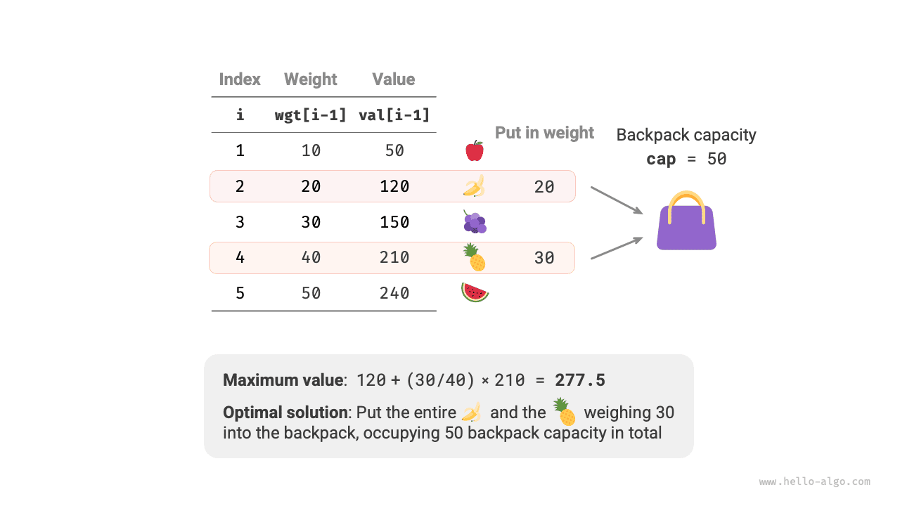
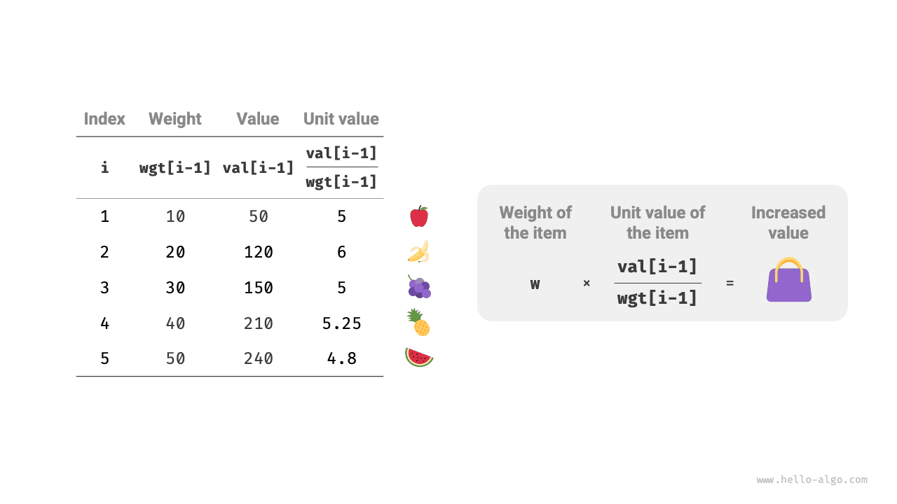
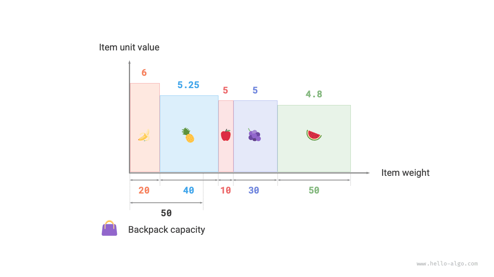

# Fractional Knapsack Problem

!!! question

    Given $n$ items, where the weight of the $i$-th item is $wgt[i-1]$ and its value is $val[i-1]$, and a knapsack with capacity $cap$. Each item can be selected only once, **but a fraction of an item may be selected, with its value proportional to the selected weight**. What is the maximum total value that can be placed in the knapsack under the capacity constraint? An example is shown in the figure below.



The fractional knapsack problem is very similar overall to the 0-1 knapsack problem, with states including the current item $i$ and capacity $c$, and the goal being to maximize value under the limited knapsack capacity.

The difference is that this problem allows selecting only a fraction of an item. As shown in the figure below, **we can split an item arbitrarily and compute its value in proportion to the selected weight**.

1. For item $i$, its value per unit weight is $val[i-1] / wgt[i-1]$, referred to as unit value.
2. Suppose we put a portion of item $i$ with weight $w$ into the knapsack, then the value added to the knapsack is $w \times val[i-1] / wgt[i-1]$.



### Greedy Strategy Determination

Maximizing the total value in the knapsack **essentially means prioritizing items with higher value per unit weight**. From this observation, we can derive the greedy strategy shown in the figure below.

1. Sort items by unit value from high to low.
2. Iterate through all items, **greedily selecting the item with the highest unit value in each round**.
3. If the remaining knapsack capacity is insufficient, use a portion of the current item to fill the knapsack.


### Code Implementation

We define an `Item` class so that items can be sorted by unit value. We then iterate through the sorted items greedily, stopping once the knapsack is full and returning the result:

```src
[file]{fractional_knapsack}-[class]{}-[func]{fractional_knapsack}
```

Built-in sorting algorithms usually take $O(n \log n)$ time, and their space complexity is usually $O(\log n)$ or $O(n)$, depending on the specific implementation of the programming language.

Apart from sorting, in the worst case the entire item list needs to be traversed, **therefore the time complexity is $O(n)$**, where $n$ is the number of items.

Since an `Item` object list is initialized, **the space complexity is $O(n)$**.

### Correctness Proof

We use proof by contradiction. Suppose item $x$ has the highest unit value, and some algorithm produces an optimal value `res`, but the resulting solution does not include item $x$.

Now remove one unit of weight from any item in the knapsack and replace it with one unit of weight from item $x$. Since item $x$ has the highest unit value, the total value after the replacement must be greater than `res`. **This contradicts the assumption that `res` is optimal, proving that any optimal solution must include item $x$**.

We can construct the same contradiction for the other items in the solution as well. In summary, **items with higher unit value are always the better choice**, which proves that the greedy strategy is effective.

As shown in the figure below, if we treat item weight and unit value as the horizontal and vertical axes of a two-dimensional chart, then the fractional knapsack problem can be viewed as "finding the maximum area enclosed within a bounded interval on the horizontal axis." This analogy helps explain the effectiveness of the greedy strategy from a geometric perspective.


