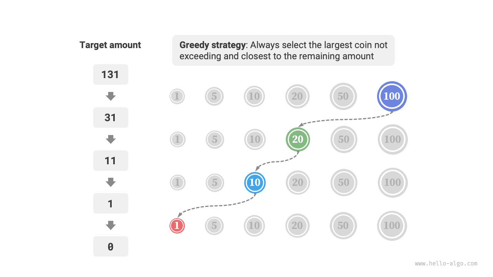
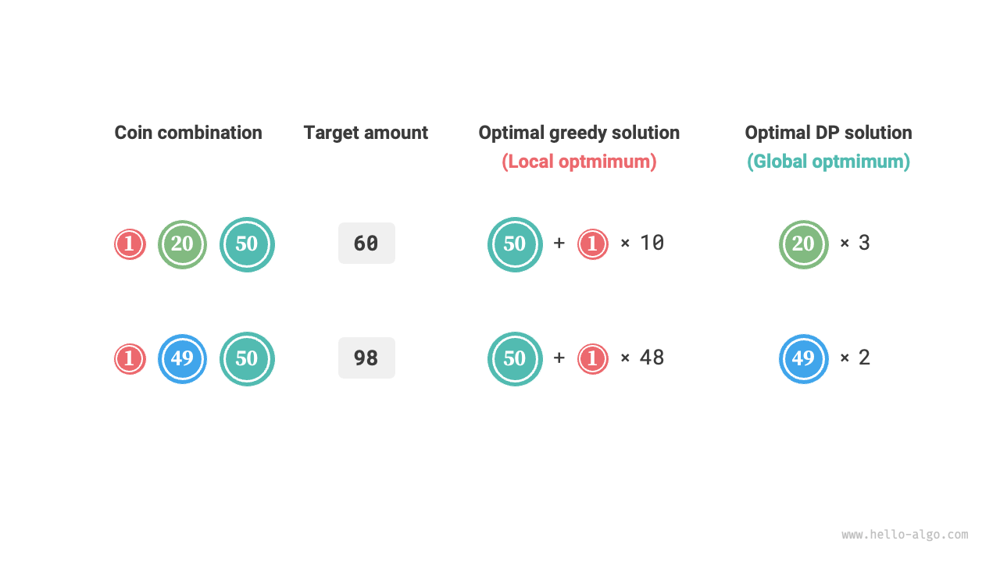

# Greedy algorithms

<u>Greedy algorithm</u> is a common algorithm for solving optimization problems, which fundamentally involves making the seemingly best choice at each decision-making stage of the problem, i.e., greedily making locally optimal decisions in hopes of finding a globally optimal solution. Greedy algorithms are concise and efficient, and are widely used in many practical problems.

Greedy algorithms and dynamic programming are both commonly used to solve optimization problems. They share some similarities, such as relying on the property of optimal substructure, but they operate differently.

- Dynamic programming considers all previous decisions at the current decision stage and uses solutions to past subproblems to construct solutions for the current subproblem.
- Greedy algorithms do not consider past decisions; instead, they proceed with greedy choices, continually narrowing the scope of the problem until it is solved.

Let's first understand the working principle of the greedy algorithm through the example of "coin change," which has been introduced in the "Complete Knapsack Problem" chapter. I believe you are already familiar with it.

!!! question

    Given $n$ types of coins, where the denomination of the $i$th type of coin is $coins[i - 1]$, and the target amount is $amt$, with each type of coin available indefinitely, what is the minimum number of coins needed to make up the target amount? If it is not possible to make up the target amount, return $-1$.

The greedy strategy adopted in this problem is shown in the figure below. Given the target amount, **we greedily choose the coin that is closest to and not greater than it**, repeatedly following this step until the target amount is met.



The implementation code is as follows:

```src
[file]{coin_change_greedy}-[class]{}-[func]{coin_change_greedy}
```

You might exclaim: So clean! The greedy algorithm solves the coin change problem in about ten lines of code.

## Advantages and limitations of greedy algorithms

**Greedy algorithms are not only straightforward and simple to implement, but they are also usually very efficient**. In the code above, if the smallest coin denomination is $\min(coins)$, the greedy choice loops at most $amt / \min(coins)$ times, giving a time complexity of $O(amt / \min(coins))$. This is an order of magnitude smaller than the time complexity of the dynamic programming solution, which is $O(n \times amt)$.

However, **for some combinations of coin denominations, greedy algorithms cannot find the optimal solution**. The figure below provides two examples.

- **Positive example $coins = [1, 5, 10, 20, 50, 100]$**: In this coin combination, given any $amt$, the greedy algorithm can find the optimal solution.
- **Negative example $coins = [1, 20, 50]$**: Suppose $amt = 60$, the greedy algorithm can only find the combination $50 + 1 \times 10$, totaling 11 coins, but dynamic programming can find the optimal solution of $20 + 20 + 20$, needing only 3 coins.
- **Negative example $coins = [1, 49, 50]$**: Suppose $amt = 98$, the greedy algorithm can only find the combination $50 + 1 \times 48$, totaling 49 coins, but dynamic programming can find the optimal solution of $49 + 49$, needing only 2 coins.



This means that for the coin change problem, greedy algorithms cannot guarantee finding the globally optimal solution, and they might find a very poor solution. They are better suited for dynamic programming.

Generally, the suitability of greedy algorithms falls into two categories.

1. **Guaranteed to find the optimal solution**: In these cases, greedy algorithms are often the best choice, as they tend to be more efficient than backtracking or dynamic programming.
2. **Can find a near-optimal solution**: Greedy algorithms are also applicable here. For many complex problems, finding the global optimal solution is very challenging, and being able to find a high-efficiency suboptimal solution is also very commendable.

## Characteristics of greedy algorithms

So, what kind of problems are suitable for solving with greedy algorithms? Or rather, under what conditions can greedy algorithms guarantee to find the optimal solution?

Compared to dynamic programming, greedy algorithms have stricter usage conditions, focusing mainly on two properties of the problem.

- **Greedy choice property**: Only when the locally optimal choice can always lead to a globally optimal solution can greedy algorithms guarantee to obtain the optimal solution.
- **Optimal substructure**: The optimal solution to the original problem contains the optimal solutions to its subproblems.

Optimal substructure has already been introduced in the "Dynamic Programming" chapter, so it is not discussed further here. It's important to note that some problems do not have an obvious optimal substructure, but can still be solved using greedy algorithms.

We mainly explore the method for determining the greedy choice property. Although its description seems simple, **in practice, proving the greedy choice property for many problems is not easy**.

For example, in the coin change problem, although we can easily cite counterexamples to disprove the greedy choice property, proving it is much more challenging. If asked, **what conditions must a coin combination meet to be solvable using a greedy algorithm**? We often have to rely on intuition or examples to provide an ambiguous answer, as it is difficult to provide a rigorous mathematical proof.

!!! quote

    A paper presents an algorithm with a time complexity of $O(n^3)$ for determining whether a coin combination can use a greedy algorithm to find the optimal solution for any amount.

    Pearson, D. A polynomial-time algorithm for the change-making problem[J]. Operations Research Letters, 2005, 33(3): 231-234.

## Steps for solving problems with greedy algorithms

The problem-solving process for greedy problems can generally be divided into the following three steps.

1. **Problem analysis**: Sort out and understand the characteristics of the problem, including state definition, optimization objectives, and constraints, etc. This step is also involved in backtracking and dynamic programming.
2. **Determine the greedy strategy**: Determine how to make a greedy choice at each step. This strategy can reduce the scale of the problem at each step and eventually solve the entire problem.
3. **Proof of correctness**: It is usually necessary to prove that the problem has both a greedy choice property and optimal substructure. This step may require mathematical proofs, such as induction or reductio ad absurdum.

Determining the greedy strategy is the core step in solving the problem, but it may not be easy to implement, mainly for the following reasons.

- **Greedy strategies vary greatly between different problems**. For many problems, the greedy strategy is fairly straightforward, and we can come up with it through some general thinking and attempts. However, for some complex problems, the greedy strategy may be very elusive, which is a real test of individual problem-solving experience and algorithmic capability.
- **Some greedy strategies are quite misleading**. When we confidently design a greedy strategy, write the code, and submit it for testing, it is quite possible that some test cases will not pass. This is because the designed greedy strategy is only "partially correct," as described above with the coin change example.

To ensure accuracy, we should provide rigorous mathematical proofs for the greedy strategy, **usually involving reductio ad absurdum or mathematical induction**.

However, proving correctness may not be an easy task. If we are at a loss, we usually choose to debug the code based on test cases, modifying and verifying the greedy strategy step by step.

## Typical problems solved by greedy algorithms

Greedy algorithms are often applied to optimization problems that satisfy the properties of greedy choice and optimal substructure. Below are some typical greedy algorithm problems.

- **Coin change problem**: In some coin combinations, the greedy algorithm always provides the optimal solution.
- **Interval scheduling problem**: Suppose you have several tasks, each of which takes place over a period of time. Your goal is to complete as many tasks as possible. If you always choose the task that ends the earliest, then the greedy algorithm can achieve the optimal solution.
- **Fractional knapsack problem**: Given a set of items and a carrying capacity, your goal is to select a set of items such that the total weight does not exceed the carrying capacity and the total value is maximized. If you always choose the item with the highest value-to-weight ratio (value / weight), the greedy algorithm can achieve the optimal solution in some cases.
- **Stock trading problem**: Given a set of historical stock prices, you can make multiple trades, but you cannot buy again until after you have sold if you already own stocks. The goal is to achieve the maximum profit.
- **Huffman coding**: Huffman coding is a greedy algorithm used for lossless data compression. By constructing a Huffman tree, it always merges the two nodes with the lowest frequency, resulting in a Huffman tree with the minimum weighted path length (coding length).
- **Dijkstra's algorithm**: It is a greedy algorithm for solving the shortest path problem from a given source vertex to all other vertices.
