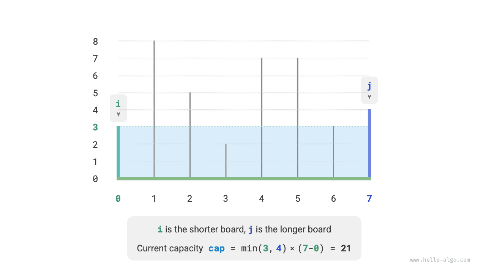
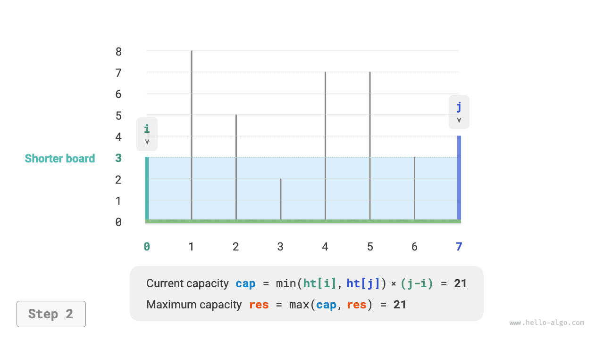
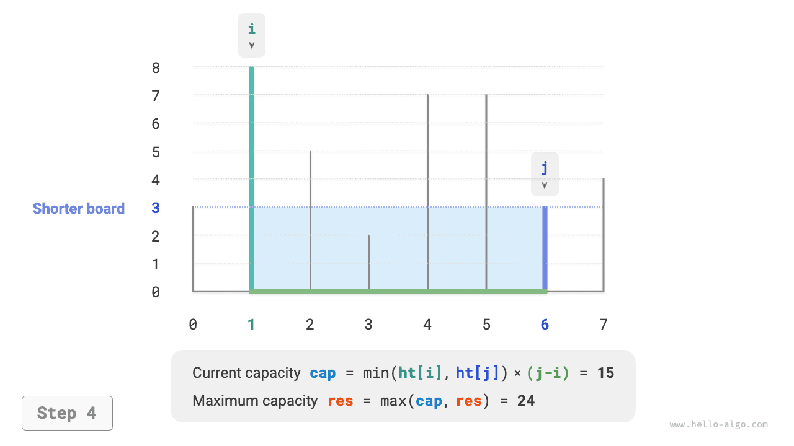
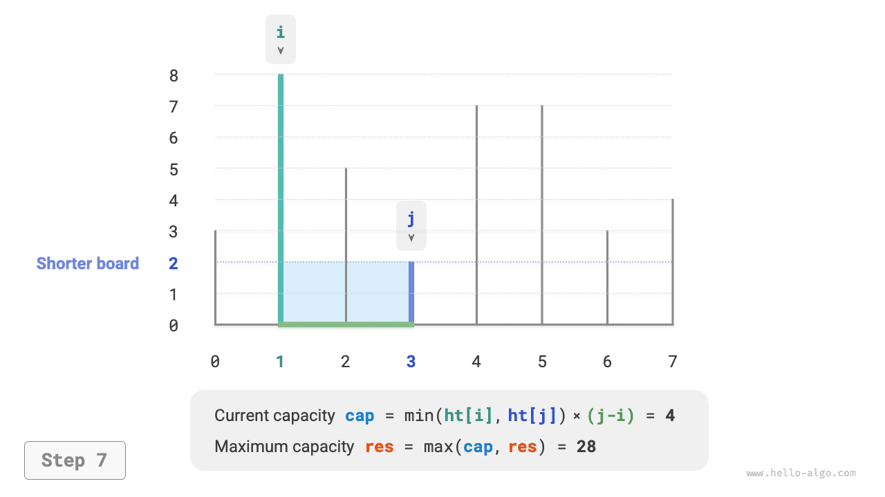

# 15.3 &nbsp; Max Capacity Problem

!!! question

    Given an array $ht$, where each element represents the height of a vertical partition. Any two partitions in the array, together with the space between them, can form a container.

    The capacity of the container equals the product of its height and width (that is, its area), where the height is determined by the shorter partition and the width is the difference between the array indices of the two partitions.

    Select two partitions in the array such that the capacity of the resulting container is maximized, and return that maximum capacity. An example is shown in Figure 15-7.

{ class="animation-figure" }

<p align="center"> Figure 15-7 &nbsp; Example data for the max capacity problem </p>

The container is formed by any two partitions, **so the state of this problem is the indices of the two partitions, denoted by $[i, j]$**.

According to the problem statement, capacity equals height multiplied by width, where the height is determined by the shorter partition and the width is the difference between the array indices of the two partitions. Let the capacity be $cap[i, j]$; then we obtain the following formula:

$$
cap[i, j] = \min(ht[i], ht[j]) \times (j - i)
$$

Let the array length be $n$. Then the number of ways to choose two partitions (that is, the total number of states) is $C_n^2 = \frac{n(n - 1)}{2}$. The most straightforward approach is to **exhaustively enumerate all states** to find the maximum capacity, which has a time complexity of $O(n^2)$.

### 1. &nbsp; Greedy Strategy Determination

This problem has a more efficient solution. As shown in Figure 15-8, consider a state $[i, j]$ where $i < j$ and $ht[i] < ht[j]$. In this case, $i$ is the shorter partition and $j$ is the taller partition.

{ class="animation-figure" }

<p align="center"> Figure 15-8 &nbsp; Initial state </p>

As shown in Figure 15-9, **if we now move the taller partition $j$ inward toward the shorter partition $i$, the capacity will definitely decrease**.

This is because after moving the taller partition $j$, the width $j-i$ definitely decreases. Since the height is determined by the shorter partition, the height can only stay the same ($i$ remains the shorter partition) or decrease ($j$ becomes the shorter partition after being moved).

{ class="animation-figure" }

<p align="center"> Figure 15-9 &nbsp; State after moving the long partition inward </p>

Conversely, **only by moving the shorter partition $i$ inward can the capacity possibly increase**. Although the width will definitely decrease, **the height may increase** (the moved partition at $i$ may be taller). For example, in Figure 15-10, the area increases after moving the shorter partition.

{ class="animation-figure" }

<p align="center"> Figure 15-10 &nbsp; State after moving the short partition inward </p>

From this, we can derive the greedy strategy for this problem: initialize two pointers at the two ends, and in each round move the pointer corresponding to the shorter partition inward until the two pointers meet.

Figure 15-11 shows the execution process of the greedy strategy.

1. In the initial state, pointers $i$ and $j$ are at both ends of the array.
2. Calculate the capacity of the current state $cap[i, j]$, and update the maximum capacity.
3. Compare the heights of partitions $i$ and $j$, and move the pointer corresponding to the shorter partition inward by one position.
4. Repeat steps `2.` and `3.` until $i$ and $j$ meet.

=== "<1>"
    { class="animation-figure" }

=== "<2>"
    { class="animation-figure" }

=== "<3>"
    { class="animation-figure" }

=== "<4>"
    { class="animation-figure" }

=== "<5>"
    { class="animation-figure" }

=== "<6>"
    { class="animation-figure" }

=== "<7>"
    { class="animation-figure" }

=== "<8>"
    { class="animation-figure" }

=== "<9>"
    { class="animation-figure" }

<p align="center"> Figure 15-11 &nbsp; Greedy process for the max capacity problem </p>

### 2. &nbsp; Code Implementation

The code runs for at most $n$ rounds, **so the time complexity is $O(n)$**.

Variables $i$, $j$, and $res$ use only a constant amount of extra space, **so the space complexity is $O(1)$**.

=== "Python"

    ```python title="max_capacity.py"
    def max_capacity(ht: list[int]) -> int:
        """Max capacity: Greedy algorithm"""
        # Initialize i, j to be at both ends of the array
        i, j = 0, len(ht) - 1
        # Initial max capacity is 0
        res = 0
        # Loop for greedy selection until the two boards meet
        while i < j:
            # Update max capacity
            cap = min(ht[i], ht[j]) * (j - i)
            res = max(res, cap)
            # Move the shorter board inward
            if ht[i] < ht[j]:
                i += 1
            else:
                j -= 1
        return res
    ```

=== "C++"

    ```cpp title="max_capacity.cpp"
    /* Max capacity: Greedy algorithm */
    int maxCapacity(vector<int> &ht) {
        // Initialize i, j to be at both ends of the array
        int i = 0, j = ht.size() - 1;
        // Initial max capacity is 0
        int res = 0;
        // Loop for greedy selection until the two boards meet
        while (i < j) {
            // Update max capacity
            int cap = min(ht[i], ht[j]) * (j - i);
            res = max(res, cap);
            // Move the shorter board inward
            if (ht[i] < ht[j]) {
                i++;
            } else {
                j--;
            }
        }
        return res;
    }
    ```

=== "Java"

    ```java title="max_capacity.java"
    /* Max capacity: Greedy algorithm */
    int maxCapacity(int[] ht) {
        // Initialize i, j to be at both ends of the array
        int i = 0, j = ht.length - 1;
        // Initial max capacity is 0
        int res = 0;
        // Loop for greedy selection until the two boards meet
        while (i < j) {
            // Update max capacity
            int cap = Math.min(ht[i], ht[j]) * (j - i);
            res = Math.max(res, cap);
            // Move the shorter board inward
            if (ht[i] < ht[j]) {
                i++;
            } else {
                j--;
            }
        }
        return res;
    }
    ```

=== "C#"

    ```csharp title="max_capacity.cs"
    /* Max capacity: Greedy algorithm */
    int MaxCapacity(int[] ht) {
        // Initialize i, j to be at both ends of the array
        int i = 0, j = ht.Length - 1;
        // Initial max capacity is 0
        int res = 0;
        // Loop for greedy selection until the two boards meet
        while (i < j) {
            // Update max capacity
            int cap = Math.Min(ht[i], ht[j]) * (j - i);
            res = Math.Max(res, cap);
            // Move the shorter board inward
            if (ht[i] < ht[j]) {
                i++;
            } else {
                j--;
            }
        }
        return res;
    }
    ```

=== "Go"

    ```go title="max_capacity.go"
    /* Max capacity: Greedy algorithm */
    func maxCapacity(ht []int) int {
        // Initialize i, j to be at both ends of the array
        i, j := 0, len(ht)-1
        // Initial max capacity is 0
        res := 0
        // Loop for greedy selection until the two boards meet
        for i < j {
            // Update max capacity
            capacity := int(math.Min(float64(ht[i]), float64(ht[j]))) * (j - i)
            res = int(math.Max(float64(res), float64(capacity)))
            // Move the shorter board inward
            if ht[i] < ht[j] {
                i++
            } else {
                j--
            }
        }
        return res
    }
    ```

=== "Swift"

    ```swift title="max_capacity.swift"
    /* Max capacity: Greedy algorithm */
    func maxCapacity(ht: [Int]) -> Int {
        // Initialize i, j to be at both ends of the array
        var i = ht.startIndex, j = ht.endIndex - 1
        // Initial max capacity is 0
        var res = 0
        // Loop for greedy selection until the two boards meet
        while i < j {
            // Update max capacity
            let cap = min(ht[i], ht[j]) * (j - i)
            res = max(res, cap)
            // Move the shorter board inward
            if ht[i] < ht[j] {
                i += 1
            } else {
                j -= 1
            }
        }
        return res
    }
    ```

=== "JS"

    ```javascript title="max_capacity.js"
    /* Max capacity: Greedy algorithm */
    function maxCapacity(ht) {
        // Initialize i, j to be at both ends of the array
        let i = 0,
            j = ht.length - 1;
        // Initial max capacity is 0
        let res = 0;
        // Loop for greedy selection until the two boards meet
        while (i < j) {
            // Update max capacity
            const cap = Math.min(ht[i], ht[j]) * (j - i);
            res = Math.max(res, cap);
            // Move the shorter board inward
            if (ht[i] < ht[j]) {
                i += 1;
            } else {
                j -= 1;
            }
        }
        return res;
    }
    ```

=== "TS"

    ```typescript title="max_capacity.ts"
    /* Max capacity: Greedy algorithm */
    function maxCapacity(ht: number[]): number {
        // Initialize i, j to be at both ends of the array
        let i = 0,
            j = ht.length - 1;
        // Initial max capacity is 0
        let res = 0;
        // Loop for greedy selection until the two boards meet
        while (i < j) {
            // Update max capacity
            const cap: number = Math.min(ht[i], ht[j]) * (j - i);
            res = Math.max(res, cap);
            // Move the shorter board inward
            if (ht[i] < ht[j]) {
                i += 1;
            } else {
                j -= 1;
            }
        }
        return res;
    }
    ```

=== "Dart"

    ```dart title="max_capacity.dart"
    /* Max capacity: Greedy algorithm */
    int maxCapacity(List<int> ht) {
      // Initialize i, j to be at both ends of the array
      int i = 0, j = ht.length - 1;
      // Initial max capacity is 0
      int res = 0;
      // Loop for greedy selection until the two boards meet
      while (i < j) {
        // Update max capacity
        int cap = min(ht[i], ht[j]) * (j - i);
        res = max(res, cap);
        // Move the shorter board inward
        if (ht[i] < ht[j]) {
          i++;
        } else {
          j--;
        }
      }
      return res;
    }
    ```

=== "Rust"

    ```rust title="max_capacity.rs"
    /* Max capacity: Greedy algorithm */
    fn max_capacity(ht: &[i32]) -> i32 {
        // Initialize i, j to be at both ends of the array
        let mut i = 0;
        let mut j = ht.len() - 1;
        // Initial max capacity is 0
        let mut res = 0;
        // Loop for greedy selection until the two boards meet
        while i < j {
            // Update max capacity
            let cap = std::cmp::min(ht[i], ht[j]) * (j - i) as i32;
            res = std::cmp::max(res, cap);
            // Move the shorter board inward
            if ht[i] < ht[j] {
                i += 1;
            } else {
                j -= 1;
            }
        }
        res
    }
    ```

=== "C"

    ```c title="max_capacity.c"
    /* Max capacity: Greedy algorithm */
    int maxCapacity(int ht[], int htLength) {
        // Initialize i, j to be at both ends of the array
        int i = 0;
        int j = htLength - 1;
        // Initial max capacity is 0
        int res = 0;
        // Loop for greedy selection until the two boards meet
        while (i < j) {
            // Update max capacity
            int capacity = myMin(ht[i], ht[j]) * (j - i);
            res = myMax(res, capacity);
            // Move the shorter board inward
            if (ht[i] < ht[j]) {
                i++;
            } else {
                j--;
            }
        }
        return res;
    }
    ```

=== "Kotlin"

    ```kotlin title="max_capacity.kt"
    /* Max capacity: Greedy algorithm */
    fun maxCapacity(ht: IntArray): Int {
        // Initialize i, j to be at both ends of the array
        var i = 0
        var j = ht.size - 1
        // Initial max capacity is 0
        var res = 0
        // Loop for greedy selection until the two boards meet
        while (i < j) {
            // Update max capacity
            val cap = min(ht[i], ht[j]) * (j - i)
            res = max(res, cap)
            // Move the shorter board inward
            if (ht[i] < ht[j]) {
                i++
            } else {
                j--
            }
        }
        return res
    }
    ```

=== "Ruby"

    ```ruby title="max_capacity.rb"
    ### Maximum capacity: greedy ###
    def max_capacity(ht)
      # Initialize i, j to be at both ends of the array
      i, j = 0, ht.length - 1
      # Initial max capacity is 0
      res = 0

      # Loop for greedy selection until the two boards meet
      while i < j
        # Update max capacity
        cap = [ht[i], ht[j]].min * (j - i)
        res = [res, cap].max
        # Move the shorter board inward
        if ht[i] < ht[j]
          i += 1
        else
          j -= 1
        end
      end

      res
    end
    ```

### 3. &nbsp; Correctness Proof

The reason greedy is faster than exhaustive enumeration is that each round of greedy selection "skips" some states.

For example, in state $cap[i, j]$, suppose $i$ is the shorter partition and $j$ is the taller partition. If we greedily move the shorter partition $i$ inward by one position, the states shown in Figure 15-12 will be "skipped." **This means that their capacities can no longer be checked later**.

$$
cap[i, i+1], cap[i, i+2], \dots, cap[i, j-2], cap[i, j-1]
$$

{ class="animation-figure" }

<p align="center"> Figure 15-12 &nbsp; States skipped by moving the short partition </p>

A closer look shows that **these skipped states are exactly the states obtained by moving the taller partition $j$ inward**. We have already proven that moving the taller partition inward will definitely decrease the capacity. Therefore, none of the skipped states can be the optimal solution, **so skipping them does not cause us to miss the optimum**.

The above analysis shows that moving the shorter partition is a "safe" operation, and that the greedy strategy is effective.
