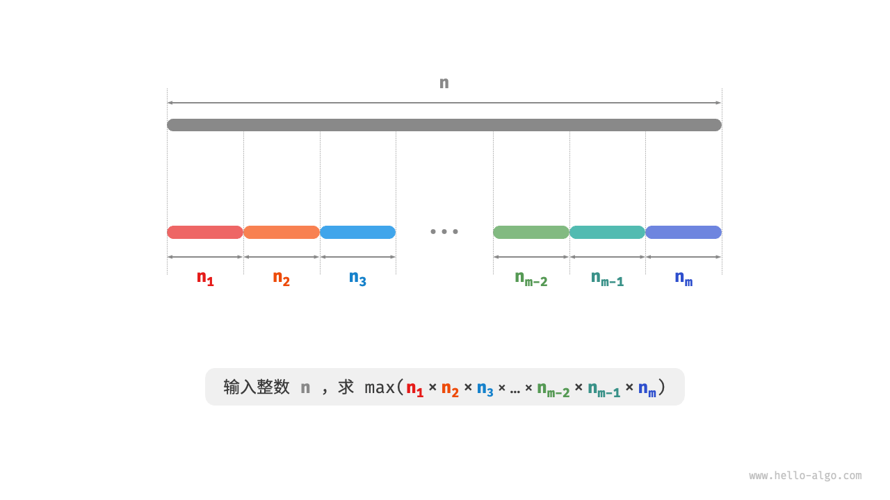
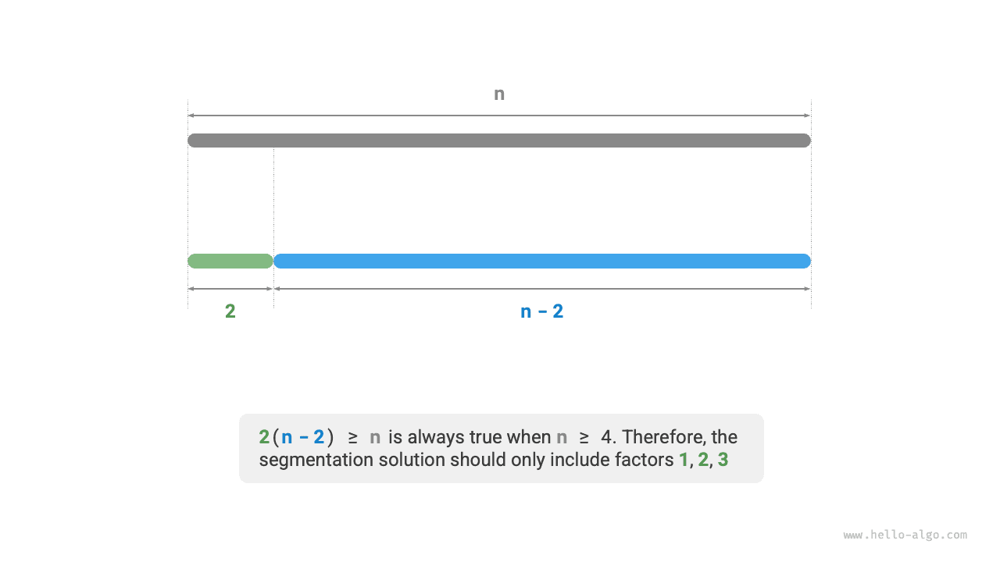
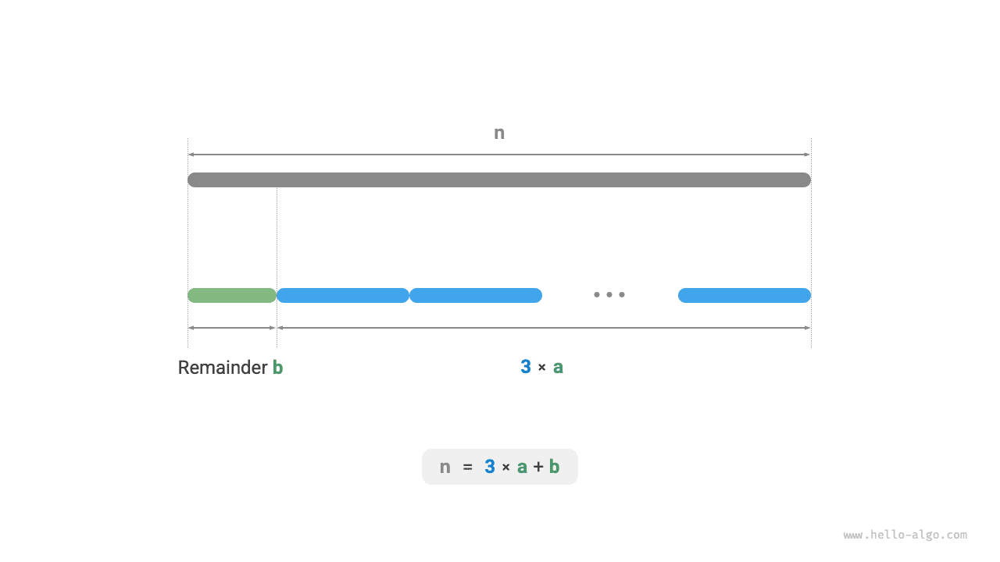

# Max Product Cutting Problem

!!! question

    Given a positive integer $n$, split it into the sum of at least two positive integers, and find the maximum product of all integers after splitting, as shown in the figure below.



Suppose we split $n$ into $m$ integer factors, where the $i$-th factor is denoted as $n_i$, that is

$$
n = \sum_{i=1}^{m}n_i
$$

The goal of this problem is to find the maximum product of all integer factors, namely

$$
\max(\prod_{i=1}^{m}n_i)
$$

We need to think about: how large should the splitting count $m$ be, and what should each $n_i$ be?

### Greedy Strategy Determination

Based on experience, the product of two integers is often greater than their sum. Suppose we split out a factor of $2$ from $n$, then their product is $2(n-2)$. We compare this product with $n$:

$$
\begin{aligned}
2(n-2) & \geq n \newline
2n - n - 4 & \geq 0 \newline
n & \geq 4
\end{aligned}
$$

As shown in the figure below, when $n \geq 4$, splitting out a $2$ will increase the product, **which indicates that integers greater than or equal to $4$ should all be split**.

**Greedy strategy one**: If the splitting scheme includes factors $\geq 4$, then they should continue to be split. The final splitting scheme should only contain factors $1$, $2$, and $3$.



Next, consider which factor is optimal. Among the three factors $1$, $2$, and $3$, clearly $1$ is the worst, because $1 \times (n-1) < n$ always holds, meaning splitting out $1$ will actually decrease the product.

As shown in the figure below, when $n = 6$, we have $3 \times 3 > 2 \times 2 \times 2$. **This means that splitting out $3$ is better than splitting out $2$**.

**Greedy strategy two**: In the splitting scheme, there should be at most two $2$s. Because three $2$s can always be replaced by two $3$s to obtain a larger product.


In summary, the following greedy strategies can be derived.

1. Input integer $n$, continuously split out factor $3$ until the remainder is $0$, $1$, or $2$.
2. When the remainder is $0$, it means $n$ is a multiple of $3$, so no further action is needed.
3. When the remainder is $2$, do not continue splitting, keep it.
4. When the remainder is $1$, since $2 \times 2 > 1 \times 3$, the last $3$ should be replaced with $2$.

### Code Implementation

As shown in the figure below, we don't need to use loops to split the integer, but can use integer division to get the count of $3$s as $a$, and modulo operation to get the remainder as $b$, at which point we have:

$$
n = 3 a + b
$$

Please note that for the edge case of $n \leq 3$, a $1$ must be split out, with product $1 \times (n - 1)$.

```src
[file]{max_product_cutting}-[class]{}-[func]{max_product_cutting}
```



**The time complexity depends on the implementation of the exponentiation operation in the programming language**. Taking Python as an example, there are three commonly used power calculation functions.

- Both the operator `**` and the function `pow()` have time complexity $O(\log⁡ a)$.
- The function `math.pow()` internally calls the C library's `pow()` function, which performs floating-point exponentiation, with time complexity $O(1)$.

Variables $a$ and $b$ use a constant amount of extra space, **therefore the space complexity is $O(1)$**.

### Correctness Proof

Using proof by contradiction, only analyzing the case where $n \geq 4$.

1. **All factors $\leq 3$**: Suppose the optimal splitting scheme includes a factor $x \geq 4$, then it can definitely continue to be split into $2(x-2)$ to obtain a larger (or equal) product. This contradicts the assumption.
2. **The splitting scheme does not contain $1$**: Suppose the optimal splitting scheme includes a factor of $1$, then it can definitely be merged into another factor to obtain a larger product. This contradicts the assumption.
3. **The splitting scheme contains at most two $2$s**: Suppose the optimal splitting scheme includes three $2$s, then they can definitely be replaced by two $3$s for a larger product. This contradicts the assumption.
