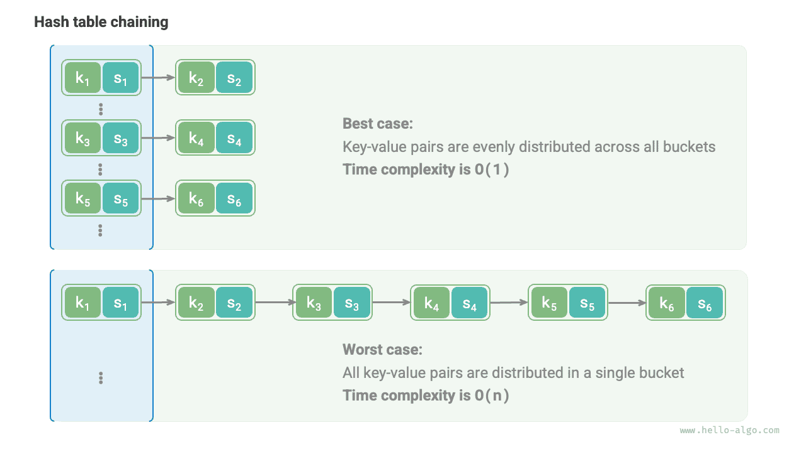

# Hash algorithms

The previous two sections introduced the working principle of hash tables and the methods to handle hash collisions. However, both open addressing and chaining can **only ensure that the hash table functions normally when collisions occur, but cannot reduce the frequency of hash collisions**.

If hash collisions occur too frequently, the performance of the hash table will deteriorate drastically. As shown in the figure below, for a chaining hash table, in the ideal case, the key-value pairs are evenly distributed across the buckets, achieving optimal query efficiency; in the worst case, all key-value pairs are stored in the same bucket, degrading the time complexity to $O(n)$.



**The distribution of key-value pairs is determined by the hash function**. Recalling the steps of calculating a hash function, first compute the hash value, then modulo it by the array length:

```shell
index = hash(key) % capacity
```

Observing the above formula, when the hash table capacity `capacity` is fixed, **the hash algorithm `hash()` determines the output value**, thereby determining the distribution of key-value pairs in the hash table.

This means that, to reduce the probability of hash collisions, we should focus on the design of the hash algorithm `hash()`.

## Goals of hash algorithms

To achieve a "fast and stable" hash table data structure, hash algorithms should have the following characteristics:

- **Determinism**: For the same input, the hash algorithm should always produce the same output. Only then can the hash table be reliable.
- **High efficiency**: The process of computing the hash value should be fast enough. The smaller the computational overhead, the more practical the hash table.
- **Uniform distribution**: The hash algorithm should ensure that key-value pairs are evenly distributed in the hash table. The more uniform the distribution, the lower the probability of hash collisions.

In fact, hash algorithms are not only used to implement hash tables but are also widely applied in other fields.

- **Password storage**: To protect the security of user passwords, systems usually do not store the plaintext passwords but rather the hash values of the passwords. When a user enters a password, the system calculates the hash value of the input and compares it with the stored hash value. If they match, the password is considered correct.
- **Data integrity check**: The data sender can calculate the hash value of the data and send it along; the receiver can recalculate the hash value of the received data and compare it with the received hash value. If they match, the data is considered intact.

For cryptographic applications, to prevent reverse engineering such as deducing the original password from the hash value, hash algorithms need higher-level security features.

- **Unidirectionality**: It should be impossible to deduce any information about the input data from the hash value.
- **Collision resistance**: It should be extremely difficult to find two different inputs that produce the same hash value.
- **Avalanche effect**: Minor changes in the input should lead to significant and unpredictable changes in the output.

Note that **"Uniform Distribution" and "Collision Resistance" are two separate concepts**. Satisfying uniform distribution does not necessarily mean collision resistance. For example, under random input `key`, the hash function `key % 100` can produce a uniformly distributed output. However, this hash algorithm is too simple, and all `key` with the same last two digits will have the same output, making it easy to deduce a usable `key` from the hash value, thereby cracking the password.

## Design of hash algorithms

The design of hash algorithms is a complex issue that requires consideration of many factors. However, for some less demanding scenarios, we can also design some simple hash algorithms.

- **Additive hash**: Add up the ASCII codes of each character in the input and use the total sum as the hash value.
- **Multiplicative hash**: Utilize the non-correlation of multiplication, multiplying each round by a constant, accumulating the ASCII codes of each character into the hash value.
- **XOR hash**: Accumulate the hash value by XORing each element of the input data.
- **Rotating hash**: Accumulate the ASCII code of each character into a hash value, performing a rotation operation on the hash value before each accumulation.

```src
[file]{simple_hash}-[class]{}-[func]{rot_hash}
```

It is observed that the last step of each hash algorithm is to take the modulus of the large prime number $1000000007$ to ensure that the hash value is within an appropriate range. It is worth pondering why emphasis is placed on modulo a prime number, or what are the disadvantages of modulo a composite number? This is an interesting question.

To conclude: **Using a large prime number as the modulus can maximize the uniform distribution of hash values**. Since a prime number does not share common factors with other numbers, it can reduce the periodic patterns caused by the modulo operation, thus avoiding hash collisions.

For example, suppose we choose the composite number $9$ as the modulus, which can be divided by $3$, then all `key` divisible by $3$ will be mapped to hash values $0$, $3$, $6$.

$$
\begin{aligned}
\text{modulus} & = 9 \newline
\text{key} & = \{ 0, 3, 6, 9, 12, 15, 18, 21, 24, 27, 30, 33, \dots \} \newline
\text{hash} & = \{ 0, 3, 6, 0, 3, 6, 0, 3, 6, 0, 3, 6,\dots \}
\end{aligned}
$$

If the input `key` happens to have this kind of arithmetic sequence distribution, then the hash values will cluster, thereby exacerbating hash collisions. Now, suppose we replace `modulus` with the prime number $13$, since there are no common factors between `key` and `modulus`, the uniformity of the output hash values will be significantly improved.

$$
\begin{aligned}
\text{modulus} & = 13 \newline
\text{key} & = \{ 0, 3, 6, 9, 12, 15, 18, 21, 24, 27, 30, 33, \dots \} \newline
\text{hash} & = \{ 0, 3, 6, 9, 12, 2, 5, 8, 11, 1, 4, 7, \dots \}
\end{aligned}
$$

It is worth noting that if the `key` is guaranteed to be randomly and uniformly distributed, then choosing a prime number or a composite number as the modulus can both produce uniformly distributed hash values. However, when the distribution of `key` has some periodicity, modulo a composite number is more likely to result in clustering.

In summary, we usually choose a prime number as the modulus, and this prime number should be large enough to eliminate periodic patterns as much as possible, enhancing the robustness of the hash algorithm.

## Common hash algorithms

It is not hard to see that the simple hash algorithms mentioned above are quite "fragile" and far from reaching the design goals of hash algorithms. For example, since addition and XOR obey the commutative law, additive hash and XOR hash cannot distinguish strings with the same content but in different order, which may exacerbate hash collisions and cause security issues.

In practice, we usually use some standard hash algorithms, such as MD5, SHA-1, SHA-2, and SHA-3. They can map input data of any length to a fixed-length hash value.

Over the past century, hash algorithms have been in a continuous process of upgrading and optimization. Some researchers strive to improve the performance of hash algorithms, while others, including hackers, are dedicated to finding security issues in hash algorithms. The table below shows hash algorithms commonly used in practical applications.

- MD5 and SHA-1 have been successfully attacked multiple times and are thus abandoned in various security applications.
- SHA-2 series, especially SHA-256, is one of the most secure hash algorithms to date, with no successful attacks reported, hence commonly used in various security applications and protocols.
- SHA-3 has lower implementation costs and higher computational efficiency compared to SHA-2, but its current usage coverage is not as extensive as the SHA-2 series.

<p align="center"> Table <id> &nbsp; Common hash algorithms </p>

|                 | MD5                                             | SHA-1                               | SHA-2                                                             | SHA-3                        |
| --------------- | ----------------------------------------------- | ----------------------------------- | ----------------------------------------------------------------- | ---------------------------- |
| Release Year    | 1992                                            | 1995                                | 2002                                                              | 2008                         |
| Output Length   | 128 bit                                         | 160 bit                             | 256/512 bit                                                       | 224/256/384/512 bit          |
| Hash Collisions | Frequent                                        | Frequent                            | Rare                                                              | Rare                         |
| Security Level  | Low, has been successfully attacked             | Low, has been successfully attacked | High                                                              | High                         |
| Applications    | Abandoned, still used for data integrity checks | Abandoned                           | Cryptocurrency transaction verification, digital signatures, etc. | Can be used to replace SHA-2 |

# Hash values in data structures

We know that the keys in a hash table can be of various data types such as integers, decimals, or strings. Programming languages usually provide built-in hash algorithms for these data types to calculate the bucket indices in the hash table. Taking Python as an example, we can use the `hash()` function to compute the hash values for various data types.

- The hash values of integers and booleans are their own values.
- The calculation of hash values for floating-point numbers and strings is more complex, and interested readers are encouraged to study this on their own.
- The hash value of a tuple is a combination of the hash values of each of its elements, resulting in a single hash value.
- The hash value of an object is generated based on its memory address. By overriding the hash method of an object, hash values can be generated based on content.

!!! tip

    Be aware that the definition and methods of the built-in hash value calculation functions in different programming languages vary.

=== "Python"

    ```python title="built_in_hash.py"
    num = 3
    hash_num = hash(num)
    # Hash value of integer 3 is 3

    bol = True
    hash_bol = hash(bol)
    # Hash value of boolean True is 1

    dec = 3.14159
    hash_dec = hash(dec)
    # Hash value of decimal 3.14159 is 326484311674566659

    str = "Hello 算法"
    hash_str = hash(str)
    # Hash value of string "Hello 算法" is 4617003410720528961

    tup = (12836, "小哈")
    hash_tup = hash(tup)
    # Hash value of tuple (12836, '小哈') is 1029005403108185979

    obj = ListNode(0)
    hash_obj = hash(obj)
    # Hash value of ListNode object at 0x1058fd810 is 274267521
    ```

=== "C++"

    ```cpp title="built_in_hash.cpp"
    int num = 3;
    size_t hashNum = hash<int>()(num);
    // Hash value of integer 3 is 3

    bool bol = true;
    size_t hashBol = hash<bool>()(bol);
    // Hash value of boolean 1 is 1

    double dec = 3.14159;
    size_t hashDec = hash<double>()(dec);
    // Hash value of decimal 3.14159 is 4614256650576692846

    string str = "Hello 算法";
    size_t hashStr = hash<string>()(str);
    // Hash value of string "Hello 算法" is 15466937326284535026

    // In C++, built-in std::hash() only provides hash values for basic data types
    // Hash values for arrays and objects need to be implemented separately
    ```

=== "Java"

    ```java title="built_in_hash.java"
    int num = 3;
    int hashNum = Integer.hashCode(num);
    // Hash value of integer 3 is 3

    boolean bol = true;
    int hashBol = Boolean.hashCode(bol);
    // Hash value of boolean true is 1231

    double dec = 3.14159;
    int hashDec = Double.hashCode(dec);
    // Hash value of decimal 3.14159 is -1340954729

    String str = "Hello 算法";
    int hashStr = str.hashCode();
    // Hash value of string "Hello 算法" is -727081396

    Object[] arr = { 12836, "小哈" };
    int hashTup = Arrays.hashCode(arr);
    // Hash value of array [12836, 小哈] is 1151158

    ListNode obj = new ListNode(0);
    int hashObj = obj.hashCode();
    // Hash value of ListNode object utils.ListNode@7dc5e7b4 is 2110121908
    ```

=== "C#"

    ```csharp title="built_in_hash.cs"
    int num = 3;
    int hashNum = num.GetHashCode();
    // Hash value of integer 3 is 3;

    bool bol = true;
    int hashBol = bol.GetHashCode();
    // Hash value of boolean true is 1;

    double dec = 3.14159;
    int hashDec = dec.GetHashCode();
    // Hash value of decimal 3.14159 is -1340954729;

    string str = "Hello 算法";
    int hashStr = str.GetHashCode();
    // Hash value of string "Hello 算法" is -586107568;

    object[] arr = [12836, "小哈"];
    int hashTup = arr.GetHashCode();
    // Hash value of array [12836, 小哈] is 42931033;

    ListNode obj = new(0);
    int hashObj = obj.GetHashCode();
    // Hash value of ListNode object 0 is 39053774;
    ```

=== "Go"

    ```go title="built_in_hash.go"
    // Go does not provide built-in hash code functions
    ```

=== "Swift"

    ```swift title="built_in_hash.swift"
    let num = 3
    let hashNum = num.hashValue
    // Hash value of integer 3 is 9047044699613009734

    let bol = true
    let hashBol = bol.hashValue
    // Hash value of boolean true is -4431640247352757451

    let dec = 3.14159
    let hashDec = dec.hashValue
    // Hash value of decimal 3.14159 is -2465384235396674631

    let str = "Hello 算法"
    let hashStr = str.hashValue
    // Hash value of string "Hello 算法" is -7850626797806988787

    let arr = [AnyHashable(12836), AnyHashable("小哈")]
    let hashTup = arr.hashValue
    // Hash value of array [AnyHashable(12836), AnyHashable("小哈")] is -2308633508154532996

    let obj = ListNode(x: 0)
    let hashObj = obj.hashValue
    // Hash value of ListNode object utils.ListNode is -2434780518035996159
    ```

=== "JS"

    ```javascript title="built_in_hash.js"
    // JavaScript does not provide built-in hash code functions
    ```

=== "TS"

    ```typescript title="built_in_hash.ts"
    // TypeScript does not provide built-in hash code functions
    ```

=== "Dart"

    ```dart title="built_in_hash.dart"
    int num = 3;
    int hashNum = num.hashCode;
    // Hash value of integer 3 is 34803

    bool bol = true;
    int hashBol = bol.hashCode;
    // Hash value of boolean true is 1231

    double dec = 3.14159;
    int hashDec = dec.hashCode;
    // Hash value of decimal 3.14159 is 2570631074981783

    String str = "Hello 算法";
    int hashStr = str.hashCode;
    // Hash value of string "Hello 算法" is 468167534

    List arr = [12836, "小哈"];
    int hashArr = arr.hashCode;
    // Hash value of array [12836, 小哈] is 976512528

    ListNode obj = new ListNode(0);
    int hashObj = obj.hashCode;
    // Hash value of ListNode object Instance of 'ListNode' is 1033450432
    ```

=== "Rust"

    ```rust title="built_in_hash.rs"
    use std::collections::hash_map::DefaultHasher;
    use std::hash::{Hash, Hasher};

    let num = 3;
    let mut num_hasher = DefaultHasher::new();
    num.hash(&mut num_hasher);
    let hash_num = num_hasher.finish();
    // Hash value of integer 3 is 568126464209439262

    let bol = true;
    let mut bol_hasher = DefaultHasher::new();
    bol.hash(&mut bol_hasher);
    let hash_bol = bol_hasher.finish();
    // Hash value of boolean true is 4952851536318644461

    let dec: f32 = 3.14159;
    let mut dec_hasher = DefaultHasher::new();
    dec.to_bits().hash(&mut dec_hasher);
    let hash_dec = dec_hasher.finish();
    // Hash value of decimal 3.14159 is 2566941990314602357

    let str = "Hello 算法";
    let mut str_hasher = DefaultHasher::new();
    str.hash(&mut str_hasher);
    let hash_str = str_hasher.finish();
    // Hash value of string "Hello 算法" is 16092673739211250988

    let arr = (&12836, &"小哈");
    let mut tup_hasher = DefaultHasher::new();
    arr.hash(&mut tup_hasher);
    let hash_tup = tup_hasher.finish();
    // Hash value of tuple (12836, "小哈") is 1885128010422702749

    let node = ListNode::new(42);
    let mut hasher = DefaultHasher::new();
    node.borrow().val.hash(&mut hasher);
    let hash = hasher.finish();
    // Hash value of ListNode object RefCell { value: ListNode { val: 42, next: None } } is 15387811073369036852
    ```

=== "C"

    ```c title="built_in_hash.c"
    // C does not provide built-in hash code functions
    ```

=== "Kotlin"

    ```kotlin title="built_in_hash.kt"

    ```

=== "Zig"

    ```zig title="built_in_hash.zig"

    ```

??? pythontutor "Code Visualization"

    https://pythontutor.com/render.html#code=class%20ListNode%3A%0A%20%20%20%20%22%22%22%E9%93%BE%E8%A1%A8%E8%8A%82%E7%82%B9%E7%B1%BB%22%22%22%0A%20%20%20%20def%20__init__%28self,%20val%3A%20int%29%3A%0A%20%20%20%20%20%20%20%20self.val%3A%20int%20%3D%20val%20%20%23%20%E8%8A%82%E7%82%B9%E5%80%BC%0A%20%20%20%20%20%20%20%20self.next%3A%20ListNode%20%7C%20None%20%3D%20None%20%20%23%20%E5%90%8E%E7%BB%A7%E8%8A%82%E7%82%B9%E5%BC%95%E7%94%A8%0A%0A%22%22%22Driver%20Code%22%22%22%0Aif%20__name__%20%3D%3D%20%22__main__%22%3A%0A%20%20%20%20num%20%3D%203%0A%20%20%20%20hash_num%20%3D%20hash%28num%29%0A%20%20%20%20%23%20%E6%95%B4%E6%95%B0%203%20%E7%9A%84%E5%93%88%E5%B8%8C%E5%80%BC%E4%B8%BA%203%0A%0A%20%20%20%20bol%20%3D%20True%0A%20%20%20%20hash_bol%20%3D%20hash%28bol%29%0A%20%20%20%20%23%20%E5%B8%83%E5%B0%94%E9%87%8F%20True%20%E7%9A%84%E5%93%88%E5%B8%8C%E5%80%BC%E4%B8%BA%201%0A%0A%20%20%20%20dec%20%3D%203.14159%0A%20%20%20%20hash_dec%20%3D%20hash%28dec%29%0A%20%20%20%20%23%20%E5%B0%8F%E6%95%B0%203.14159%20%E7%9A%84%E5%93%88%E5%B8%8C%E5%80%BC%E4%B8%BA%20326484311674566659%0A%0A%20%20%20%20str%20%3D%20%22Hello%20%E7%AE%97%E6%B3%95%22%0A%20%20%20%20hash_str%20%3D%20hash%28str%29%0A%20%20%20%20%23%20%E5%AD%97%E7%AC%A6%E4%B8%B2%E2%80%9CHello%20%E7%AE%97%E6%B3%95%E2%80%9D%E7%9A%84%E5%93%88%E5%B8%8C%E5%80%BC%E4%B8%BA%204617003410720528961%0A%0A%20%20%20%20tup%20%3D%20%2812836,%20%22%E5%B0%8F%E5%93%88%22%29%0A%20%20%20%20hash_tup%20%3D%20hash%28tup%29%0A%20%20%20%20%23%20%E5%85%83%E7%BB%84%20%2812836,%20'%E5%B0%8F%E5%93%88'%29%20%E7%9A%84%E5%93%88%E5%B8%8C%E5%80%BC%E4%B8%BA%201029005403108185979%0A%0A%20%20%20%20obj%20%3D%20ListNode%280%29%0A%20%20%20%20hash_obj%20%3D%20hash%28obj%29%0A%20%20%20%20%23%20%E8%8A%82%E7%82%B9%E5%AF%B9%E8%B1%A1%20%3CListNode%20object%20at%200x1058fd810%3E%20%E7%9A%84%E5%93%88%E5%B8%8C%E5%80%BC%E4%B8%BA%20274267521&cumulative=false&curInstr=19&heapPrimitives=nevernest&mode=display&origin=opt-frontend.js&py=311&rawInputLstJSON=%5B%5D&textReferences=false

In many programming languages, **only immutable objects can serve as the `key` in a hash table**. If we use a list (dynamic array) as a `key`, when the contents of the list change, its hash value also changes, and we would no longer be able to find the original `value` in the hash table.

Although the member variables of a custom object (such as a linked list node) are mutable, it is hashable. **This is because the hash value of an object is usually generated based on its memory address**, and even if the contents of the object change, the memory address remains the same, so the hash value remains unchanged.

You might have noticed that the hash values output in different consoles are different. **This is because the Python interpreter adds a random salt to the string hash function each time it starts up**. This approach effectively prevents HashDoS attacks and enhances the security of the hash algorithm.
