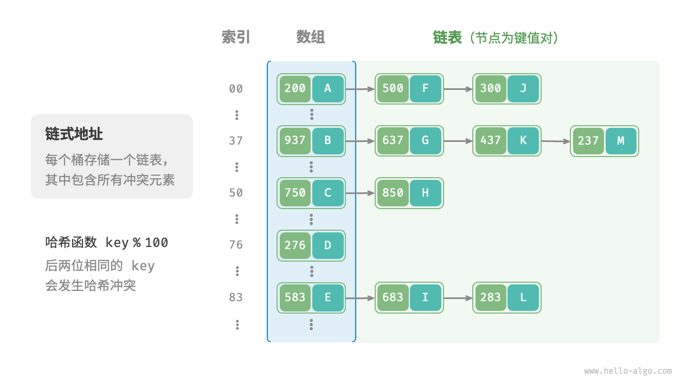
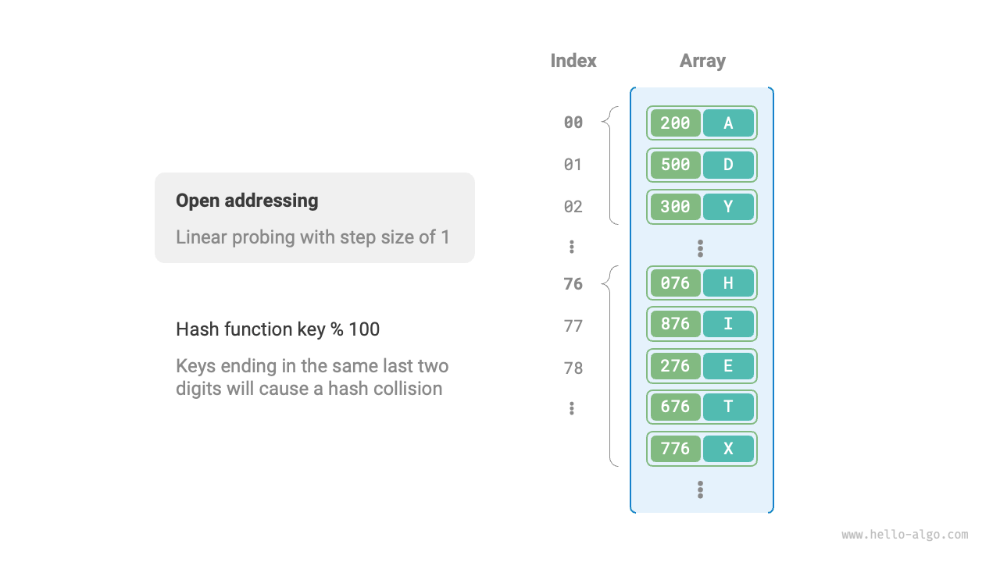
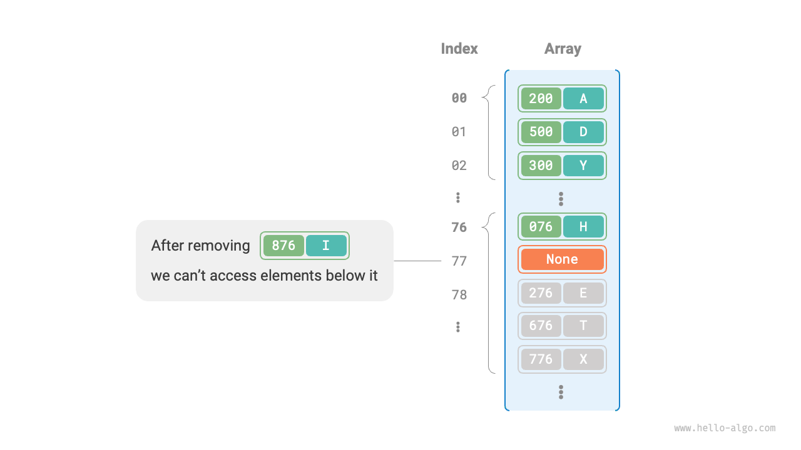

# Hash collision

The previous section mentioned that, **in most cases, the input space of a hash function is much larger than the output space**, so theoretically, hash collisions are inevitable. For example, if the input space is all integers and the output space is the size of the array capacity, then multiple integers will inevitably be mapped to the same bucket index.

Hash collisions can lead to incorrect query results, severely impacting the usability of the hash table. To address this issue, whenever a hash collision occurs, we perform hash table resizing until the collision disappears. This approach is pretty simple, straightforward, and working well. However, it appears to be pretty inefficient as the table expansion involves a lot of data migration as well as recalculation of hash code, which are expansive. To improve efficiency, we can adopt the following strategies:

1. Improve the hash table data structure in a way that **locating target element is still functioning well in the event of a hash collision**.
2. Expansion is the last resort before it becomes necessary, when severe collisions are observed.

There are mainly two methods for improving the structure of hash tables: "Separate Chaining" and "Open Addressing".

## Separate chaining

In the original hash table, each bucket can store only one key-value pair. <u>Separate chaining</u> converts a single element into a linked list, treating key-value pairs as list nodes, storing all colliding key-value pairs in the same linked list. The figure below shows an example of a hash table with separate chaining.



The operations of a hash table implemented with separate chaining have changed as follows:

- **Querying Elements**: Input `key`, obtain the bucket index through the hash function, then access the head node of the linked list. Traverse the linked list and compare key to find the target key-value pair.
- **Adding Elements**: Access the head node of the linked list via the hash function, then append the node (key-value pair) to the list.
- **Deleting Elements**: Access the head of the linked list based on the result of the hash function, then traverse the linked list to find the target node and delete it.

Separate chaining has the following limitations:

- **Increased Space Usage**: The linked list contains node pointers, which consume more memory space than arrays.
- **Reduced Query Efficiency**: This is because linear traversal of the linked list is required to find the corresponding element.

The code below provides a simple implementation of a separate chaining hash table, with two things to note:

- Lists (dynamic arrays) are used instead of linked lists for simplicity. In this setup, the hash table (array) contains multiple buckets, each of which is a list.
- This implementation includes a hash table resizing method. When the load factor exceeds $\frac{2}{3}$, we expand the hash table to twice its original size.

```src
[file]{hash_map_chaining}-[class]{hash_map_chaining}-[func]{}
```

It's worth noting that when the linked list is very long, the query efficiency $O(n)$ is poor. **In this case, the list can be converted to an "AVL tree" or "Red-Black tree"** to optimize the time complexity of the query operation to $O(\log n)$.

## Open addressing

<u>Open addressing</u> does not introduce additional data structures but instead handles hash collisions through "multiple probing". The probing methods mainly include linear probing, quadratic probing, and double hashing.

Let's use linear probing as an example to introduce the mechanism of open addressing hash tables.

### Linear probing

Linear probing uses a fixed-step linear search for probing, differing from ordinary hash tables.

- **Inserting Elements**: Calculate the bucket index using the hash function. If the bucket already contains an element, linearly traverse forward from the conflict position (usually with a step size of $1$) until an empty bucket is found, then insert the element.
- **Searching for Elements**: If a hash collision is encountered, use the same step size to linearly traverse forward until the corresponding element is found and return `value`; if an empty bucket is encountered, it means the target element is not in the hash table, so return `None`.

The figure below shows the distribution of key-value pairs in an open addressing (linear probing) hash table. According to this hash function, keys with the same last two digits will be mapped to the same bucket. Through linear probing, they are stored sequentially in that bucket and the buckets below it.



However, **linear probing is prone to create "clustering"**. Specifically, the longer the continuously occupied positions in the array, the greater the probability of hash collisions occurring in these continuous positions, further promoting the growth of clustering at that position, forming a vicious cycle, and ultimately leading to degraded efficiency of insertion, deletion, query, and update operations.

It's important to note that **we cannot directly delete elements in an open addressing hash table**. Deleting an element creates an empty bucket `None` in the array. When searching for elements, if linear probing encounters this empty bucket, it will return, making the elements below this bucket inaccessible. The program may incorrectly assume these elements do not exist, as shown in the figure below.



To solve this problem, we can adopt the <u>lazy deletion</u> mechanism: instead of directly removing elements from the hash table, **use a constant `TOMBSTONE` to mark the bucket**. In this mechanism, both `None` and `TOMBSTONE` represent empty buckets and can hold key-value pairs. However, when linear probing encounters `TOMBSTONE`, it should continue traversing since there may still be key-value pairs below it.

However, **lazy deletion may accelerate the performance degradation of the hash table**. Every deletion operation produces a delete mark, and as `TOMBSTONE` increases, the search time will also increase because linear probing may need to skip multiple `TOMBSTONE` to find the target element.

To address this, consider recording the index of the first encountered `TOMBSTONE` during linear probing and swapping the positions of the searched target element with that `TOMBSTONE`. The benefit of doing this is that each time an element is queried or added, the element will be moved to a bucket closer to its ideal position (the starting point of probing), thereby optimizing query efficiency.

The code below implements an open addressing (linear probing) hash table with lazy deletion. To make better use of the hash table space, we treat the hash table as a "circular array,". When going beyond the end of the array, we return to the beginning and continue traversing.

```src
[file]{hash_map_open_addressing}-[class]{hash_map_open_addressing}-[func]{}
```

### Quadratic probing

Quadratic probing is similar to linear probing and is one of the common strategies of open addressing. When a collision occurs, quadratic probing does not simply skip a fixed number of steps but skips a number of steps equal to the "square of the number of probes", i.e., $1, 4, 9, \dots$ steps.

Quadratic probing has the following advantages:

- Quadratic probing attempts to alleviate the clustering effect of linear probing by skipping the distance of the square of the number of probes.
- Quadratic probing skips larger distances to find empty positions, which helps to distribute data more evenly.

However, quadratic probing is not perfect:

- Clustering still exists, i.e., some positions are more likely to be occupied than others.
- Due to the growth of squares, quadratic probing may not probe the entire hash table, meaning that even if there are empty buckets in the hash table, quadratic probing may not be able to access them.

### Double hashing

As the name suggests, the double hashing method uses multiple hash functions $f_1(x)$, $f_2(x)$, $f_3(x)$, $\dots$ for probing.

- **Inserting Elements**: If hash function $f_1(x)$ encounters a conflict, it tries $f_2(x)$, and so on, until an empty position is found and the element is inserted.
- **Searching for Elements**: Search in the same order of hash functions until the target element is found and returned; if an empty position is encountered or all hash functions have been tried, it indicates the element is not in the hash table, then return `None`.

Compared to linear probing, the double hashing method is less prone to clustering, but multiple hash functions introduce additional computational overhead.

!!! tip

    Please note that open addressing (linear probing, quadratic probing, and double hashing) hash tables all have the problem of "can not directly delete elements."

## Choice of programming languages

Different programming languages adopt different hash table implementation strategies. Here are a few examples:

- Python uses open addressing. The `dict` dictionary uses pseudo-random numbers for probing.
- Java uses separate chaining. Since JDK 1.8, when the array length in `HashMap` reaches 64 and the length of a linked list reaches 8, the linked list is converted to a red-black tree to improve search performance.
- Go uses separate chaining. Go stipulates that each bucket can store up to 8 key-value pairs, and if the capacity is exceeded, an overflow bucket is linked; when there are too many overflow buckets, a special equal-capacity resizing operation is performed to ensure performance.
