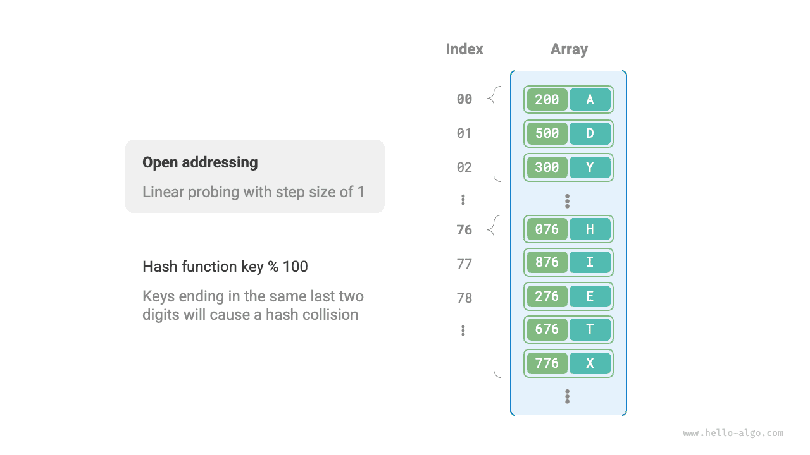

# Hash Collision

The previous section mentioned that, **in most cases, the input space of a hash function is much larger than the output space**, so theoretically, hash collisions are inevitable. For example, if the input space is all integers and the output space is the array capacity size, then multiple integers will inevitably be mapped to the same bucket index.

Hash collisions can lead to incorrect query results, severely impacting the usability of the hash table. To address this issue, whenever a hash collision occurs, we can perform hash table expansion until the collision disappears. This approach is simple, straightforward, and effective, but it is very inefficient because hash table expansion involves a large amount of data migration and hash value recalculation. To improve efficiency, we can adopt the following strategies:

1. Improve the hash table data structure so that **the hash table can function normally when hash collisions occur**.
2. Only expand when necessary, that is, only when hash collisions are severe.

The main approaches to improving a hash table's structure are separate chaining and open addressing.

## Separate Chaining

In the original hash table, each bucket can store only one key-value pair. <u>Separate chaining</u> replaces the single element in each bucket with a linked list, treating each key-value pair as a node and storing all colliding key-value pairs in the same list. The figure below shows an example of a separate chaining hash table.


In a hash table implemented with separate chaining, the basic operations work as follows:

- **Querying elements**: Input `key`, compute the bucket index using the hash function, access the head of the corresponding linked list, and traverse the list while comparing keys until the target key-value pair is found.
- **Adding elements**: First use the hash function to locate the corresponding linked list, then insert the node (key-value pair) into the list.
- **Deleting elements**: Use the hash function to locate the corresponding linked list, then traverse it to find and delete the target node.

Separate chaining has the following limitations:

- **Increased Space Usage**: The linked list contains node pointers, which consume more memory space than arrays.
- **Reduced Query Efficiency**: This is because linear traversal of the linked list is required to find the corresponding element.

The code below provides a simple implementation of a separate chaining hash table, with two things to note:

- Lists (dynamic arrays) are used instead of linked lists to simplify the code. In this setup, the hash table (array) contains multiple buckets, each of which is a list.
- This implementation includes a hash table expansion method. When the load factor exceeds $\frac{2}{3}$, we expand the hash table to $2$ times its original size.

```src
[file]{hash_map_chaining}-[class]{hash_map_chaining}-[func]{}
```

It's worth noting that when the linked list becomes very long, the query time $O(n)$ is poor. **In this case, the linked list can be converted into an AVL tree or a red-black tree**, reducing the time complexity of lookups to $O(\log n)$.

## Open Addressing

<u>Open addressing</u> does not introduce additional data structures. Instead, it handles hash collisions through repeated probing. Common probing strategies include linear probing, quadratic probing, and multiple hashing.

Let's use linear probing as an example to introduce the mechanism of open addressing hash tables.

### Linear Probing

Linear probing uses a fixed step size to probe sequentially, so its operations differ somewhat from those of an ordinary hash table.

- **Inserting elements**: Compute the bucket index using the hash function. If the bucket is already occupied, continue probing forward from the collision position with a fixed step size (usually $1$) until an empty bucket is found, then insert the element there.
- **Searching for elements**: If a collision occurs, continue probing forward with the same step size until the corresponding element is found and return its `value`; if an empty bucket is encountered, the target element is not in the hash table, so return `None`.

The figure below shows the distribution of key-value pairs in an open-addressing hash table that uses linear probing. Under this hash function, keys with the same last two digits are mapped to the same bucket. Linear probing then places them in that bucket and the subsequent buckets.



However, **linear probing is prone to clustering**. Specifically, the longer a contiguous occupied region in the array becomes, the more likely new collisions are to occur within that region. This in turn makes the cluster grow even further, creating a vicious cycle that gradually degrades the efficiency of insertion, deletion, lookup, and update operations.

It's important to note that **we cannot directly delete elements from an open-addressing hash table**. Deleting an element creates an empty bucket `None` in the array. During lookup, once linear probing reaches that empty bucket, it stops, which means any elements stored farther along the probe sequence become unreachable. As a result, the program may incorrectly conclude that those elements do not exist, as shown in the figure below.


To solve this problem, we can adopt <u>lazy deletion</u>: instead of directly removing an element from the hash table, **use a constant `TOMBSTONE` to mark the bucket**. Under this mechanism, both `None` and `TOMBSTONE` denote buckets that can accept key-value pairs. The difference is that when linear probing encounters `TOMBSTONE`, it must continue probing, because key-value pairs may still exist farther along the sequence.

However, **lazy deletion may accelerate hash-table performance degradation**. Each deletion leaves behind a marker, and as the number of `TOMBSTONE` entries grows, search time increases as well, because linear probing may need to skip over multiple tombstones before finding the target element.

To address this, we can record the index of the first `TOMBSTONE` encountered during linear probing and swap the found target element into that position. The benefit is that each query or insertion can move elements closer to their ideal positions, that is, closer to where probing begins, which improves lookup efficiency.

The code below implements an open addressing (linear probing) hash table with lazy deletion. To make better use of the hash table space, we treat the hash table as a "circular array". When going beyond the end of the array, we return to the beginning and continue traversing.

```src
[file]{hash_map_open_addressing}-[class]{hash_map_open_addressing}-[func]{}
```

### Quadratic Probing

Quadratic probing is similar to linear probing and is one of the common strategies for open addressing. When a collision occurs, quadratic probing does not simply skip a fixed number of steps but skips a number of steps equal to the "square of the number of probes", i.e., $1, 4, 9, \dots$ steps.

Quadratic probing has the following advantages:

- Quadratic probing attempts to alleviate the clustering effect of linear probing by skipping distances equal to the square of the probe count.
- Quadratic probing skips larger distances to find empty positions, which helps to distribute data more evenly.

However, quadratic probing is not perfect:

- Clustering still exists, i.e., some positions are more likely to be occupied than others.
- Due to the growth of squares, quadratic probing may not probe the entire hash table, meaning that even if there are empty buckets in the hash table, quadratic probing may not be able to access them.

### Multiple Hashing

As the name suggests, multiple hashing uses multiple hash functions $f_1(x)$, $f_2(x)$, $f_3(x)$, $\dots$ for probing.

- **Inserting elements**: If hash function $f_1(x)$ encounters a conflict, try $f_2(x)$, and so on, until an empty position is found and the element is inserted.
- **Searching for elements**: Search in the same order of hash functions until the target element is found and return it; if an empty position is encountered or all hash functions have been tried, it indicates the element is not in the hash table, then return `None`.

Compared with linear probing, multiple hashing is less prone to clustering, but using multiple hash functions introduces additional computational overhead.

!!! tip

    Please note that hash tables based on open addressing, including linear probing, quadratic probing, and multiple hashing, all have the problem that elements cannot be deleted directly.

## Choice of Programming Languages

Different programming languages adopt different hash table implementation strategies. Here are a few examples:

- Python uses open addressing. The `dict` dictionary uses pseudo-random numbers for probing.
- Java uses separate chaining. Since JDK 1.8, when the array length in `HashMap` reaches 64 and the length of a linked list reaches 8, the linked list is converted to a red-black tree to improve search performance.
- Go uses separate chaining. Go stipulates that each bucket can store up to 8 key-value pairs, and if the capacity is exceeded, an overflow bucket is linked; when there are too many overflow buckets, a special equal-capacity expansion operation is performed to ensure performance.
