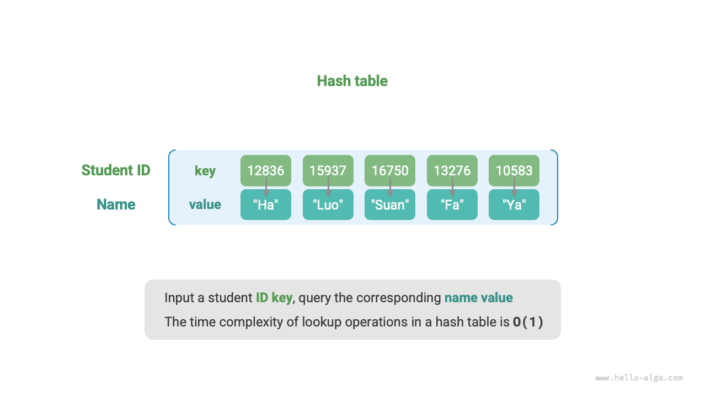
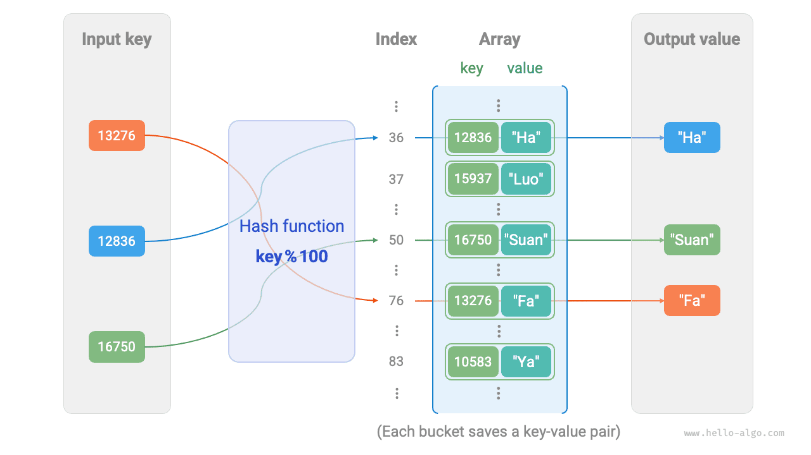
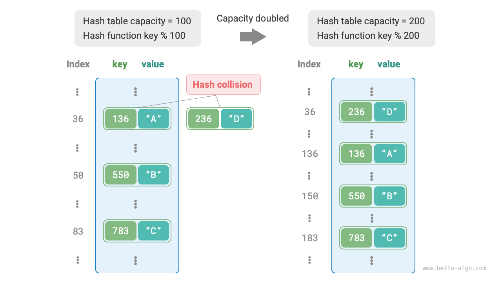

# Hash table

A <u>hash table</u>, also known as a <u>hash map</u>, is a data structure that establishes a mapping between keys and values, enabling efficient element retrieval. Specifically, when we input a `key` into the hash table, we can retrive the corresponding `value` in $O(1)$ time complexity.

As shown in the figure below, given $n$ students, each student has two data fields: "Name" and "Student ID". If we want to implement a query function that takes a student ID as input and returns the corresponding name, we can use the hash table shown in the figure below.



In addition to hash tables, arrays and linked lists can also be used to implement query functionality, but the time complexity is different. Their efficiency is compared in the table below:

- **Inserting elements**: Simply append the element to the tail of the array (or linked list). The time complexity of this operation is $O(1)$.
- **Searching for elements**: As the array (or linked list) is unsorted, searching for an element requires traversing through all of the elements. The time complexity of this operation is $O(n)$.
- **Deleting elements**: To remove an element, we first need to locate it. Then, we delete it from the array (or linked list). The time complexity of this operation is $O(n)$.

<p align="center"> Table <id> &nbsp; Comparison of time efficiency for common operations </p>

|                | Array  | Linked List | Hash Table |
| -------------- | ------ | ----------- | ---------- |
| Search Elements   | $O(n)$ | $O(n)$      | $O(1)$     |
| Insert Elements    | $O(1)$ | $O(1)$      | $O(1)$     |
| Delete Elements | $O(n)$ | $O(n)$      | $O(1)$     |

It can be seen that **the time complexity for operations (insertion, deletion, searching, and modification) in a hash table is $O(1)$**, which is highly efficient.

## Common operations of hash table

Common operations of a hash table include: initialization, querying, adding key-value pairs, and deleting key-value pairs. Here is an example code:

=== "Python"

    ```python title="hash_map.py"
    # Initialize hash table
    hmap: dict = {}

    # Add operation
    # Add key-value pair (key, value) to the hash table
    hmap[12836] = "Xiao Ha"
    hmap[15937] = "Xiao Luo"
    hmap[16750] = "Xiao Suan"
    hmap[13276] = "Xiao Fa"
    hmap[10583] = "Xiao Ya"

    # Query operation
    # Input key into hash table, get value
    name: str = hmap[15937]

    # Delete operation
    # Delete key-value pair (key, value) from hash table
    hmap.pop(10583)
    ```

=== "C++"

    ```cpp title="hash_map.cpp"
    /* Initialize hash table */
    unordered_map<int, string> map;

    /* Add operation */
    // Add key-value pair (key, value) to the hash table
    map[12836] = "Xiao Ha";
    map[15937] = "Xiao Luo";
    map[16750] = "Xiao Suan";
    map[13276] = "Xiao Fa";
    map[10583] = "Xiao Ya";

    /* Query operation */
    // Input key into hash table, get value
    string name = map[15937];

    /* Delete operation */
    // Delete key-value pair (key, value) from hash table
    map.erase(10583);
    ```

=== "Java"

    ```java title="hash_map.java"
    /* Initialize hash table */
    Map<Integer, String> map = new HashMap<>();

    /* Add operation */
    // Add key-value pair (key, value) to the hash table
    map.put(12836, "Xiao Ha");   
    map.put(15937, "Xiao Luo");   
    map.put(16750, "Xiao Suan");   
    map.put(13276, "Xiao Fa");
    map.put(10583, "Xiao Ya");

    /* Query operation */
    // Input key into hash table, get value
    String name = map.get(15937);

    /* Delete operation */
    // Delete key-value pair (key, value) from hash table
    map.remove(10583);
    ```

=== "C#"

    ```csharp title="hash_map.cs"
    /* Initialize hash table */
    Dictionary<int, string> map = new() {
        /* Add operation */
        // Add key-value pair (key, value) to the hash table
        { 12836, "Xiao Ha" },
        { 15937, "Xiao Luo" },
        { 16750, "Xiao Suan" },
        { 13276, "Xiao Fa" },
        { 10583, "Xiao Ya" }
    };

    /* Query operation */
    // Input key into hash table, get value
    string name = map[15937];

    /* Delete operation */
    // Delete key-value pair (key, value) from hash table
    map.Remove(10583);
    ```

=== "Go"

    ```go title="hash_map_test.go"
    /* Initialize hash table */
    hmap := make(map[int]string)

    /* Add operation */
    // Add key-value pair (key, value) to the hash table
    hmap[12836] = "Xiao Ha"
    hmap[15937] = "Xiao Luo"
    hmap[16750] = "Xiao Suan"
    hmap[13276] = "Xiao Fa"
    hmap[10583] = "Xiao Ya"

    /* Query operation */
    // Input key into hash table, get value
    name := hmap[15937]

    /* Delete operation */
    // Delete key-value pair (key, value) from hash table
    delete(hmap, 10583)
    ```

=== "Swift"

    ```swift title="hash_map.swift"
    /* Initialize hash table */
    var map: [Int: String] = [:]

    /* Add operation */
    // Add key-value pair (key, value) to the hash table
    map[12836] = "Xiao Ha"
    map[15937] = "Xiao Luo"
    map[16750] = "Xiao Suan"
    map[13276] = "Xiao Fa"
    map[10583] = "Xiao Ya"

    /* Query operation */
    // Input key into hash table, get value
    let name = map[15937]!

    /* Delete operation */
    // Delete key-value pair (key, value) from hash table
    map.removeValue(forKey: 10583)
    ```

=== "JS"

    ```javascript title="hash_map.js"
    /* Initialize hash table */
    const map = new Map();
    /* Add operation */
    // Add key-value pair (key, value) to the hash table
    map.set(12836, 'Xiao Ha');
    map.set(15937, 'Xiao Luo');
    map.set(16750, 'Xiao Suan');
    map.set(13276, 'Xiao Fa');
    map.set(10583, 'Xiao Ya');

    /* Query operation */
    // Input key into hash table, get value
    let name = map.get(15937);

    /* Delete operation */
    // Delete key-value pair (key, value) from hash table
    map.delete(10583);
    ```

=== "TS"

    ```typescript title="hash_map.ts"
    /* Initialize hash table */
    const map = new Map<number, string>();
    /* Add operation */
    // Add key-value pair (key, value) to the hash table
    map.set(12836, 'Xiao Ha');
    map.set(15937, 'Xiao Luo');
    map.set(16750, 'Xiao Suan');
    map.set(13276, 'Xiao Fa');
    map.set(10583, 'Xiao Ya');
    console.info('\nAfter adding, the hash table is\nKey -> Value');
    console.info(map);

    /* Query operation */
    // Input key into hash table, get value
    let name = map.get(15937);
    console.info('\nInput student number 15937, query name ' + name);

    /* Delete operation */
    // Delete key-value pair (key, value) from hash table
    map.delete(10583);
    console.info('\nAfter deleting 10583, the hash table is\nKey -> Value');
    console.info(map);
    ```

=== "Dart"

    ```dart title="hash_map.dart"
    /* Initialize hash table */
    Map<int, String> map = {};

    /* Add operation */
    // Add key-value pair (key, value) to the hash table
    map[12836] = "Xiao Ha";
    map[15937] = "Xiao Luo";
    map[16750] = "Xiao Suan";
    map[13276] = "Xiao Fa";
    map[10583] = "Xiao Ya";

    /* Query operation */
    // Input key into hash table, get value
    String name = map[15937];

    /* Delete operation */
    // Delete key-value pair (key, value) from hash table
    map.remove(10583);
    ```

=== "Rust"

    ```rust title="hash_map.rs"
    use std::collections::HashMap;

    /* Initialize hash table */
    let mut map: HashMap<i32, String> = HashMap::new();

    /* Add operation */
    // Add key-value pair (key, value) to the hash table
    map.insert(12836, "Xiao Ha".to_string());
    map.insert(15937, "Xiao Luo".to_string());
    map.insert(16750, "Xiao Suan".to_string());
    map.insert(13279, "Xiao Fa".to_string());
    map.insert(10583, "Xiao Ya".to_string());

    /* Query operation */
    // Input key into hash table, get value
    let _name: Option<&String> = map.get(&15937);

    /* Delete operation */
    // Delete key-value pair (key, value) from hash table
    let _removed_value: Option<String> = map.remove(&10583);
    ```

=== "C"

    ```c title="hash_map.c"
    // C does not provide a built-in hash table
    ```

=== "Kotlin"

    ```kotlin title="hash_map.kt"

    ```

=== "Zig"

    ```zig title="hash_map.zig"

    ```

??? pythontutor "Code Visualization"

    https://pythontutor.com/render.html#code=%22%22%22Driver%20Code%22%22%22%0Aif%20__name__%20%3D%3D%20%22__main__%22%3A%0A%20%20%20%20%23%20%E5%88%9D%E5%A7%8B%E5%8C%96%E5%93%88%E5%B8%8C%E8%A1%A8%0A%20%20%20%20hmap%20%3D%20%7B%7D%0A%20%20%20%20%0A%20%20%20%20%23%20%E6%B7%BB%E5%8A%A0%E6%93%8D%E4%BD%9C%0A%20%20%20%20%23%20%E5%9C%A8%E5%93%88%E5%B8%8C%E8%A1%A8%E4%B8%AD%E6%B7%BB%E5%8A%A0%E9%94%AE%E5%80%BC%E5%AF%B9%20%28key,%20value%29%0A%20%20%20%20hmap%5B12836%5D%20%3D%20%22%E5%B0%8F%E5%93%88%22%0A%20%20%20%20hmap%5B15937%5D%20%3D%20%22%E5%B0%8F%E5%95%B0%22%0A%20%20%20%20hmap%5B16750%5D%20%3D%20%22%E5%B0%8F%E7%AE%97%22%0A%20%20%20%20hmap%5B13276%5D%20%3D%20%22%E5%B0%8F%E6%B3%95%22%0A%20%20%20%20hmap%5B10583%5D%20%3D%20%22%E5%B0%8F%E9%B8%AD%22%0A%20%20%20%20%0A%20%20%20%20%23%20%E6%9F%A5%E8%AF%A2%E6%93%8D%E4%BD%9C%0A%20%20%20%20%23%20%E5%90%91%E5%93%88%E5%B8%8C%E8%A1%A8%E4%B8%AD%E8%BE%93%E5%85%A5%E9%94%AE%20key%20%EF%BC%8C%E5%BE%97%E5%88%B0%E5%80%BC%20value%0A%20%20%20%20name%20%3D%20hmap%5B15937%5D%0A%20%20%20%20%0A%20%20%20%20%23%20%E5%88%A0%E9%99%A4%E6%93%8D%E4%BD%9C%0A%20%20%20%20%23%20%E5%9C%A8%E5%93%88%E5%B8%8C%E8%A1%A8%E4%B8%AD%E5%88%A0%E9%99%A4%E9%94%AE%E5%80%BC%E5%AF%B9%20%28key,%20value%29%0A%20%20%20%20hmap.pop%2810583%29&cumulative=false&curInstr=2&heapPrimitives=nevernest&mode=display&origin=opt-frontend.js&py=311&rawInputLstJSON=%5B%5D&textReferences=false

There are three common ways to traverse a hash table: traversing key-value pairs, traversing keys, and traversing values. Here is an example code:

=== "Python"

    ```python title="hash_map.py"
    # Traverse hash table
    # Traverse key-value pairs key->value
    for key, value in hmap.items():
        print(key, "->", value)
    # Traverse keys only
    for key in hmap.keys():
        print(key)
    # Traverse values only
    for value in hmap.values():
        print(value)
    ```

=== "C++"

    ```cpp title="hash_map.cpp"
    /* Traverse hash table */
    // Traverse key-value pairs key->value
    for (auto kv: map) {
        cout << kv.first << " -> " << kv.second << endl;
    }
    // Traverse using iterator key->value
    for (auto iter = map.begin(); iter != map.end(); iter++) {
        cout << iter->first << "->" << iter->second << endl;
    }
    ```

=== "Java"

    ```java title="hash_map.java"
    /* Traverse hash table */
    // Traverse key-value pairs key->value
    for (Map.Entry<Integer, String> kv: map.entrySet()) {
        System.out.println(kv.getKey() + " -> " + kv.getValue());
    }
    // Traverse keys only
    for (int key: map.keySet()) {
        System.out.println(key);
    }
    // Traverse values only
    for (String val: map.values()) {
        System.out.println(val);
    }
    ```

=== "C#"

    ```csharp title="hash_map.cs"
    /* Traverse hash table */
    // Traverse key-value pairs Key->Value
    foreach (var kv in map) {
        Console.WriteLine(kv.Key + " -> " + kv.Value);
    }
    // Traverse keys only
    foreach (int key in map.Keys) {
        Console.WriteLine(key);
    }
    // Traverse values only
    foreach (string val in map.Values) {
        Console.WriteLine(val);
    }
    ```

=== "Go"

    ```go title="hash_map_test.go"
    /* Traverse hash table */
    // Traverse key-value pairs key->value
    for key, value := range hmap {
        fmt.Println(key, "->", value)
    }
    // Traverse keys only
    for key := range hmap {
        fmt.Println(key)
    }
    // Traverse values only
    for _, value := range hmap {
        fmt.Println(value)
    }
    ```

=== "Swift"

    ```swift title="hash_map.swift"
    /* Traverse hash table */
    // Traverse key-value pairs Key->Value
    for (key, value) in map {
        print("\(key) -> \(value)")
    }
    // Traverse keys only
    for key in map.keys {
        print(key)
    }
    // Traverse values only
    for value in map.values {
        print(value)
    }
    ```

=== "JS"

    ```javascript title="hash_map.js"
    /* Traverse hash table */
    console.info('\nTraverse key-value pairs Key->Value');
    for (const [k, v] of map.entries()) {
        console.info(k + ' -> ' + v);
    }
    console.info('\nTraverse keys only Key');
    for (const k of map.keys()) {
        console.info(k);
    }
    console.info('\nTraverse values only Value');
    for (const v of map.values()) {
        console.info(v);
    }
    ```

=== "TS"

    ```typescript title="hash_map.ts"
    /* Traverse hash table */
    console.info('\nTraverse key-value pairs Key->Value');
    for (const [k, v] of map.entries()) {
        console.info(k + ' -> ' + v);
    }
    console.info('\nTraverse keys only Key');
    for (const k of map.keys()) {
        console.info(k);
    }
    console.info('\nTraverse values only Value');
    for (const v of map.values()) {
        console.info(v);
    }
    ```

=== "Dart"

    ```dart title="hash_map.dart"
    /* Traverse hash table */
    // Traverse key-value pairs Key->Value
    map.forEach((key, value) {
    print('$key -> $value');
    });

    // Traverse keys only Key
    map.keys.forEach((key) {
    print(key);
    });

    // Traverse values only Value
    map.values.forEach((value) {
    print(value);
    });
    ```

=== "Rust"

    ```rust title="hash_map.rs"
    /* Traverse hash table */
    // Traverse key-value pairs Key->Value
    for (key, value) in &map {
        println!("{key} -> {value}");
    }

    // Traverse keys only Key
    for key in map.keys() {
        println!("{key}"); 
    }

    // Traverse values only Value
    for value in map.values() {
        println!("{value}");
    }
    ```

=== "C"

    ```c title="hash_map.c"
    // C does not provide a built-in hash table
    ```

=== "Kotlin"

    ```kotlin title="hash_map.kt"

    ```

=== "Zig"

    ```zig title="hash_map.zig"
    // Zig example is not provided
    ```

??? pythontutor "Code Visualization"

    https://pythontutor.com/render.html#code=%22%22%22Driver%20Code%22%22%22%0Aif%20__name__%20%3D%3D%20%22__main__%22%3A%0A%20%20%20%20%23%20%E5%88%9D%E5%A7%8B%E5%8C%96%E5%93%88%E5%B8%8C%E8%A1%A8%0A%20%20%20%20hmap%20%3D%20%7B%7D%0A%20%20%20%20%0A%20%20%20%20%23%20%E6%B7%BB%E5%8A%A0%E6%93%8D%E4%BD%9C%0A%20%20%20%20%23%20%E5%9C%A8%E5%93%88%E5%B8%8C%E8%A1%A8%E4%B8%AD%E6%B7%BB%E5%8A%A0%E9%94%AE%E5%80%BC%E5%AF%B9%20%28key,%20value%29%0A%20%20%20%20hmap%5B12836%5D%20%3D%20%22%E5%B0%8F%E5%93%88%22%0A%20%20%20%20hmap%5B15937%5D%20%3D%20%22%E5%B0%8F%E5%95%B0%22%0A%20%20%20%20hmap%5B16750%5D%20%3D%20%22%E5%B0%8F%E7%AE%97%22%0A%20%20%20%20hmap%5B13276%5D%20%3D%20%22%E5%B0%8F%E6%B3%95%22%0A%20%20%20%20hmap%5B10583%5D%20%3D%20%22%E5%B0%8F%E9%B8%AD%22%0A%20%20%20%20%0A%20%20%20%20%23%20%E9%81%8D%E5%8E%86%E5%93%88%E5%B8%8C%E8%A1%A8%0A%20%20%20%20%23%20%E9%81%8D%E5%8E%86%E9%94%AE%E5%80%BC%E5%AF%B9%20key-%3Evalue%0A%20%20%20%20for%20key,%20value%20in%20hmap.items%28%29%3A%0A%20%20%20%20%20%20%20%20print%28key,%20%22-%3E%22,%20value%29%0A%20%20%20%20%23%20%E5%8D%95%E7%8B%AC%E9%81%8D%E5%8E%86%E9%94%AE%20key%0A%20%20%20%20for%20key%20in%20hmap.keys%28%29%3A%0A%20%20%20%20%20%20%20%20print%28key%29%0A%20%20%20%20%23%20%E5%8D%95%E7%8B%AC%E9%81%8D%E5%8E%86%E5%80%BC%20value%0A%20%20%20%20for%20value%20in%20hmap.values%28%29%3A%0A%20%20%20%20%20%20%20%20print%28value%29&cumulative=false&curInstr=8&heapPrimitives=nevernest&mode=display&origin=opt-frontend.js&py=311&rawInputLstJSON=%5B%5D&textReferences=false

## Simple implementation of a hash table

First, let's consider the simplest case: **implementing a hash table using only one array**. In the hash table, each empty slot in the array is called a <u>bucket</u>, and each bucket can store a key-value pair. Therefore, the query operation involves finding the bucket corresponding to the `key` and retrieving the `value` from it.

So, how do we locate the corresponding bucket based on the `key`? This is achieved through a <u>hash function</u>. The role of the hash function is to map a larger input space to a smaller output space. In a hash table, the input space consists of all the keys, and the output space consists of all the buckets (array indices). In other words, given a `key`, **we can use the hash function to determine the storage location of the corresponding key-value pair in the array**.

When given a `key`, the calculation process of the hash function consists of the following two steps:

1. Calculate the hash value by using a certain hash algorithm `hash()`.
2. Take the modulus of the hash value with the bucket count (array length) `capacity` to obtain the array `index` corresponding to that key.

```shell
index = hash(key) % capacity
```

Afterward, we can use the `index` to access the corresponding bucket in the hash table and thereby retrieve the `value`.

Let's assume that the array length is `capacity = 100`, and the hash algorithm is defined as `hash(key) = key`. Therefore, the hash function can be expressed as `key % 100`. The following figure illustrates the working principle of the hash function using `key` as student ID and `value` as name.



The following code implements a simple hash table. Here, we encapsulate `key` and `value` into a class `Pair` to represent the key-value pair.

```src
[file]{array_hash_map}-[class]{array_hash_map}-[func]{}
```

## Hash collision and resizing

Essentially, the role of the hash function is to map the entire input space of all keys to the output space of all array indices. However, the input space is often much larger than the output space. Therefore, **theoretically, there will always be cases where "multiple inputs correspond to the same output"**.

In the example above, with the given hash function, when the last two digits of the input `key` are the same, the hash function produces the same output. For instance, when querying two students with student IDs 12836 and 20336, we find:

```shell
12836 % 100 = 36
20336 % 100 = 36
```

As shown in the figure below, both student IDs point to the same name, which is obviously incorrect. This situation where multiple inputs correspond to the same output is called <u>hash collision</u>.


It is easy to understand that as the capacity $n$ of the hash table increases, the probability of multiple keys being assigned to the same bucket decreases, resulting in fewer collisions. Therefore, **we can reduce hash collisions by resizing the hash table**.

As shown in the figure below, before resizing, the key-value pairs `(136, A)` and `(236, D)` collide. However, after resizing, the collision is resolved.



Similar to array expansion, resizing a hash table requires migrating all key-value pairs from the original hash table to the new one, which is time-consuming. Furthermore, since the `capacity` of the hash table changes, we need to recalculate the storage positions of all key-value pairs using the hash function, further increasing the computational overhead of the resizing process. Therefore, programming languages often allocate a sufficiently large capacity for the hash table to prevent frequent resizing.

The <u>load factor</u> is an important concept in hash tables. It is defined as the ratio of the number of elements in the hash table to the number of buckets. It is used to measure the severity of hash collisions and **often serves as a trigger for hash table resizing**. For example, in Java, when the load factor exceeds $0.75$, the system will resize the hash table to twice its original size.
