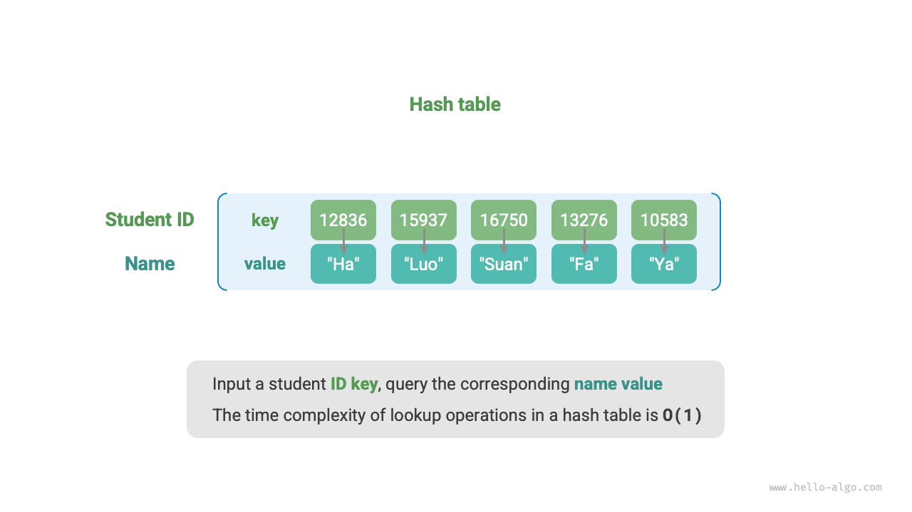

# Hash Table

A <u>hash table</u>, also known as a <u>hash map</u>, stores mappings from keys `key` to values `value`, enabling efficient lookups. Specifically, given a key `key`, we can retrieve the corresponding value `value` from a hash table in $O(1)$ time.

As shown below, suppose we have $n$ students, each with two pieces of information: a name and a student ID. If we want to support the query "given a student ID, return the corresponding name," we can use the hash table shown below.



In addition to hash tables, arrays and linked lists can also implement query functionality. Their efficiency comparison is shown in the following table.

- **Adding elements**: Simply add elements to the end of the array (linked list), using $O(1)$ time.
- **Querying elements**: Since the array (linked list) is unordered, all elements need to be traversed, using $O(n)$ time.
- **Deleting elements**: The element must first be located, then deleted from the array (linked list), using $O(n)$ time.

<p align="center"> Table <id> &nbsp; Comparison of element query efficiency </p>

|                 | Array  | Linked List | Hash Table |
| --------------- | ------ | ----------- | ---------- |
| Find element    | $O(n)$ | $O(n)$      | $O(1)$     |
| Add element     | $O(1)$ | $O(1)$      | $O(1)$     |
| Delete element  | $O(n)$ | $O(n)$      | $O(1)$     |

As we can see, **insertion, deletion, lookup, and update operations in a hash table all have time complexity $O(1)$**, making hash tables highly efficient.

## Common Hash Table Operations

Common operations on hash tables include: initialization, query operations, adding key-value pairs, and deleting key-value pairs. Example code is as follows:

=== "Python"

    ```python title="hash_map.py"
    # Initialize hash table
    hmap: dict = {}

    # Add operation
    # Add key-value pair (key, value) to hash table
    hmap[12836] = "XiaoHa"
    hmap[15937] = "XiaoLuo"
    hmap[16750] = "XiaoSuan"
    hmap[13276] = "XiaoFa"
    hmap[10583] = "XiaoYa"

    # Query operation
    # Input key into hash table to get value
    name: str = hmap[15937]

    # Delete operation
    # Delete key-value pair (key, value) from hash table
    hmap.pop(10583)
    ```

=== "C++"

    ```cpp title="hash_map.cpp"
    /* Initialize hash table */
    unordered_map<int, string> map;

    /* Add operation */
    // Add key-value pair (key, value) to hash table
    map[12836] = "XiaoHa";
    map[15937] = "XiaoLuo";
    map[16750] = "XiaoSuan";
    map[13276] = "XiaoFa";
    map[10583] = "XiaoYa";

    /* Query operation */
    // Input key into hash table to get value
    string name = map[15937];

    /* Delete operation */
    // Delete key-value pair (key, value) from hash table
    map.erase(10583);
    ```

=== "Java"

    ```java title="hash_map.java"
    /* Initialize hash table */
    Map<Integer, String> map = new HashMap<>();

    /* Add operation */
    // Add key-value pair (key, value) to hash table
    map.put(12836, "XiaoHa");
    map.put(15937, "XiaoLuo");
    map.put(16750, "XiaoSuan");
    map.put(13276, "XiaoFa");
    map.put(10583, "XiaoYa");

    /* Query operation */
    // Input key into hash table to get value
    String name = map.get(15937);

    /* Delete operation */
    // Delete key-value pair (key, value) from hash table
    map.remove(10583);
    ```

=== "C#"

    ```csharp title="hash_map.cs"
    /* Initialize hash table */
    Dictionary<int, string> map = new() {
        /* Add operation */
        // Add key-value pair (key, value) to hash table
        { 12836, "XiaoHa" },
        { 15937, "XiaoLuo" },
        { 16750, "XiaoSuan" },
        { 13276, "XiaoFa" },
        { 10583, "XiaoYa" }
    };

    /* Query operation */
    // Input key into hash table to get value
    string name = map[15937];

    /* Delete operation */
    // Delete key-value pair (key, value) from hash table
    map.Remove(10583);
    ```

=== "Go"

    ```go title="hash_map_test.go"
    /* Initialize hash table */
    hmap := make(map[int]string)

    /* Add operation */
    // Add key-value pair (key, value) to hash table
    hmap[12836] = "XiaoHa"
    hmap[15937] = "XiaoLuo"
    hmap[16750] = "XiaoSuan"
    hmap[13276] = "XiaoFa"
    hmap[10583] = "XiaoYa"

    /* Query operation */
    // Input key into hash table to get value
    name := hmap[15937]

    /* Delete operation */
    // Delete key-value pair (key, value) from hash table
    delete(hmap, 10583)
    ```

=== "Swift"

    ```swift title="hash_map.swift"
    /* Initialize hash table */
    var map: [Int: String] = [:]

    /* Add operation */
    // Add key-value pair (key, value) to hash table
    map[12836] = "XiaoHa"
    map[15937] = "XiaoLuo"
    map[16750] = "XiaoSuan"
    map[13276] = "XiaoFa"
    map[10583] = "XiaoYa"

    /* Query operation */
    // Input key into hash table to get value
    let name = map[15937]!

    /* Delete operation */
    // Delete key-value pair (key, value) from hash table
    map.removeValue(forKey: 10583)
    ```

=== "JS"

    ```javascript title="hash_map.js"
    /* Initialize hash table */
    const map = new Map();
    /* Add operation */
    // Add key-value pair (key, value) to hash table
    map.set(12836, 'XiaoHa');
    map.set(15937, 'XiaoLuo');
    map.set(16750, 'XiaoSuan');
    map.set(13276, 'XiaoFa');
    map.set(10583, 'XiaoYa');

    /* Query operation */
    // Input key into hash table to get value
    let name = map.get(15937);

    /* Delete operation */
    // Delete key-value pair (key, value) from hash table
    map.delete(10583);
    ```

=== "TS"

    ```typescript title="hash_map.ts"
    /* Initialize hash table */
    const map = new Map<number, string>();
    /* Add operation */
    // Add key-value pair (key, value) to hash table
    map.set(12836, 'XiaoHa');
    map.set(15937, 'XiaoLuo');
    map.set(16750, 'XiaoSuan');
    map.set(13276, 'XiaoFa');
    map.set(10583, 'XiaoYa');
    console.info('\nAfter adding, hash table is\nKey -> Value');
    console.info(map);

    /* Query operation */
    // Input key into hash table to get value
    let name = map.get(15937);
    console.info('\nInput student ID 15937, queried name ' + name);

    /* Delete operation */
    // Delete key-value pair (key, value) from hash table
    map.delete(10583);
    console.info('\nAfter deleting 10583, hash table is\nKey -> Value');
    console.info(map);
    ```

=== "Dart"

    ```dart title="hash_map.dart"
    /* Initialize hash table */
    Map<int, String> map = {};

    /* Add operation */
    // Add key-value pair (key, value) to hash table
    map[12836] = "XiaoHa";
    map[15937] = "XiaoLuo";
    map[16750] = "XiaoSuan";
    map[13276] = "XiaoFa";
    map[10583] = "XiaoYa";

    /* Query operation */
    // Input key into hash table to get value
    String name = map[15937];

    /* Delete operation */
    // Delete key-value pair (key, value) from hash table
    map.remove(10583);
    ```

=== "Rust"

    ```rust title="hash_map.rs"
    use std::collections::HashMap;

    /* Initialize hash table */
    let mut map: HashMap<i32, String> = HashMap::new();

    /* Add operation */
    // Add key-value pair (key, value) to hash table
    map.insert(12836, "XiaoHa".to_string());
    map.insert(15937, "XiaoLuo".to_string());
    map.insert(16750, "XiaoSuan".to_string());
    map.insert(13276, "XiaoFa".to_string());
    map.insert(10583, "XiaoYa".to_string());

    /* Query operation */
    // Input key into hash table to get value
    let _name: Option<&String> = map.get(&15937);

    /* Delete operation */
    // Delete key-value pair (key, value) from hash table
    let _removed_value: Option<String> = map.remove(&10583);
    ```

=== "C"

    ```c title="hash_map.c"
    // C does not provide a built-in hash table
    ```

=== "Kotlin"

    ```kotlin title="hash_map.kt"
    /* Initialize hash table */
    val map = HashMap<Int,String>()

    /* Add operation */
    // Add key-value pair (key, value) to hash table
    map[12836] = "XiaoHa"
    map[15937] = "XiaoLuo"
    map[16750] = "XiaoSuan"
    map[13276] = "XiaoFa"
    map[10583] = "XiaoYa"

    /* Query operation */
    // Input key into hash table to get value
    val name = map[15937]

    /* Delete operation */
    // Delete key-value pair (key, value) from hash table
    map.remove(10583)
    ```

=== "Ruby"

    ```ruby title="hash_map.rb"
    # Initialize hash table
    hmap = {}

    # Add operation
    # Add key-value pair (key, value) to hash table
    hmap[12836] = "XiaoHa"
    hmap[15937] = "XiaoLuo"
    hmap[16750] = "XiaoSuan"
    hmap[13276] = "XiaoFa"
    hmap[10583] = "XiaoYa"

    # Query operation
    # Input key into hash table to get value
    name = hmap[15937]

    # Delete operation
    # Delete key-value pair (key, value) from hash table
    hmap.delete(10583)
    ```

??? pythontutor "Visualized Execution"

    https://pythontutor.com/render.html#code=%22%22%22Driver%20Code%22%22%22%0Aif%20__name__%20%3D%3D%20%22__main__%22%3A%0A%20%20%20%20%23%20%E5%88%9D%E5%A7%8B%E5%8C%96%E5%93%88%E5%B8%8C%E8%A1%A8%0A%20%20%20%20hmap%20%3D%20%7B%7D%0A%20%20%20%20%0A%20%20%20%20%23%20%E6%B7%BB%E5%8A%A0%E6%93%8D%E4%BD%9C%0A%20%20%20%20%23%20%E5%9C%A8%E5%93%88%E5%B8%8C%E8%A1%A8%E4%B8%AD%E6%B7%BB%E5%8A%A0%E9%94%AE%E5%80%BC%E5%AF%B9%20%28key,%20value%29%0A%20%20%20%20hmap%5B12836%5D%20%3D%20%22%E5%B0%8F%E5%93%88%22%0A%20%20%20%20hmap%5B15937%5D%20%3D%20%22%E5%B0%8F%E5%95%B0%22%0A%20%20%20%20hmap%5B16750%5D%20%3D%20%22%E5%B0%8F%E7%AE%97%22%0A%20%20%20%20hmap%5B13276%5D%20%3D%20%22%E5%B0%8F%E6%B3%95%22%0A%20%20%20%20hmap%5B10583%5D%20%3D%20%22%E5%B0%8F%E9%B8%AD%22%0A%20%20%20%20%0A%20%20%20%20%23%20%E6%9F%A5%E8%AF%A2%E6%93%8D%E4%BD%9C%0A%20%20%20%20%23%20%E5%90%91%E5%93%88%E5%B8%8C%E8%A1%A8%E4%B8%AD%E8%BE%93%E5%85%A5%E9%94%AE%20key%20%EF%BC%8C%E5%BE%97%E5%88%B0%E5%80%BC%20value%0A%20%20%20%20name%20%3D%20hmap%5B15937%5D%0A%20%20%20%20%0A%20%20%20%20%23%20%E5%88%A0%E9%99%A4%E6%93%8D%E4%BD%9C%0A%20%20%20%20%23%20%E5%9C%A8%E5%93%88%E5%B8%8C%E8%A1%A8%E4%B8%AD%E5%88%A0%E9%99%A4%E9%94%AE%E5%80%BC%E5%AF%B9%20%28key,%20value%29%0A%20%20%20%20hmap.pop%2810583%29&cumulative=false&curInstr=2&heapPrimitives=nevernest&mode=display&origin=opt-frontend.js&py=311&rawInputLstJSON=%5B%5D&textReferences=false

There are three common ways to traverse a hash table: traversing key-value pairs, traversing keys, and traversing values. Example code is as follows:

=== "Python"

    ```python title="hash_map.py"
    # Traverse hash table
    # Traverse key-value pairs key->value
    for key, value in hmap.items():
        print(key, "->", value)
    # Traverse keys only
    for key in hmap.keys():
        print(key)
    # Traverse values only
    for value in hmap.values():
        print(value)
    ```

=== "C++"

    ```cpp title="hash_map.cpp"
    /* Traverse hash table */
    // Traverse key-value pairs key->value
    for (auto kv: map) {
        cout << kv.first << " -> " << kv.second << endl;
    }
    // Traverse using iterator key->value
    for (auto iter = map.begin(); iter != map.end(); iter++) {
        cout << iter->first << "->" << iter->second << endl;
    }
    ```

=== "Java"

    ```java title="hash_map.java"
    /* Traverse hash table */
    // Traverse key-value pairs key->value
    for (Map.Entry<Integer, String> kv: map.entrySet()) {
        System.out.println(kv.getKey() + " -> " + kv.getValue());
    }
    // Traverse keys only
    for (int key: map.keySet()) {
        System.out.println(key);
    }
    // Traverse values only
    for (String val: map.values()) {
        System.out.println(val);
    }
    ```

=== "C#"

    ```csharp title="hash_map.cs"
    /* Traverse hash table */
    // Traverse key-value pairs Key->Value
    foreach (var kv in map) {
        Console.WriteLine(kv.Key + " -> " + kv.Value);
    }
    // Traverse keys only
    foreach (int key in map.Keys) {
        Console.WriteLine(key);
    }
    // Traverse values only
    foreach (string val in map.Values) {
        Console.WriteLine(val);
    }
    ```

=== "Go"

    ```go title="hash_map_test.go"
    /* Traverse hash table */
    // Traverse key-value pairs key->value
    for key, value := range hmap {
        fmt.Println(key, "->", value)
    }
    // Traverse keys only
    for key := range hmap {
        fmt.Println(key)
    }
    // Traverse values only
    for _, value := range hmap {
        fmt.Println(value)
    }
    ```

=== "Swift"

    ```swift title="hash_map.swift"
    /* Traverse hash table */
    // Traverse key-value pairs Key->Value
    for (key, value) in map {
        print("\(key) -> \(value)")
    }
    // Traverse keys only
    for key in map.keys {
        print(key)
    }
    // Traverse values only
    for value in map.values {
        print(value)
    }
    ```

=== "JS"

    ```javascript title="hash_map.js"
    /* Traverse hash table */
    console.info('\nTraverse key-value pairs Key->Value');
    for (const [k, v] of map.entries()) {
        console.info(k + ' -> ' + v);
    }
    console.info('\nTraverse keys only Key');
    for (const k of map.keys()) {
        console.info(k);
    }
    console.info('\nTraverse values only Value');
    for (const v of map.values()) {
        console.info(v);
    }
    ```

=== "TS"

    ```typescript title="hash_map.ts"
    /* Traverse hash table */
    console.info('\nTraverse key-value pairs Key->Value');
    for (const [k, v] of map.entries()) {
        console.info(k + ' -> ' + v);
    }
    console.info('\nTraverse keys only Key');
    for (const k of map.keys()) {
        console.info(k);
    }
    console.info('\nTraverse values only Value');
    for (const v of map.values()) {
        console.info(v);
    }
    ```

=== "Dart"

    ```dart title="hash_map.dart"
    /* Traverse hash table */
    // Traverse key-value pairs Key->Value
    map.forEach((key, value) {
      print('$key -> $value');
    });

    // Traverse keys only
    map.keys.forEach((key) {
      print(key);
    });

    // Traverse values only
    map.values.forEach((value) {
      print(value);
    });
    ```

=== "Rust"

    ```rust title="hash_map.rs"
    /* Traverse hash table */
    // Traverse key-value pairs Key->Value
    for (key, value) in &map {
        println!("{key} -> {value}");
    }

    // Traverse keys only
    for key in map.keys() {
        println!("{key}");
    }

    // Traverse values only
    for value in map.values() {
        println!("{value}");
    }
    ```

=== "C"

    ```c title="hash_map.c"
    // C does not provide a built-in hash table
    ```

=== "Kotlin"

    ```kotlin title="hash_map.kt"
    /* Traverse hash table */
    // Traverse key-value pairs key->value
    for ((key, value) in map) {
        println("$key -> $value")
    }
    // Traverse keys only
    for (key in map.keys) {
        println(key)
    }
    // Traverse values only
    for (_val in map.values) {
        println(_val)
    }
    ```

=== "Ruby"

    ```ruby title="hash_map.rb"
    # Traverse hash table
    # Traverse key-value pairs key->value
    hmap.entries.each { |key, value| puts "#{key} -> #{value}" }

    # Traverse keys only
    hmap.keys.each { |key| puts key }

    # Traverse values only
    hmap.values.each { |val| puts val }
    ```

??? pythontutor "Visualized Execution"

    https://pythontutor.com/render.html#code=%22%22%22Driver%20Code%22%22%22%0Aif%20__name__%20%3D%3D%20%22__main__%22%3A%0A%20%20%20%20%23%20%E5%88%9D%E5%A7%8B%E5%8C%96%E5%93%88%E5%B8%8C%E8%A1%A8%0A%20%20%20%20hmap%20%3D%20%7B%7D%0A%20%20%20%20%0A%20%20%20%20%23%20%E6%B7%BB%E5%8A%A0%E6%93%8D%E4%BD%9C%0A%20%20%20%20%23%20%E5%9C%A8%E5%93%88%E5%B8%8C%E8%A1%A8%E4%B8%AD%E6%B7%BB%E5%8A%A0%E9%94%AE%E5%80%BC%E5%AF%B9%20%28key,%20value%29%0A%20%20%20%20hmap%5B12836%5D%20%3D%20%22%E5%B0%8F%E5%93%88%22%0A%20%20%20%20hmap%5B15937%5D%20%3D%20%22%E5%B0%8F%E5%95%B0%22%0A%20%20%20%20hmap%5B16750%5D%20%3D%20%22%E5%B0%8F%E7%AE%97%22%0A%20%20%20%20hmap%5B13276%5D%20%3D%20%22%E5%B0%8F%E6%B3%95%22%0A%20%20%20%20hmap%5B10583%5D%20%3D%20%22%E5%B0%8F%E9%B8%AD%22%0A%20%20%20%20%0A%20%20%20%20%23%20%E9%81%8D%E5%8E%86%E5%93%88%E5%B8%8C%E8%A1%A8%0A%20%20%20%20%23%20%E9%81%8D%E5%8E%86%E9%94%AE%E5%80%BC%E5%AF%B9%20key-%3Evalue%0A%20%20%20%20for%20key,%20value%20in%20hmap.items%28%29%3A%0A%20%20%20%20%20%20%20%20print%28key,%20%22-%3E%22,%20value%29%0A%20%20%20%20%23%20%E5%8D%95%E7%8B%AC%E9%81%8D%E5%8E%86%E9%94%AE%20key%0A%20%20%20%20for%20key%20in%20hmap.keys%28%29%3A%0A%20%20%20%20%20%20%20%20print%28key%29%0A%20%20%20%20%23%20%E5%8D%95%E7%8B%AC%E9%81%8D%E5%8E%86%E5%80%BC%20value%0A%20%20%20%20for%20value%20in%20hmap.values%28%29%3A%0A%20%20%20%20%20%20%20%20print%28value%29&cumulative=false&curInstr=8&heapPrimitives=nevernest&mode=display&origin=opt-frontend.js&py=311&rawInputLstJSON=%5B%5D&textReferences=false

## Simple Hash Table Implementation

Let's start with the simplest case: **implementing a hash table with just an array**. In a hash table, each empty slot in the array is called a <u>bucket</u>, and each bucket can store one key-value pair. A lookup therefore consists of finding the bucket for `key` and reading the `value` stored there.

So how do we find the right bucket for a given `key`? We do this with a <u>hash function</u>. A hash function maps a larger input space to a smaller output space. In a hash table, the input space is the set of all `key`s, and the output space is the set of all buckets (array indices). In other words, given a `key`, **the hash function tells us where the corresponding key-value pair should be stored in the array**.

Given a `key`, computing the bucket index involves the following two steps:

1. Use a hash algorithm `hash()` to compute a hash value.
2. Take that hash value modulo the number of buckets (array length), `capacity`, to obtain the bucket (array index) `index` corresponding to the `key`.

```shell
index = hash(key) % capacity
```

We can then use `index` to access the corresponding bucket in the hash table and retrieve the `value`.

Suppose the array length is `capacity = 100` and the hash algorithm is `hash(key) = key`. Then the hash function is `key % 100`. The figure below illustrates how this hash function works, using student ID as `key` and name as `value`.


The following code implements a simple hash table. Here, we encapsulate `key` and `value` into a class `Pair` to represent a key-value pair.

```src
[file]{array_hash_map}-[class]{array_hash_map}-[func]{}
```

## Hash Collision and Resizing

Fundamentally, a hash function maps the input space consisting of all `key`s to the output space consisting of all array indices, and the input space is often much larger than the output space. Therefore, **in theory, different inputs must sometimes map to the same output**.

For the hash function in the above example, when the input `key`s have the same last two digits, the hash function produces the same output. For example, when querying two students with IDs 12836 and 20336, we get:

```shell
12836 % 100 = 36
20336 % 100 = 36
```

As shown below, two student IDs now point to the same name, which is clearly incorrect. We call this situation, where multiple inputs map to the same output, a <u>hash collision</u>.


It's easy to see that the larger the hash table capacity $n$, the lower the probability that multiple `key`s will be assigned to the same bucket, and the fewer collisions. Therefore, **we can reduce hash collisions by expanding the hash table**.

As shown in the figure below, before expansion, the key-value pairs `(136, A)` and `(236, D)` collided, but after expansion, the collision disappears.


Like resizing an array, resizing a hash table requires migrating all key-value pairs from the original table to the new table, which is expensive. In addition, because the hash table capacity `capacity` changes, we must recompute the storage location of every key-value pair using the hash function, which further increases the cost of resizing. For this reason, programming languages typically reserve a sufficiently large hash table capacity to avoid frequent resizing.

The <u>load factor</u> is an important concept in hash tables. It is defined as the number of elements in the hash table divided by the number of buckets and is used to measure the severity of hash collisions. **It is also commonly used as a threshold for triggering hash table resizing**. For example, in Java, when the load factor exceeds $0.75$, the system expands the hash table to twice its original size.
