# Heap

A <u>heap</u> is a complete binary tree that satisfies specific conditions and can be mainly categorized into two types, as shown in the figure below.

- <u>min heap</u>: The value of any node $\leq$ the values of its child nodes.
- <u>max heap</u>: The value of any node $\geq$ the values of its child nodes.


As a special case of a complete binary tree, a heap has the following characteristics:

- The bottom layer nodes are filled from left to right, and nodes in other layers are fully filled.
- The root node of the binary tree is called the "top" of the heap, and the bottom-rightmost node is called the "bottom" of the heap.
- For max heaps (min heaps), the value of the top element (root) is the largest (smallest) among all elements.

## Common heap operations

It should be noted that many programming languages provide a <u>priority queue</u>, which is an abstract data structure defined as a queue with priority sorting.

In practice, **heaps are often used to implement priority queues. A max heap corresponds to a priority queue where elements are dequeued in descending order**. From a usage perspective, we can consider "priority queue" and "heap" as equivalent data structures. Therefore, this book does not make a special distinction between the two, uniformly referring to them as "heap."

Common operations on heaps are shown in the table below, and the method names may vary based on the programming language.

<p align="center"> Table <id> &nbsp; Efficiency of Heap Operations </p>

| Method name | Description                                                  | Time complexity |
| ----------- | ------------------------------------------------------------ | --------------- |
| `push()`    | Add an element to the heap                                   | $O(\log n)$     |
| `pop()`     | Remove the top element from the heap                         | $O(\log n)$     |
| `peek()`    | Access the top element (for max/min heap, the max/min value) | $O(1)$          |
| `size()`    | Get the number of elements in the heap                       | $O(1)$          |
| `isEmpty()` | Check if the heap is empty                                   | $O(1)$          |

In practice, we can directly use the heap class (or priority queue class) provided by programming languages.

Similar to sorting algorithms where we have "ascending order" and "descending order", we can switch between "min heap" and "max heap" by setting a `flag` or modifying the `Comparator`. The code is as follows:

=== "Python"

    ```python title="heap.py"
    # Initialize a min heap
    min_heap, flag = [], 1
    # Initialize a max heap
    max_heap, flag = [], -1

    # Python's heapq module implements a min heap by default
    # By negating the elements before pushing them to the heap, we invert the order and thus implement a max heap
    # In this example, flag = 1 corresponds to a min heap, while flag = -1 corresponds to a max heap

    # Push elements into the heap
    heapq.heappush(max_heap, flag * 1)
    heapq.heappush(max_heap, flag * 3)
    heapq.heappush(max_heap, flag * 2)
    heapq.heappush(max_heap, flag * 5)
    heapq.heappush(max_heap, flag * 4)

    # Retrieve the top element of the heap
    peek: int = flag * max_heap[0] # 5

    # Pop the top element of the heap
    # The popped elements will form a sequence in descending order
    val = flag * heapq.heappop(max_heap) # 5
    val = flag * heapq.heappop(max_heap) # 4
    val = flag * heapq.heappop(max_heap) # 3
    val = flag * heapq.heappop(max_heap) # 2
    val = flag * heapq.heappop(max_heap) # 1

    # Get the size of the heap
    size: int = len(max_heap)

    # Check if the heap is empty
    is_empty: bool = not max_heap

    # Create a heap from a list
    min_heap: list[int] = [1, 3, 2, 5, 4]
    heapq.heapify(min_heap)
    ```

=== "C++"

    ```cpp title="heap.cpp"
    /* Initialize a heap */
    // Initialize a min heap
    priority_queue<int, vector<int>, greater<int>> minHeap;
    // Initialize a max heap
    priority_queue<int, vector<int>, less<int>> maxHeap;

    /* Push elements into the heap */
    maxHeap.push(1);
    maxHeap.push(3);
    maxHeap.push(2);
    maxHeap.push(5);
    maxHeap.push(4);

    /* Retrieve the top element of the heap */
    int peek = maxHeap.top(); // 5

    /* Pop the top element of the heap */
    // The popped elements will form a sequence in descending order
    maxHeap.pop(); // 5
    maxHeap.pop(); // 4
    maxHeap.pop(); // 3
    maxHeap.pop(); // 2
    maxHeap.pop(); // 1

    /* Get the size of the heap */
    int size = maxHeap.size();

    /* Check if the heap is empty */
    bool isEmpty = maxHeap.empty();

    /* Create a heap from a list */
    vector<int> input{1, 3, 2, 5, 4};
    priority_queue<int, vector<int>, greater<int>> minHeap(input.begin(), input.end());
    ```

=== "Java"

    ```java title="heap.java"
    /* Initialize a heap */
    // Initialize a min heap
    Queue<Integer> minHeap = new PriorityQueue<>();
    // Initialize a max heap (Simply modify the Comparator using a lambda expression）
    Queue<Integer> maxHeap = new PriorityQueue<>((a, b) -> b - a);
    
    /* Push elements into the heap */
    maxHeap.offer(1);
    maxHeap.offer(3);
    maxHeap.offer(2);
    maxHeap.offer(5);
    maxHeap.offer(4);
    
    /* Retrieve the top element of the heap */
    int peek = maxHeap.peek(); // 5
    
    /* Pop the top element of the heap */
    // The popped elements will form a sequence in descending order
    peek = maxHeap.poll(); // 5
    peek = maxHeap.poll(); // 4
    peek = maxHeap.poll(); // 3
    peek = maxHeap.poll(); // 2
    peek = maxHeap.poll(); // 1
    
    /* Get the size of the heap */
    int size = maxHeap.size();
    
    /* Check if the heap is empty */
    boolean isEmpty = maxHeap.isEmpty();
    
    /* Create a heap from a list */
    minHeap = new PriorityQueue<>(Arrays.asList(1, 3, 2, 5, 4));
    ```

=== "C#"

    ```csharp title="heap.cs"
    /* Initialize a heap */
    // Initialize a min heap
    PriorityQueue<int, int> minHeap = new();
    // Initialize a max heap (Simply modify the Comparator using a lambda expression)
    PriorityQueue<int, int> maxHeap = new(Comparer<int>.Create((x, y) => y - x));

    /* Push elements into the heap */
    maxHeap.Enqueue(1, 1);
    maxHeap.Enqueue(3, 3);
    maxHeap.Enqueue(2, 2);
    maxHeap.Enqueue(5, 5);
    maxHeap.Enqueue(4, 4);

    /* Retrieve the top element of the heap */
    int peek = maxHeap.Peek();//5

    /* Pop the top element of the heap */
    // The popped elements will form a sequence in descending order
    peek = maxHeap.Dequeue();  // 5
    peek = maxHeap.Dequeue();  // 4
    peek = maxHeap.Dequeue();  // 3
    peek = maxHeap.Dequeue();  // 2
    peek = maxHeap.Dequeue();  // 1

    /* Get the size of the heap */
    int size = maxHeap.Count;

    /* Check if the heap is empty */
    bool isEmpty = maxHeap.Count == 0;

    /* Create a heap from a list */
    minHeap = new PriorityQueue<int, int>([(1, 1), (3, 3), (2, 2), (5, 5), (4, 4)]);
    ```

=== "Go"

    ```go title="heap.go"
    // In Go, we can construct a max heap of integers by implementing heap.Interface
    // Note that implementing heap.Interface requires also implementing sort.Interface
    type intHeap []any

    // Push method of heap.Interface, which pushes an element into the heap
    func (h *intHeap) Push(x any) {
        // Both Push and Pop use a pointer receiver
        // because they not only adjust the elements of the slice but also change its length
        *h = append(*h, x.(int))
    }

    // Pop method of heap.Interface, which removes the top element of the heap
    func (h *intHeap) Pop() any {
        // The element to pop from the heap is stored at the end
        last := (*h)[len(*h)-1]
        *h = (*h)[:len(*h)-1]
        return last
    }

    // Len method of sort.Interface
    func (h *intHeap) Len() int {
        return len(*h)
    }

    // Less method of sort.Interface
    func (h *intHeap) Less(i, j int) bool {
        // If you want to implement a min heap, you would change this to a less-than comparison
        return (*h)[i].(int) > (*h)[j].(int)
    }

    // Swap method of sort.Interface
    func (h *intHeap) Swap(i, j int) {
        (*h)[i], (*h)[j] = (*h)[j], (*h)[i]
    }

    // Top Retrieve the top element of the heap
    func (h *intHeap) Top() any {
        return (*h)[0]
    }

    /* Driver Code */
    func TestHeap(t *testing.T) {
        /* Initialize a heap */
        // Initialize a max heap
        maxHeap := &intHeap{}
        heap.Init(maxHeap)
        /* Push elements into the heap */
        // Call the methods of heap.Interface to add elements
        heap.Push(maxHeap, 1)
        heap.Push(maxHeap, 3)
        heap.Push(maxHeap, 2)
        heap.Push(maxHeap, 4)
        heap.Push(maxHeap, 5)

        /* Retrieve the top element of the heap */
        top := maxHeap.Top()
        fmt.Printf("The top element of the heap is %d\n", top)

        /* Pop the top element of the heap */
        // Call the methods of heap.Interface to remove elements
        heap.Pop(maxHeap) // 5
        heap.Pop(maxHeap) // 4
        heap.Pop(maxHeap) // 3
        heap.Pop(maxHeap) // 2
        heap.Pop(maxHeap) // 1

        /* Get the size of the heap */
        size := len(*maxHeap)
        fmt.Printf("The number of elements in the heap is %d\n", size)

        /* Check if the heap is empty */
        isEmpty := len(*maxHeap) == 0
        fmt.Printf("Is the heap empty? %t\n", isEmpty)
    }
    ```

=== "Swift"

    ```swift title="heap.swift"
    /* Initialize a heap */
    // Swift’s Heap type supports both max heaps and min heaps, and need the swift-collections library
    var heap = Heap<Int>()

    /* Push elements into the heap */
    heap.insert(1)
    heap.insert(3)
    heap.insert(2)
    heap.insert(5)
    heap.insert(4)

    /* Retrieve the top element of the heap */
    var peek = heap.max()!

    /* Pop the top element of the heap */
    peek = heap.removeMax() // 5
    peek = heap.removeMax() // 4
    peek = heap.removeMax() // 3
    peek = heap.removeMax() // 2
    peek = heap.removeMax() // 1

    /* Get the size of the heap */
    let size = heap.count

    /* Check if the heap is empty */
    let isEmpty = heap.isEmpty

    /* Create a heap from a list */
    let heap2 = Heap([1, 3, 2, 5, 4])
    ```

=== "JS"

    ```javascript title="heap.js"
    // JavaScript does not provide a built-in Heap class
    ```

=== "TS"

    ```typescript title="heap.ts"
    // TypeScript does not provide a built-in Heap class
    ```

=== "Dart"

    ```dart title="heap.dart"
    // Dart does not provide a built-in Heap class
    ```

=== "Rust"

    ```rust title="heap.rs"
    use std::collections::BinaryHeap;
    use std::cmp::Reverse;

    /* Initialize a heap */
    // Initialize a min heap
    let mut min_heap = BinaryHeap::<Reverse<i32>>::new();
    // Initialize a max heap
    let mut max_heap = BinaryHeap::new();

    /* Push elements into the heap */
    max_heap.push(1);
    max_heap.push(3);
    max_heap.push(2);
    max_heap.push(5);
    max_heap.push(4);
    
    /* Retrieve the top element of the heap */
    let peek = max_heap.peek().unwrap();  // 5

    /* Pop the top element of the heap */
    // The popped elements will form a sequence in descending order
    let peek = max_heap.pop().unwrap();   // 5
    let peek = max_heap.pop().unwrap();   // 4
    let peek = max_heap.pop().unwrap();   // 3
    let peek = max_heap.pop().unwrap();   // 2
    let peek = max_heap.pop().unwrap();   // 1

    /* Get the size of the heap */
    let size = max_heap.len();

    /* Check if the heap is empty */
    let is_empty = max_heap.is_empty();

    /* Create a heap from a list */
    let min_heap = BinaryHeap::from(vec![Reverse(1), Reverse(3), Reverse(2), Reverse(5), Reverse(4)]);
    ```

=== "C"

    ```c title="heap.c"
    // C does not provide a built-in Heap class
    ```

=== "Kotlin"

    ```kotlin title="heap.kt"
    /* Initialize a heap */
    // Initialize a min heap
    var minHeap = PriorityQueue<Int>()
    // Initialize a max heap (Simply modify the Comparator using a lambda expression）
    val maxHeap = PriorityQueue { a: Int, b: Int -> b - a }
    
    /* Push elements into the heap */
    maxHeap.offer(1)
    maxHeap.offer(3)
    maxHeap.offer(2)
    maxHeap.offer(5)
    maxHeap.offer(4)
    
    /* Retrieve the top element of the heap */
    var peek = maxHeap.peek() // 5
    
    /* Pop the top element of the heap */
    // The popped elements will form a sequence in descending order
    peek = maxHeap.poll() // 5
    peek = maxHeap.poll() // 4
    peek = maxHeap.poll() // 3
    peek = maxHeap.poll() // 2
    peek = maxHeap.poll() // 1
    
    /* Get the size of the heap */
    val size = maxHeap.size
    
    /* Check if the heap is empty */
    val isEmpty = maxHeap.isEmpty()
    
    /* Create a heap from a list */
    minHeap = PriorityQueue(mutableListOf(1, 3, 2, 5, 4))
    ```

=== "Ruby"

    ```ruby title="heap.rb"

    ```

=== "Zig"

    ```zig title="heap.zig"

    ```

??? pythontutor "Code visualization"

    https://pythontutor.com/render.html#code=import%20heapq%0A%0A%22%22%22Driver%20Code%22%22%22%0Aif%20__name__%20%3D%3D%20%22__main__%22%3A%0A%20%20%20%20%23%20%E5%88%9D%E5%A7%8B%E5%8C%96%E5%B0%8F%E9%A1%B6%E5%A0%86%0A%20%20%20%20min_heap,%20flag%20%3D%20%5B%5D,%201%0A%20%20%20%20%23%20%E5%88%9D%E5%A7%8B%E5%8C%96%E5%A4%A7%E9%A1%B6%E5%A0%86%0A%20%20%20%20max_heap,%20flag%20%3D%20%5B%5D,%20-1%0A%20%20%20%20%0A%20%20%20%20%23%20Python%20%E7%9A%84%20heapq%20%E6%A8%A1%E5%9D%97%E9%BB%98%E8%AE%A4%E5%AE%9E%E7%8E%B0%E5%B0%8F%E9%A1%B6%E5%A0%86%0A%20%20%20%20%23%20%E8%80%83%E8%99%91%E5%B0%86%E2%80%9C%E5%85%83%E7%B4%A0%E5%8F%96%E8%B4%9F%E2%80%9D%E5%90%8E%E5%86%8D%E5%85%A5%E5%A0%86%EF%BC%8C%E8%BF%99%E6%A0%B7%E5%B0%B1%E5%8F%AF%E4%BB%A5%E5%B0%86%E5%A4%A7%E5%B0%8F%E5%85%B3%E7%B3%BB%E9%A2%A0%E5%80%92%EF%BC%8C%E4%BB%8E%E8%80%8C%E5%AE%9E%E7%8E%B0%E5%A4%A7%E9%A1%B6%E5%A0%86%0A%20%20%20%20%23%20%E5%9C%A8%E6%9C%AC%E7%A4%BA%E4%BE%8B%E4%B8%AD%EF%BC%8Cflag%20%3D%201%20%E6%97%B6%E5%AF%B9%E5%BA%94%E5%B0%8F%E9%A1%B6%E5%A0%86%EF%BC%8Cflag%20%3D%20-1%20%E6%97%B6%E5%AF%B9%E5%BA%94%E5%A4%A7%E9%A1%B6%E5%A0%86%0A%20%20%20%20%0A%20%20%20%20%23%20%E5%85%83%E7%B4%A0%E5%85%A5%E5%A0%86%0A%20%20%20%20heapq.heappush%28max_heap,%20flag%20*%201%29%0A%20%20%20%20heapq.heappush%28max_heap,%20flag%20*%203%29%0A%20%20%20%20heapq.heappush%28max_heap,%20flag%20*%202%29%0A%20%20%20%20heapq.heappush%28max_heap,%20flag%20*%205%29%0A%20%20%20%20heapq.heappush%28max_heap,%20flag%20*%204%29%0A%20%20%20%20%0A%20%20%20%20%23%20%E8%8E%B7%E5%8F%96%E5%A0%86%E9%A1%B6%E5%85%83%E7%B4%A0%0A%20%20%20%20peek%20%3D%20flag%20*%20max_heap%5B0%5D%20%23%205%0A%20%20%20%20%0A%20%20%20%20%23%20%E5%A0%86%E9%A1%B6%E5%85%83%E7%B4%A0%E5%87%BA%E5%A0%86%0A%20%20%20%20%23%20%E5%87%BA%E5%A0%86%E5%85%83%E7%B4%A0%E4%BC%9A%E5%BD%A2%E6%88%90%E4%B8%80%E4%B8%AA%E4%BB%8E%E5%A4%A7%E5%88%B0%E5%B0%8F%E7%9A%84%E5%BA%8F%E5%88%97%0A%20%20%20%20val%20%3D%20flag%20*%20heapq.heappop%28max_heap%29%20%23%205%0A%20%20%20%20val%20%3D%20flag%20*%20heapq.heappop%28max_heap%29%20%23%204%0A%20%20%20%20val%20%3D%20flag%20*%20heapq.heappop%28max_heap%29%20%23%203%0A%20%20%20%20val%20%3D%20flag%20*%20heapq.heappop%28max_heap%29%20%23%202%0A%20%20%20%20val%20%3D%20flag%20*%20heapq.heappop%28max_heap%29%20%23%201%0A%20%20%20%20%0A%20%20%20%20%23%20%E8%8E%B7%E5%8F%96%E5%A0%86%E5%A4%A7%E5%B0%8F%0A%20%20%20%20size%20%3D%20len%28max_heap%29%0A%20%20%20%20%0A%20%20%20%20%23%20%E5%88%A4%E6%96%AD%E5%A0%86%E6%98%AF%E5%90%A6%E4%B8%BA%E7%A9%BA%0A%20%20%20%20is_empty%20%3D%20not%20max_heap%0A%20%20%20%20%0A%20%20%20%20%23%20%E8%BE%93%E5%85%A5%E5%88%97%E8%A1%A8%E5%B9%B6%E5%BB%BA%E5%A0%86%0A%20%20%20%20min_heap%20%3D%20%5B1,%203,%202,%205,%204%5D%0A%20%20%20%20heapq.heapify%28min_heap%29&cumulative=false&curInstr=3&heapPrimitives=nevernest&mode=display&origin=opt-frontend.js&py=311&rawInputLstJSON=%5B%5D&textReferences=false

## Implementation of the heap

The following implementation is of a max heap. To convert it into a min heap, simply invert all size logic comparisons (for example, replace $\geq$ with $\leq$). Interested readers are encouraged to implement it on their own.

### Heap storage and representation

As mentioned in the "Binary Trees" section, complete binary trees are highly suitable for array representation. Since heaps are a type of complete binary tree, **we will use arrays to store heaps**.

When using an array to represent a binary tree, elements represent node values, and indexes represent node positions in the binary tree. **Node pointers are implemented through an index mapping formula**.

As shown in the figure below, given an index $i$, the index of its left child is $2i + 1$, the index of its right child is $2i + 2$, and the index of its parent is $(i - 1) / 2$ (floor division). When the index is out of bounds, it signifies a null node or the node does not exist.

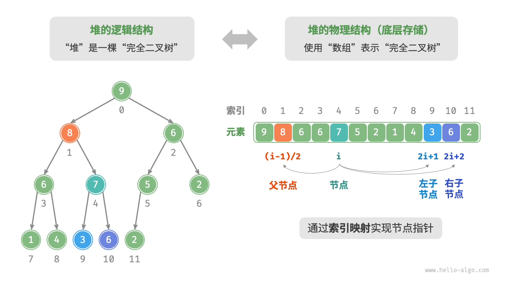

We can encapsulate the index mapping formula into functions for convenient later use:

```src
[file]{my_heap}-[class]{max_heap}-[func]{parent}
```

### Accessing the top element of the heap

The top element of the heap is the root node of the binary tree, which is also the first element of the list:

```src
[file]{my_heap}-[class]{max_heap}-[func]{peek}
```

### Inserting an element into the heap

Given an element `val`, we first add it to the bottom of the heap. After addition, since `val` may be larger than other elements in the heap, the heap's integrity might be compromised, **thus it's necessary to repair the path from the inserted node to the root node**. This operation is called <u>heapify</u>.

Considering starting from the node inserted, **perform heapify from bottom to top**. As shown in the figure below, we compare the value of the inserted node with its parent node, and if the inserted node is larger, we swap them. Then continue this operation, repairing each node in the heap from bottom to top until reaching the root or a node that does not need swapping.

=== "<1>"
    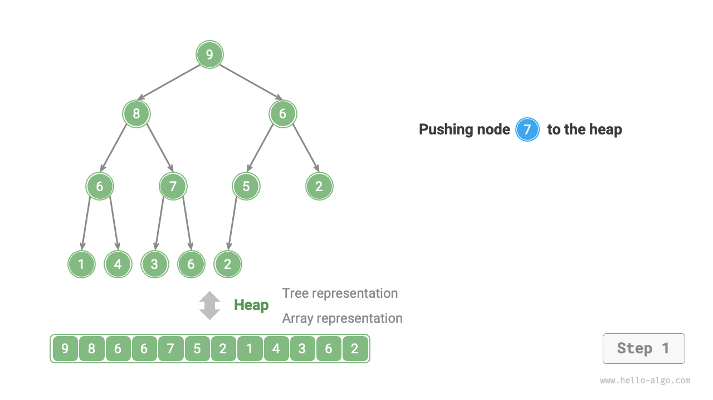

=== "<2>"
    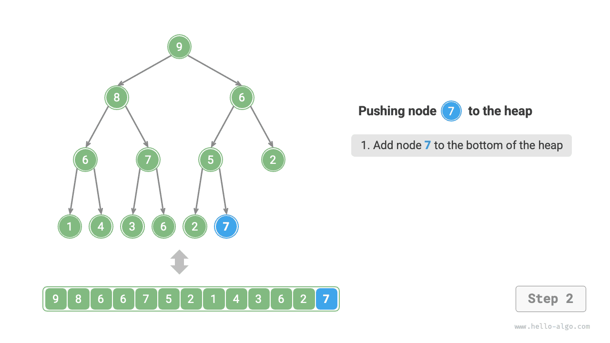

=== "<3>"
    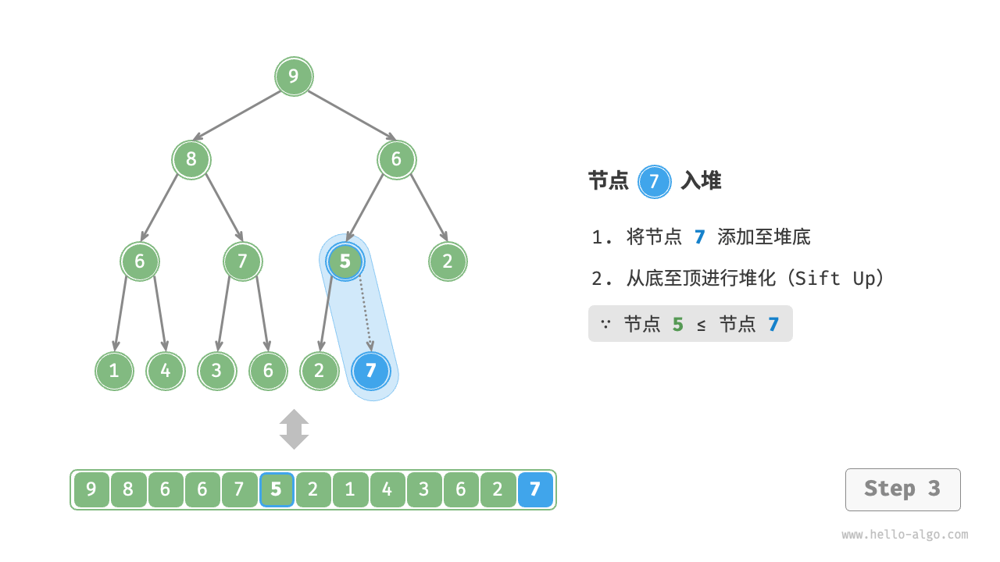

=== "<4>"
    

=== "<5>"
    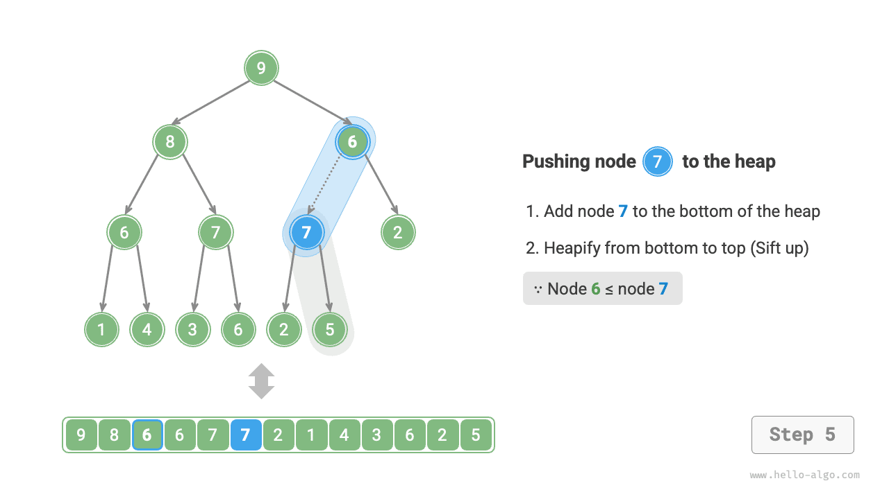

=== "<6>"
    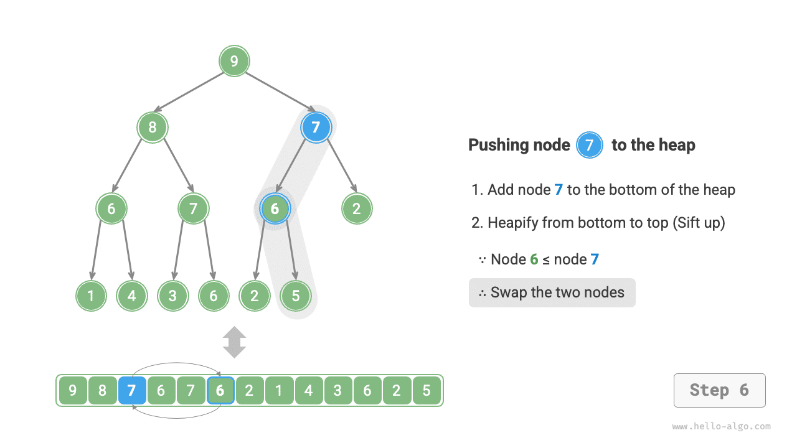

=== "<7>"
    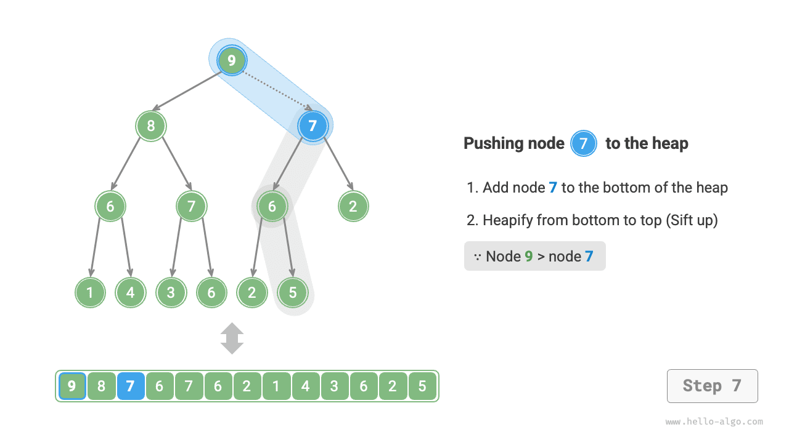

=== "<8>"
    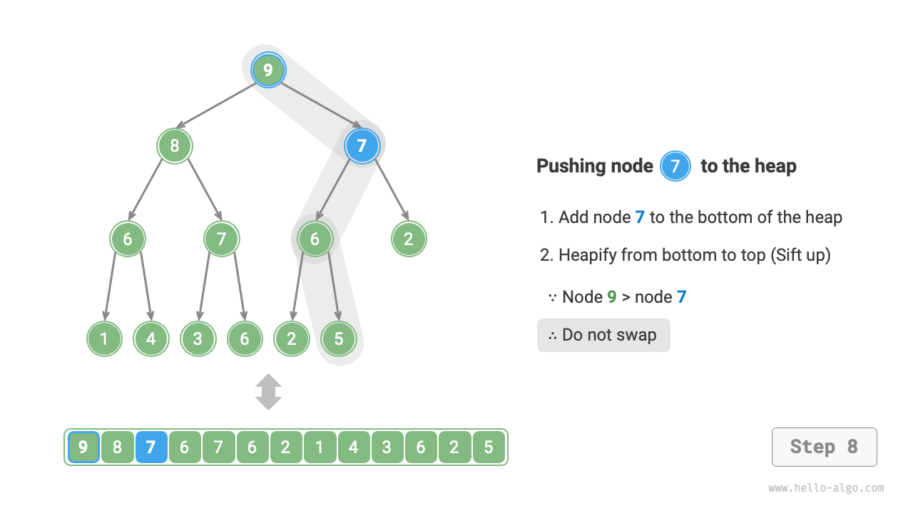

=== "<9>"
    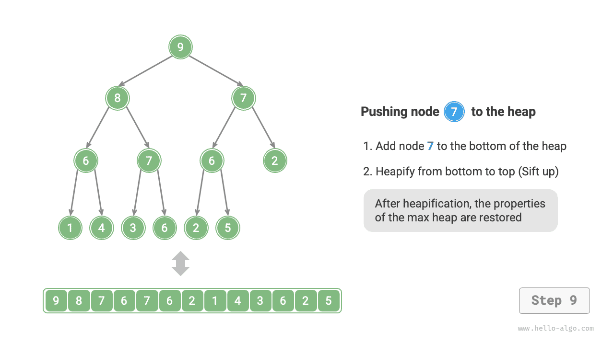

Given a total of $n$ nodes, the height of the tree is $O(\log n)$. Hence, the loop iterations for the heapify operation are at most $O(\log n)$, **making the time complexity of the element insertion operation $O(\log n)$**. The code is as shown:

```src
[file]{my_heap}-[class]{max_heap}-[func]{sift_up}
```

### Removing the top element from the heap

The top element of the heap is the root node of the binary tree, that is, the first element of the list. If we directly remove the first element from the list, all node indexes in the binary tree will change, making it difficult to use heapify for subsequent repairs. To minimize changes in element indexes, we use the following steps.

1. Swap the top element with the bottom element of the heap (swap the root node with the rightmost leaf node).
2. After swapping, remove the bottom of the heap from the list (note that since it has been swapped, the original top element is actually being removed).
3. Starting from the root node, **perform heapify from top to bottom**.

As shown in the figure below, **the direction of "heapify from top to bottom" is opposite to "heapify from bottom to top"**. We compare the value of the root node with its two children and swap it with the largest child. Then, repeat this operation until reaching the leaf node or encountering a node that does not need swapping.

=== "<1>"
    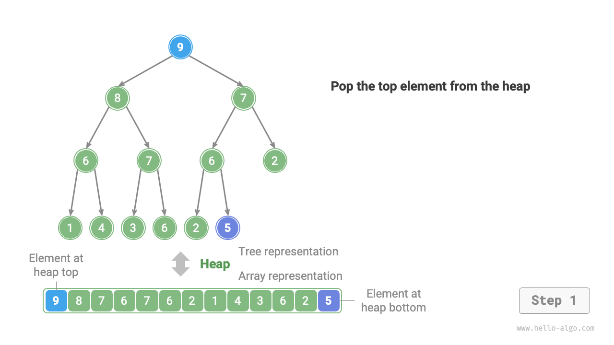

=== "<2>"
    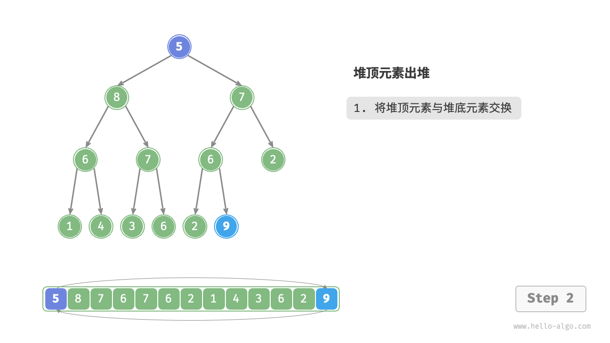

=== "<3>"
    

=== "<4>"
    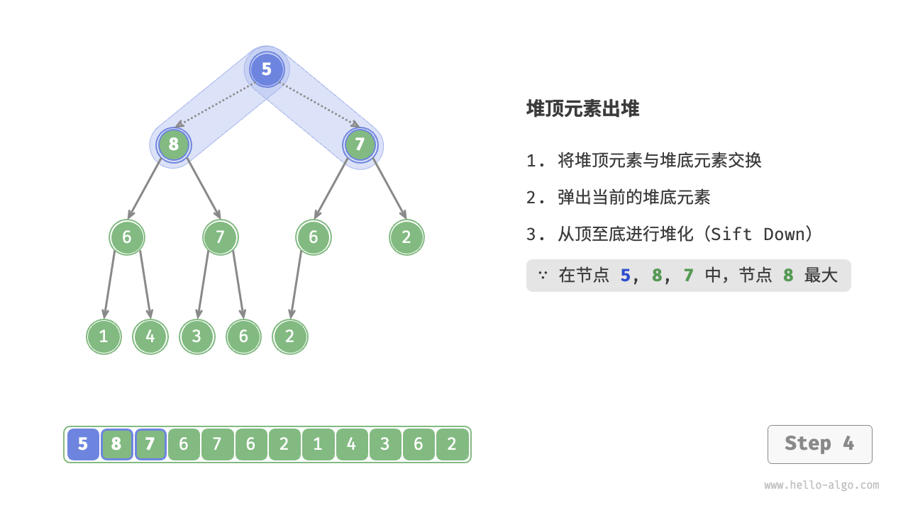

=== "<5>"
    

=== "<6>"
    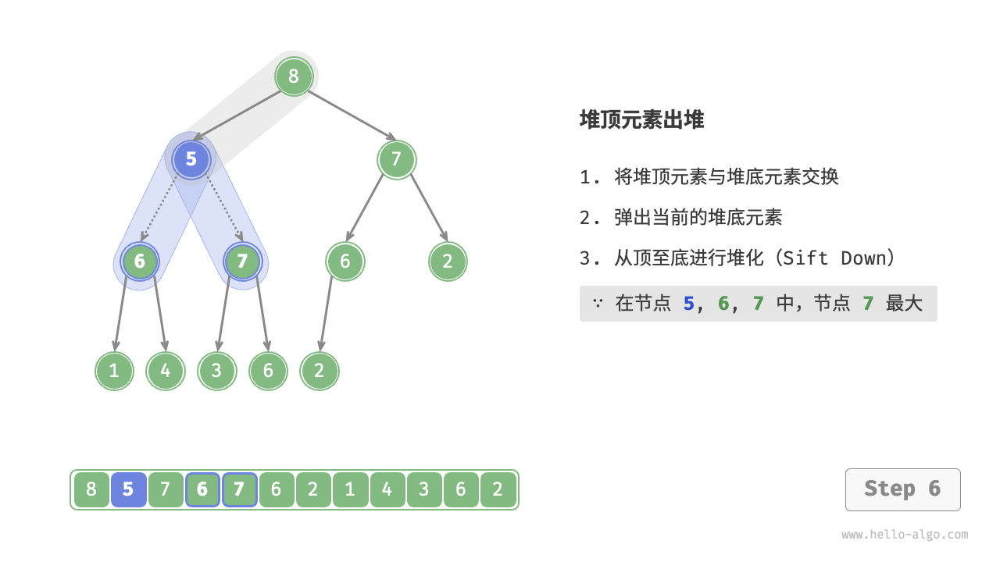

=== "<7>"
    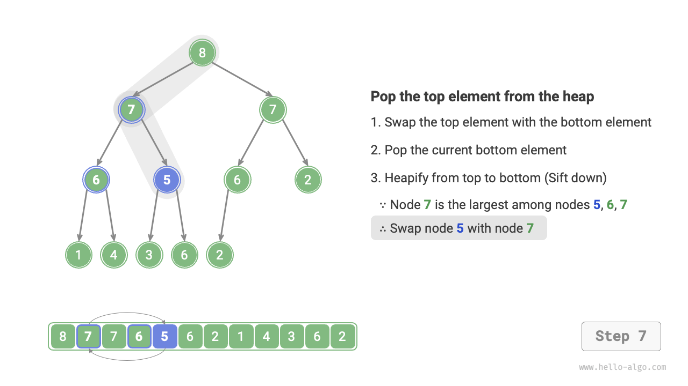

=== "<8>"
    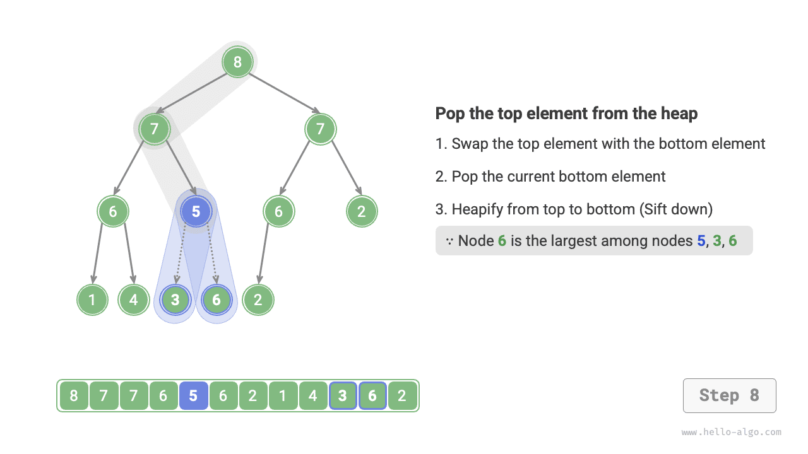

=== "<9>"
    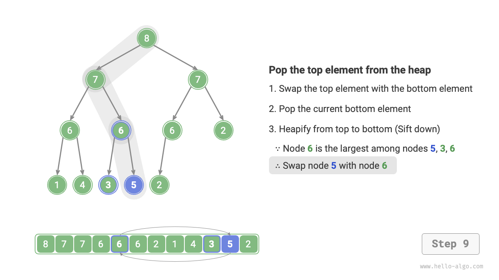

=== "<10>"
    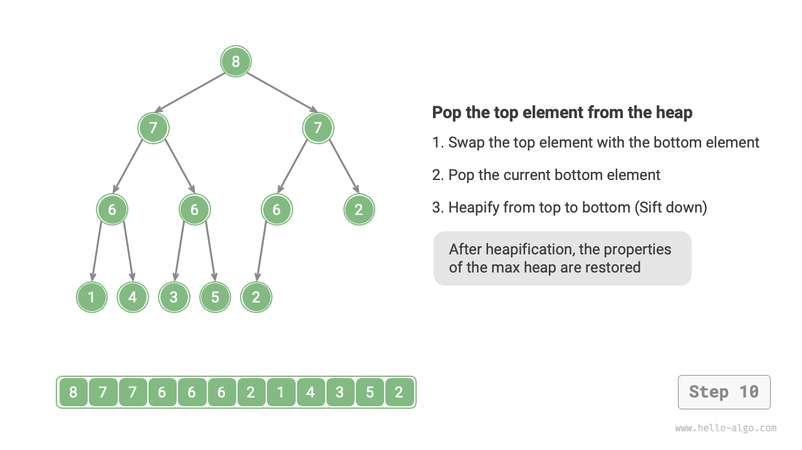

Similar to the element insertion operation, the time complexity of the top element removal operation is also $O(\log n)$. The code is as follows:

```src
[file]{my_heap}-[class]{max_heap}-[func]{sift_down}
```

## Common applications of heaps

- **Priority Queue**: Heaps are often the preferred data structure for implementing priority queues, with both enqueue and dequeue operations having a time complexity of $O(\log n)$, and building a queue having a time complexity of $O(n)$, all of which are very efficient.
- **Heap Sort**: Given a set of data, we can create a heap from them and then continually perform element removal operations to obtain ordered data. However, there is a more elegant way to implement heap sort, as explained in the "Heap Sort" chapter.
- **Finding the Largest $k$ Elements**: This is a classic algorithm problem and also a common use case, such as selecting the top 10 hot news for Weibo hot search, picking the top 10 selling products, etc.
