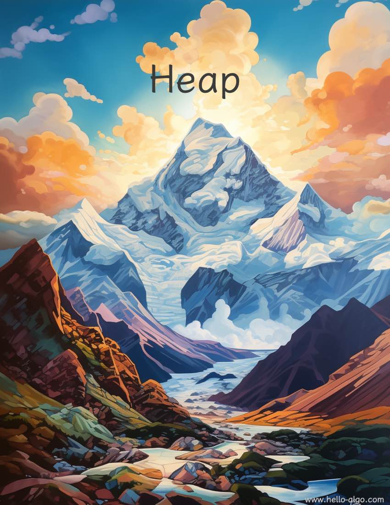

# Heap

!!! abstract

    Heaps resemble mountains and their jagged peaks, layered and undulating, each with its unique form.

    Each mountain peak rises and falls in scattered heights, yet the tallest always captures attention first.
