# Top-K Problem

!!! question

    Given an unordered array `nums` of length $n$, return the largest $k$ elements in the array.

For this problem, we'll first introduce two solutions with relatively straightforward approaches, then introduce a more efficient heap-based solution.

## Method 1: Iterative Selection

We can perform $k$ rounds of traversal as shown in the figure below, extracting the $1^{st}$, $2^{nd}$, $\dots$, $k^{th}$ largest elements in each round, with a time complexity of $O(nk)$.

This method is only suitable when $k \ll n$, because when $k$ is close to $n$, the time complexity approaches $O(n^2)$, which is very time-consuming.

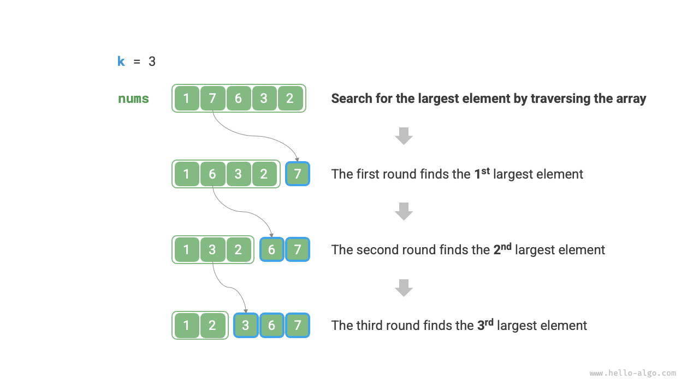

!!! tip

    When $k = n$, we can obtain a complete sorted sequence, which is equivalent to the "selection sort" algorithm.

## Method 2: Sorting

As shown in the figure below, we can first sort the array `nums`, then return the rightmost $k$ elements, with a time complexity of $O(n \log n)$.

Clearly, this method "overachieves" the task, as we only need to find the largest $k$ elements, without needing to sort the other elements.

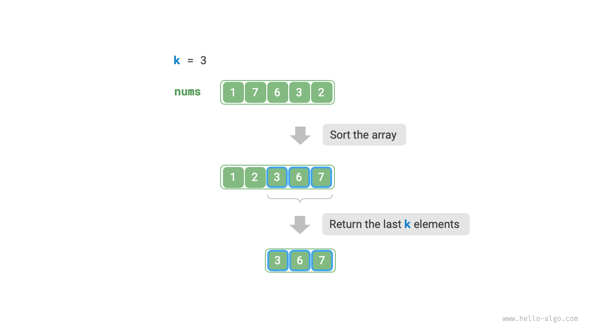

## Method 3: Heap

We can solve the Top-k problem more efficiently using heaps, with the process shown in the figure below.

1. Initialize a min heap, where the heap top element is the smallest.
2. First, insert the first $k$ elements of the array into the heap in sequence.
3. Starting from the $(k + 1)^{th}$ element, if the current element is greater than the heap top element, remove the heap top element and insert the current element into the heap.
4. After traversal is complete, the heap contains the largest $k$ elements.

=== "<1>"
    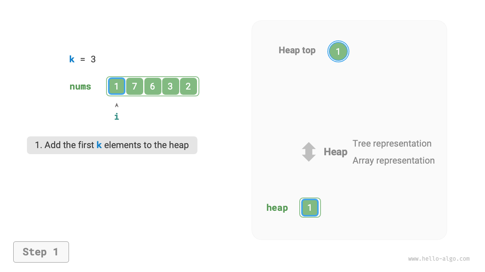

=== "<2>"
    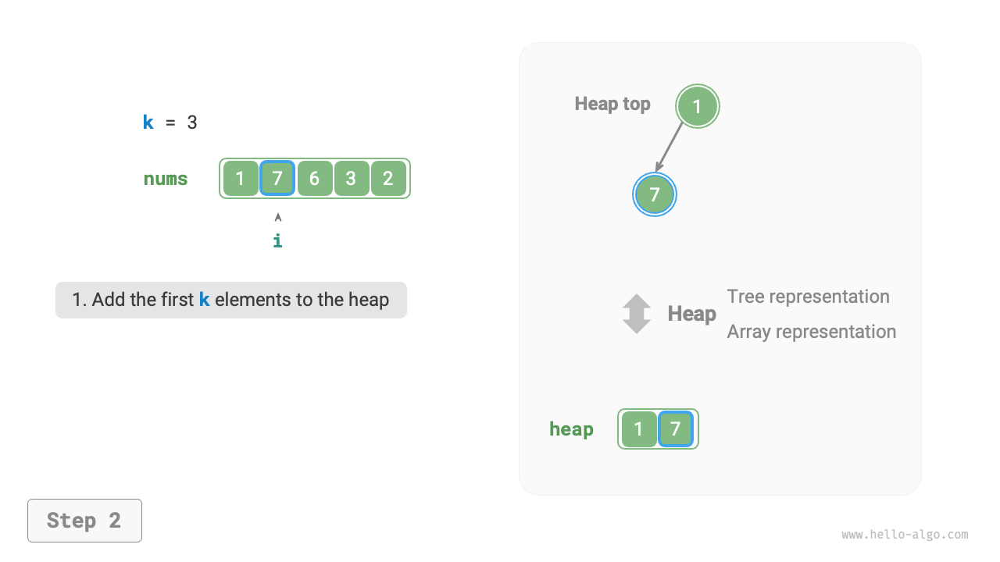

=== "<3>"
    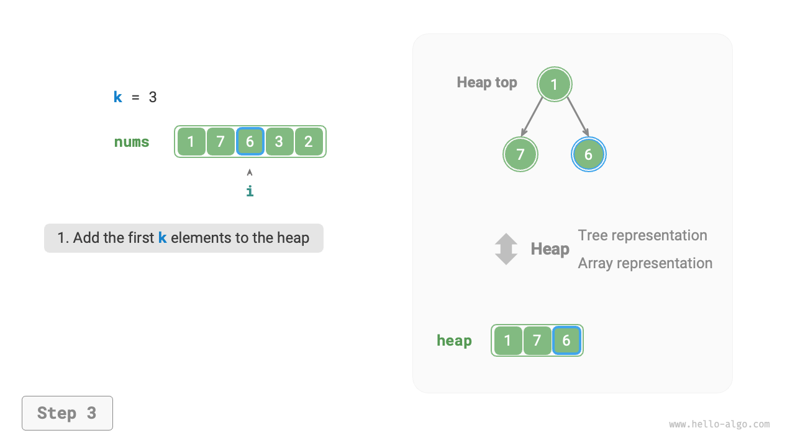

=== "<4>"
    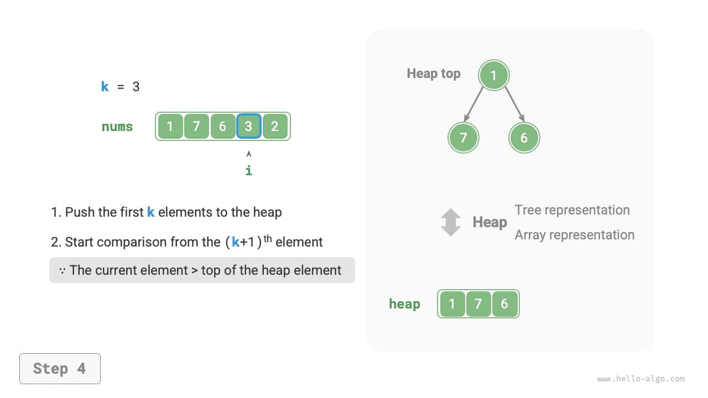

=== "<5>"
    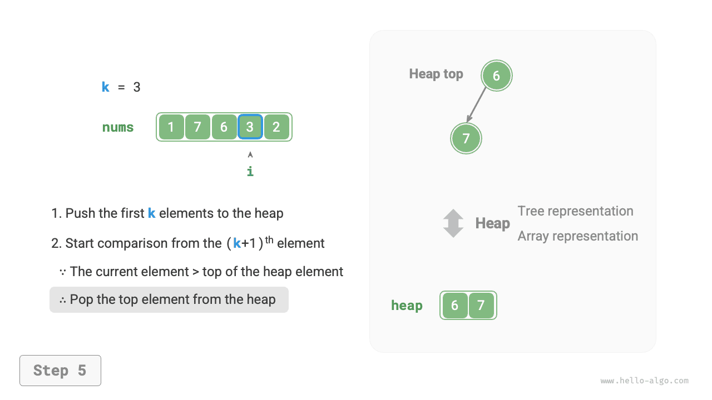

=== "<6>"
    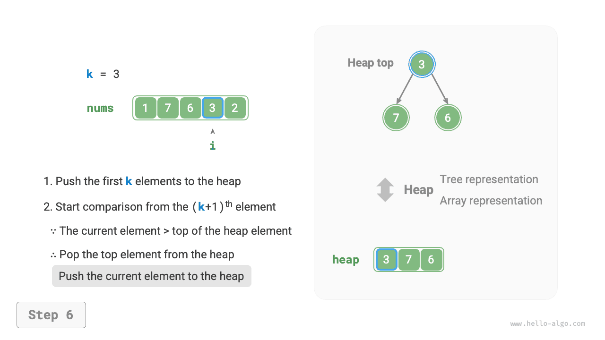

=== "<7>"
    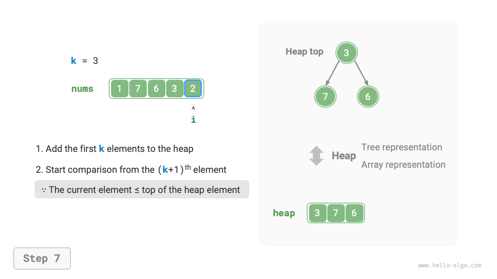

=== "<8>"
    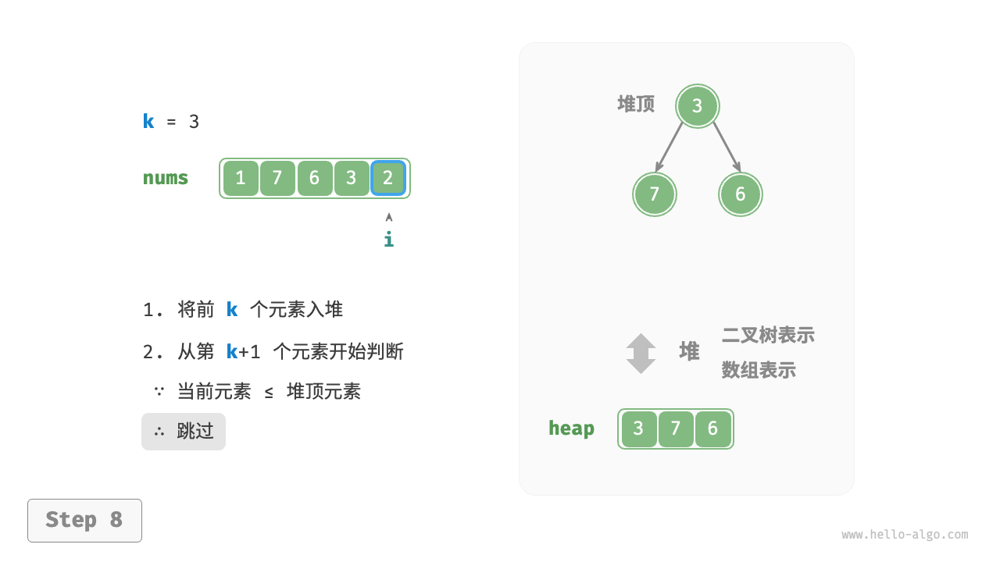

=== "<9>"
    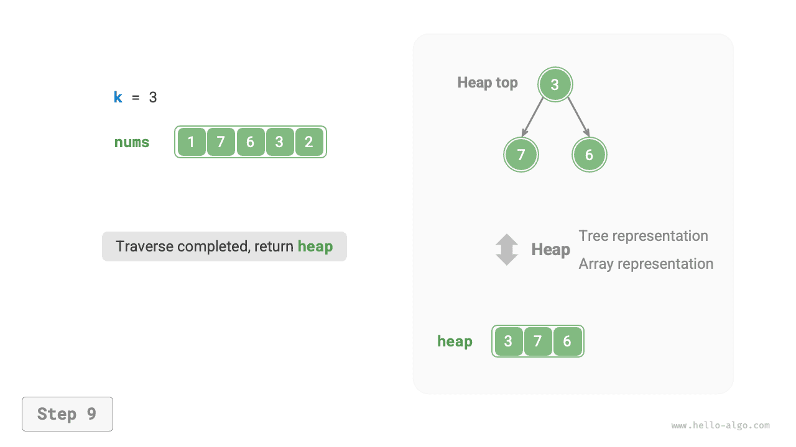

Example code is as follows:

```src
[file]{top_k}-[class]{}-[func]{top_k_heap}
```

A total of $n$ rounds of heap insertions and removals are performed, with the heap's maximum length being $k$, so the time complexity is $O(n \log k)$. This method is very efficient; when $k$ is small, the time complexity approaches $O(n)$; when $k$ is large, the time complexity does not exceed $O(n \log n)$.

Additionally, this method is suitable for dynamic data stream scenarios. By continuously adding data, we can maintain the elements in the heap, thus achieving dynamic updates of the largest $k$ elements.
