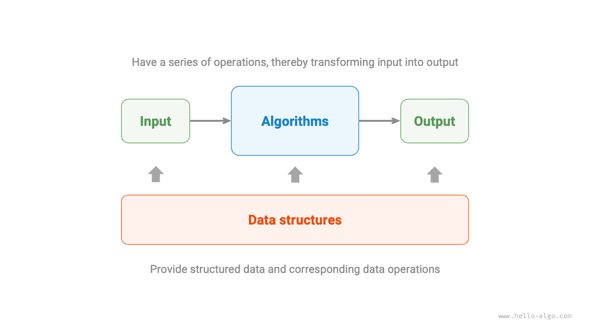

# What is an algorithm

## Definition of an algorithm

An <u>algorithm</u> is a set of instructions or steps to solve a specific problem within a finite amount of time. It has the following characteristics:

- The problem is clearly defined, including unambiguous definitions of input and output.
- The algorithm is feasible, meaning it can be completed within a finite number of steps, time, and memory space.
- Each step has a definitive meaning. The output is consistently the same under the same inputs and conditions.

## Definition of a data structure

A <u>data structure</u> is a way of organizing and storing data in a computer, with the following design goals:

- Minimize space occupancy to save computer memory.
- Make data operations as fast as possible, covering data access, addition, deletion, updating, etc.
- Provide concise data representation and logical information to enable efficient algorithm execution.

**Designing data structures is a balancing act, often requiring trade-offs**. If you want to improve in one aspect, you often need to compromise in another. Here are two examples:

- Compared to arrays, linked lists offer more convenience in data addition and deletion but sacrifice data access speed.
- Graphs, compared to linked lists, provide richer logical information but require more memory space.

## Relationship between data structures and algorithms

As shown in the figure below, data structures and algorithms are highly related and closely integrated, specifically in the following three aspects:

- Data structures are the foundation of algorithms. They provide structured data storage and methods for manipulating data for algorithms.
- Algorithms are the stage where data structures come into play. The data structure alone only stores data information; it is through the application of algorithms that specific problems can be solved.
- Algorithms can often be implemented based on different data structures, but their execution efficiency can vary greatly. Choosing the right data structure is key.

Data structures and algorithms can be likened to a set of building blocks, as illustrated in the figure below. A building block set includes numerous pieces, accompanied by detailed assembly instructions. Following these instructions step by step allows us to construct an intricate block model.

The detailed correspondence between the two is shown in the table below.

 Table <id> &nbsp; Comparing data structures and algorithms to building blocks 

| Data Structures and Algorithms | Building Blocks                                                 |
| ------------------------------ | --------------------------------------------------------------- |
| Input data                     | Unassembled blocks                                              |
| Data structure                 | Organization of blocks, including shape, size, connections, etc |
| Algorithm                      | A series of steps to assemble the blocks into the desired shape |
| Output data                    | Completed Block model                                           |

It's worth noting that data structures and algorithms are independent of programming languages. For this reason, this book is able to provide implementations in multiple programming languages.

!!! tip "Conventional Abbreviation"

    In real-life discussions, we often refer to "Data Structures and Algorithms" simply as "Algorithms". For example, the well-known LeetCode algorithm problems actually test both data structure and algorithm knowledge.
