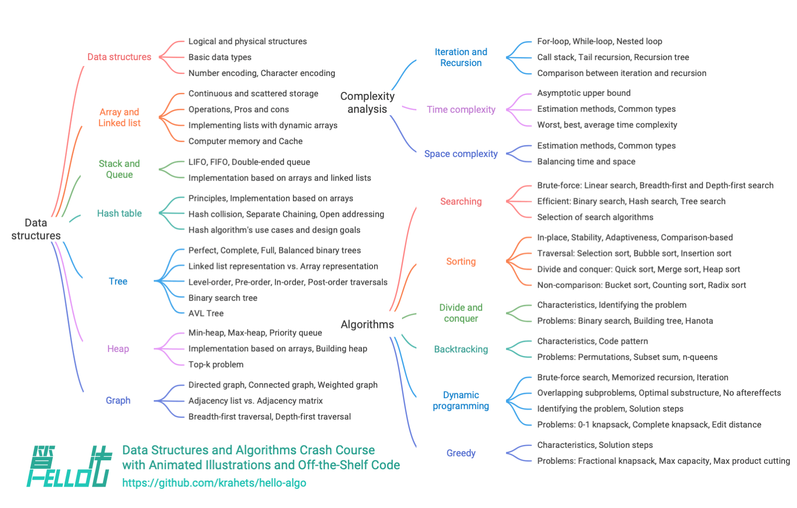

# About this book

This open-source project aims to create a free, and beginner-friendly crash course on data structures and algorithms.

- Animated illustrations, easy-to-understand content, and a smooth learning curve help beginners explore the "knowledge map" of data structures and algorithms.
- Run code with just one click, helping readers improve their programming skills and understand the working principle of algorithms and the underlying implementation of data structures.
- Promoting learning by teaching, feel free to ask questions and share insights. Let's grow together through discussion.

## Target audience

If you are new to algorithms with limited exposure, or you have accumulated some experience in algorithms, but you only have a vague understanding of data structures and algorithms, and you are constantly jumping between "yep" and "hmm", then this book is for you!

If you have already accumulated a certain amount of problem-solving experience, and are familiar with most types of problems, then this book can help you review and organize your algorithm knowledge system. The repository's source code can be used as a "problem-solving toolkit" or an "algorithm cheat sheet".

If you are an algorithm expert, we look forward to receiving your valuable suggestions, or [join us and collaborate](https://www.hello-algo.com/chapter_appendix/contribution/).

!!! success "Prerequisites"

    You should know how to write and read simple code in at least one programming language.

## Content structure

The main content of the book is shown in the figure below.

- **Complexity analysis**: explores aspects and methods for evaluating data structures and algorithms. Covers methods of deriving time complexity and space complexity, along with common types and examples.
- **Data structures**: focuses on fundamental data types, classification methods, definitions, pros and cons, common operations, types, applications, and implementation methods of data structures such as array, linked list, stack, queue, hash table, tree, heap, graph, etc.
- **Algorithms**: defines algorithms, discusses their pros and cons, efficiency, application scenarios, problem-solving steps, and includes sample questions for various algorithms such as search, sorting, divide and conquer, backtracking, dynamic programming, greedy algorithms, and more.

## Acknowledgements

This book is continuously improved with the joint efforts of many contributors from the open-source community. Thanks to each writer who invested their time and energy, listed in the order generated by GitHub: krahets, codingonion, nuomi1, Gonglja, Reanon, justin-tse, danielsss, hpstory, S-N-O-R-L-A-X, night-cruise, msk397, gvenusleo, RiverTwilight, gyt95, zhuoqinyue, Zuoxun, Xia-Sang, mingXta, FangYuan33, GN-Yu, IsChristina, xBLACKICEx, guowei-gong, Cathay-Chen, mgisr, JoseHung, qualifier1024, pengchzn, Guanngxu, longsizhuo, L-Super, what-is-me, yuan0221, lhxsm, Slone123c, WSL0809, longranger2, theNefelibatas, xiongsp, JeffersonHuang, hongyun-robot, K3v123, yuelinxin, a16su, gaofer, malone6, Wonderdch, xjr7670, DullSword, Horbin-Magician, NI-SW, reeswell, XC-Zero, XiaChuerwu, yd-j, iron-irax, huawuque404, MolDuM, Nigh, KorsChen, foursevenlove, 52coder, bubble9um, youshaoXG, curly210102, gltianwen, fanchenggang, Transmigration-zhou, FloranceYeh, FreddieLi, ShiMaRing, lipusheng, Javesun99, JackYang-hellobobo, shanghai-Jerry, 0130w, Keynman, psychelzh, logan-qiu, ZnYang2018, MwumLi, 1ch0, Phoenix0415, qingpeng9802, Richard-Zhang1019, QiLOL, Suremotoo, Turing-1024-Lee, Evilrabbit520, GaochaoZhu, ZJKung, linzeyan, hezhizhen, ZongYangL, beintentional, czruby, coderlef, dshlstarr, szu17dmy, fbigm, gledfish, hts0000, boloboloda, iStig, jiaxianhua, wenjianmin, keshida, kilikilikid, lclc6, lwbaptx, liuxjerry, lucaswangdev, lyl625760, chadyi, noobcodemaker, selear, siqyka, syd168, 4yDX3906, tao363, wangwang105, weibk, yabo083, yi427, yishangzhang, zhouLion, baagod, ElaBosak233, xb534, luluxia, yanedie, thomasq0, YangXuanyi and th1nk3r-ing.

The code review work for this book was completed by codingonion, Gonglja, gvenusleo, hpstory, justin‐tse, khoaxuantu, krahets, night-cruise, nuomi1, and Reanon (listed in alphabetical order). Thanks to them for their time and effort, ensuring the standardization and uniformity of the code in various languages.

Throughout the creation of this book, numerous individuals provided invaluable assistance, including but not limited to:

- Thanks to my mentor at the company, Dr. Xi Li, who encouraged me in a conversation to "get moving fast," which solidified my determination to write this book;
- Thanks to my girlfriend Bubble, as the first reader of this book, for offering many valuable suggestions from the perspective of a beginner in algorithms, making this book more suitable for newbies;
- Thanks to Tengbao, Qibao, and Feibao for coming up with a creative name for this book, evoking everyone's fond memories of writing their first line of code "Hello World!";
- Thanks to Xiaoquan for providing professional help in intellectual property, which has played a significant role in the development of this open-source book;
- Thanks to Sutong for designing a beautiful cover and logo for this book, and for patiently making multiple revisions under my insistence;
- Thanks to @squidfunk for providing writing and typesetting suggestions, as well as his developed open-source documentation theme [Material-for-MkDocs](https://github.com/squidfunk/mkdocs-material/tree/master).

Throughout the writing journey, I delved into numerous textbooks and articles on data structures and algorithms. These works served as exemplary models, ensuring the accuracy and quality of this book's content. I extend my gratitude to all who preceded me for their invaluable contributions!

This book advocates a combination of hands-on and minds-on learning, inspired in this regard by ["Dive into Deep Learning"](https://github.com/d2l-ai/d2l-zh). I highly recommend this excellent book to all readers.

**Heartfelt thanks to my parents, whose ongoing support and encouragement have allowed me to do this interesting work**.
