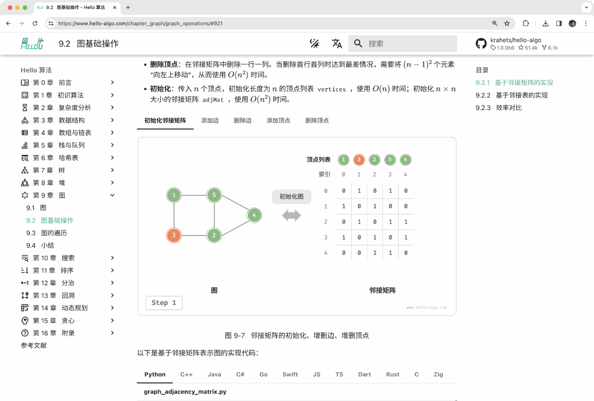
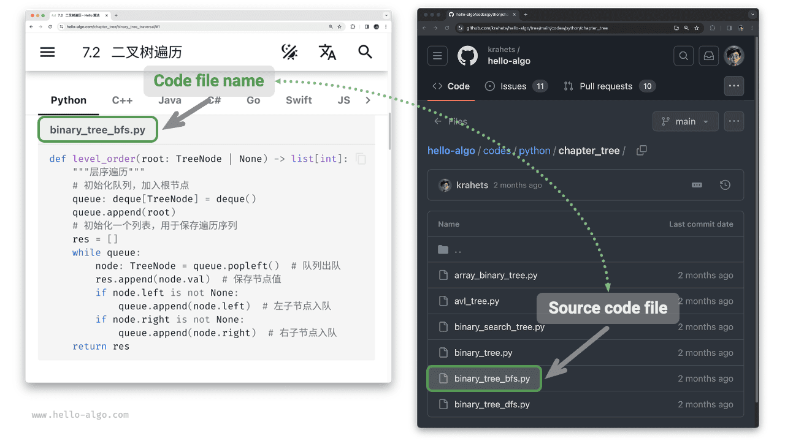
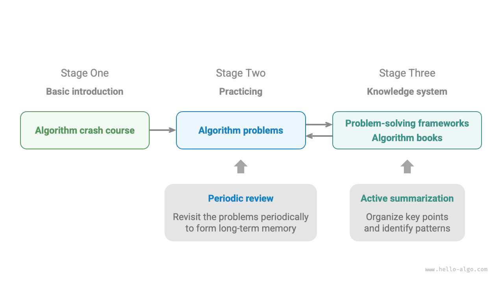

# How to read

!!! tip

    For the best reading experience, it is recommended that you read through this section.

## Writing conventions

- Chapters marked with '*' after the title are optional and contain relatively challenging content. If you are short on time, it is advisable to skip them.
- Technical terms will be in boldface (in the print and PDF versions) or underlined (in the web version), for instance, <u>array</u>. It's advisable to familiarize yourself with these for better comprehension of technical texts.
- **Bolded text** indicates key content or summary statements, which deserve special attention.
- Words and phrases with specific meanings are indicated with “quotation marks” to avoid ambiguity.
- When it comes to terms that are inconsistent between programming languages, this book follows Python, for example using `None` to mean `null`.
- This book partially ignores the comment conventions for programming languages in exchange for a more compact layout of the content. The comments primarily consist of three types: title comments, content comments, and multi-line comments.

=== "Python"

    ```python title=""
    """Header comments for labeling functions, classes, test samples, etc"""
   
    # Comments for explaining details
   
    """
    Multiline
    comments
    """
    ```

=== "C++"

    ```cpp title=""
    /* Header comments for labeling functions, classes, test samples, etc */
   
    // Comments for explaining details.
   
    /**
     * Multiline
     * comments
     */
    ```

=== "Java"

    ```java title=""
    /* Header comments for labeling functions, classes, test samples, etc */
   
    // Comments for explaining details.
   
    /**
     * Multiline
     * comments
     */
    ```

=== "C#"

    ```csharp title=""
    /* Header comments for labeling functions, classes, test samples, etc */
   
    // Comments for explaining details.
   
    /**
     * Multiline
     * comments
     */
    ```

=== "Go"

    ```go title=""
    /* Header comments for labeling functions, classes, test samples, etc */
   
    // Comments for explaining details.
   
    /**
     * Multiline
     * comments
     */
    ```

=== "Swift"

    ```swift title=""
    /* Header comments for labeling functions, classes, test samples, etc */
   
    // Comments for explaining details.
   
    /**
     * Multiline
     * comments
     */
    ```

=== "JS"

    ```javascript title=""
    /* Header comments for labeling functions, classes, test samples, etc */
   
    // Comments for explaining details.
   
    /**
     * Multiline
     * comments
     */
    ```

=== "TS"

    ```typescript title=""
    /* Header comments for labeling functions, classes, test samples, etc */
   
    // Comments for explaining details.
   
    /**
     * Multiline
     * comments
     */
    ```

=== "Dart"

    ```dart title=""
    /* Header comments for labeling functions, classes, test samples, etc */
   
    // Comments for explaining details.
   
    /**
     * Multiline
     * comments
     */
    ```

=== "Rust"

    ```rust title=""
    /* Header comments for labeling functions, classes, test samples, etc */

    // Comments for explaining details.
   
    /**
     * Multiline
     * comments
     */
    ```

=== "C"

    ```c title=""
    /* Header comments for labeling functions, classes, test samples, etc */
   
    // Comments for explaining details.
   
    /**
     * Multiline
     * comments
     */
    ```

=== "Kotlin"

    ```kotlin title=""
    /* Header comments for labeling functions, classes, test samples, etc */
   
    // Comments for explaining details.
   
    /**
     * Multiline
     * comments
     */
    ```

=== "Zig"

    ```zig title=""
    // Header comments for labeling functions, classes, test samples, etc
   
    // Comments for explaining details.
   
    // Multiline
    // comments
    ```

## Efficient learning via animated illustrations

Compared with text, videos and pictures have a higher density of information and are more structured, making them easier to understand. In this book, **key and difficult concepts are mainly presented through animations and illustrations**, with text serving as explanations and supplements.

When encountering content with animations or illustrations as shown in the figure below, **prioritize understanding the figure, with text as supplementary**, integrating both for a comprehensive understanding.



## Deepen understanding through coding practice

The source code of this book is hosted on the [GitHub Repository](https://github.com/krahets/hello-algo). As shown in the figure below, **the source code comes with test examples and can be executed with just a single click**.

If time permits, **it's recommended to type out the code yourself**. If pressed for time, at least read and run all the codes.

Compared to just reading code, writing code often yields more learning. **Learning by doing is the real way to learn.**


Setting up to run the code involves three main steps.

**Step 1: Install a local programming environment**. Follow the [tutorial](https://www.hello-algo.com/chapter_appendix/installation/) in the appendix for installation, or skip this step if already installed.

**Step 2: Clone or download the code repository**. Visit the [GitHub Repository](https://github.com/krahets/hello-algo).

If [Git](https://git-scm.com/downloads) is installed, use the following command to clone the repository:

```shell
git clone https://github.com/krahets/hello-algo.git
```

Alternatively, you can also click the "Download ZIP" button at the location shown in the figure below to directly download the code as a compressed ZIP file. Then, you can simply extract it locally.


**Step 3: Run the source code**. As shown in the figure below, for the code block labeled with the file name at the top, we can find the corresponding source code file in the `codes` folder of the repository. These files can be executed with a single click, which will help you save unnecessary debugging time and allow you to focus on learning.



## Learning together in discussion

While reading this book, please don't skip over the points that you didn't learn. **Feel free to post your questions in the comment section**. We will be happy to answer them and can usually respond within two days.

As illustrated in the figure below, each chapter features a comment section at the bottom. I encourage you to pay attention to these comments. They not only expose you to others' encountered problems, aiding in identifying knowledge gaps and sparking deeper contemplation, but also invite you to generously contribute by answering fellow readers' inquiries, sharing insights, and fostering mutual improvement.


## Algorithm learning path

Overall, the journey of mastering data structures and algorithms can be divided into three stages:

1. **Stage 1: Introduction to algorithms**. We need to familiarize ourselves with the characteristics and usage of various data structures and learn about the principles, processes, uses, and efficiency of different algorithms.
2. **Stage 2: Practicing algorithm problems**. It is recommended to start from popular problems, such as [Sword for Offer](https://leetcode.cn/studyplan/coding-interviews/) and [LeetCode Hot 100](https://leetcode.cn/studyplan/top-100- liked/), and accumulate at least 100 questions to familiarize yourself with mainstream algorithmic problems. Forgetfulness can be a challenge when you start practicing, but rest assured that this is normal. We can follow the "Ebbinghaus Forgetting Curve" to review the questions, and usually after 3~5 rounds of repetitions, we will be able to memorize them.
3. **Stage 3: Building the knowledge system**. In terms of learning, we can read algorithm column articles, solution frameworks, and algorithm textbooks to continuously enrich the knowledge system. In terms of practicing, we can try advanced strategies, such as categorizing by topic, multiple solutions for a single problem,  and one solution for multiple problems, etc. Insights on these strategies can be found in various communities.

As shown in the figure below, this book mainly covers “Stage 1,” aiming to help you more efficiently embark on Stages 2 and 3.


