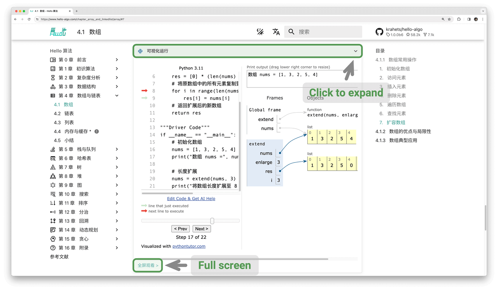

# How to Use This Book

!!! tip

    For the best reading experience, it is recommended that you read through this section.

## Writing Style Conventions

- Titles marked with `*` are optional sections with relatively difficult content. If you have limited time, you can skip them first.
- Technical terms will be in bold (in paper and PDF versions) or underlined (in web versions), such as <u>array</u>. It is recommended to memorize them for reading literature.
- Key content and summary statements will be **bolded**, and such text deserves special attention.
- Words and phrases with specific meanings will be marked with "quotation marks" to avoid ambiguity.
- When it comes to nouns that are inconsistent between programming languages, this book uses Python as the standard, for example, using `None` to represent "null".
- This book partially abandons the comment conventions of programming languages in favor of more compact content layout. Comments are mainly divided into three types: title comments, content comments, and multi-line comments.

=== "Python"

    ```python title=""
    """Title comment, used to label functions, classes, test cases, etc."""

    # Content comment, used to explain code in detail

    """
    Multi-line
    comment
    """
    ```

=== "C++"

    ```cpp title=""
    /* Title comment, used to label functions, classes, test cases, etc. */

    // Content comment, used to explain code in detail

    /**
     * Multi-line
     * comment
     */
    ```

=== "Java"

    ```java title=""
    /* Title comment, used to label functions, classes, test cases, etc. */

    // Content comment, used to explain code in detail

    /**
     * Multi-line
     * comment
     */
    ```

=== "C#"

    ```csharp title=""
    /* Title comment, used to label functions, classes, test cases, etc. */

    // Content comment, used to explain code in detail

    /**
     * Multi-line
     * comment
     */
    ```

=== "Go"

    ```go title=""
    /* Title comment, used to label functions, classes, test cases, etc. */

    // Content comment, used to explain code in detail

    /**
     * Multi-line
     * comment
     */
    ```

=== "Swift"

    ```swift title=""
    /* Title comment, used to label functions, classes, test cases, etc. */

    // Content comment, used to explain code in detail

    /**
     * Multi-line
     * comment
     */
    ```

=== "JS"

    ```javascript title=""
    /* Title comment, used to label functions, classes, test cases, etc. */

    // Content comment, used to explain code in detail

    /**
     * Multi-line
     * comment
     */
    ```

=== "TS"

    ```typescript title=""
    /* Title comment, used to label functions, classes, test cases, etc. */

    // Content comment, used to explain code in detail

    /**
     * Multi-line
     * comment
     */
    ```

=== "Dart"

    ```dart title=""
    /* Title comment, used to label functions, classes, test cases, etc. */

    // Content comment, used to explain code in detail

    /**
     * Multi-line
     * comment
     */
    ```

=== "Rust"

    ```rust title=""
    /* Title comment, used to label functions, classes, test cases, etc. */

    // Content comment, used to explain code in detail

    /**
     * Multi-line
     * comment
     */
    ```

=== "C"

    ```c title=""
    /* Title comment, used to label functions, classes, test cases, etc. */

    // Content comment, used to explain code in detail

    /**
     * Multi-line
     * comment
     */
    ```

=== "Kotlin"

    ```kotlin title=""
    /* Title comment, used to label functions, classes, test cases, etc. */

    // Content comment, used to explain code in detail

    /**
     * Multi-line
     * comment
     */
    ```

=== "Ruby"

    ```ruby title=""
    ### Title comment, used to label functions, classes, test cases, etc. ###

    # Content comment, used to explain code in detail

    # Multi-line
    # comment
    ```

## Learning Efficiently with Animated Illustrations

Compared to text, videos and images have higher information density and structural organization, making them easier to understand. In this book, **key and difficult knowledge will mainly be presented in the form of animated illustrations**, with text serving as explanation and supplement.

If you find that a section of content provides animated illustrations as shown in the figure below while reading this book, **please focus on the illustrations first, with text as a supplement**, and combine the two to understand the content.


## Deepening Understanding Through Code Practice

The accompanying code for this book is hosted in the [GitHub repository](https://github.com/krahets/hello-algo). As shown in the figure below, **the source code comes with test cases and can be run with one click**.

If time permits, **it is recommended that you type out the code yourself**. If you have limited study time, please at least read through and run all the code.

Compared to reading code, the process of writing code often brings more rewards. **Learning by doing is the real learning**.


The preliminary work for running code is mainly divided into three steps.

**Step 1: Install the local programming environment**. Please follow the [tutorial](https://www.hello-algo.com/chapter_appendix/installation/) shown in the appendix for installation. If already installed, you can skip this step.

**Step 2: Clone or download the code repository**. Visit the [GitHub repository](https://github.com/krahets/hello-algo). If you have already installed [Git](https://git-scm.com/downloads), you can clone this repository with the following command:

```shell
git clone https://github.com/krahets/hello-algo.git
```

Of course, you can also click the "Download ZIP" button at the location shown in the figure below to directly download the code compressed package, and then extract it locally.


**Step 3: Run the source code**. As shown in the figure below, for code blocks with file names at the top, we can find the corresponding source code files in the `codes` folder of the repository. The source code files can be run with one click, which will help you save unnecessary debugging time and allow you to focus on learning content.


In addition to running code locally, **the web version also supports visual running of Python code** (implemented based on [pythontutor](https://pythontutor.com/)). As shown in the figure below, you can click "Visual Run" below the code block to expand the view and observe the execution process of the algorithm code; you can also click "Full Screen View" for a better viewing experience.



## Growing Together Through Questions and Discussions

When reading this book, please do not easily skip knowledge points that you have not learned well. **Feel free to ask your questions in the comments section**, and my friends and I will do our best to answer you, and generally reply within two days.

As shown in the figure below, the web version has a comments section at the bottom of each chapter. I hope you will pay more attention to the content of the comments section. On the one hand, you can learn about the problems that everyone encounters, thus checking for omissions and stimulating deeper thinking. On the other hand, I hope you can generously answer other friends' questions, share your insights, and help others progress.


## Algorithm Learning Roadmap

From an overall perspective, we can divide the process of learning data structures and algorithms into three stages.

1. **Stage 1: Algorithm introduction**. We need to familiarize ourselves with the characteristics and usage of various data structures, and learn the principles, processes, uses, and efficiency of different algorithms.
2. **Stage 2: Practice algorithm problems**. It is recommended to start with popular problems, and accumulate at least 100 problems first, to familiarize yourself with mainstream algorithm problems. When first practicing problems, "knowledge forgetting" may be a challenge, but rest assured, this is very normal. We can review problems according to the "Ebbinghaus forgetting curve", and usually after 3-5 rounds of repetition, we can firmly remember them. For recommended problem lists and practice plans, please see this [GitHub repository](https://github.com/krahets/LeetCode-Book).
3. **Stage 3: Building a knowledge system**. In terms of learning, we can read algorithm column articles, problem-solving frameworks, and algorithm textbooks to continuously enrich our knowledge system. In terms of practicing problems, we can try advanced problem-solving strategies, such as categorization by topic, one problem multiple solutions, one solution multiple problems, etc. Related problem-solving insights can be found in various communities.

As shown in the figure below, the content of this book mainly covers "Stage 1", aiming to help you more efficiently carry out Stage 2 and Stage 3 learning.


