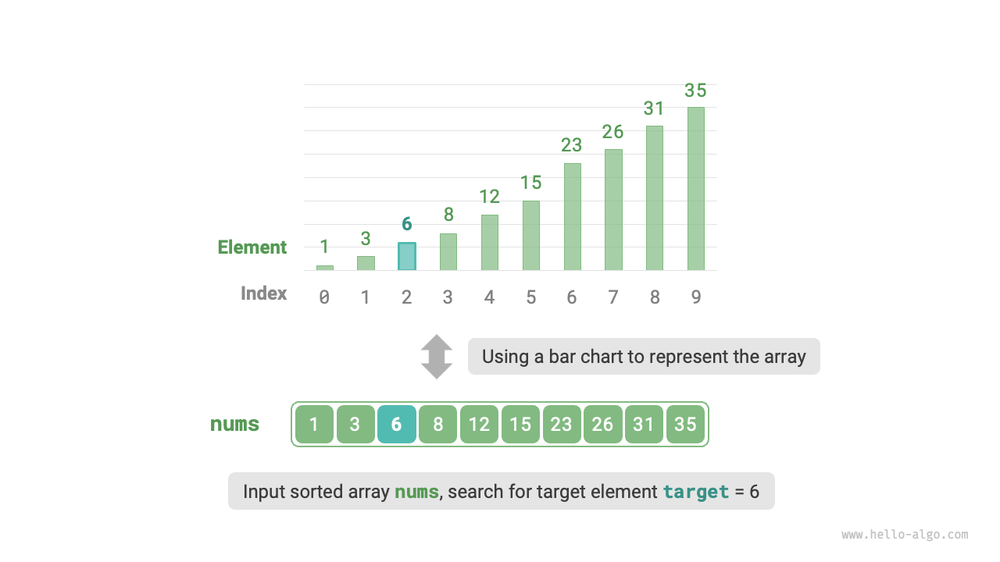
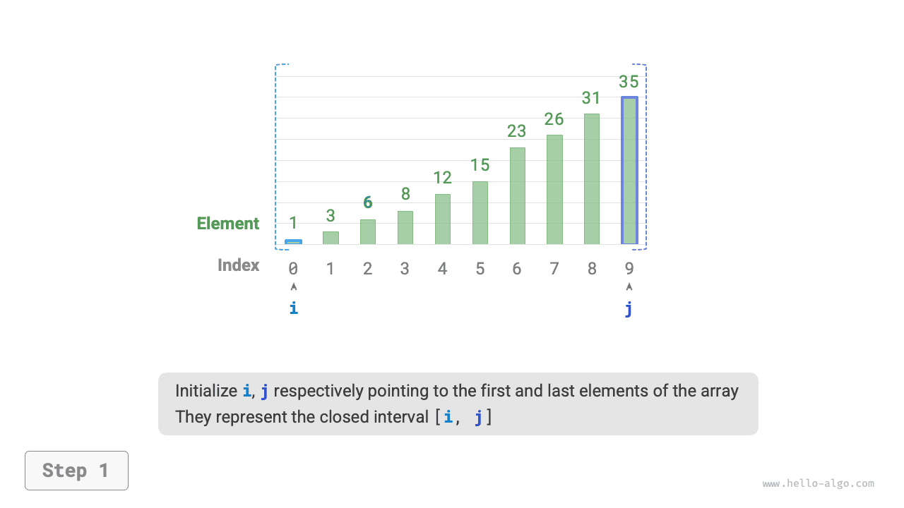
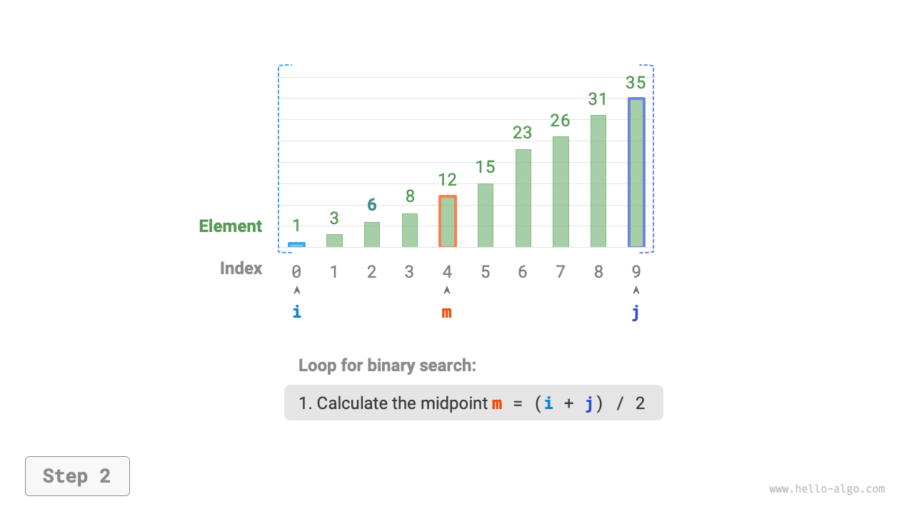
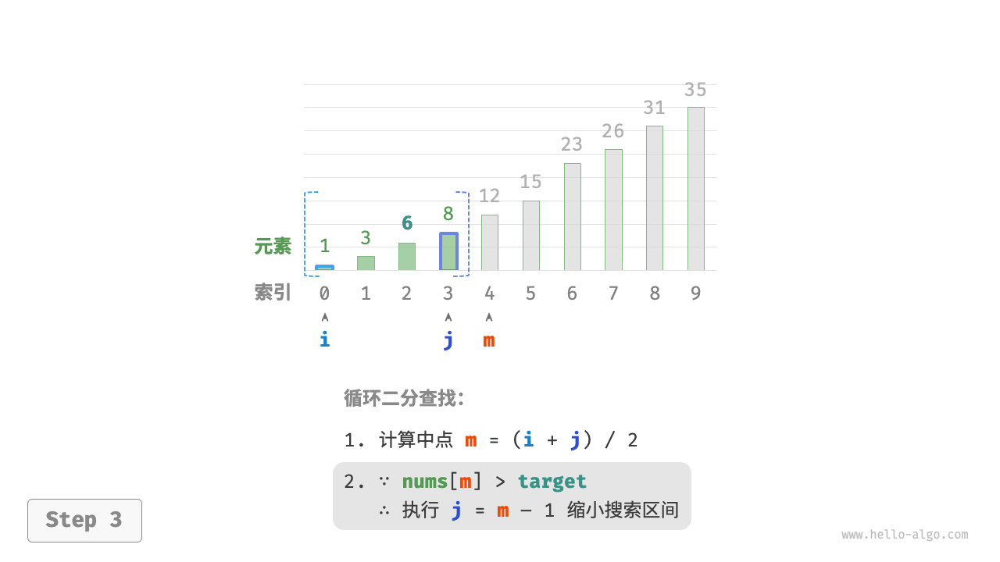
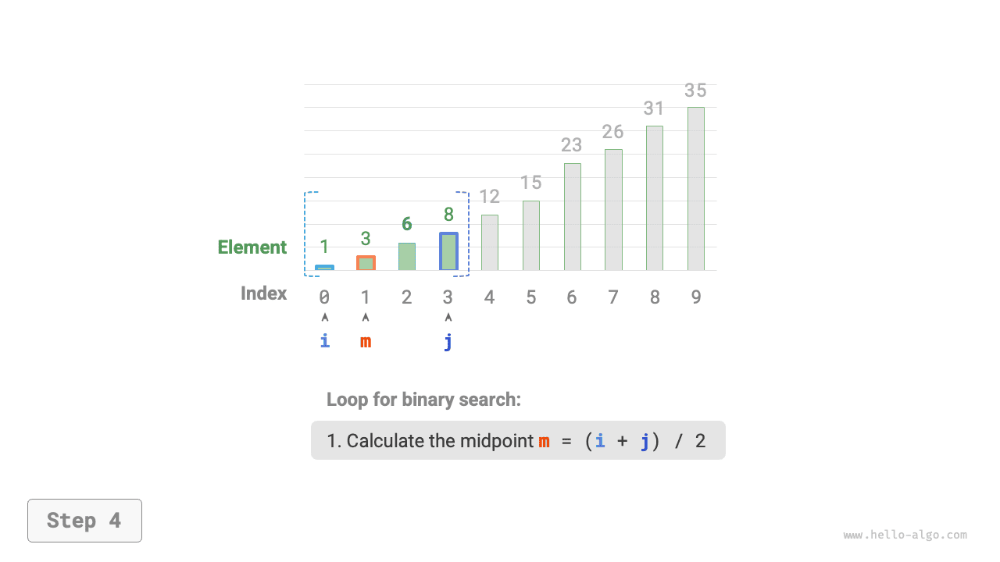
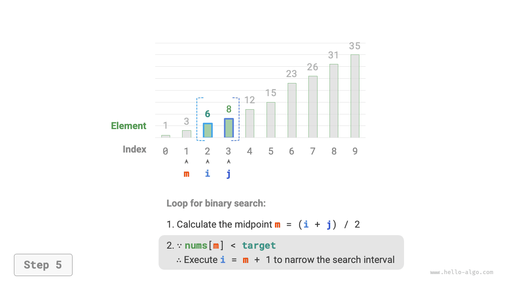
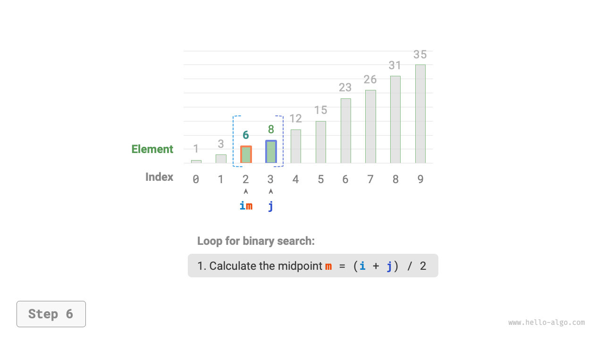
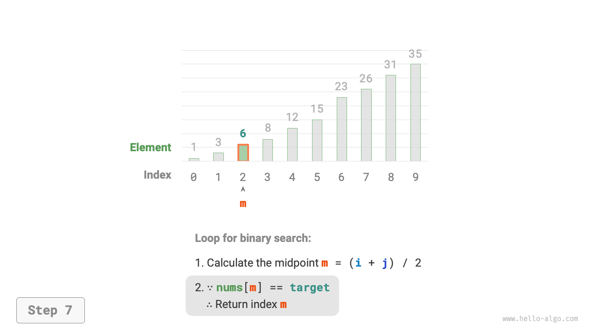

# Binary search

<u>Binary search</u> is an efficient search algorithm that uses a divide-and-conquer strategy. It takes advantage of the sorted order of elements in an array by reducing the search interval by half in each iteration, continuing until either the target element is found or the search interval becomes empty.

!!! question

    Given an array `nums` of length $n$, where elements are arranged in ascending order without duplicates. Please find and return the index of element `target` in this array. If the array does not contain the element, return $-1$. An example is shown in the figure below.



As shown in the figure below, we firstly initialize pointers with $i = 0$ and $j = n - 1$, pointing to the first and last element of the array respectively. They also represent the whole search interval $[0, n - 1]$. Please note that square brackets indicate a closed interval, which includes the boundary values themselves.

And then the following two steps may be performed in a loop.

1. Calculate the midpoint index $m = \lfloor {(i + j) / 2} \rfloor$, where $\lfloor \: \rfloor$ denotes the floor operation.
2. Based on the comparison between the value of `nums[m]` and `target`, one of the following three cases will be chosen to execute.
    1. If `nums[m] < target`, it indicates that `target` is in the interval $[m + 1, j]$, thus set $i = m + 1$.
    2. If `nums[m] > target`, it indicates that `target` is in the interval $[i, m - 1]$, thus set $j = m - 1$.
    3. If `nums[m] = target`, it indicates that `target` is found, thus return index $m$.

If the array does not contain the target element, the search interval will eventually reduce to empty, ending up returning $-1$.

=== "<1>"
    

=== "<2>"
    

=== "<3>"
    

=== "<4>"
    

=== "<5>"
    

=== "<6>"
    

=== "<7>"
    

It's worth noting that as $i$ and $j$ are both of type `int`, **$i + j$ might exceed the range of `int` type**. To avoid large number overflow, we usually use the formula $m = \lfloor {i + (j - i) / 2} \rfloor$ to calculate the midpoint.

The code is as follows:

```src
[file]{binary_search}-[class]{}-[func]{binary_search}
```

**Time complexity is $O(\log n)$** : In the binary loop, the interval decreases by half each round, hence the number of iterations is $\log_2 n$.

**Space complexity is $O(1)$** : Pointers $i$ and $j$ occupies constant size of space.

## Interval representation methods

Besides the above closed interval, another common interval representation is the "left-closed right-open" interval, defined as $[0, n)$, where the left boundary includes itself, and the right boundary does not. In this representation, the interval $[i, j)$ is empty when $i = j$.

We can implement a binary search algorithm with the same functionality based on this representation:

```src
[file]{binary_search}-[class]{}-[func]{binary_search_lcro}
```

As shown in the figure below, under the two types of interval representations, the initialization, loop condition, and narrowing interval operation of the binary search algorithm differ.

Since both boundaries in the "closed interval" representation are inclusive, the operations to narrow the interval through pointers $i$ and $j$ are also symmetrical. This makes it less prone to errors, **therefore, it is generally recommended to use the "closed interval" approach**.


## Advantages and limitations

Binary search performs well in both time and space aspects.

- Binary search is time-efficient. With large dataset, the logarithmic time complexity offers a major advantage. For instance, given a dataset with size $n = 2^{20}$, linear search requires $2^{20} = 1048576$ iterations, while binary search only demands $\log_2 2^{20} = 20$ loops.
- Binary search does not need extra space. Compared to search algorithms that rely on additional space (like hash search), binary search is more space-efficient.

However, binary search may not be suitable for all scenarios due to the following concerns.

- Binary search can only be applied to sorted data. Unsorted data must be sorted before applying binary search, which may not be worthwhile as sorting algorithm typically has a time complexity of $O(n \log n)$. Such cost is even higher than linear search, not to mention binary search itself. For scenarios with frequent insertion, the cost of remaining the array in order is pretty high as the time complexity of inserting new elements into specific positions is $O(n)$.
- Binary search may use array only. Binary search requires non-continuous (jumping) element access, which is inefficient in linked list. As a result, linked list or data structures based on linked list may not be suitable for this algorithm.
- Linear search performs better on small dataset. In linear search, only 1 decision operation is required for each iteration; whereas in binary search, it involves 1 addition, 1 division, 1 to 3 decision operations, 1 addition (subtraction), totaling 4 to 6 operations. Therefore, if data size $n$ is small, linear search is faster than binary search.
