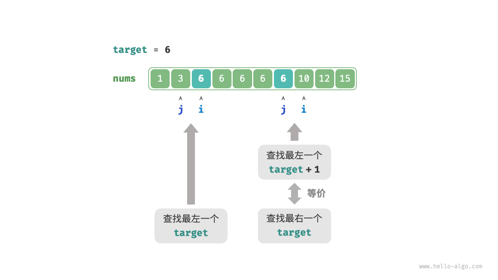

# Binary search boundaries

## Find the left boundary

!!! question

    Given a sorted array `nums` of length $n$, which may contain duplicate elements, return the index of the leftmost element `target`. If the element is not present in the array, return $-1$.

Recalling the method of binary search for an insertion point, after the search is completed, the index $i$ will point to the leftmost occurrence of `target`. Therefore, **searching for the insertion point is essentially the same as finding the index of the leftmost `target`**.

We can use the function for finding an insertion point to find the left boundary of `target`. Note that the array might not contain `target`, which could lead to the following two results:

- The index $i$ of the insertion point is out of bounds.
- The element `nums[i]` is not equal to `target`.

In these cases, simply return $-1$. The code is as follows:

```src
[file]{binary_search_edge}-[class]{}-[func]{binary_search_left_edge}
```

## Find the right boundary

How do we find the rightmost occurrence of `target`? The most straightforward way is to modify the traditional binary search logic by changing how we adjust the search boundaries in the case of `nums[m] == target`. The code is omitted here. If you are interested, try to implement the code on your own.

Below we are going to introduce two more ingenious methods.

### Reuse the left boundary search

To find the rightmost occurrence of `target`, we can reuse the function used for locating the leftmost `target`. Specifically, we transform the search for the rightmost target into a search for the leftmost target + 1.

As shown in the figure below, after the search is complete, pointer $i$ will point to the leftmost `target + 1` (if exists), while pointer $j$ will point to the rightmost occurrence of `target`. Therefore, returning $j$ will give us the right boundary.



Note that the insertion point returned is $i$, therefore, it should be subtracted by $1$ to obtain $j$:

```src
[file]{binary_search_edge}-[class]{}-[func]{binary_search_right_edge}
```

### Transform into an element search

When the array does not contain `target`, $i$ and $j$ will eventually point to the first element greater and smaller than `target` respectively.

Thus, as shown in the figure below, we can construct an element that does not exist in the array, to search for the left and right boundaries.

- To find the leftmost `target`: it can be transformed into searching for `target - 0.5`, and return the pointer $i$.
- To find the rightmost `target`: it can be transformed into searching for `target + 0.5`, and return the pointer $j$.


The code is omitted here, but here are two important points to note about this approach.

- The given array `nums` does not contain decimal, so handling equal cases is not a concern.
- However, introducing decimals in this approach requires modifying the `target` variable to a floating-point type (no change needed in Python).
