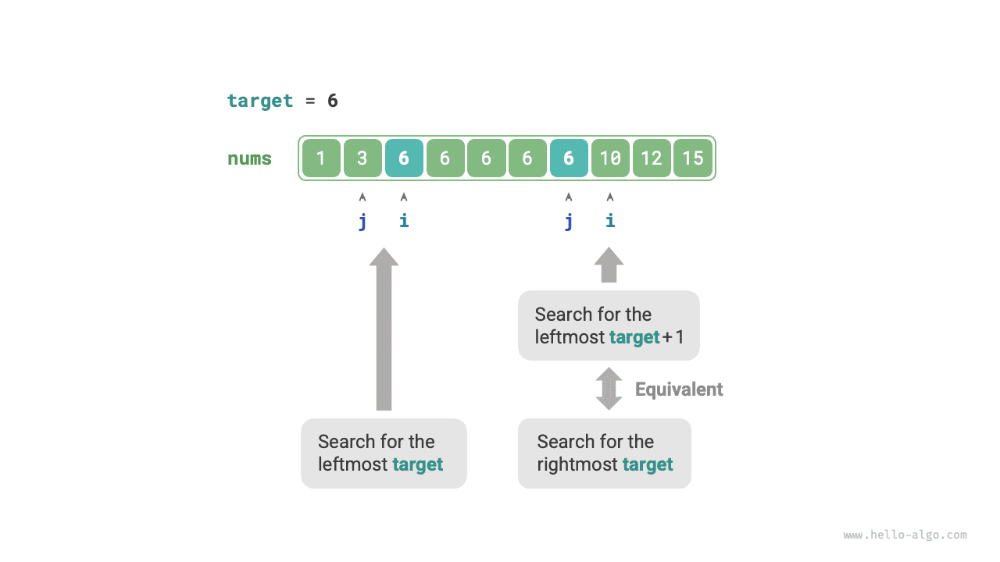

# Binary Search Boundaries

## Finding the Left Boundary

!!! question

    Given a sorted array `nums` of length $n$ that may contain duplicate elements, return the index of the leftmost occurrence of `target`. If the array does not contain `target`, return $-1$.

Recall the method for finding the insertion point with binary search. After the search completes, $i$ points to the leftmost `target`, **so finding the insertion point is essentially finding the index of the leftmost `target`**.

Consider implementing the left boundary search using the insertion point finding function. Note that the array may not contain `target`, which could result in the following two cases:

- The insertion point index $i$ is out of bounds.
- The element `nums[i]` is not equal to `target`.

When either of these situations occurs, simply return $-1$. The code is shown below:

```src
[file]{binary_search_edge}-[class]{}-[func]{binary_search_left_edge}
```

## Finding the Right Boundary

So how do we find the rightmost `target`? The most direct approach is to modify the code and replace the pointer shrinking operation in the `nums[m] == target` case. The code is omitted here; interested readers can implement it themselves.

Below we introduce two more clever methods.

### Reusing Left Boundary Search

In fact, we can use the function for finding the leftmost `target` to find the rightmost `target`. The specific method is: **convert finding the rightmost `target` into finding the leftmost `target + 1`**.

As shown in the figure below, after the search completes, the pointer $i$ points to the leftmost `target + 1` (if it exists), while $j$ points to the rightmost `target`, **so we can return $j$**.



Note that the returned insertion point is $i$, so we need to subtract $1$ from it to obtain $j$:

```src
[file]{binary_search_edge}-[class]{}-[func]{binary_search_right_edge}
```

### Converting to Element Search

We know that when the array does not contain `target`, $i$ and $j$ will eventually point to the first elements greater than and less than `target`, respectively.

Therefore, as shown in the figure below, we can construct an element that does not exist in the array to find the left and right boundaries.

- Finding the leftmost `target`: This can be converted to finding `target - 0.5` and returning the pointer $i$.
- Finding the rightmost `target`: This can be converted to finding `target + 0.5` and returning the pointer $j$.


The code is omitted here, but the following two points are worth noting:

- Since the given array does not contain decimal values, we do not need to worry about how to handle equality.
- Because this method introduces decimals, the variable `target` in the function needs to be changed to a floating-point type (Python does not require this change).
