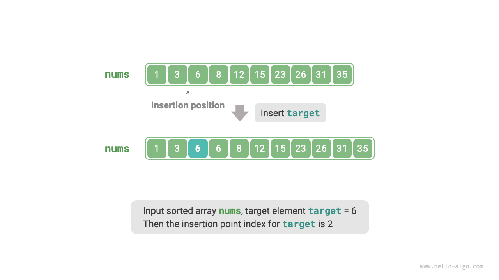
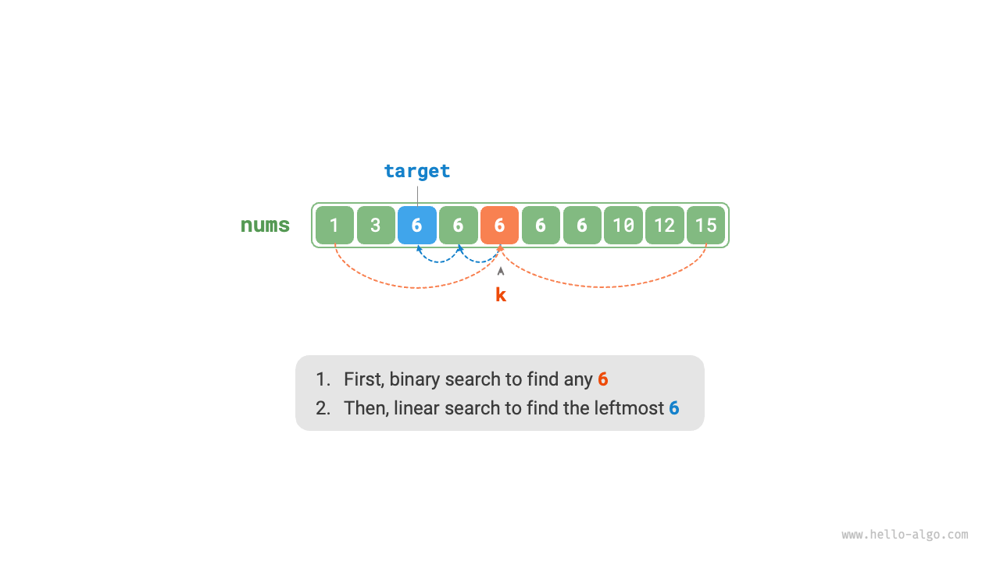
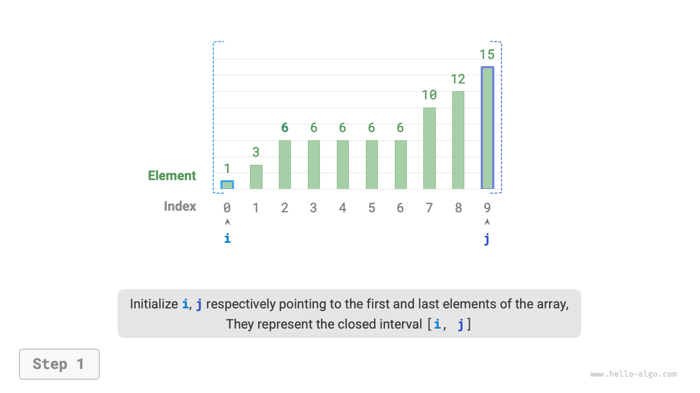
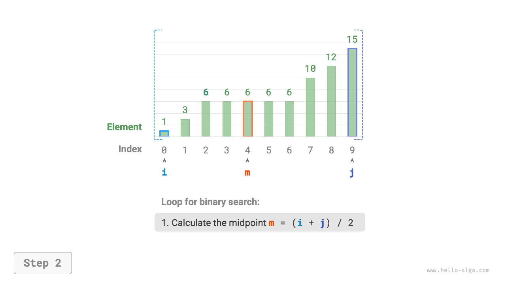
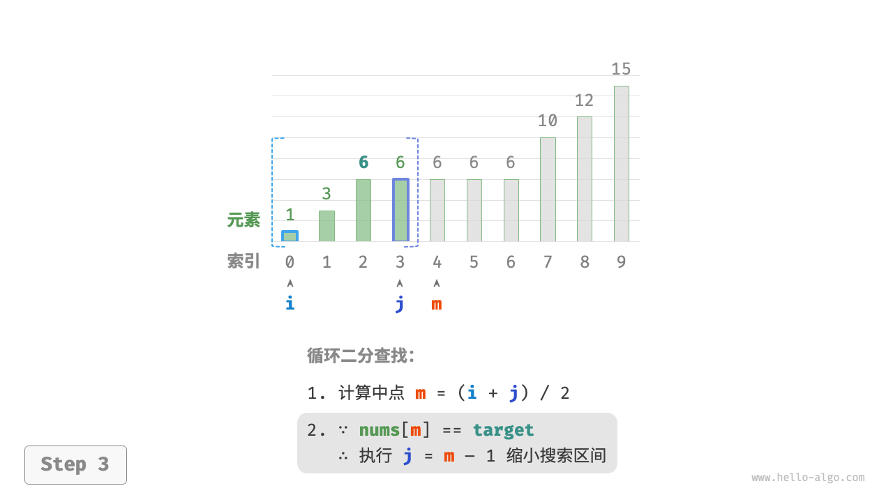
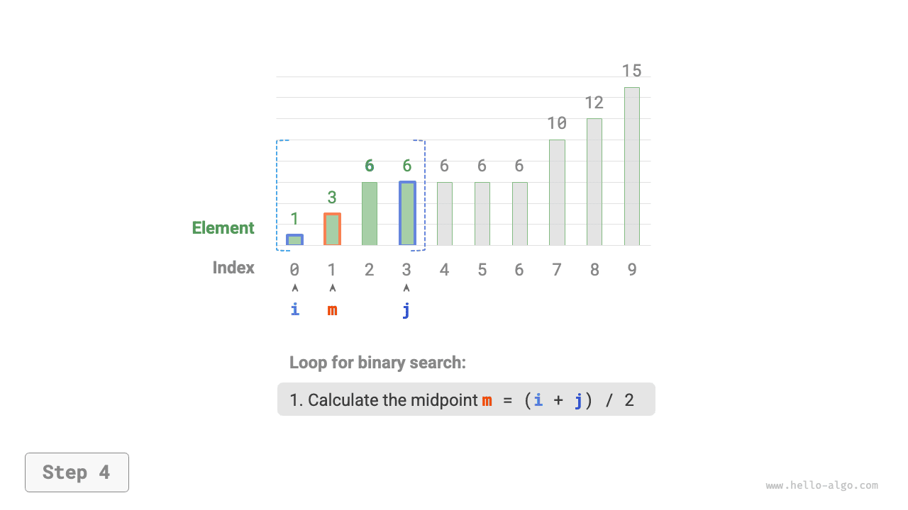
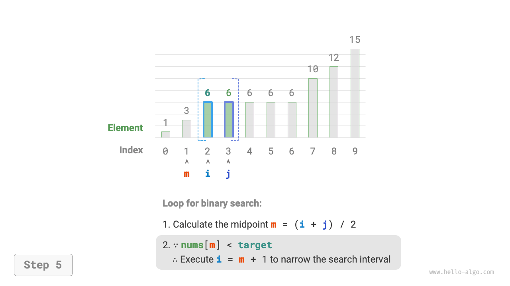
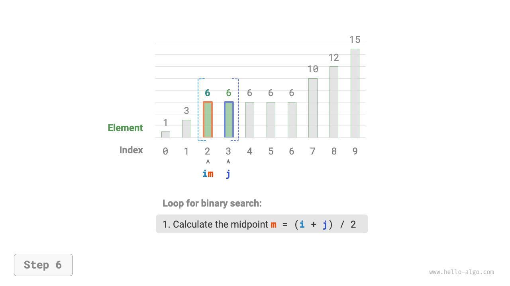
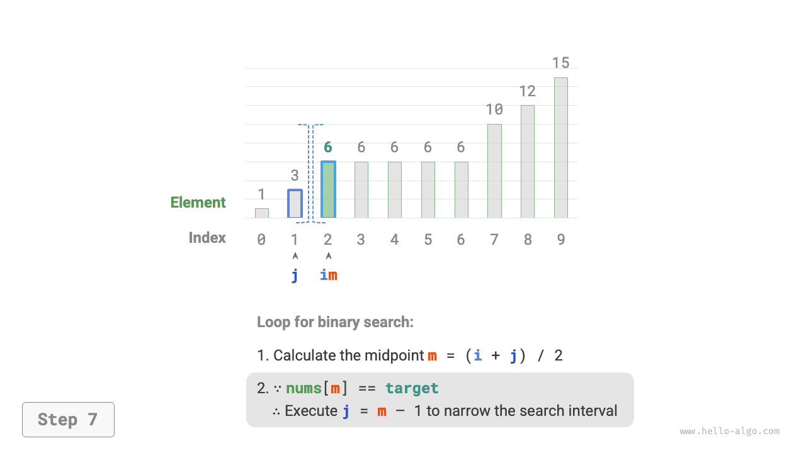
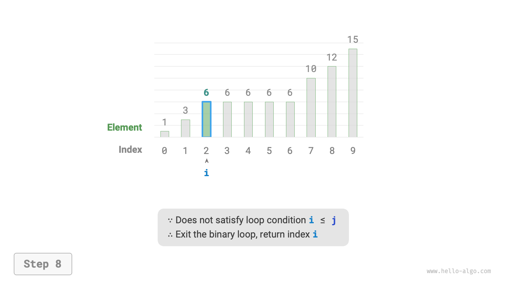

# Binary search insertion

Binary search is not only used to search for target elements but also to solve many variant problems, such as searching for the insertion position of target elements.

## Case with no duplicate elements

!!! question

    Given an ordered array `nums` of length $n$ and an element `target`, where the array has no duplicate elements. Now insert `target` into the array `nums` while maintaining its order. If the element `target` already exists in the array, insert it to its left side. Please return the index of `target` in the array after insertion. See the example shown in the figure below.



If you want to reuse the binary search code from the previous section, you need to answer the following two questions.

**Question one**: When the array contains `target`, is the insertion point index the index of that element?

The requirement to insert `target` to the left of equal elements means that the newly inserted `target` replaces the original `target` position. Thus, **when the array contains `target`, the insertion point index is the index of that `target`**.

**Question two**: When the array does not contain `target`, what is the index of the insertion point?

Further consider the binary search process: when `nums[m] < target`, pointer $i$ moves, meaning that pointer $i$ is approaching an element greater than or equal to `target`. Similarly, pointer $j$ is always approaching an element less than or equal to `target`.

Therefore, at the end of the binary, it is certain that: $i$ points to the first element greater than `target`, and $j$ points to the first element less than `target`. **It is easy to see that when the array does not contain `target`, the insertion index is $i$**. The code is as follows:

```src
[file]{binary_search_insertion}-[class]{}-[func]{binary_search_insertion_simple}
```

## Case with duplicate elements

!!! question

    Based on the previous question, assume the array may contain duplicate elements, all else remains the same.

Suppose there are multiple `target`s in the array, ordinary binary search can only return the index of one of the `target`s, **and it cannot determine how many `target`s are to the left and right of that element**.

The task requires inserting the target element to the very left, **so we need to find the index of the leftmost `target` in the array**. Initially consider implementing this through the steps shown in the figure below.

1. Perform a binary search, get an arbitrary index of `target`, denoted as $k$.
2. Start from index $k$, and perform a linear search to the left until the leftmost `target` is found and return.



Although this method is feasible, it includes linear search, so its time complexity is $O(n)$. This method is inefficient when the array contains many duplicate `target`s.

Now consider extending the binary search code. As shown in the figure below, the overall process remains the same, each round first calculates the midpoint index $m$, then judges the size relationship between `target` and `nums[m]`, divided into the following cases.

- When `nums[m] < target` or `nums[m] > target`, it means `target` has not been found yet, thus use the normal binary search interval reduction operation, **thus making pointers $i$ and $j$ approach `target`**.
- When `nums[m] == target`, it indicates that the elements less than `target` are in the interval $[i, m - 1]$, therefore use $j = m - 1$ to narrow the interval, **thus making pointer $j$ approach elements less than `target`**.

After the loop, $i$ points to the leftmost `target`, and $j$ points to the first element less than `target`, **therefore index $i$ is the insertion point**.

=== "<1>"
    

=== "<2>"
    

=== "<3>"
    

=== "<4>"
    

=== "<5>"
    

=== "<6>"
    

=== "<7>"
    

=== "<8>"
    

Observe the code, the operations of the branch `nums[m] > target` and `nums[m] == target` are the same, so the two can be combined.

Even so, we can still keep the conditions expanded, as their logic is clearer and more readable.

```src
[file]{binary_search_insertion}-[class]{}-[func]{binary_search_insertion}
```

!!! tip

    The code in this section uses "closed intervals". Readers interested can implement the "left-closed right-open" method themselves.

In summary, binary search is merely about setting search targets for pointers $i$ and $j$, which might be a specific element (like `target`) or a range of elements (like elements less than `target`).

In the continuous loop of binary search, pointers $i$ and $j$ gradually approach the predefined target. Ultimately, they either find the answer or stop after crossing the boundary.
